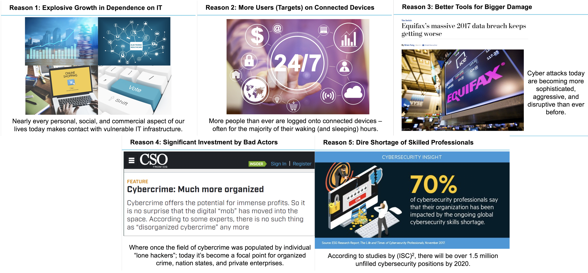
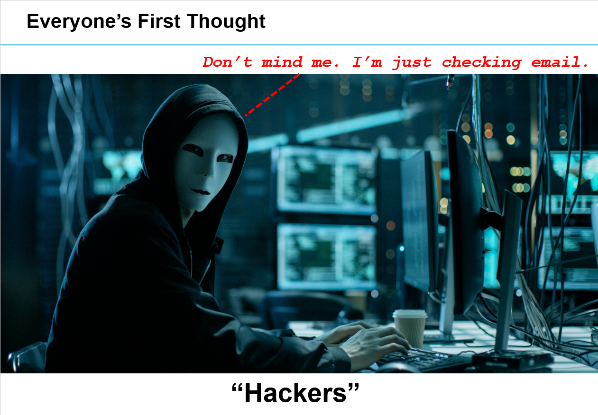
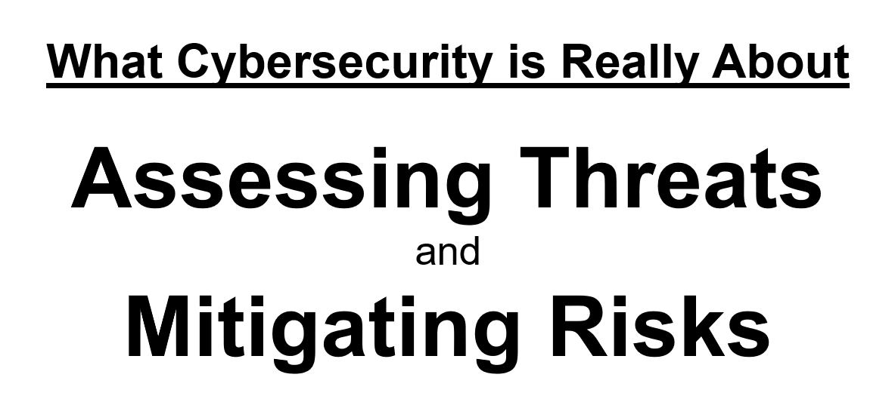
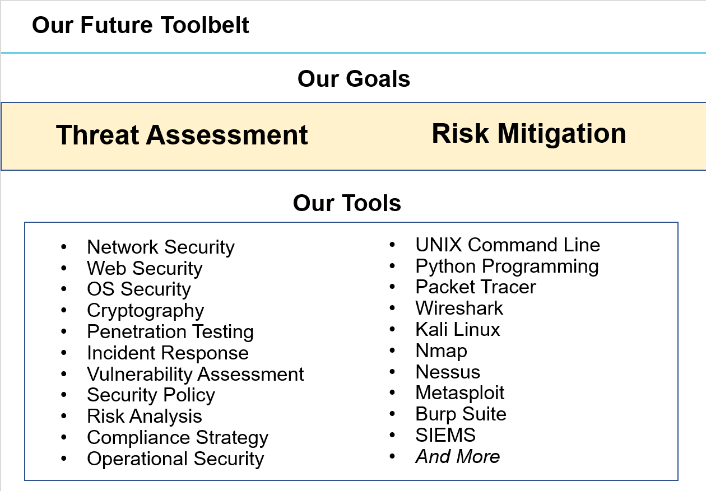
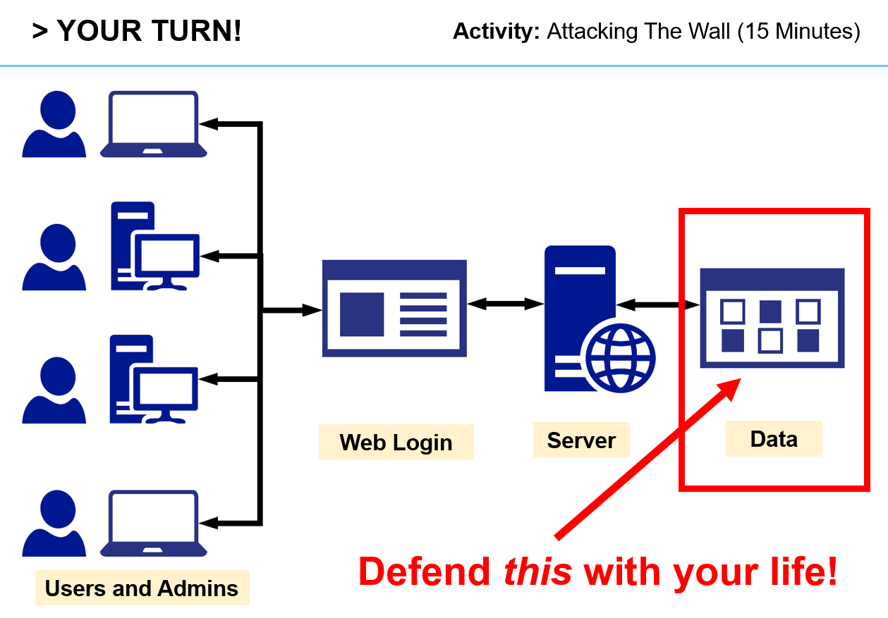
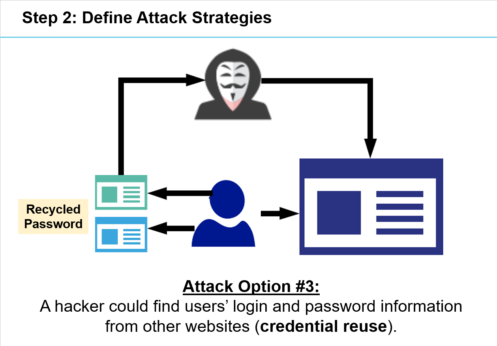
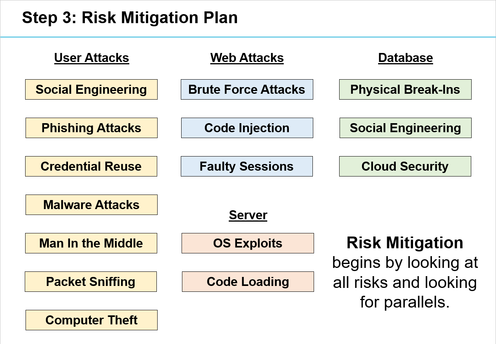
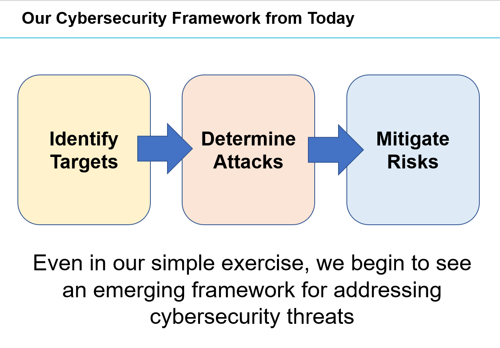

## 1.1 Lesson Plan - Zen of Cyber

### Overview
In this class, students will introduce themselves, become familiar with the class structure, and gain perspective on the course topics. Towards the end of class, students will also complete two group activities to encourage teamwork and analytic thinking. Have fun with this one!

### Class Objectives

By the end of class: 

* Students should feel completely welcome, excited, and ready to begin the rigorous journey ahead.
* Students should gain perspective on the course structure and general direction of the program.
* Students should gain exposure to the high-level security strategies and tools to be covered in class.
* Students should introduce themselves and complete ice-breaking activities together.

### Instructor Notes

* First off, welcome! And thank you for being a part of our program. Because of Instructors and TAs like yourselves, we're helping thousands of students achieve their goals and creative dreams. You've got a long road ahead and plenty of time to make an impact. So buckle in! You're in for a fun ride.

* Today's class is *all* about making students feel comfortable. This means showing them, from the get-go, that you and your TAs are committed to their success. Many of your students will have jitters on the first day, so do what you can to engage them as friends. Make sure they know that you will support them through the struggles ahead.

* Because of students' jitters, it's very important that you are *extra* prepared for today's class. Practice aloud at home and think through your exact presentation and transitions. Don't regurgitate your entire lesson from memory, but push yourself to be buttoned up. On the first day, students will be extra perceptive of your hesitations and extra concerned by signs of unpreparedness. Later, when you've established rapport with your students, you can lighten your preparation a bit. 

* In keeping with the theme of comfort, today's class is also about making students feel comfortable with *each other*. Many of your students will be entering class unsure of what to expect. They will think back to previous experiences in college classes filled with dull lectures, high-stakes exams, and frequently nagging feelings of insecurity. It's important they realize that this class will be different. As an instructor, your objective is to ensure that every class feels like a vibrant community of learning. 

* Towards that end, today's class is filled with thought exercises for students to solve security challenges as teams. Do your part as Instructors and TAs to ensure that these group activities lead to ice breaking and meaningful conversations. Be sure to walk around, ask students probing questions, and do your part to keep the environment lighthearted.

* Today's class includes a first PowerPoint. Don't forget to modify the PowerPoint to add in your own content for the "Instructor Bio" and "Stuff You Did" sections. Feel free to modify the slides to your own style, but be sure to cover the key activities.

* Lastly, realize that introductions often take a long time, however, are important to establish the group dynamic. Feel free to adjust today's lesson plan by removing the latter thought experiment if time doesn't permit. 

-------

### 1. University Do / SSM Do: Introductions (0:10)

* The first 30 minutes of class consists of introductions by the university, program director, student services director, and/or career director.

* **Instructor/TAs**: Just hang tight and calm your nerves for now. Your time for introductions will be coming up shortly.

### 2. Instructor Do: Begin Powerpoint + Introductions (0:20)

* Open the PowerPoint [Zen of Cyber](Zen_of_Cyber.pptx). Use it as a guide for the remaining sections. Keep a close eye on your TA to make sure you are staying on schedule. Be concise when you can!

* During the slides related to introductions, have every student in class introduce themselves aloud. Feel free to substitute questions. Try to keep things lighthearted as students share their backgrounds. 

* Once students have finished introducing themselves, have your TAs introduce themselves as well.

* Then introduce yourself and showcase a story or two to show your chops in the field. 

### 3. Instructor Do: The Rise of Cyber  (0:10)

* At this point, transition the conversation to make a rousing case for why cybersecurity is such a hot skill today.

* Use the slides to help guide your discussion, in doing so point out:
  
  * That there has been an explosive growth in the dependence on IT systems. 

  * More users online mean more potential targets. 

  * Hackers are getting increasingly sophisticated and aggressive in the audacity of their attacks.

  * Cybercriminals are getting more organized.

  * Huge job shortages exist for security professionals.

* As you are discussing these slides, look for opportunities to engage students into thoughtful reflection. Use the Socratic method to encourage students to offer their opinions aloud before revealing your own answer. (Ex: Ask them to bring up their own examples of a breach they've heard about in the news. )

  * 

### 4. Instructor Do: Defining Cybersecurity (0:20)

* Transition to the next section by asking your class to share the first thoughts that come to their mind when they hear the word: "Cybersecurity". 

* After you've heard a few answers, acknowledge the validity of their responses, before explaining that in this class we'll be thinking of cybersecurity as being focused on the assessment of threats and the mitigation of risk.

* Towards elucidating this idea, you will begin by communicating the threat that could lie in an unknown USB drive. You will then use this point to draw a larger idea that to an experienced cybersecurity professional, threats exist everywhere -- even in the most common place of technologies.

* From here, you will explain that the second area of focus in this course will center around managing and mitigating risks. This often means managing risks beyond defenses to also include incident response.  

  * 
  * 

### 5. Instructor Do: Course Overview  (0:10)

* From here explain that in this course we'll be learning a variety of tools to help us in our quest to assess threats and mitigate risks. They should see what they learn in this class as being formative tools in an extensive tool belt they will be building.

* Upon showing them this slide, ask the class how many of them have heard of X or Y technology (e.g. "How many of you have heard of or worked with Wireshark? Or Burp Suite?")

* Then use the remaining slides to give students a *taste* of the types of topics and projects they'll be completing in this class. Key examples include:
  
  * Brute Force Password Crackers in Python

  * Malware Analysis of Network Traffic

  * Cryptography Principles 

  * Web Application Hardening

  * Penetration Testing and OS Exploitation

  * Executive Strategy

  * 

* At this point, some of your students will be cringing at the thought of how much is going to be covered. Acknowledge this fear, and deflect it by saying: "If you're worried about how much is covered, you're right to be. It is a lot! Our goal is to turn you into broad-minded security professionals, who have a wide view of the field. You'll have plenty of time and plenty of support to get there."

### 6. Instructor Do: Helpful Tips (0:10)

* The next series of slides is meant to give students the right perspective coming in. 

* To begin, take a few moments to assuage student fears of being a "beginner." Let them know that having a humble attitude is the first requirement of being successful in this program. In a way, students should channel their inner toddler and recognize that "knowing nothing" and admitting such will allow them to dig their heels in and invest the time necessary to succeed. In a way, being in this program will be like nothing else these students have attempted to do. Their mastery of other subjects, their educational backgrounds, and their professional successes do not guarantee that they will do well here. The only thing that will guarantee success is hard work, humility, and a relentless desire to be better. Recognizing how little you know is a first step towards creating that urgency.

* As you review the remaining tips, give students perspective on the "Path of Learning":

  * First, learning all the skills in this course will feel tough, intimidating, and frustrating at times. They should immediately forget about their uncle/brother-in-law/friend/step-sister who told them about so-and-so learning to hack in 1 week. Becoming a skilled professional is challenging. It will take time. There is no way around that.

  * Second, because of how hard this can be, there will be many moments where students will doubt themselves. Take this chance to help them overcome this obstacle ahead of time by building up their confidence. Tell them that you started just like they did, that it takes time but that they have what it takes, that they were selected for this program because we know they have what it takes.

  * Lastly, because of the length of the program, personal issues WILL come up during the course of the program. The idealism and "can-do" attitude students enter with on day 1 will be challenged by the length of the course. Let students know that they should see each other as a family embarking on a long journey. They will become far closer to their peers than they realize. Intensity is no substitute for endurance.

* Let them know that learning is supposed to be frustrating. It's a process, and they should stick with it!

-------

### 7. Break (0:15)

-------

### 9. Students Do: Security Challenge #1 (Attacking the Wall) (0:15)

* Upon returning, have students re-group.

* Then use the slides to cue the first thought experiment. 

  * In essence, this experiment has students attempting to determine the various attack strategies that hackers could use to penetrate an insecure login. While students will be new to the field, this exercise should force students to think creatively about all the ways a system can be penetrated -- from user attacks to physical break-ins. 

  * The key to executing this exercise in the classroom is in ensuring that students are engaged to *think* through creative options. When students discover real world attacks through discussion there comes a real sense of accomplishment. 

### 9. Students Do: Security Challenge #1 (Attacking the Wall) (0:15)

* Set a timer and allow students to think through their options. 

* As students are working on this experiment, have yourself and your TAs walk around to listen into student conversations. Where appropriate, nudge them to think more critically. For instance:

  * If students seem to have exhausted ideas, prod them to think about the vulnerabilities present to *another* aspect of the system. Have they considered the potential for theft? Have they considered the potential for a break-in? Have they considered that a person's password may already be listed on another website?

  * If students seem to have come up with a full list, prod them to share their ideas. Then challenge them if their answers seem to similar. Remind them that they need to *think* like a hacker. If a defense mechanism can hinder all of their attacks at once, then they need to think of other pathways.

  * 

### 10.  Instructor Do: Review Security Challenge #1 (0:15)

* Once time is up, ask a few student groups to share a few of their options. Consider opening a notepad file to track a running list of suggestions. 

* Once you've heard a few solutions, flip to the slides where it breaks down our approach to solving the problem. 
  
  * The slides provide a list of 15 different means of attacking the system. While some are more technical than others, try not to get bogged down into the details. These slides are meant to provide students fodder for thought. They are NOT meant to be a primer on attack strategy.

  * If you have stories to share relevant to the slides from your professional experience -- feel extra encouraged to share!

  * 

### 11.  Students Do: Security Challenge #2 (Defending the Wall) (0:15)

* For the second thought experiment, students should form a new group of 3-4 students.

* This time they are tasked with looking at the complete list of attacks and try to create a list of 10 strategies to mitigate risks. The goal of this exercise is for students to realize that certain mitigation strategies can be used to handle multiple threats at once.

* Again, use a prodding approach to help students in arriving at 10+ strategies that address each of the concerns.

* 

### 12.  Instructor Do: Review Security Challenge #2 (0:15)

* Have a few student groups share their response before sharing your own solutions using the slides as a guide. 

* A key takeaway to share with students is the reality that effective risk mitigation strategies can be used to address multiple threat pathways at once. 

### 13.  Instructor Do: Cybersecurity Framework  (0:05)

* Finally, help students to understand that this thought exercise provided them with a prelude to an important concept in security: Frameworks. 

* Offer them the perspective that in this course, much of what they learn will fit into larger and more consequential frameworks well understood by the security community. 

* 

### 14.  Instructor D: Next Class  (0:05)

* Give students a preview of what's to come by explaining that we will be talking about the current threat landscape in the next class before dismissing them for the day.

-------

### Copyright

Trilogy Education Services © 2018. All Rights Reserved.
