## 2.1 Lesson Plan: Tingles For Terminal

### Overview

In today's class, students will receive their first exposure to terminal and bash commands. Throughout the day, students will complete activities that are focused on using the command line for basic file navigation and retrieval tasks.

### Class Objectives

By the end of class, students will be able to:

* Explain why the command line is important for IT and security professionals.
* Utilize commands like `ls`, `cd`, `mkdir`, `touch`, `cp`, `mv`, and `cat` for basic file navigation and manipulation.
* Demonstrate an ability to navigate deeply nested folder structures using relative file paths. 
* Utilize commands like `head`, `tail`, and `less` to preview files in the command line. 
* Combine the above commands in sequence to accomplish relevant IT tasks. 

### Instructor Notes

* Welcome back! This week, students will be taking their first step in building their technical tool belt by learning about terminal and command-line applications. 

* In today's class, you will find that some of your students will be intimidated and struggle to keep up, while other students will find the content easy to follow. For those students who are struggling, encourage them to be patient with themselves. Remind them that practice builds competence. For those students looking to be challenged, assure them that the complexity level will increase quickly over the weeks to come. Tall towers are built on tiny blocks. 

* It's worth noting that we will *not* be teaching the Windows command line for any of these activities. In order to create a consistent learning experience, we will be teaching all students Unix-based bash commands. Mac users will use Terminal. Windows users will use Git Bash.

* Take the time necessary before class to familiarize yourself with each activity in this week. In particular, make sure to practice your workflow before class. It is easy get lost on stage when working in the command line. Each extra keystroke you show on screen is an opportunity for your students to get lost, so be intentional with each command. Take the time necessary to articulate what you are entering at each step. 

* Particularly for demos related to navigation, it can be helpful to show a GUI-based explorer file tree adjacent to your terminal window. As you run commands in terminal, show students how these commands visually translate into the traditional GUI-style navigation they are used to working with. Providing students an anchor to something familiar is a great way to ease them into learning something new.

* Try to stay on track of time as best possible, but always feel free to add a few extra minutes to the clock if students are struggling with an activity. As always, have your TAs refer to the [Time Tracker](https://github.com/coding-boot-camp/Cybersecurity-Lesson-Plans/blob/Prod-Branch/1-Lesson-Plans/Unit02-Terminal/timetracker.xlsx) to help you stay on track.

-------

### 1. Instructor Do: Why Terminal Matters (0:10)

* Begin class by welcoming students back and informing them that today they will be learning the basics of the command line. 

* Open the [PowerPoint](Tingles_For_Terminal.pptx) and use the slides to guide the introductory lecture. 

  * You will begin with a preview of today's class and goals.

  * Then, you will do a quick poll to see how many students have worked with the command line in the past. If there are just a few, assure students that it's okay—the terminal is easy enough to learn with a bit of practice. If there are many hands raised, praise them before letting them know that they will be building on their existing knowledge through the week.

  * Next, you will offer students a bit of perspective on why the command line matters. You should feel encouraged to share stories from your own professional experience. Where have you used the command line in cases where a GUI wasn't available? Where have you written a command-line script to automate a tedious process? Students value your professional wisdom, so please take moments like this to share your real-word experiences with them. 

  * Finally, stress that this week is oriented around hands-on practice. The instructor-led demos and slides will be brief and there will be many activities for students to complete. Encourage students to take the activities seriously, as they are a core part of their learning experience. 

* As you proceed through class today, use the slides as an accompaniment. 

### 2. Student Do: Install Git Bash (0:10)

* Have PC-based students install Git Bash and Mac-based students find the terminal. 

* Send students the following instructions:

  * **Instructions:**
    * Windows Users: 

      1. Go to https://gitforwindows.org to download the Git Bash .exe for your computer. 
      2. Double-click the .exe you downloaded and accept the default settings to complete the installation. 
      3. After the installation is complete, double-click the Git Bash icon to open the terminal window. 

    * Mac Users: 

      1. No installation is needed. Select **Command** + **Space** to open Launcher. 
      2. In the search box, type **Terminal** and then hit **Enter** to open the Terminal window. 

### 3. Instructor Do: Basic Terminal Commands (0:10)

* Once all students have located the Terminal or Git Bash successfully, begin your first demonstration using the following steps as your guide. Encourage students to make note of the commands you use as you go. 

    1. Open an instance of a terminal and navigate to a folder on your machine.

    2. Run the `pwd` command to retrieve the path of the *print working directory*.

    3. Run the `mkdir MyFolder` command to make or create a folder. Show in the GUI that this folder now exists.

    4. Create a new file using `touch MyFirstFile.txt`. Again, show through the GUI that this file exists.

    5. Run the `ls` command to retrieve a listing of all files in the current folder. Show students that the listing in terminal matches the files they would see in a traditional file explorer.

    6. Run `cd MyFolder` to navigate, or *change directory*, into the folder we created.

    7. Create an additional folder and navigate into it using `mkdir MySubFolder` and `cd MySubFolder`. 

    8. Run `explorer .` (Windows) or `open .` (Mac) to display the file explorer at the current directory.

    9. Return to terminal and enter the `clear` command to clear the terminal history.

    * 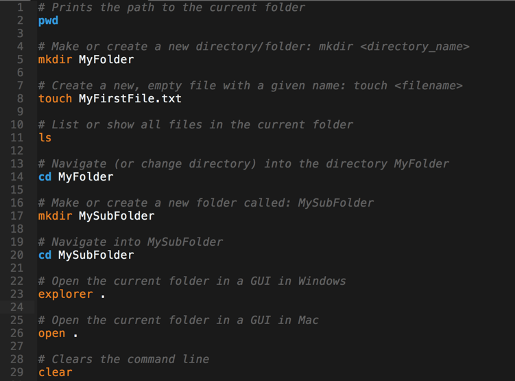

    * 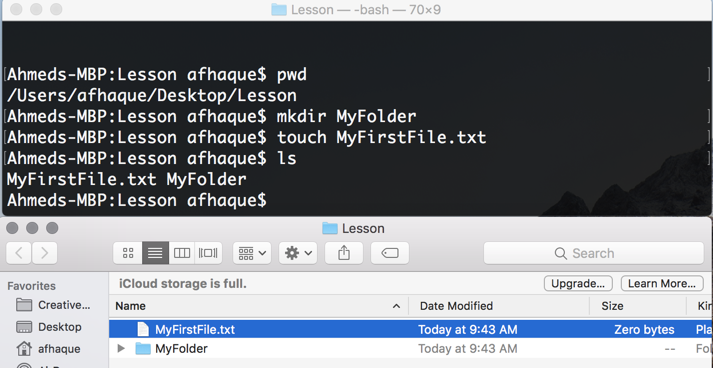

### 4. Students Do: MyHacks Folder (0:07)

* Now it's your students' turn! 
* Send students the following instructions:
  * **Instructions:**
    * Using only the command line, complete the following tasks:

        * Create a folder on your desktop called **MyHacks**.
        * Navigate into the **MyHacks** folder.
        * From within the **MyHacks** folder, print the working directory.
        * Create three files inside the **MyHacks** folder: **DoS.txt**, **Phishing.txt**, **Keylogger.txt**.
        * Display all of the files created.
        * Open the folder in your file explorer. 
        * Clear the terminal history.
  * **Hint:**
    * Feel encouraged to ask your neighbor or TA for help if you get stumped on a command.

### 5. Instructor Do: Review MyHacks Folder (0:05)

* Once time is up, take a few moments to review the activity. 

* Fire up the terminal and guide students through the solution. As you make your way through your explanation, be sure to point out the following: 

    * That we used the `mkdir`, `cd`, `pwd`, `touch`, `ls`, and `clear` commands to complete the tasks. 
    * That we were able to string multiple file names, or *parameters*, after `touch` to create many files at once. 
    * Answer any questions that remain, before sharing your solution and proceeding to the next activity.
    * 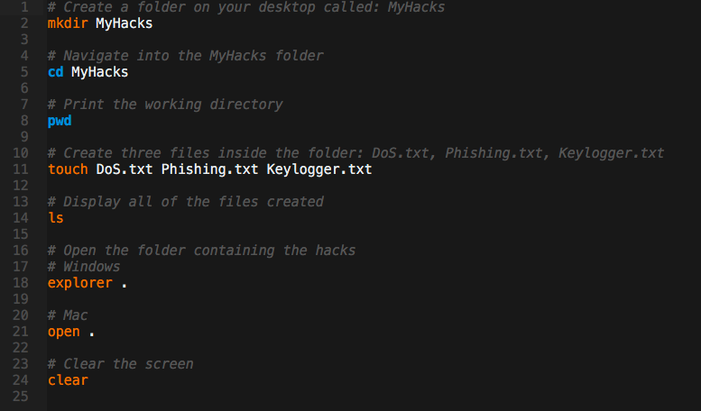

### 6. Instructor Do: Relative Paths (0:07)

* In this next demonstration, you will show students how to navigate nested folder structures using relative paths.

    1. Copy the provided **Level_1** folder onto your desktop.

    2. Show students how the folder structures look using the GUI-based file explorer. This will help students better understand this demo.

    3. Open a terminal instance at your desktop.

    4. Run each of the commands shown in the following image:

        * As you run each command, spend time explaining the command to ensure students understand how you are navigating into subfolders by referencing them by name and navigating into parent folders by using  `../`.  

        * Flip back-and-forth between the terminal and the GUI-based explorer to help students see how your navigation in terminal correlates to what they'd see in the GUI.

        * 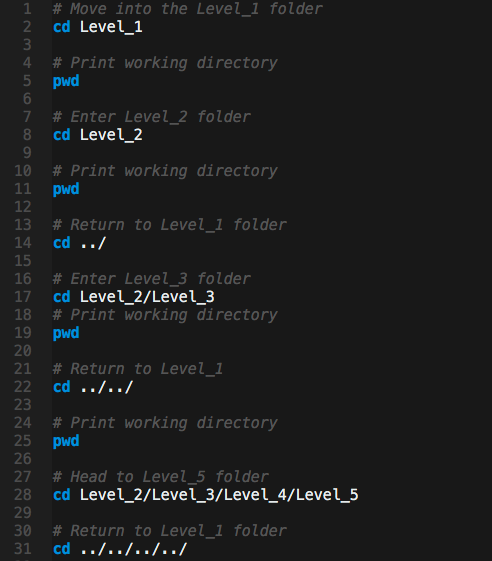

    5. Finally, introduce students to the `cp` (copy) and `mv` (move) commands using the following image as a guide. Show both the `ls` command and the file explorer window to confirm to students that these commands copied or moved files to new locations.  

        * 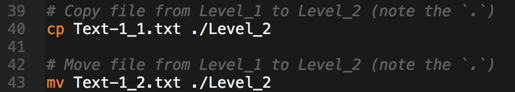

### 7. Students Do: Terminal Mazes (0:15)

* Now it's time for a student challenge! In this activity, students will use the terminal to navigate through a few tricky folder structures. 

* Send students the following file and instructions:

  * **File:**
    * [activities/04-Stu_TerminalMazes/Unsolved/Mazes.zip](activities/04-Stu_TerminalMazes/Unsolved/Mazes.zip)

  * **Instructions:**
    * The zip file we just sent you provides you with three maze-like file directories. Each folder maze is composed of a set of deeply nested subfolders. At the base of each folder is a file called **start.txt**.
    * Your task is to copy the **start.txt** file into the **End** folder, which is buried somewhere in the maze of folders. You may use only *one* copy command as part of each solution. 

  * **Hints:**
    * Your final solutions should each take the form of: `cp start.txt ./Left/Left/Right/Left/End/`.

    * The first two mazes use file trees that looks like the following:

      ```
      Maze 1
      ------------------------------
      Start.txt
        - Left
          - Left
          - Right
          - Bonus.txt
        -Right
          - Left
              - Left
              - Right
          - Right
              - End
      
      Maze 2
      ------------------------------
      Start.txt
          Left
              Left
                  Bonus.txt
              Right
          Right
              Left
                  Left
                      End
                  Right
              Right
                  Left
                      Left
                      Right
                  Right
      
      ```

    * For the third challenge, you may want to create a similar file tree to help you navigate.  

    * Stay persistent! This is a bit of a brainteaser, but it's great practice for the real-world!

  * **Bonus:**
    * If you finish early, take on an extra challenge! 
    * Buried in each of the folder mazes is a file called **Bonus.txt**. For an extra challenge, create a single `cd` command to navigate from the root of the maze to the point of the **Bonus.txt** file. Then create a single `cp` command to relocate the **Bonus.txt** file to the **End** folder.
    * **Hint:** Recall the power of `../`.

### 8. Instructor Do: Review Terminal Mazes (0:10)

* Once time is up, spend a few moments reviewing the solution.
  
  * Begin by unzipping the unsolved **Mazes** folder sent to students and ask them to share their answers with you. Or, if you'd like to create a bit of extra engagement, encourage students to come up to your computer and enter the solution themselves!

  * As you proceed through each of the solutions (provided in the section below), be sure to demonstrate how you would build each chain yourself. Start from the root directory and chain each subfolder name one after the other. You may want to introduce students to the **Tab** key's ability to auto-complete folder names as you do. 

    * 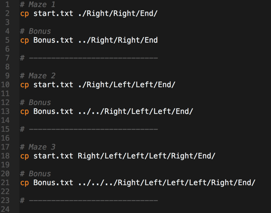

  * For the final maze, share with students the following file map before running the commands. 

      ```
      Maze 3 
      ------------------------------
      Start.txt
          Left
              Left
                  Left
                      Left
                      Right
                  Right
                      Bonus.txt
              Right
          Right
              Left
                  Left
                      Left
                          Left
                          Right
                              End
                      Right
                  Right
              Right
                  Left
                  Right
      ```

    * Answer any questions that remain, before sharing your solution and proceeding to the next activity.

### 9. Students Do: Terminal Decor (0:15)

* Time for another student activity! In this one, using a provided file tree, you will ask students to create a folder structure that mimics a home and its rooms. 

* Send students the following instructions:

  * **Instructions:**
    * Using *only* the terminal, complete the following tasks:

      1. Create a folder on the desktop called **My_House**.
      2. Inside the **My_House** folder, create three subfolders: **Bedroom**, **Living_Room**, and **Kitchen**.
      3. Navigate into the **Living_Room** folder and create two files called **tv.txt** and **sofa.txt**.
      4. Navigate into the **Kitchen** folder and create two files called **oven.txt** and **sink.txt**.
      5. Navigate into the **Bedroom** folder and create a file called **bed.txt** and a folder called **Bathroom**. 
      6. Copy the **sink.txt** file from the **Kitchen** folder into the **Bathroom** folder. 
      7. Move the **tv.txt** file from the **Living_Room** and into the **Bedroom** folder.

    * Record all the commands you used into a new file (saved anywhere) called: **Decor.sh**.
    * When all steps are complete, your file tree should look like the following:

      ```
        My_House
          - Bedroom
            - bed.txt
            - tv.txt
            - Bathroom
              - sink.txt
          - Living_Room
            - sofa.txt
          - Kitchen
            - sink.txt
            - oven.txt
      ```

    * **Hints:**
      * Remember all the commands you've used so far: `cd`, `ls`, `mkdir`, `touch`, `cp`, and `mv`. 
      * We know it's painful. But believe us when we say: It's important to get good at this!  

### 10.  Instructor Do: Review Terminal Decor (0:10)

* Once time is up, spend a few moments reviewing the solution. Once again, consider bringing students to the stage to complete sections of the activity in turn. 

* As you proceed through the solution, be sure to call out the learning opportunities and sticking points. For example: 
  
  * Remind students that they can create multiple files or folders at once by stringing  parameters after the `touch` and `mkdir` command, as in `mkdir Bedroom Living_Room Kitchen`.
  
  * Remind students that they need to navigate within a folder using `cd` before creating files. Many students will forget this step, and will therefore end up creating files in the wrong location. 

  * Remind students that the correct command for moving up one level is `cd ..`.

  * 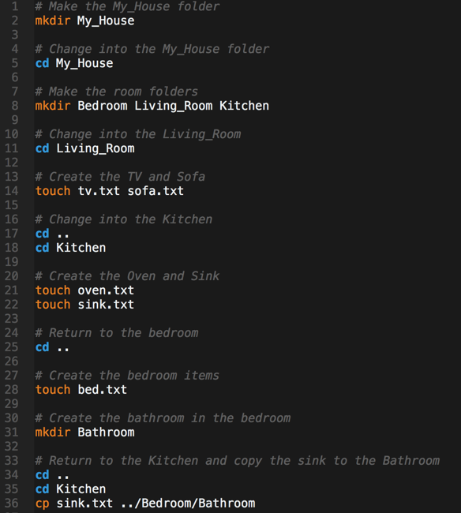
  
* Answer any questions that remain, before sharing your solution and proceeding to the next activity.

### 11.  Instructor Do: Preview Commands (0:10)

* In this next demo, you will introduce students to the preview commands `head`, `tail`, and `less`. 

  * Copy or navigate to the **06-Ins_PrevCommands** folder. Contained within the folder is an assortment of files including **frank_1.txt** and **frank_2.txt** (chapters of Mary Shelley's novel *Frankenstein*), a Python file, an HTML file, and a SpongeBob GIF.

  * Use the following image as a guide to demonstrate the utility of the preview commands for sifting through text files.

    * 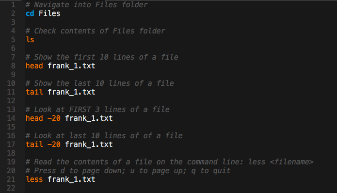

  * Once you've gone through the basic commands on the text files, run the same commands on the non-text files. 

    * Point out to students that the command works well for viewing the content of code files as well, because they are text-based files, but it is less useful when viewing executables and images.

    * Also, let students know that this process of previewing files is a safe way to confirm that file extensions are accurate. It'd be easy for a malicious party to send a harmful file disguised as **.txt**. Previewing the contents through the `less` command allows you to safely view the contents. 

      * 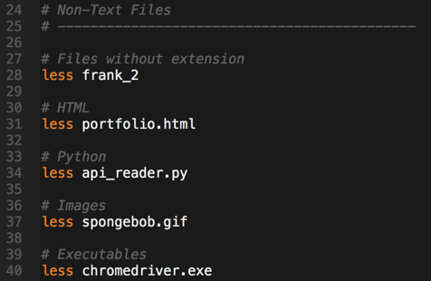

      * 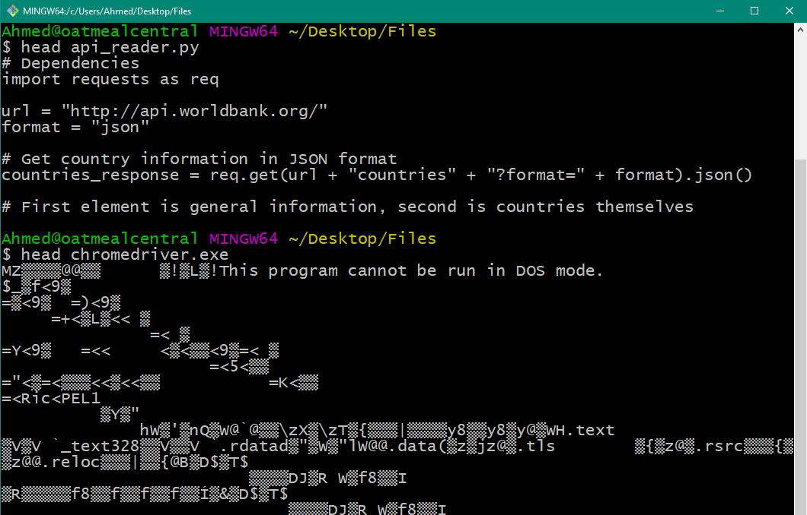

  * Answer any questions that remain, before sharing your solution and proceeding. 

-------
### 12.  Break (0:15)
-------

### 13.  Students Do: Preview Practice (0:05)

* In this next activity, students will be instructed to use the `head`, `tail`, and `less` commands to sift through various files. They will have to use these commands to determine which of the files is in fact not a text file.

* Send students the following file and instructions:

* **File:**

  * [activities/07-Stu_PreviewPractice/Unsolved/Books.zip](activities/07-Stu_PreviewPractice/Unsolved/Books.zip)

* **Instructions:**

  * You've just been given a zip folder allegedly filled with book chapters in text format.
  * Use the `head`, `less`, and `tail` commands to preview each of the files. 
  * Use each command and specify a number of lines at least once. 
  * Be ready to state which is not actually a text file in your opinion. 

### 14.  Instructor Do: Review Preview Practice (0:05)

* Once time is up, take a few moments to review. 

  * Have students share which of the files is likely not a text file. Answer: 04-Iliad.txt (in homage to the Trojans). 

  * Then call on individual students to share the command they used for each file in turn. 

    * 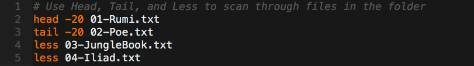
    * 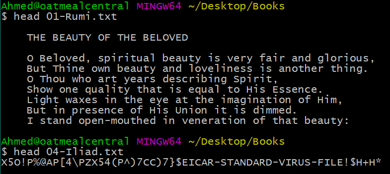

  * Answer any questions that remain, before sharing your solution and proceeding to the next example. 

### 15.  Instructor Do: cat Command (0:07)

* In this next demo, you will introduce students to the `cat` command.

  * Copy the files contained in the **08-Ins_CatCommand** folder to a folder on your desktop and navigate into the folder.

  * Use the `head` command on each of the files to show the contents of each. 

  * Run through the `cat` commands shown in the image that follows. Be sure to point out the following:

    * That `cat` is short for concatenate.
    
    * The standard form of `cat` usage is to string multiple file names in sequence. This combines the files, but it does *not* save the result beyond the command line. 

    * In order to save the results, we use the `cat > {file}` command which *redirects* the output from the screen to a file. This command will create the file if it does not already exist and write over any pre-existing content if a file already did. 

    * This concept of *redirecting* can be further utilized in the context of the `|` (pipe) and `tee` characters. In the example provided, the pipe character is used to take the traditional output from the `cat` command and pass it to the `tee` command for output to a file. This has the effect of printing output to the screen and immediately storing the contents to a file. We'll talk more about the pipe character in the next class. 

    * Use the `head` and `tail` commands to confirm for students that the files combined.

      * 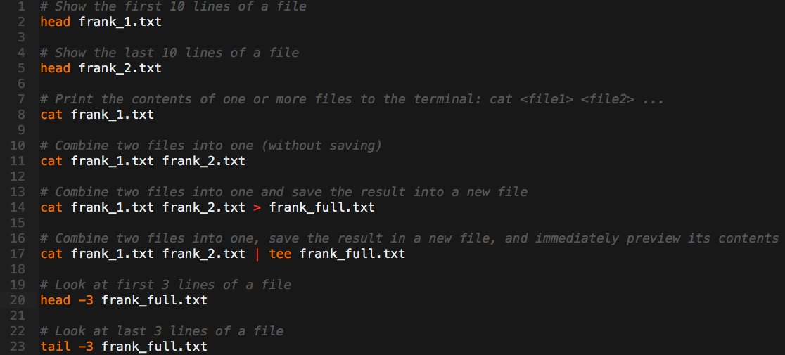

    * Answer any questions that remain, before sharing your solution and proceeding to the next activity. 

### 16.  Students Do: Great Library (0:10)

* Now for one last student activity! In this activity, students will use a combination of commands to preview the contents of a folder, combine them into a single text file, and move the output to a new location.  

* Send students the following file and instructions:

  * **File:**
    
    * [activities/09-Stu_GreatLibrary/Unsolved/Books.zip](activities/09-Stu_GreatLibrary/Unsolved/Books.zip)

  * **Instructions:**
    
    * You've just been given a folder allegedly filled with books. 
    * Your task is to sift through each of the book files to identify which are text based.
    * Combine these files into a single text file called **full.txt**.
    * Confirm that the combination worked successfully, before moving the new file to a folder called **Summary**.
    
  * **Bonus:**

    * See if you can determine the correct file format of the non-text file. Rename the file extension and be ready to share what you found. (Hint: Read the gibberish.)

### 17.  Instructor Do: Review Great Library (0:05)

* Once time is up, spend a few moments reviewing the solution using the following guide. As you walk through the solution, be sure to point out the following:

  * We used the `mkdir Summary` command to create a **Summary** folder. 
  * We used the `head` or `less` commands to preview the contents of each of the files and to see that **4_great_tea.txt** was not a text file.
  * We used the `cat {files} > full.txt` to combine each of the files.
  * We previewed all of the content using the `head` command. 
  * That we used `mv` to move the file to the base directory.

    * 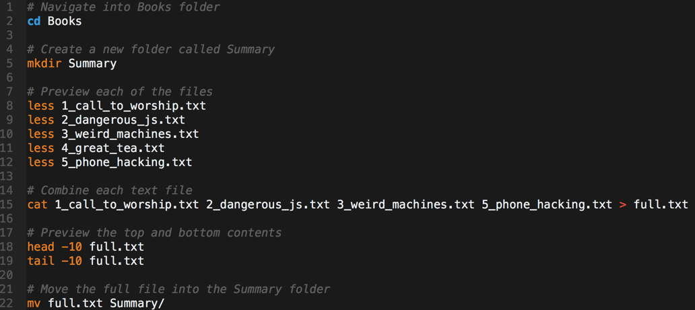
  * For students looking to solve the bonus, they should look closely at the output of the file preview. The first line of the content includes words like **JFIF** and **JPEG** which give us a clue about the file signature. Renaming the file extension to **.jpeg** allows us to then see a picture of iced tea.

    * 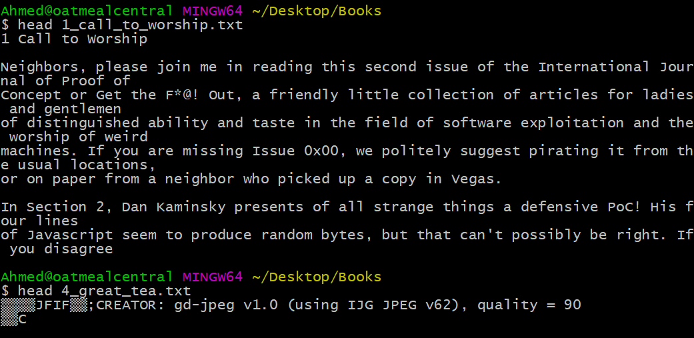

    * 
  * Answer any questions that remain before sharing your solution and proceeding to the final activity.

### 18.  Instructor Do: Review Key Commands (0:10)

* For the last 10 minutes of class, return to the PowerPoint slides to guide students through a brief review. This is a great way to build confidence among students and is also a way to remind them of all they have learned. Try to engage individual students as you go through the review. Don't let the same students monopolize the class! 

* As you make your way to the end of the review, be sure to offer students additional encouragement to continue practicing. Without your nudge, many students will assume their studies start and end during class hours. Let them know that practice outside of class is required to build proficiency!

* You should also let them know that in the next class we will be covering additional terminal commands for finding files based on search parameters and more broadly learning how to use documentation to uncover new commands.  

### 19.  Instructor Do: Intro Homework (0:05)

* End class by pointing students to the posted homework assignment. This is just a preview of the homework. Students do not yet have all the skills to complete the homework just yet, but it won't hurt to take an early look.

-------

### Copyright

Trilogy Education Services © 2018. All Rights Reserved.
