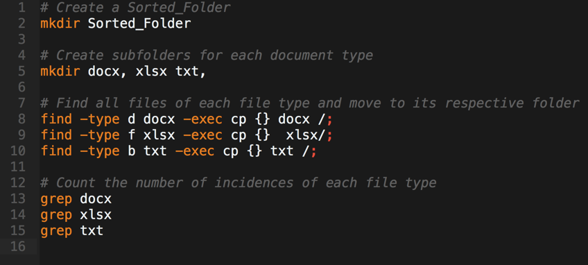

## 2.3 Lesson Plan: Undercover Unix

### Overview

In today's class, students will cap off their skills with the command line by learning how to execute shell scripts, utilize the `ssh` and `scp` commands, and further learn how to employ new Unix commands through research and documentation.

### Class Objectives

By the end of class, students will be able to:

* Create and execute shell scripts using Unix commands.
* Employ research and documentation to identify new commands for unfamiliar situations. 
* Devise strategies for combining multiple commands in sequence to accomplish advanced IT tasks.  
* Navigate the file system of virtual machines using the command line.
* Use `ssh` (secure shell) to create a secure shell to remote machines.
* Use `scp` (secure copy) to copy files from remote machines to local machines.    

### Instructor Notes

* Today's class should be a fun conclusion to the week. It is punctuated with two highlighted activities: (1) a meaty all-in-one shell scripting challenge where students create reports on authentication break-in attempts and (2) an `ssh` and `scp` activity where students retrieve files from a remote machine and extract them to their local one. 

* The shell scripting challenge involves reporting on break-in attempts, you and your TAs should be prepared to help students if they get stuck. Be prepared to give extra support during this project. This challenge is intended to be a *mini-project*. Students will be given 30 minutes to complete the activity and they should be encouraged to spend ample time planning and researching before beginning their work. This project is intended to mimic a real-world task they may be given in the field.

* In today's class, be *extra* mindful of time. It is critical that students' understand the `ssh` and `scp` content described at the end of class for them to be able to complete their homework assignment. If you find yourself falling behind, consider cutting the student activity on troubleshooting scripts. 

* You (and your students) will need to have VirtualBox installed as well as this week's virtual machine downloaded and ready. The virtual machine is large, so be sure to send students the [download link](https://drive.google.com/file/d/11giTFhe6l_I5r-UtliQncU4kxmUsNIUP/view?usp=sharing) before the break.

* As always, have your TAs refer to the [Time Tracker](../timetracker.xlsx) to help you stay on track.

-------

### 1. Instructor Do: Intro Class (0:05)

* Begin class by welcoming students back and giving them a preview of today's class. 

* Open the [PowerPoint](Undercover_Unix.pptx) and use the slides to guide the introductory lecture. 

  * Begin by briefly reviewing what was covered in the last class. 

  * Then, transition into today's goals and the warm-up activity of the day.

* As you proceed through class today, use the slides as an accompaniment. 

### 2. Students Do: Warm-Up Activity (0:10)

* Let's start class off with a warm up.

* Send students the following file and instructions:

  * **File:**
    * [activities/01-Stu_Warmup/Unsolved/Docs.zip](activities/01-Stu_Warmup/Unsolved/Docs.zip)

  * **Instructions:**
    * You've just been given a folder filled with files from a user's personal machine. Your task is to use the command line to:

      1. Create two subfolders within the **Music** folder: one called **FLAC** and the other called **MP3**.
      2. Write a command that finds all **.mp3** and **.flac** files and copies them into their respective subfolders.
      3. Write a command to count the number of **.mp3** and **.flac** files in each folder.  

  * **Hint:**

    * Make sure to avoid double counting for the final step.

### 3. Instructor Do: Review Warm-Up Activity (0:05)

* Once time is up, take a few minutes to review the activity. 

* Fire up a terminal window and have students guide you through their solution. Be sure to call out the following as they do:
  
  * We began by creating our relevant folders **Music** > **MP3** and **Music** > **FLAC**.

  * We used the `find` and `-exec` commands to locate each of the file types and immediately copied them to their respective folders.

  * In using the `find` command we used `-type f` to indicate we were searching for files and `-iname '*.ext'` to indicate each file type we were searching for.

  * To count the number of each file type, we used the format `find Music/MP3 -type f | wc -l`. In this case, we explicitly set our `find` command to only locate files within the subfolder and attached `| wc -l` to count the number of lines we retrieved. By explicitly specifying the file path, we avoided double counting by excluding the original files from our count. 

  * Answer any questions that remain before proceeding to the next activity.

    * 

### 4. Instructor Do: Intro to Shell Scripting (0:07)

* Next, you will formally introduce the concept of shell *scripts*. Most likely, students have been exclusively entering their Unix commands one-by-one directly into the command line. In this next demo, you will reveal to students the capability of prewriting entire scripts that can be executed by a single command.

* Open the **script.sh** file contained in your **02-Ins_ShScripts** folder using VS Code. Then do the following:

  * Explain to students that this file includes a complete set of Unix commands from the previous example.  
  * The file has been saved using the file extension **.sh**. This indicates that the file is a *shell script*.
  * Fire up a terminal instance, navigate to this script, and run the `sh script.sh` command. Demonstrate to students that this triggered the commands, included in the script, to be executed.
  * Shell scripting is a powerful tool to use because it allows IT and security professionals to prescript repeatable processes for future use. 
  * Answer any questions that remain before sharing your solution and proceeding to the next demo.
    * 

### 5. Students Do: My First Shell Script (0:07)

* Time for a bit of practice.

* Send students the following file and instructions:
  * **File:**

    * [activities/03-Stu_MyFirstSh/Unsolved/Files.zip](activities/03-Stu_MyFirstSh/Unsolved/Files.zip)

  * **Instructions:**

    * Create (and execute) a shell script which accomplishes the following:

      1. Creates a folder called **Summary**.
      2. Combines all files in the **Files** folder into a single file called **MySummary.txt**. 
      3. Moves the **MySummary.txt** file into the **Summary** folder.
      4. Previews the first ten lines of contents. 

  * **Hint:**

    * Consider solving this activity using the command line before writing your shell script. Start where you feel comfortable before transitioning to what's new.

### 6. Instructor Do: Review My First Shell Script (0:05)

* Once time is up, open the solution file and walk students through it. Break down each of the following key elements:
  
  * The solution file's extension is **.sh**.

  * Running the file requires us to use the `.sh script.sh` command.

  * The shell script includes the usual suspects of commands: `mkdir`, `cat`, `mv`, and `head`. 

  * Answer any questions that remain before sharing your solution and proceeding to the next activity.

    * 

### 7. Students Do: Troubleshooting Scripts (0:12)

* This student activity is one where students will practice *debugging* a broken shell script. 
  **Note:** While this is a fun activity and great for student learning, if you are running late on time, consider cutting it in favor of higher priority activities that follow.

* Send the students the following file and instructions:

  * **Files:**

    * [activities/04-Stu_TroubleshootSh/Unsolved/Gibberish_Folder.zip](activities/04-Stu_TroubleshootSh/Unsolved/Gibberish_Folder.zip)
    * [activities/04-Stu_TroubleshootSh/Unsolved/Unsolved.sh](activities//Unsolved/Unsol04-Stu_TroubleshootShved.sh)

  * **Instructions:**

    * You've just been given a shell script for interacting with **Gibberish_Folder.zip**. Your task is to identify and correct the errors included in the **Unsolved.sh** shell script to ensure that it works as designed. 

    * When successful, your corrected shell script should:

      * Create a subfolder for document type (**.docx**, **.xlsx**, **.txt**).

      * Find and move all of each file type to its respective folder.

      * Count the number of incidences of each file type.  

  * **Hints:**

    * Be sure to unzip **Gibberish_Folder.zip** before beginning this challenge.

    * Don't be afraid to run your shell script as you make changes. You can always unzip the original **Gibberish_Folder.zip** again if you need to restart.

    * This is a challenging activity! Debugging scripts can often be more frustrating than writing them in the first place.

### 8. Instructor Do: Review Troubleshooting Scripts (0:07)

* Once time is up, spend a few moments reviewing the activity.

* Before you reveal the solved version, spend a few minutes having students call out the errors they found with the original script. For example: 

  * The `mkdir` statement is incorrect in a number of places. For example:

    * It incorrectly uses a mix of spaces and commas. This should be changed to exclusively use spaces to separate folder names. 
    * The `mkdir` statement also needs to specify that each folder is a subfolder to **Sorted_Folder**. For example, this means that we should be writing `Sorted_Folder/docx` as opposed to just `docx`.

  * The `find` and `-exec` statements are incorrect in the following places:

    * Each statement should begin as `find . -type f` to indicate we are searching within the current directory for files (not folders).

    * Each `find` statement should use the `-iname "*.ext"` option to indicate that we are searching for files based on their name.

    * Each `exec` statement needs to explicitly state that the file destination is `Sorted_Folder/docx` and not just `docx`.

    * The termination statement is incorrect. Instead of `/;` the terminator should read `\;`.

  * The count statements are *completely* incorrect, as follows:

    * The original use of `grep` was a red herring. Instead of needing to use `grep` the solution called for the use of another `find` statement. In this case, we used `find` in conjunction with `| wc -l` to count the number of incidences of each file type.

* Once students have seen all the errors, reveal the corrected version of the script, before sharing it, and proceeding with the next example.

  * Original **Unsolved.sh**:
    * 

  * Revised **Solved.sh**:
    * 

### 9. Instructor Do: Learning New Commands (0:10)

* In this next section, you will introduce students to the *process* of learning new commands. This is an important skill to learn because security professionals must be comfortable expanding their knowledge set on the fly based on the demands of their job. 

* Begin by framing the next exercise as being one where you are looking for a way to use Unix to package a folder in **.zip** or **.tar** format. Then begin your demo: 

  * Google the phrase **tar manual unix** (yes, actually google this phrase in front of students). 

  * Open the first link which should be the official Linux manual on the `tar` command. Point out to students that, while this is the official reference, the explanatory text is not helpful from them to complete the task at hand, so they will need to try a new search.

    * 

  * Return to Google and search for the phrase **How to tar on the command line**.

  * Open up a few of the links. Flip through the contents of each article until you find a clear exposition of the `tar` command's use case. You should find something like the following advice given:

    * 

  * Return to the command line and find a folder to convert into **.tar** format. You may use the **IRC_Logs** folder provided in the **05-Ins_NewCommands** folder. Demonstrate to students that running the `tar -cvf IRCLogs.tar IRC_Logs/` command converts the contents into **.tar** format and places it in the specified directory.

  * Repeat this research and implementation process for the untar function. In this case, you will demonstrate to students that using `tar -xvf Gibberish_Folder.tar` untars the folder.

    *   

  * Stress to students that research, knowing where to look something up, is a key skill to master in their training, before answering any questions and proceeding to the next activity.

### 10.  Students Do: Writing to a File (0:15)

* In this next activity, students will be challenged to use their research skills to acquire mastery of new Unix commands for writing and appending to files.

* Send the students the following file and instructions:

  * **File:**

    * [activities/06-Stu_WritingFiles/Unsolved/Readings.zip](activities/06-Stu_WritingFiles/Unsolved/Readings.zip)

  * **Instructions:**

    * Using the **Readings** folder as a starting place, create a shell script that accomplishes the following:

      1. Creates a new file called **MyFile.txt.** In the file, add the following line of text: "Hey there! This is my sentence".

      2. Clear the **Pride.txt** file and insert a line of replacement text.

      3. Add a line of text to the bottom of the **Alice.txt** file.  

  * **Hint:**

    * This task will require you to research a new command and its various options.

### 11.  Instructor Do: Review Writing to a File (0:05)

* Once time is up, demonstrate the process of unearthing the solution to the students 

  * Run a Google search for the phrase: "Write or append to a text file". Then click through a few of the solutions until you find a result that articulates the use of the `echo`, `>`, and `>>` commands.

    * 
  
  * Reveal the completed shell script and execute it for students to see using the `sh` command.

  * Answer any questions that remain before sharing your solution and proceeding to the next activity.

    * 

### 12.  Students Do: Break-In Report (0:30)

* This next activity is intended to be a mini-project. Students will be given a significant amount of time to complete an exercise that involves strategic planning, research, teamwork, and diligent execution. 

* Have students form groups of three before sending them the following file and instructions:

  * **File:**

    * [activities/07-Stu_BreakInReport/Unsolved/auth.zip](activities/07-Stu_BreakInReport/Unsolved/auth.zip)

  * **Instructions:**

    * In this activity, you've been given a log from an authentication server. We'll talk more about servers at a later point in this course, but for now, just understand that this server handles authentication attempts. As potential break-ins are made against the authentication system, the server denies access and logs the attempts as such. 

    * Your task is to create two reports using this authentication log.

      * The first should be a *Frequency Report*. This report should summarize the number of break-in attempts that took place in November and December, as well as the number of break-ins that took place by the hour.

      * The second report should be a *IP Address Report*. This report should summarize a count of unique IP addresses for which a potential break-in attempt was registered. It should then be followed by a complete list of unique IP addresses associated with the break-ins. 
  
    * Your final deliverable should be two shell scripts (one for each report) as well as the generated reports. Use the **Sample_Reports** folder provided as a reference for what your final solution should yield in terms of format.

    * For this activity, you should form a group of three with your closest neighbors.

  * **Hints:**
    
    * Before you dive into writing commands, take a step back to *plan* your attack. 

      * Try to create a rough plan of action (3–5 bullets) in terms of what steps your shell script will need to undertake. 

      * Try to identify which aspect of the task will require you to conduct additional research. Do you know how to extract IP addresses from a line of text? If not, then this task should begin with research.

    * Complete the first report (frequency) first, before pursuing the IP report. 

    * Divvy up the responsibilities to each member of the team early on in the task. For example, you can appoint one person to be the code creator, one person to offer code review, and one person to be the researcher. There's a lot to get done, so make sure each person is engaged in something that will benefit the team.

    * Keep pushing! This is a hard task. But it's well within the realm of your success.

### 13.  Instructor Do: Review Break-In Report (0:10)

* Once time is up, spend a few moments working through the solution.

* Begin by going through the Frequency Report solution.

  * Open the **auth.txt** file and point out the relevant strings to the students. In this case, we are looking for the phrase "POSSIBLE BREAK-IN ATTEMPT!" In each of these lines containing the phrase, we are then looking to see the month (Nov or Dec), the hour, and the IP address. 

  * To locate the month, use the following `grep` statement: `grep -i "BREAK-IN" * | grep -i "NOV"`. This could be the first case where students need to find a compounded `grep` statement. In this instance, we had to research (Google search) how to identify the necessary compounded script.

  * To locate the hour, use the following `grep` statement: `grep -i "BREAK-IN" * | grep -i " 00:"`. In this case, the hour can be extracted from the line by looking at the first element of the time stamp.

  * Each of these lines can be added to the relevant report using the `echo >` statement. When adding lines to a file for the first time, a single `>` will suffice. When appending lines to an existing file, a `>>` is necessary.

  * Answer any questions that remain before proceeding to the next challenge.

    * 
    * 

* Once you've gone through the Frequency Report, proceed to the IP Report.

  * In this case, the IP report required us to find a `grep` statement for extracting IP addresses. Using a bit of research, students should have found a `grep` statement that employed regular expressions to capture this bit of text. Searching for the phrase "Extracting IP addresses using grep" will yield this [link](https://stackoverflow.com/questions/11482951/extracting-ip-address-from-a-line-from-ifconfig-output-with-grep).

  * In order to limit their lens of view to unique IP addresses, use the `| sort | uniq | wc -l` statement. Again, this would have required a bit of research. Searching for the phrase: "finding unique values using grep" will yield this [link](https://stackoverflow.com/questions/6951223/finding-unique-values-in-a-data-file).

  * Answer any questions that remain before proceeding to the next challenge.

    * 

-------

### 14.  Break (0:40)

* Be sure to send students the Virtual Machine [download link](https://drive.google.com/file/d/11giTFhe6l_I5r-UtliQncU4kxmUsNIUP/view?usp=sharing) before dismissing them. They should be downloading the link while on break. Reminder: Students must also have VirtualBox installed. 

-------

### 15.  Instructor Do: Loading Virtual Machines (0:10)

* As students return from break, let them know that they will be working with their first virtual machine of the class. 

* Students may be unclear as to what a virtual machine is so feel free define it as something like this: A *virtual machine (VM)* is an emulation of a computer system. VMs are useful during security testing because they provide us with a snapshot of various operating systems that can be configured to mimic specific scenarios.

* Demonstrate for students the process of loading up this virtual machine using VirtualBox. Use the following steps as a guide:

  * Select **File** > **Import Appliance** and choose the downloaded virtual machine file. 

  * Right-click the virtual machine and navigate to the **Network** setting to complete the following fields:

    * From the **Attached to** drop-down list, select **Bridged Adapter**. 

    * From the **Name** field, select the name of the adapter to whichever Wi-Fi adapter your machine uses. 

    * Hit **OK** to confirm and return to the main screen.

  * Double-click the loaded virtual machine to turn it on.

  * You will be shown an instance of a running Ubuntu Server. As alluded to in the first class of the week, this server offers no GUI interface. All interactions must be made using Unix commands.

  * Use the following credentials **Username:** poweruser and **Password:** grep to log on to the machine. 

  * You may want to enter the `ls` and `mkdir MyFolder` commands to demonstrate that typical Unix commands work in this configuration.  

    * 
    * 
    * 

### 16.  Students Do: My First Virtual Machine (0:10)

* Now, it's time for students to practice.

* Send the students the following instructions:

* **Instructions:**

  * Load the virtual machine provided for you, start the machine, and log on. The credentials are **Username**: poweruser **Password**: grep.

  * While inside the virtual machine create a folder and a text file within the folder using the command line.

### 17.  Instructor Do: ssh Command (0:07)

* Next, you will be introducing students to the power of `ssh` (secure shell), which will allow them to connect their local machines to remote machines. In this case, we will have students connect to their virtual machine. 

  * Begin your demo by explaining that in order to make a secure connection across machines, we will first need the IP address of the target machine. Later in the course, we will be showing students how to acquire the IP address of target machines using scanning tools, but for now we are going to *cheat* and look it up from the remote machine. 

  * Enter the `ifconfig` command on the virtual machine to retrieve the IP information. The IP address is located next to the word `inet` as shown below:

    * 

  * Return to your local machine (not the virtual machine) and fire up a terminal instance. Enter the `ssh poweruser@ipaddress` command (where *ipaddress* should be replaced by the actual IP address). You will then be shown a prompt asking for poweruser's password. Enter **grep** and then proceed. 

  * Explain to students that at this point, we have used a secure shell to log on to the virtual machine as poweruser. This same process can be carried out to any networked device for which remote access is activated. If time permits, use this as an opportunity to discuss the security implications these actions present. 

  * Before proceeding to the next step, create a file called **happy.txt** in the current directory. You will use this file in a future demo.

    * 

### 18.  Students Do: ssh Command Practice (0:15)

* Now it's time for students to practice. Send students the following instructions:

  * **Instructions:**

    1. Use the `ifconfig` command to identify the IP address of your virtual machine.

    2. Use `ssh poweruser@ipaddress` from your local machine to create a secure shell into the virtual machine. 

    3. Create a folder called **Extract** at the base directory of the virtual machine.

    4. Use the `find` and `exec` commands to copy all files with the words **password**, **finance**, **topsecret**, and **ost** into the **Extract** folder.

    5. Use the `tar` command to tar the **Extract** file.

### 19.  Instructor Do: ssh Command Review (0:07)

* Spend a few moments reviewing the solution to the previous activity using the following commands as a guide:

  * You may want to begin your demonstration by reviewing the process for creating a secure shell.

  * Then have students articulate the `find` and `-exec` commands they used to locate and copy the relevant files.

  * There may be a few questions regarding process and setup. Answer these accordingly before proceeding.
  
    * 

### 20.  Instructor Do: scp Command  (0:05)

* Finally, you will introduce students to the power of `scp` (secure copy). This command allows us to copy files across a network in a similar fashion to `ssh`.

  * Exit the secure shell on your local machine using the `exit` command. 

  * Enter the `scp poweruser@ipaddress:happy.txt .` command. **Note:** On Macs you will need to prefix this command with the word `sudo`. This will copy the **happy.txt** file we created earlier to the current directory of your local machine. 

  * Answer any questions that remain before proceeding to the final student activity.

    * 

### 21.  Students Do: scp Practice (0:10)

* Send students the instructions for the final activity of the day:

  * **Instructions:**

    1. Using the `scp` command, copy the **Extract.tar** file you created in the previous exercise to your local machine. 

    2. From your local machine, extract the tar file to reveal its contents.

### 22.  Instructor Do: scp Command Review (0:05)

* Review the final activity by using the following command as your guide:

  * 

### 23.  Recap (0:05)

* Spend a few moments reviewing the activities of the day before dismissing class.

-------

### Copyright

Trilogy Education Services © 2018. All Rights Reserved.
