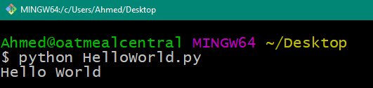
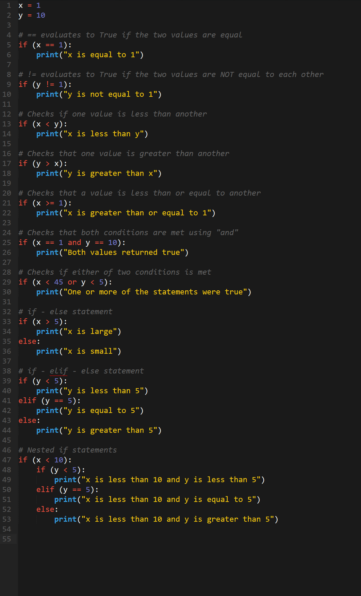

## 3.1 Lesson Plan: Power of Python

### Overview

In today's class, students will receive their first exposure to Python programming. They will understand its basic syntax, its use cases in security, and learn how to build a simple command line interface (CLI) for checking against a list of blocked IP addresses. 

### Objectives

By the end of class, students will be able to:

* Explain how and why Python is used in cybersecurity.
* Utilize basic Python elements like variables and operators. 
* Employ the Python `input()` function to retrieve, store, and utilize user inputs. 
* Reference and store collections of data using lists.
* Use Boolean logic within conditional statements.

### Instructor Notes

* This week's class will likely be one of the most difficult for your students (and potentially... yourself). Take the time to practice the exercises in this lesson plan. If you have questions that emerge during prep-work, be sure to use the instructional community forums. 

* Be sure to spend ample time at the beginning of class to ensure that students have mastered the very basics of Python work. At a bare minimum, each of your students should be able to comfortably create a Hello World script and run it using the command line. Don't gloss over this! It's easy for students to get flustered right out the gate. If you breeze too quickly, students will struggle for the entirety of class.

* In establishing a work-flow for today's class, consider loading the entirety of the lesson plan into a VS Code window. Then navigate between each of the activities from your VS Code window. This will enable you to quickly flip between exercises and solved/unsolved files. 

* Try to stay on track of time as best possible, but always feel free to add a few extra minutes to the clock if students are struggling with an activity. As always, have your TAs refer to the [Time Tracker](../TimeTracker.xlsx) to help you stay on track.

----

### 1. Instructor Do: Why Python?  (0:08)
### 2. Students Do: Install Python (0:07)
### 3. Students Do: Install VS Code  (0:05)
### 4. Instructor Do: Hello World! (0:10)

### 5. Students Do: Hello World! (0:07)
### 6. Instructor Do: Variables and Operators  (0:05)
### 7. Instructor Do: Variables Demo (0:05)

### 8. Students Do: My First Variable  (0:07)
### 9. Instructor Do: Review My First Variable (0:07)

### 10.  Students Do: Variable Dissection  (0:08)
### 11.  Instructor Do: Review Variable Dissection (0:05)

### 12.  Students Do: Variable Address (0:10)
### 13.  Instructor Do: Review Variable Address  (0:05)

### 14.  Instructor Do: Input Demo (0:05)

### 15.  Student Do: Down to Input (0:10)
### 16.  Instructor Do: Review Down to Input (0:05)

----
### 17.  Break   (0:15)
----

### 18.  Instructor Do: Intro to List  (0:05)

### 19.  Instructor Do: List Demo  (0:05)
### 20.  Students Do: Messy Lists  (0:10)

### 21.  Instructor Do: Messy Lists Review (0:05)
### 22.  Instructor Do: Intro to Conditionals  (0:05)

### 23.  Instructor Do: Conditionals Demo  (0:05)
### 24.  Student Do: Password Check  (0:10)
### 25.  Instructor Do: Password Check Review  (0:05)

### 26.  Instructor Do: Reflections  (0:05)

-------

### Copyright

Trilogy Education Services © 2018. All Rights Reserved.
