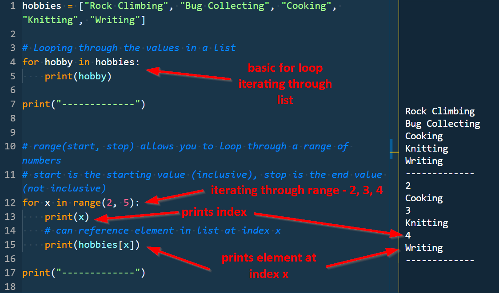
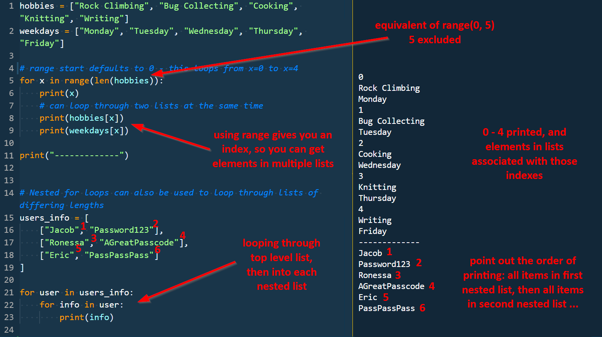
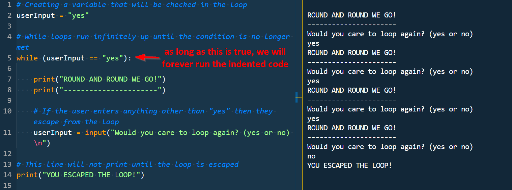
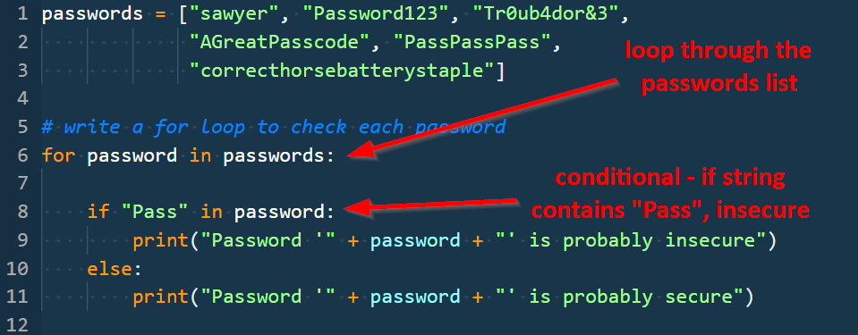
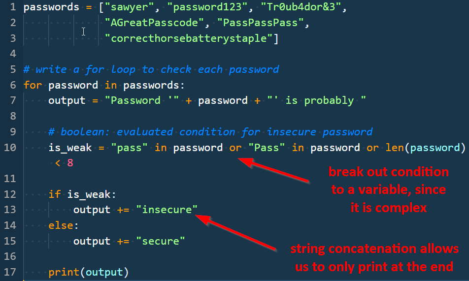
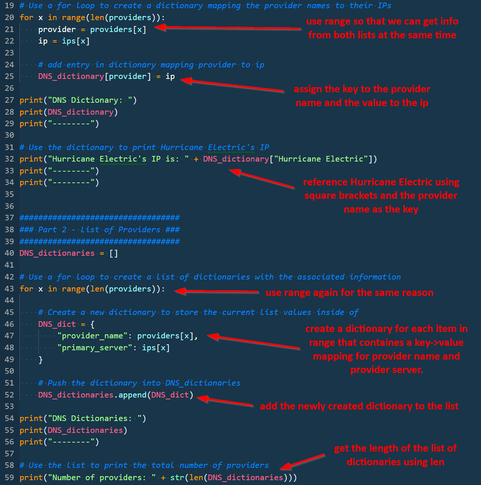
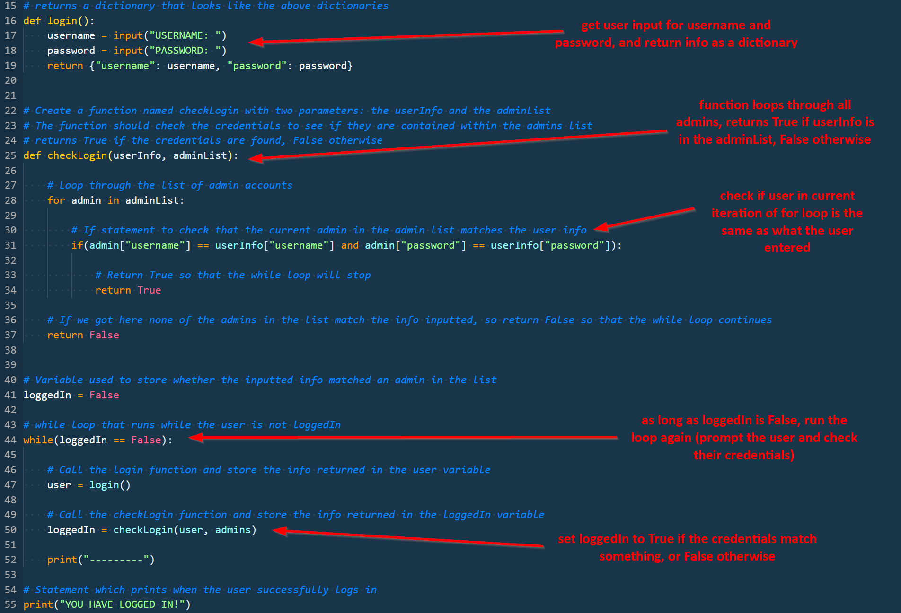
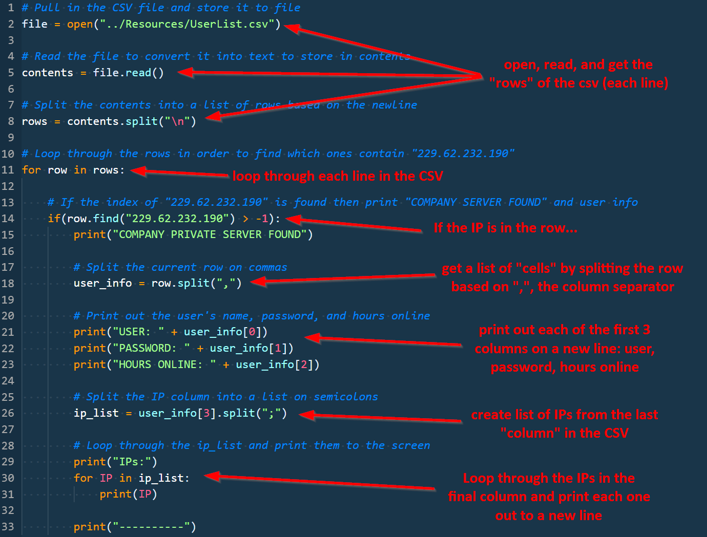

## 3.2 Lesson Plan - Picking up the Python Pace

### Overview

Today's class is intended to finish introducing most of the basic programming building blocks with Python. As such, we introduce students to loops, dictionaries, functions, and reading files.

### Objectives

By the end of class, students will be able to:

- Use loops to iterate through lists and dictionaries to perform basic operations on collections of data.

- Create and reference data in dictionaries.

- Work with lists of dictionaries to store and retrieve information.

- Create and run functions to abstract repeatable tasks.

- Read files from disk using Python and parse the information in those files.

### Instructor Notes

- Today we'll be building on a lot of concepts from the previous class. This will involve practicing many of the previous class's concepts, so students who struggled in the last class will likely to continue to struggle today.

- Walk through today's slides before class to get a feel for the flow. You'll be using the slides to step through some code - be prepared to talk about how the code works!

- Today is another fast-paced day that is very activity-based. Be sure to leave time for students to practice, and don't spend too much time lecturing.

- Walk around during activities and help to unblock students!

- Take the time necessary before class to familiarize yourself with each activity for today. In particular, make sure to practice your workflow before class. It is easy get lost on stage when switching back and forth between code and slides. Each extra keystroke you show on screen is an opportunity for your students to get lost, so be intentional with each command. Take the time necessary to articulate what you are doing at each step.

- For executing python scripts, ensure that students are using the right click/"Run Python in Terminal" through VS Code - it will help head off any issues with incorrectly located files and other similar problems.

- Try to stay on track of time as best possible, but always feel free to add a few extra minutes to the clock if students are struggling with an activity. As always, have your TAs refer to the [Time Tracker](../TimeTracker.xlsx) to help you stay on track.

----

### 1. Instructor Do: Intro and Pace Setting (0:05)

- Welcome students back to class!

- Use the intro slides to review yesterday's topics and give them an overview of the goals for the day.

- Take a moment before moving into the loops slides to give students a pep talk. Python is one of the hardest things we'll cover, but also one of the most rewarding. It's a skill that can help them in almost any job, and one they'll likely value for the rest of their lives. It's definitely tough, but it's tough for everyone.

- Take a moment to share your experience learning your first programming language to share with them how difficult it was for you.

- Ask students if they have any questions before moving on.

### 2. Instructor Do: Loops, For Loops, While Loops Slides (0:10)

- Use the slides to introduce the concept of loops and walk through a for and while loop example. The key takeaways are:

  - Loops allow you to run/repeat a single block of code multiple times.

  - For loops are used to iterate through something, while loops are used to run code until some condition is met.

  - The range function is useful if you don't want to loop through the whole list.

- Once you get to the Demo slide answer any questions before moving on.

### 3. Instructor Do: Loops Demo (0:05)

- Open up the `01-Ins_Loops` folder.

- Walk through each file in order - spending about a minute on each loop example, and running the code by right-clicking and selecting "Run Python File in Terminal".

  - Don't spend too long on the following demo! They'll learn faster by coding, so timebox this section strictly so that they have time to practice on their own.

- Use the following images as a guide in walking through the code, and run each file:

  - `1-ForLoops.py`:

    

  - `2-ForLoops-Advanced.py`

    

  - `3-WhileLoops.py`

    

- Ask students if they have any questions before moving on.

### 4. Students Do: Loopy Conditionals (0:05)

- Don't open the `02-Stu_LoopConditionals/Solved/PassCheck.py` file - simply right-click and choose the "Ryun Python File in Terminal" command.

- Demonstrate running the file and showing the output (should look like the images on the slide).

- Use the slide to show the instructions for the activity.

- Ensure the students have the `Unsolved/PassCheck.py` file to work off of.

### 5. Instructor Do: Review Loopy Conditionals (0:05)

- Use the image following to walk students through the solution. Once finished walking through the solution, run the code to show the output.

  

- Point out the following in the bonus file:

  

### 6. Instructor Do: Dictionaries (Slides) (0:03)

- Use the dictionary slides to explain the final data type we'll discuss. Key takeaways:

  - Dictionaries are key -> value mappings. They're for defining properties, whereas lists are just collections of alike items.

  - Syntax for dictionaries: `{}` for creation, `name["key"]` for referencing and assigning values at "key"

  - There are a ton of other data types! These are some of the most commonly used.

### 7. Instructor Do: Dictionaries (0:05)

- Open up the `03-Ins_IntroToDictionaries` folder.

- Walk through and use the comments in each file to demo dictionaries. Spend about 1-2 minutes per file.

  - Don't spend too long on the following demo! They'll learn faster by coding, so timebox this section strictly so that they have time to practice on their own.

- Open each of the following and run them, pointing out the following:

  - `1-Dictionaries.py`

    - Basic syntax, reference, assignment, and deletion.

  - `2-Dictionary-Methods.py`

    - Dictionary methods and looping through dictionaries

  - `3-List-of-Dictionaries.py`

    - Defining a list of dictionaries and looping through the list.

### 8. Students Do: Hobby Book (0:08)

- Bring up the slide that gives the requirements for the next section.

- Tell students that they'll need to create a file from scratch and run it!

- Walk around helping students as they complete this task.

### 9. Instructor Do: Review Hobby Book (0:04)

- Walk students through the solution file `04-Stu_HobbyBook/HobbyBook_Solved.py`, using the comments in the file as a guide.

### 10. Students Do: The DNS Dictionary (0:10)

- Use the slide to introduce the next activity, DNS Dictionaries.

- Explain that in this activity students will build different data structures for accessing information.

- They are given two lists, and will be expected to loop through the lists to create new structures.

- Demonstrate the output of the file by running it before students start.

- Send out the `05-Stu_DNSDictionary/Unsolved/DNSDictionary.py` file to students as a starter.

### 11. Instructor Do: The DNS Dictionary Review (0:05)

- Open the solution in `05-Stu_DNSDictionary/Solved/DNSDictionary.py`

- Walk students through the code that loops through the lists and creates the desired structures. Use the following image as a guide:

  

- Don't go through the bonus! It will eat up too much time. But recommend that they revisit it for practice later.

### 12. Break (0:15)

### 13. Instructor Do: Functions (Slides) (0:10)

- Use the slides to introduce the concept of functions and methods.

- Walk through the code example in the slides quickly. Try to timebox this! The key takeaways are:

  - Functions are used to name blocks of code you can refer to later.

  - To work with functions you must both define and call them.

  - Functions can help DRY up and deduplicate code.

  - Functions are useful for taking various input and returning an output value.

- When prompted, transition into the demo.

### 14. Instructor Do: Functions Demo (0:05)

- Open up the `06-Ins_Functions` folder.

- Starting with `1-Functions.py`, walk through the code, progressing eventually to `2-Functions-Arguments.py` and finally to `3-Function-Return.py`.

  - Spend about 1 minute on each function.

- Be sure to point out the usage of arguments and the `return` keyword.

### 15. Student Do: First Function (0:10)

- Use the slide to introduce the requirements for this activity.

- Explain to students that they will not get a starter file for this activity!

- Walk around and help students as they work on this.

### 16. Instructor Do: Review First Function (0:05)

- Open up `07-Stu_FirstFunctions/Solved/Length.py` and walk through the code, using the following image as a guide:

  

- Time permitting, open up `07-Stu_FirstFunctions/Solved/Length-Bonus.py` and walk through that code as well.

  

### 17. Students Do: Partners Admin Login (0:15)

- Explain to students that this activity is challenging. We've done a lot of the "psuedocoding" for them - they will have to fill in the code itself.

- Navigate to the slide with the instructions for this activity, and send students the `08-Stu_UserAdmin/Unsolved/UserAdmin.py` file.

- Tell students you'll be walking around to help with code and answer questions.

### 18. Everyone Do: Admin Login Review (0:10)

- Open up `08-Stu_UserAdmin/Solved/UserAdmin.py` and walk through the code solution, using the following image as a guide:

  - Note: If you have extra time, live-coding this activity is an insightful exercise for students.

    

- Ask students if they have any questions before moving on.

### 19. Instructor Do: Reading Files (0:05)

- Point out that running the file only works if you run the Python file from the folder in which it defined, so that it can find the other file.

- Demonstrate this by right clicking to run the file, show the error, then right-click the file in the file explorer, click "open in command prompt", and then run the file manually using `python 1-ReadingTXT.py`

- Spend about 2 minutes in each file. Be sure to point out the most important pieces: `open` and `read`.

- Explain that because these are read as strings, string methods such as `.split` and `.find` are very helpful in parsing the file/getting information.

- Run both files to show the output, and compare that output to the files being read.

- Ask if anyone has questions before moving on to the final challenge activity with students.

### 20. Partners Do: The User List (0:25)

- Use the slide to introduce the final activity.

- Explain that it will be challenging! Encourage students to try their best with what time is left. We will revisit this code next class either way.

- Send out the `10-Stu_TheUserList/Resources/UserList.csv` file.

### 21. Everyone Do: The User List Review (0:10)

- Walk through the solution. Use the following image as a guide as you explain how the code works.

  

- Ask if anyone has any questions before moving on.

  - If you have time left over, feel free to review some of the bonus solution as well.

### 22. Everyone Do: Reflect (0:05)

- Use the final slides to reflect on the day's learning and answer any final questions before dismissing class.

### 23. Instructor Do: Intro Homework (0:05)

### 23. END

