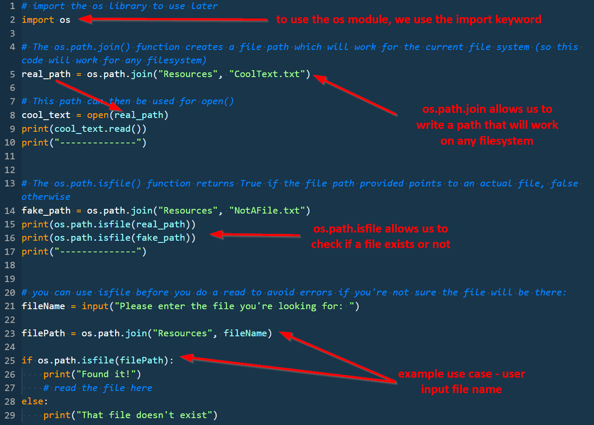
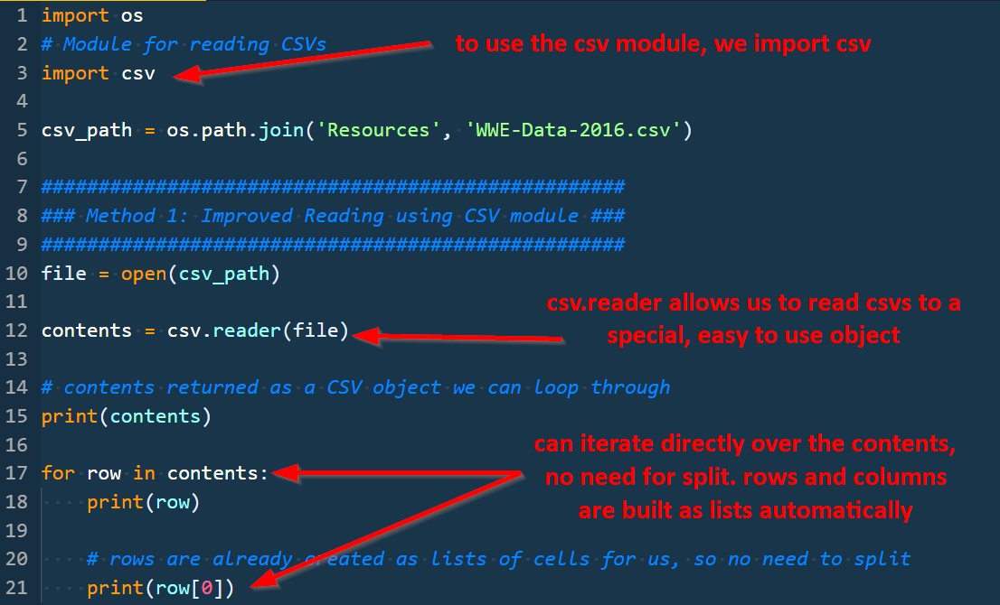
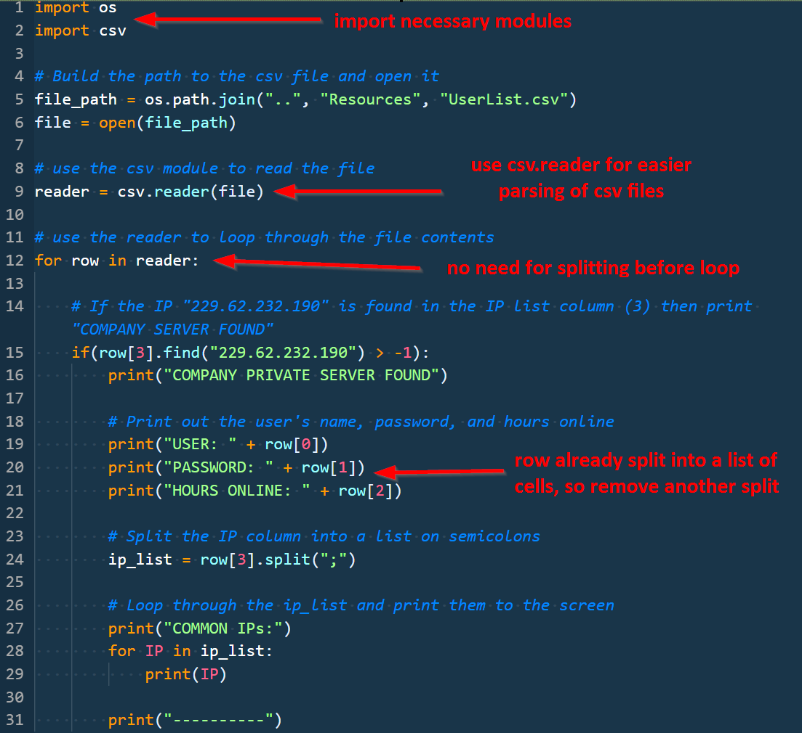
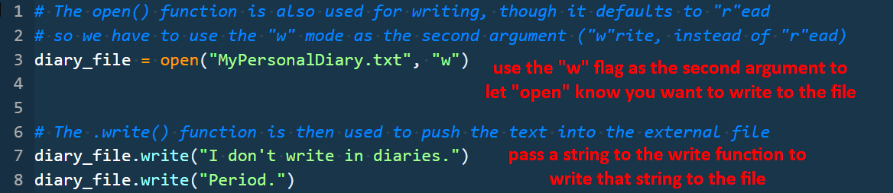
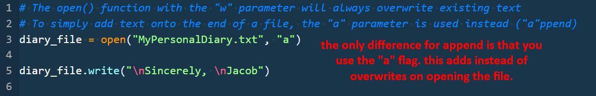
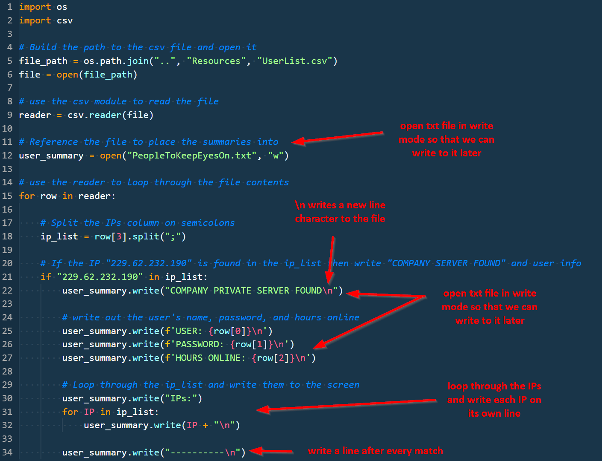
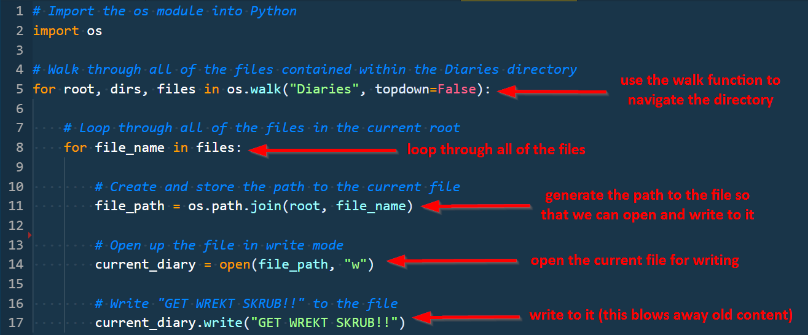
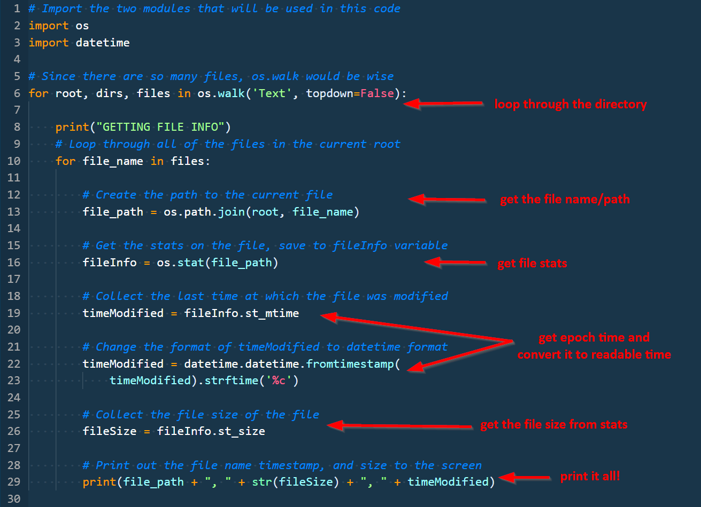
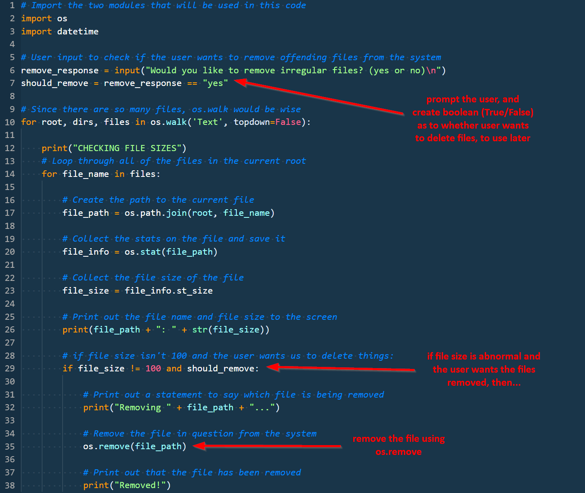

## 3.3 Lesson Plan - Practicing with Python Projects

### Overview

Today's class is intended primarily for further practice of the previous two day's material. Students learn how to use modules and write files, while building more complex applications.

### Objectives

By the end of class, students will be able to:

- Use modules to complete more complex operations with Python.

- Search and reference documentation to learn of and use necessary functions.

- Read and write files using Python.

- Walk through directories effectively using the `os` module.

- Use the datetime module for date management.

### Instructor Notes

- Today's primary goal is to give students a lot of time writing and running Python scripts, and using modules.

- The focus is more on guided practice than direct instruction - students should spend a lot of time writing code and practicing what they've learned this week.

- Be sure to walk around during activities and help to unblock students and answer questions!

- Take the time necessary before class to familiarize yourself with each activity for today. In particular, make sure you understand well the code and can explain it easily.

- Remember that when reading/writing files, you must be running the Python script from its directory - so "Run Python File in Terminal" won't work. Open the directory that contains the file in the Terminal and run the script using `python script.py`.

- Try to stay on track of time as best possible, but always feel free to add a few extra minutes to the clock if students are struggling with an activity. As always, have your TAs refer to the [Time Tracker](../TimeTracker.xlsx) to help you stay on track.

----

### 1. Instructor Do: Welcome and Recap (0:05)

- Welcome students back to class!

- Use the intro slides to review yesterday's topics and give them an overview of the goals for the day.

- Get a show of hands regarding who is feeling overwhelmed.

- Explain that programming is one of the most difficult things they will learn, and it takes years to master. As long as they're getting exposure and feel like they're making progress, they're in a good spot.

- Encourage them to attend office hours if they have any questions or concerns.

### 2. Instructor Do: Intro Modules (Slides) (0:03)

- Use the slides to guide your conversation around modules in Python. Key takeaways:

  - Modules are just other chunks of code we can use and take advantage of.

  - Python comes prepackaged with a ton of libraries already which can be pulled in and used without much hassle.

  - Modules behave similarly to functions.

- When prompted, jump into the demo.

### 3. Instructor Do: The CSV and OS Modules (0:05)

- Explain that we're going to look at two commonly used modules - `csv` and `os`

- Explain that `csv` is intended for interacting with CSV files (reading, writing, etc.), while `os` gives you operating system specific functionality.

- Explain that we're going to look at two examples.

- Open the `01-Ins_ModulesAndOS` folder.

- Point out that you need to be in the correct folder when running the Python file to read another file - since we're using relative paths.

- Open `01-OSModule.py` and spend about 2 minutes walking through the code, showing the value of the OS module. Use the following image to guide your walk through of the code:

  

- Open `02-CSVModule.py` and spend about 2 minutes walking through the code, explaining the value of the CSV module.

  

### 4. Students Do: User List Revisit (0:12)

- Use the slide to communicate the requirements for the next activity.

- Send out the starter file `02-Stu_UserListRevisit/Unsolved/UserList.py`

- Students will rebuild the final activity from last class using the `os` and `csv` modules.

- Walk around the class and help students as they work on this.

### 5. Instructor Do: Review User List Revisit (0:05)

- Walk through the solution in `02-Stu_UserListRevisit/Solved/UserList.py`, using the following image to guide your walk through of the code:

  

- Share the solution with students. Don't go into the bonus solution for now, but encourage them to look into it on their own time. They will build on this solution later today.

### 6. Instructor Do: Writing Files (0:05)

- Explain that now that we can effectively read files, the next step is ... writing them!

- Open up `03-Ins_WritingFiles`. Show that the only two files in the folder are the `.py` files.

- Run `01-WriteFile.py`. Show how a new file pops up. Inspect the contents of the new file, and then open up `01-WriteFile.py` in the text editor and walk through the code.

  

- Run `01-WriteFile.py`. Inspect the contents of the file, and show how the diary entry text has been updated. Then, open up `02-AppendFile.py` in the text editor and walk through the code.

  

- Ask if anyone has questions before moving on.

### 7. Students Do: User Summary File (0:15)

- Building off of the previous activity, students will now create a new file which will contain a summary report on each of the users contained within the user list.

- Use the slides to introduce the activity requirements.

### 8. Instructor Do: User Summary File Review (0:10)

- Walk through the code solution, answering any questions as you go.

- Open up `04-Stu_UserSummary/Solved/01-UserSummary-AllWrites.py` and use the image below to guide your code walk through.

  

- If time allows, feel free to skim the string concatenation version of the solution as well.

### 9. Instructor Do: OS.walk demo (0:05)

- Introduce the `os.walk()` function, which allows us to navigate through multiple folders and files at the same time.

- Open `05-Ins_OSWalk/OSWalk.py` and walk through the code, using the comments in the file as a guide.

- Show the `Resources` folder, and then run the Python script to show the output. 

- Send out the `OSWalk.py` file to students, and ask if they have any questions before they try it themselves.

### 10. Students Do: "GET WREKT SCRUB!" (0:15)

- Continue to the slide introducing the GET WREKT SCRUB activity.

- Send out the `Diaries` folder content to students.

- Be sure to walk around and help students throughout this activity - there are lots of places they could get stuck!

### 11. Instructor Do: "GET WREKT SCRUB!" Review (0:05)

- Open up the solution in `06-Stu_GetWrekt/Solved/GetWrekt.py` and walk through the solution, using the following image as guidance.

  

- Send out the solution and ask students if they have any questions before breaking.

### 12. BREAK (0:40)

### 13. Instructor Do: OS File Stats (0:10)

- Open `07-Ins_FileStats/FileStats.py` and walk through the file, explaining the different modules and functions used. 

  - `os.stat()` to collect information on a file

  - `st_size`: Size of the file
  
    - If a file's size seems out of place, that should be a red flag for something fishy going on

  - `st_atime`: Time of most recent access in unix epoch

  - `st_mtime`: Time of most recent modification in unix epoch

    - If a file's modification time is markedly different than all others in the same system, then that should be a red flag as well.

  - `os.remove()` to delete files (DANGEROUS)

### 14. Students Do: Searching the Red Flag Sea (0:25)

- Use the slide to distribute the activity instructions. Ensure that students have the right starting folder (`08-Stu_SearchingRedFlagSea/Unsolved/Text`)

- Explain that in this activity, they're going to look at a number of files and try to identify outliers.

- Give students extra time as needed, and encourage them to help those around them if they finish early.

### 15. Instructor Do: Searching the Red Flag Sea Review (0:10)

- Open `08-Stu_SearchingRedFlagSea/Solved/RedFlagSea.py` and walk through the solution, using the following image as a guide:

  

- When finished walking through the code, send the solution to students for reference.

### 16. Students Do: Cleaning the Red Flag Sea (0:25)

- Use the slide to distribute the activity instructions for the next step.

- Tell students to use the file provided, `09-Stu_CleaningRedFlagSea/Unsolved/RedFlagSea.py`, as a starting point.

- Give students extra time as needed, and encourage them to help those around them if they finish early.

### 17. Instructor Do: Cleaning the Red Flag Sea Review (0:10)

- Open `09-Stu_CleaningRedFlagSea/Solved/RedFlagSeaNormal.py` and walk through the solution, using the following image as a guide:

  

- When finished walking through the code, send the solution to students for reference.

- Spend the time necessary to make sure students are comfortable with this activity (it is similar to their homework).

- If you have extra time, feel free to walk through the challenge solution as well.

### 18. Students Do: Reflect (0:05)

- Using the slides, reflect on the week and what they've learned.

- If needed, spend extra time here answering questions. Depending on time, you can jump into the next bonus activity.

### 19. Students Do: Password Hunt (BONUS) (0:30)

- This activity is more of a bonus/for fun activity. It is good practice, and will help with their homework, but isn't required.

- Use the slides to give out instructions for the activity.

### 20. Instructor Do: Password Hunt Review (0:10)

- Walk through the code solution and answer any questions from students.

### 21. END

