## 4.1 Lesson Plan - Psst... Intro to Cryptography

### Overview

In today's class, students will receive their first exposure to the cryptography and encryption. They will spend a major portion of class focused on the Caesar cipher, learning it's basic mechanism, implementing it in code, and discussing the vulnerabilities present within it.  

### Class Objectives

By the end of class, students will be able to:

* Define the words "Cryptography", "Encryption", "Decryption", "Ciphertext", "Plaintext", and "Cipher Key"
* Articulate how the Caesar Cipher works.
* Explain how the Python implementation of the Caesar cipher works.
* Describe how a vulnerable cipher like the Caesar Cipher can be cracked using rote attack methods.

### Instructor Notes

* Today's class marks students' first foray into the classic security topic of cryptography. Today's class centers around the Caesar cipher, a simple encryption mechanism that offers students an accessible foothold to the field. 

* Today's class is primarily split between thought exercises and code implementation. Treat each of these components as equally important. Let students know that the coding exercise is meant for them to reinforce their Python skills and help them understand how encryption can be implemented in practice. 

* Make an extra effort to stay on track of time. While many of your students will  struggle with the final step of the Caesar implementation, be sure to leave time for the final thought exercise ("The Barbarians Got Mail"). The exercise is both fun and *critical* for students to understand how ciphers can be cracked. For students wanting to spend more time on the coding exercise, offer to host a review during office hours. 

* Today's PowerPoint includes a number of quick engagement exercises meant to stimulate interaction in the classroom. Be sure to familiarize yourself with the slides thoroughly prior to class. 

* As always, have your TAs refer to the [Time Tracker](../Unit4_Cryptography.xlsx) to stay on track.

------

### 1. Instructor Do: Intro to Encryption and Caesar Cipher  (0:15)

* Begin class by presenting the [PowerPoint](Psst_Intro_to_Cryptography.pptx) slide sections titled "Intro to Encryption" and "The Caesar Cipher." These sections offer a high-level introduction to the concept of cryptography, its historic context, and the mechanism behind the [Caesar cipher](https://en.wikipedia.org/wiki/Caesar_cipher).

* Make sure to cover the Caesar cipher's mechanism in depth. It is easy for students to *think* they understand how it works, only to be totally stumped when asked to implement it on their own. 

* Use the slides to guide your narrative and when prompted use the "Quick Activity!" slides to create moments of class engagement. 

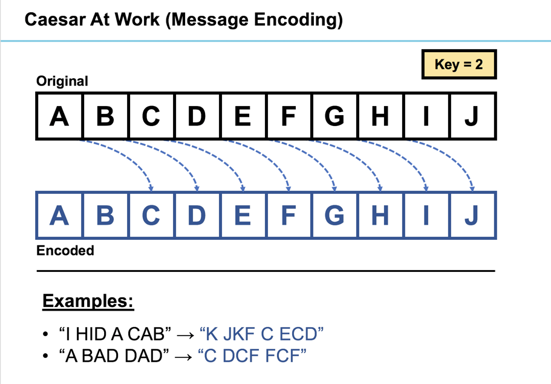

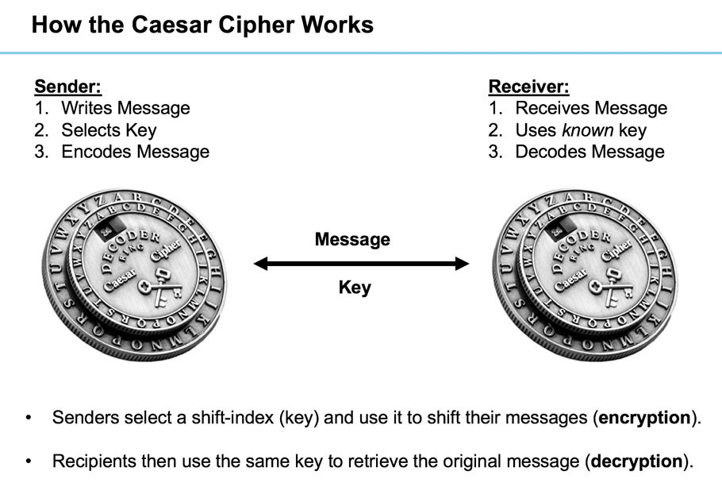

### 2. Students Do: Caesar's Minions (0:10)

* When you arrive at the first formal activity ("Caesar's Minions"), break students into pairs of two. Then send them the following instructions (also specified on the slide):
  
  * **Instructions:**
   
    * Take a few moments to do the following:

      * Explain to your neighbor in 2-3 sentences how the Caesar Cipher works. 
      * Next write a one sentence message (hidden from your partner). 
      * Specify a shift-key and use it to encode the message.
      * Then provide your partner the encoded message and key.
      * Have your partner use the key to decode the intended message. Confirm that they were correct.
  
  * **Notes**: 

    * Use only this link <http://inventwithpython.com/cipherwheel/> to do your encoding / decoding. 

### 3. Instructor Do: Review the Caesar Cipher Decoder Ring  (0:05)

* Take a moment to review the activity as a class. Specifically:
  
  * Ask students to articulate how the Caesar cipher works to you. Be sure to nudge them into offering a precise answer. (Answer: The Caesar cipher uses a letter shift substitution. The shift is determined by the key value.)
  
  * Ask one student to share their message and key with you. Then decode the message live. It's a simple way to create a bit of fun from the stage.

### 4. Instructor Do: Caesar Cipher… In Code (Overview)  (0:05)

* Next, take a few moments to introduce students to their coming challenge: implementing the Caesar cipher in code. Let students know that they will be taking this challenge on in smaller steps. 

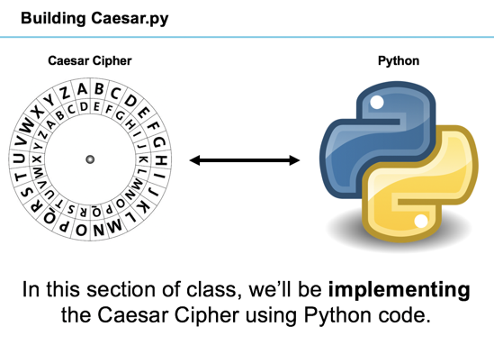

### 5. Students Do: Planning Caesar's Attack   (0:07)

* When prompted have students take a few moments to pseudocode their plan of attack in implementing the Caesar cipher. Encourage students to keep it simple -* specifying no more than 3-5 of the most critical steps in the process.

*  Then send them the following (also specified on the slide) 

  * **Instructions:**

    * Take the next few moments to pseudocode an approach to building Caesar.py with your neighbor.
    * Specifically, try to break down the problem into 3-5 steps. 
    * Be thinking of concepts you’ve used in Python (for-loops, functions, variables) in selecting your steps.
    * Be prepared to share!

### 6. Instructor Do: Review Planning Caesar's Attack  (0:05)

* Provide students a few moments to share their responses. Offer encouragement and nudges for clarification as they do so. Then use the slides provided to offer your own suggested strategy. 

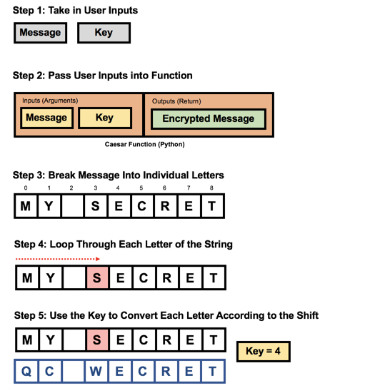

### 7. Students Do: Python Vowel Replacer  (0:12)

* Now it's time to switch away from the PowerPoint temporarily and into the code editor.

* Send students the following as a first step in implementing the Caesar cipher.

  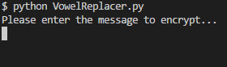

  * **Instructions:**

    * Take in some user input for the message that they desire to encode.

    * Loop through every letter in the message and perform the following actions...

      * If the letter "a" is found, replace it with "b"
      * If the letter "e" is found, replace it with "f"
      * If the letter "i" is found, replace it with "j"
      * If the letter "o" is found, replace it with "p"
      * If the letter "u" is found, replace it with "v"
      * If the letter "y" is found, replace it with "z"
    
    * Print out the now-encoded message to the terminal

  * **Hints:**

    * Strings operate in much the same way lists do. This means that it is possible to loop through every character in a list using a for loop!

### 8. Instructor Do: Review Python Vowel Replacer (0:05)

* Next, take a few moments to review the solution. As you do, use the below talking points to guide your discussion:

  * First, we created a variable called `original_string` meant to capture the user's input. 

  * Next, we created an empty variable called `encoded_string`. This will serve as our placeholder for the encrypted string.

  * Next, we created a for-loop that loops through each character (letter) of the string. 

  * For each iteration of the lop, we run conditional checks to see if the letter matches a vowel. If it does, then we add the encrypted letter to `encoded_string`. If it doesn't, we add add the original letter to `encoded_string`.

  * Finally, we print the final version of `encoded_string` for the user. 

  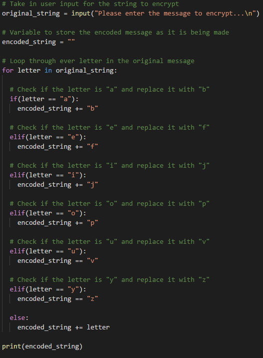

### 9. Instructor Do: Python Vowel Replacer with Dicts (0:10)

* Next, show students how their previous code could be re-written using Python dictionaries. 

* Open the solution file provided and use the below talking points to guide your discussion:

  * Begin by reminding students that dictionaries are used to relate keys to values.

  * In this case, we're using our keys to represent the original plain text letters. Our dictionary values represent the encrypted cipher text letters.

    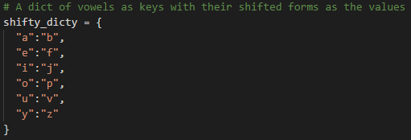

  * Next, we use the same for-loop as in our previous example to loop through each character of our original message.

  * This time, however, we use `if`-`in` code to check if our character of index falls within the dictionary's keys. If the character falls within the dictionary, we add the encrypted letter to `encoded_message`. If it does not, then we add the original letter to `encoded_message`. 

  * Once the loop is complete, we print the final version of `encoded_message`.

    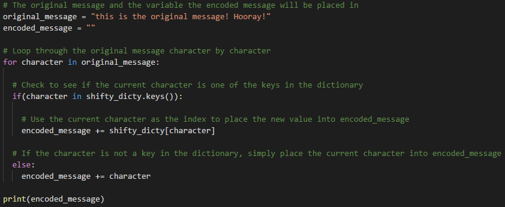

* Send students your solution file once you have completed your review.

-------

### 10. BREAK (0:15)

-------

### 11. Students Do: Python Dynamic Caesar Cipher (0:30)

* This next activity will be the most challenging for many of your students as they will be tasked with  modifying their previous code to handle various cipher key values. The  implementation will require a bit of logic and creative problem solving, but is well within their skill range.

* Send students the following instructions to guide them on the next step:

  * **Instructions:**

    * Create a command line application that takes in two user inputs (sentence and key). 

    * The code should then output an encrypted version of the sentence using the specified key value. 

      * For example, "cat" with a shift of three will become "fdw"

  * **Hints:**

    * This is a challenging exercise! Spend time breaking down the task into discrete programming tasks:

      * Create two arrays. One to hold the original alphabet and one to hold the cipher alphabet. 

      * Capture the user inputs and store them in variables.

      * Use the key to create the cipher alphabet.

      * Map the sentence to your new cipher alphabet. 

    * Think about using two loops to create your shifted alphabet: one which loops through the alphabet starting from the key number up until the end and another which then loops through the beginning of the alphabet all the way up to the shift number.

    * Again... Don't fret. Treat this like a brainteaser! Cybersecurity is all about creative problem solving. 

### 12. Instructor Review: Python Dynamic Caesar Cipher (0:20)

* Once time is up, spend the time necessary to review this solution in-depth.

* Open the provided solution and use the below talking points to guide your discussion:

  * Begin, by acknowledging that this was a challenging exercise.

  * Then break down the code into five major sections. 

  * The first section is meant to capture the full alphabet in the array `regularAlphabet`.

  * The second section creates a variable called `cipherAlphabet` meant to hold the shifted version of the alphabet.

  * The third section captures the user inputs (`sentence` and `shiftNumber`).

  * The fourth section is where we use the user inputs to shift each letter of the alphabet according to the cipher. This is a tricky section of code, but at a high-level, it works by looping through each letter of the alphabet and adding the shift value to the array index to find the new value. Each shifted letter is added to the cipher alphabet. 

  * The fifth section is where we loop through the original sentence and use the the cipher alphabet to encrypt. 

  * Give students a few moments to digest the code before continuing. 

    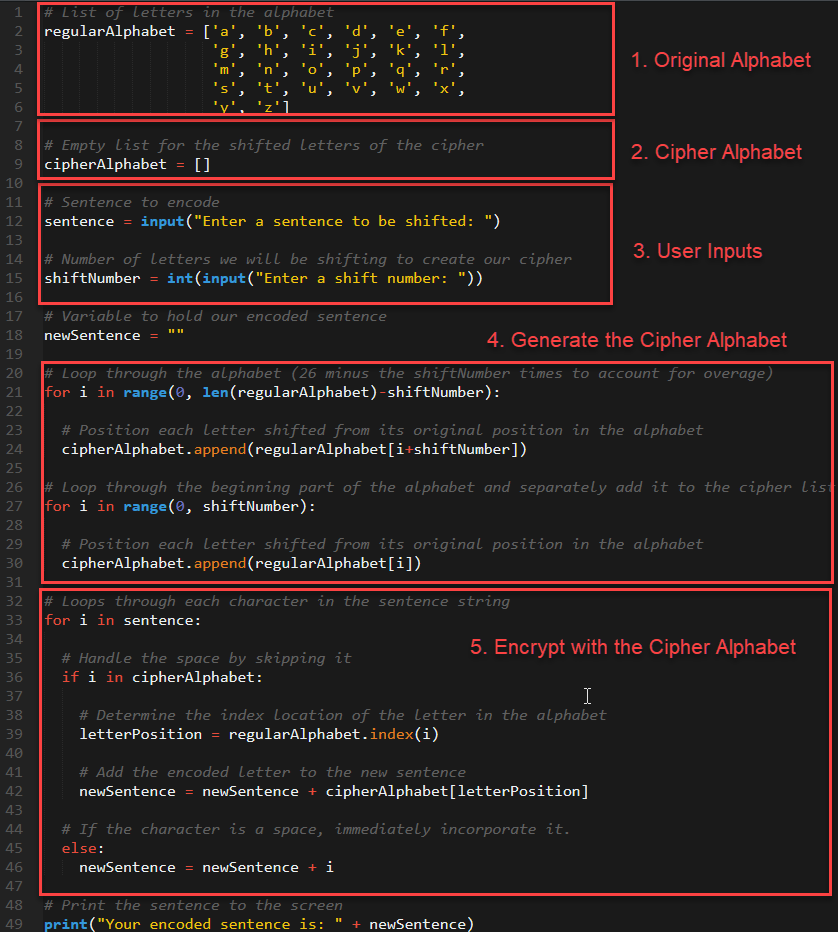

* Answer any questions that remain, before sharing your solution. 

### 13. Instructor Do: Caesar's Vulnerabilities (0:05)

* Now, return back to the PowerPoint to the section titled Caesar's Vulnerabilities. Then use the slides provided to kick-off the coming thought exercise on cracking the Caesar cipher. 

* Don't give away the answer just yet! Give students a chance to figure it out themselves!

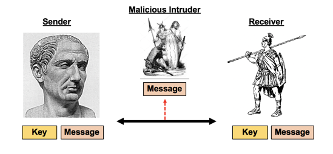

### 16. Students Do: The Barbarian's Got Mail (0:15)

* When prompted have students work with their neighbor on the final thought-exercise. 

* Send the following instructions to students (also specified on the slide):

  * **Instructions:**

    * Work with your neighbor to play out each of the following:

      * *Red Team – You Are the Barbarians*:

        * You’ve successfully (and bloodily) secured one of Caesar’s messages. 

        * However, it reads like gibberish. In fact it says: “olhklk av aol ypcly mvy h zvsv chjhf. zll fvb shaly!”. Figure out a way to determine it’s meaning. 

        * Be ready to share your approach with the general.

      * *Blue Team – You Are Caesar*:

        * The Barbarians have successfully obtained Caesar’s most recent (encrypted) message! Outline a series of steps to assess the risk  and prevent future impact.

        * Specifically come up with at least 5 assessment questions to ask and 5 proposals.

        * Be ready to share your approach with Caesar!
 
### 14. Instructor Do: Review the Barbarian's Got Mail (0:05)

* Have students share a few of their solutions prior to sharing the solution provided. 

* Use the below talking points in explaining the Red-Team solution:

  * Because of the limited number of shift possibilities (0-25), a persistent intruder can simply try every option. The option that reads like plain text is thus the intended message. Code implementations can further speed this process up by using functions for confirming that words are English -- thus ruling out all of the gibberish options. 

  * Because the cipher key for encryption is the same as for decryption, the intruder who uses brute force is thus able to retrieve the cipher for all future communication interceptions. Later, we'll be talking about various means to improve security against such intrusions. 

  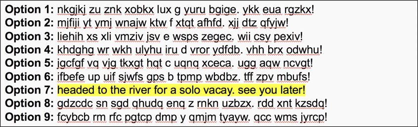

* Use the below talking points in explaining the Blue-Team solution:
  
  * As a Blue Team defender, we don't always have the ability to prevent or avoid interception altogether. Instead, we often need to plan for the worst. In this case, this means considering a reality that messages will frequently be intercepted and either our cipher needs to be more secure or we need to reduce critical communication along the faulty channel.
  
  * Feel encouraged to expand on this answer with stories or cases from your own work experience. 

### 15. Instructor Do: Prelude Next Class (0:05)

* Finally, use the last slides of the presentation to conclude class. 

* Encourage students to recognize that they've done well if they can articulate a working definitions of cryptography, the mechanism behind the Caesar cipher, and the idea of "cracking" a cipher using brute force.

* Let students know that they will be learning how to strengthen our cipher next time, before dismissing them for the evening.

-------

### Copyright

Trilogy Education Services © 2018. All Rights Reserved.