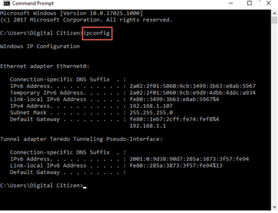
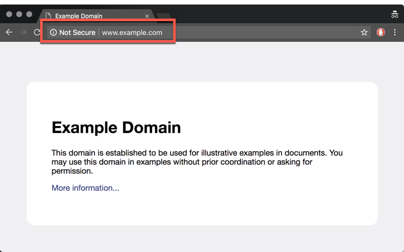
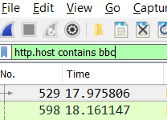
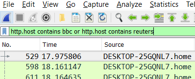
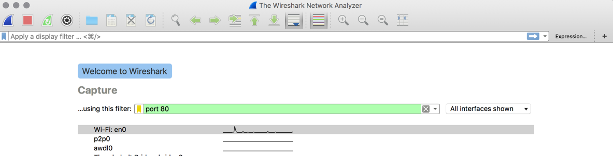
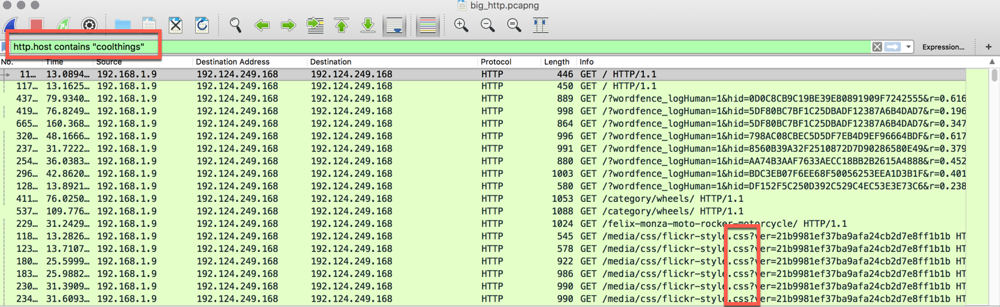

## 5.2 Lesson Plan: NetWorking with Wireshark

### Overview

Today is about building a basic understanding of how to use Wireshark, exploring examples of communication and diving deeper into how computers communicate. To that end, we heavily use and practice with Wireshark, using it as a means to explore packets and visualize layers of the OSI model. We're taking a bit of a pincer approach - discussing packets and application-layer analysis first.

### Class Objectives

By the end of class, students will be able to:

* Explain the purpose and value of tools like Wireshark in cybersecurity
* Capture communication over the network using Wireshark
* Explain the basics of a packet in Wireshark
* Analyze existing packet capture files using Wireshark
* Filter packet capture files to only show specific communication using Wireshark
* Associate functionality in Wireshark with the OSI Model
* Explain the various panels/views in Wireshark and the contents displayed

### Instructor Notes

* This week is all about introducing networking concepts to students and getting them comfortable. The week uses Wireshark as a tool to introduce and visualize complex protocols and network communication.

* Today's class is very hands on - the point is to convey concepts and get students comfortable with the tool, which we'll dive into more deeply throughout the week.

* We strongly recommend running through today's lecture and demo portions of the class ahead of time, because much of the instruction is done working with Wireshark. Each extra screen, misstep, or keystroke you show is an opportunity for your students to get lost, so be intentional with each step. Take the time necessary to articulate what you are entering/doing at each step.

* We recommend increasing your cursor size so students can more easily follow your mouse and/or zooming into sections of the UI so it's easier for them to follow.

* Try to stay on track of time as best possible, but always feel free to add a few extra minutes to the clock if students are struggling with an activity. As always, have your TAs refer to the [Time Tracker](../5-TimeTracker.xlsx) to help you stay on track.

-------

### 1. Instructor: Intro Class and Recap (0:05)

* Welcome the students to class.

* Use the slides to recap last class, talk about where we are, and motivate today's lesson.

### 2. Instructor: Intro to Wireshark (0:05)

* Use the slides to introduce Wireshark. Key takeaways:

   - Wireshark is a packet analysis tool used by industry professionals to monitor and dissect network traffic.

  - It allows us to start looking at real communication across the network.

  - It is widely used for forensics purposes to see what happened in network communication.

* Take a moment to talk about your own (and/or your TA's) experience with the tool.

* Next, visit a job website (e.g. https://www.indeed.com/jobs?q=wireshark&l=Atlanta%2C+GA
) and show them the types of roles that use this tool, talking them through what those roles do.
* Navigate to the Wireshark web page to show students where to find its documentation and install it: https://www.wireshark.org/

### 3. Students: Wireshark Install Check (0:05)

* Use the slide for the activity to distribute the activity instructions.

* Walk around and help debug any installation issues. Have TAs help students with installation. Don't spend much time here.

### 4. Instructor: Packets (0:05)

* Use the slides to introduce the concept of packets. Key takeaways:

  * Packets are data sent over the network. They also include related metadata.

  * Packets are often only part of a whole message.

  * Packets are associated with the Transport and Network Layers (3 & 4)  of the OSI Model.

  * You can view and analyze packets using Wireshark.

### 5. Students: Diving with the Wiresharks (0:15)

* Have students form groups of 2-3 to complete this next exercise.

* Give them a heads-up that in this coming challenge they will be tasked with learning to decipher the basics of the Wireshark interface *themselves*. Remind them that this will seem intimidating at first, but as cybersecurity professionals it will often be their responsibility to quickly learn new technologies on the fly.

* Then, send the following instructions for them to complete.

    * **Instructions**

        * Using your own exploration or the Wireshark documentation, complete the following steps and answer the associated questions:

            * First, "Start a Capture". (You will need to first figure out how!)
            * Allow the Wireshark capture to run for a few moments, before "Stopping" the capture.
            * Once stopped, take a few moments to answer the following questions. (Hint: You will need to do a bit of research!)

                * What do the columns "No", "Time", and "Length" represent?
                * What do the "Source" and "Destination" columns represent? How are they associated with one another?
                * What does the "Protocol" column represent? What are a few prominent protocols that appear in your packet trace?
                * What does the "Info" column represent? How might you interpret if it states: "54492 -> 7437 Len=173"?
                * What do the row colors signify? What does a green row signify? Blue? Black? Red?

            * Once you've answered the above questions, begin clicking the various rows. Observe how the panels below change as a result.
            * Then take a few moments to answer the following questions:

                * What is the significance of the *second* panel window (middle)?
                * What is the significance of the *third* panel window (bottom)?
                * What is the significance of the indecipherable numbers, letters, and symbols in the bottom window? What format is this data stored in?

        * **Hint**:

            * If you need a place to start, look for the section titled "The Packet List" Pane in the Wireshark Documentation.
            * Don't worry if you can't decipher all the terms. We'll break them down in due time!

        * **Bonus**:

            * If you finish early, start a new Wireshark capture, but this time immediately begin browsing the web while the capture is running. See if you can identify which rows (packets) are specifically relevant to your web browsing.

    * **Instructor / TAs:**

        * Be sure to wander the class as students explore. It's easy to get stuck or intimidated by the Wireshark interface.

### 5. Instructor: Review Diving with the Wiresharks (0:10)

* Once time is up, call on students one by one to share their answers.

* As they share, gently guide them to the following answers:

    * The "No" column signifies the packet number. The first packet starts at 1 and each subsequent packet is assigned a sequential number until the capture ends. The "Time" column signifies the amount of time (in seconds) from the start of the packet capture. The "Length" column signifies the size in bytes of the packet received.

    * The "Source" column represents the IP address from which the packet originated. The "Destination" column represents the IP address to which the packet arrived.

    * The "Protocol" column represents the communication method by which the packets are transmitted. Common protocols seen in Wireshark include UDP, SSL, HTTP, TCP, etc. We will be covering various protocols in future lessons.

    * The "Info" column includes additional information about the packet. As an example, "54492 -> 7437 Len=173" would signify that the packet was sent from PORT 54492 and received at PORT 7437 with a transmission length of 173 bytes. We will talk more about ports in future lessons.

    * The row colors are pre-defined to correlate with types of traffic (protocol) and interesting packet patterns. These color schemes can be changed based on user interest. By default: Green signifies HTTP or SMB. Light Blue signifies TCP or UDP. Black signifies an error. Red signifies an abort.

      

    * The three sections of the Wireshark window are called: "Packet List", "Packet Detail", and "Packet Bytes."

    * The indecipherable numbers, letters, and symbols represent a complete hex dump of the packet data.

      

* Answer any remaining student questions before proceeding to the next step.

### 6. Instructor: Hunting for HTML (0:10)

* Next, explain to students that Wireshark is a perfect tool for monitoring web traffic on your network. In this next example, we'll be using Wireshark to track web traffic to and from your computer.

* Begin your demonstrating by retrieving your internal (local) IP Address. Remind students that their local IP address is not the same as the Public IP Address they receive when entering "What's my IP Address" in Google.

    * Mac Users can obtain their local IP address by opening a terminal window and entering the command `ifconfig | grep inet`. Your local IP address will tend to be the last address listed.

      

    * Windows Users can obtain their local IP address by opening a command prompt (or bash) window and typing `ipconfig`.

      

* Next, return to your Wireshark application and initiate a capture. Let it run for a few moments before immediately stopping the capture. Point out the repeated appearance of your local IP address in the Source and Destination columns. This is an easy way to spot incoming and outgoing traffic associated with your machine.

  

* Re-initiate a Wireshark capture. Then immediately open a Chrome window in incognito mode. While the capture is running in the background, visit http://www.example.com. (Note: You must open this page in incognito mode to ensure the page does NOT load from cache). Once the page is open, point out the fact that the page does NOT use HTTPS and is thus considered insecure.

  

* Next, return to the Wireshark window and stop the capture. Inform students that web browsers use the HTTP protocol to transmit and receive web page information. Then scroll through the Wireshark Packet List until you spot rows with HTTP listed as the protocol. (Note: If you have too many packets, you can quickly search for HTTP using the Display Filter).

* Take a moment to break down the two rows. As you do so, point out that:

    * In the first row, the "Source" column lists your Local IP address and the "Destination" lists the IP Address 93.184.216.34. This signifies that *our* machine was sending a request to the example.com server.

    * In the second row, the "Source" column lists 93.184.216.34 and the "Destination" column lists your Local IP. This signifies that the *Example.com* server is responding back to our machine.

    * Let them know that they will be spending more time discussing the concept of Client-Server requests in later lessons. But for now, the key is to understand that as we browse the web, our personal machine is constantly sending requests and receiving responses from other machines.

      

*  Next, double click the first of the two HTTP rows (the request row). Scroll through the Packet Details and point out the following:

    * The top line under the section titled Hypertext Transfer Protocol lists the phrase `GET / HTTP/1.1\r\n`. Let students know that this signifies that we made a "GET Request". In essence, by visiting the example.com website, we are making a request to *GET* the web page's contents. Again, let students know they will be spending more time with GET and POST requests at a later date.

    * The the "host" listed is www.example.com.

    * The user-agent listed specifies the web browser we used to visit the example page.

      

* Next, double click the second of the two HTTP rows (the response row). Scroll through the Packet details and point out the following:

    * Under the section titled Hypertext Transfer Protocol we see the phrases `Status Code: 200` and `Response: OK`. This is our signal that the example.com server *successfully* understood our request and provided a response.

      

    * Then flip to the section titled Line-Based Text Data. Point out how this section stores the actual HTML code used to produce the Example.com website on your browser. Again, let them know they will be spending more time with HTML at a later point in time, however, the key for them today is to understand that this HTML is how our browser knows what to render on our screen.

      

* Answer any remaining student questions before proceeding to the next step.

### 7. Students: My First Sniff (0:10)

* Next, let students know they will be completing their own practice capture.

* Use the slide to communicate the instructions to students.

### 8. Instructor: Review My First Sniff (0:10)

* Once time is up, spend a few moments reviewing the previous exercise with students.

* As part of your review, initiate a capture and browse to a website that is insecure (e.g. www.bbc.com).

* Then call on students to answer each of the questions from the assignment. As they attempt to answer, guide them to the below solutions:

    * All packets associated with the HTTP protocol are relevant to the browsing event.

    * Packets for which the "Source" matches your local IP address are the ones associated with the "request".

    * Packets for which the "Destination" matches your local IP address are the ones associated with the "response".

    * Multiple requests and responses appear because modern web applications involve the transmission of multiple files (HTML, CSS, JavaScript, etc).

    * The specific packet associated with HTML markup includes the phrase "/text" in the Info column. To confirm, double click on the relevant packet, open the Packet Detail View, and navigate to the section titled Line-Based Text Data. You should see HTML Markup similar relevant to the website.

      

* Once you've answered the above questions, demo https traffic:

    * Create a new capture while browsing a secure website (e.g. https://www.chase.com).

    * Demonstrate to students that the traffic is now very difficult to decipher by filtering by `http`. It's even hard to tell who the host is -

      
      

    * Explain that instead, the packets are securely communicated using the protocol TLS. Explain that because of the encryption, it can be a significant challenge even identifying which packet is relevant to the browsing event. Show this by using the filter `ssl` (the predecessor to `tls` - this is how wireshark allows you to find all traffic associated with tls).

      

* Answer any remaining student questions before proceeding to the next step.

---

### 9. Break (0:15)

---

### 10. Partners: Leaky HTTP Traffic (0:10)

* Explain that we're going to get some practice by using Wireshark to retrieve a user's username and password from an insecure website.

* Use the slide to distribute the instructions for the activity.

### 11. Instructor: Review Leaky HTTP Traffic (0:10)

* Once time is up, spend a few moments reviewing the previous exercise with students.

* As part of your review, initiate a capture and browse to the www.aavtrain.com website.

* Next, have a student guide you through the process of identifying the relevant packet and user information. As they share their response, nudge them towards the below talking points:

    * The relevant packet includes HTTP as the protocol and the phrase `POST /` as part of the info column. This POST signifies that a POST request was sent by the user to the server.

    * Double click the packet and, in the Packet Detail view, scroll to the section titled HTML Form URL Encoded. There you will the form items: user_name and password, each of which is associated with the user's submission. Voila!

      

* Answer any remaining student questions before proceeding to the next step.

### 12. Instructor: Capture Filters & Display Filters (0:05)

* Next, introduce students to the concept of filtering in Wireshark.

* Explain that there are two types of filters - `Display` and `Capture`. `Display` just changes what you see, whereas `Capture` filters change what is captured in the first place.

* Explain that you already used display filters in the demo earlier. Explain that they're helpful in inspecting web traffic to identify patterns specifically of interest.

* Demonstrate display filters:

  * Begin a capture and navigate to an insecure webpage. Then return to Wireshark and enter `http` in the Display Filter tab. Note that only packets with the protocol HTTP remain.

    

  * Clear the filter text and replace it with the phrase `!http`. Note that this time the only packets displayed are ones *not* associated with the HTTP protocol.

    

  * Switch back to the Chrome browser and navigate to http://www.bbc.com (in incognito mode). Click on a few articles to capture additional traffic. Then return to Wireshark and enter the phrase `http.host contains bbc` in the filter text. Explain that this filters for unencrypted web traffic to any URL containing the word "bbc".

    

  * Clear the filter text and replace it with the phrase `http.host==www.bbc.com`. Explain that this filters for web traffic *specifically* associated with the url http://www.bbc.com (i.e. none of the article clicks will appear).

    

  * Clear the filter text once again and enter the phrase `!http.host==www.bbc.com`. Explain that the exclamation point signals that we are looking for all traffic *not* associated with the bbc.

  * Lastly, clear the filter text once again and replace it with the phrase `http.host contains bbc or http.host contains reuters`. Explain that using words like `and` or `or` allows us to chain filter commands (similar to boolean statements in Python).

    

* Explain why capture filters are useful:

    * While Display Filters are useful in filtering packets to just the ones of interest -- it still means that Wireshark will have collected all the other packets.

    * Capture Filters, on the other hand, allow us to initiate a Wireshark capture exclusively for packets of interest. This can be helpful in reducing the amount of noise we collect in our capture files.

* Demonstrate capture filters:

  * Close and re-open Wireshark (or select the "Capture Options" button).

  * Prior to initiating the capture enter a capture filter in the relevant field.

    * In our case, we will insert "port 80" as our filtering condition.

    * Explain that most web traffic is transmitted through port 80, so this will effectively limit our capture to HTTP content alone.

    

  * Visit a webpage.

  * Stop the capture and show that the only traffic that was collected was that communicated on port 80.

    

* Answer any remaining student questions before proceeding to the next step.

### 13. Students: The Search for Something Cool (0:15)

* Explain that in this activity they'll open a previously-captured file. They will be tasked with importing a pcap file and using display filters to retrace a user's browsing history.

* Use the activity slide to show what opening a file looks like and to kick off the activity.

* Send the following instructions and files for students to complete:

    * **Files**

        * [01-Stu_TheSearchForCool/big_http.pcap](Activities/01-Stu_TheSearchForCool/big_http.pcapng)

    * **Instructions**

        * You've just been given a pcap file of a user's browsing history. Load the pcap file into Wireshark, then using capture filters limit the view to exclusively show the user's activity on the website: http://www.coolthings.com

        * Then, further limit the view to hide any packets associated with the browser's download of web assets like JavaScript, CSS, or images.

        * Finally, use the packets that remain to decipher which links the user selected while on http://www.coolthings.com. (e.g. coolthings.com/Home -> coolthings.com/Articles -> coolthings.com/Store -> Etc.)

    * **Hint**

        * This is challenging! But spend the time necessary sleuthing through this one. You won't regret giving this an honest shot.

        * You may need to do some research online to attack this problem. Use your Google Fu! In particular, when it comes to filtering out JavaScript, CSS, and images pay attention to "file extensions".

        * Pay attention to GET requests. In this case, the simpler the GET request destination, the better!

    * **Bonus**

        * If you finish early, examine the packet history further to identify which other websites the user visited as well.

### 14. Instructor: Review The Search for Something Cool (0:10)

* Before you begin discussing the solution, let students know that this was a challenging exercise. If they didn't know where to begin -- it's totally okay!

* Then proceed to walk students through the solution:

    * Begin your discussion, by revealing the first step they should have taken -- using the `http.host contains "coolthings"` display filter to exclusively inspect traffic associated with the coolthings url.

    

    * Then acknowledge that the next step was tricky. In filtering out assets like JavaScript, CSS, and Images -- they should take note of the fact that these assets all contain a *.* in front of the file extension (e.g. `.css`, `jpeg`, `.js`, etc). By using the filter `!http.request.uri contains "."` all traffic associated with the dot extension could be removed from the view.

    

    * What's left of the view are a series of `GET` requests each followed by the url endpoint associated with the user's browsing history. So in this case, the user visited the coolthings homepage (`/`), then visited the category page on wheels (`/category/wheels`), then visited the page on the felix-monza motorcycle (`/feliz-monza-moto-rocker-motorcycle`), then visited a page on rock climbing mug holds (`/rock-climbing-mug-hold`), etc.

* Answer any remaining student questions before proceeding to the next step.

### 15. Instructor: PCAP Exports (0:05)

* Next, introduce students to the process of exporting pcap files.

* Using either your previous Wireshark capture still running or a fresh capture, select "Save As" to generate a PCAP file. Store it some place accessible.

  

* Then close and re-open Wireshark. This time, instead of initiating a capture. Import the capture just created. Point out that analyzing historic pcap files is great way to retrospectively analyze traffic events in the events of failures or breaches.

  

* Answer any remaining student questions before proceeding to the next step.

### 16. Partners: Sifting the Haystack (0:15)

* Explain that in this next activity, they will generate a packet capture while visiting a few websites -- then share the exported pcap file for their partner to decipher.

* Let them know that this is a good representation of a typical cybersecurity scenario, in which they as the professional will be tasked with identifying bad actors on a network.

* Use the slides to distribute the activity instructions.

### 17. Instructor: Review Sifting the Haystack (0:10)

* In going through the solution, open the sample capture file provided in the folder [02-Sifting_Haystack](Activities/02-Sifting_Haystack/solution.pcapng).

* Then begin to show students how they can iteratively break the capture file down into the relevant components. In doing so, point out that:

    * We begin by using the display filter `http.host contains "ipsums" or http.host contains "coolthings"` to isolate traffic to these two pages.

    

    * Then proceed to show them how they can specify traffic only associated with foxnews.com and only those pages that are HTML using a filter like: `http.host contains "www.foxnews.com" and http.request.uri contains ".html"`. Mention that there are multiple paths to achieve the same end, and the process of building the correct filter often requires iteration. Point out that they can often use the Packet Detail pane to help glean relevant information that may be filterable. In this case, we could see that the full host name for fox news is www.foxnews.com. (Specifying only "fox" or "foxnews" would pull in traffic associated with tangential services run by fox for user monitoring.)

    

    * Repeat the above process for espn. Explain that in this case, the web traffic may have seemed harder to decipher. Using tactics that may have worked in the previous example, may not similarly work in this example. Begin your process by adding in the display filter `http.host contains "espn.com"` and demonstrate that this filtered traffic to just espn. Explain that while helpful, this still shows us "garbage" entry not associated with user activity.

    

    * Continue the process of breaking down the espn traffic. Explain that for instance, we might know that API calls can be filtered out -- because they are not triggered directly by user link selection. This would allow us to add in the filter `and !http.request.uri contains "api"`.

    * Explain that we might further conclude, based on our understanding of the espn website, that all urls associated with the `/b/ss` prefix are not associated with weblinks. This would allow us to further add `and !http.request.uri contains "/b/ss/"`. Point out that in many instances, analyzing web traffic is more art than science -- but ultimately it's the goal that matters. In this case, our filters limit our view to the sporting interests of our user.

    

* Answer any remaining student questions before proceeding.

### 18. Instructor: Recap and Introduce Homework (0:10)

* Use the slides to recap objectives for the day and introduce the homework

* Answer any questions from students before ending class

### 19. END
