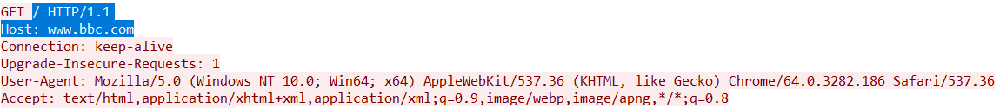
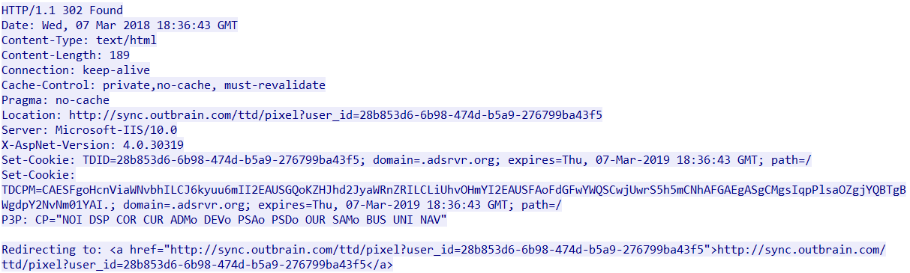
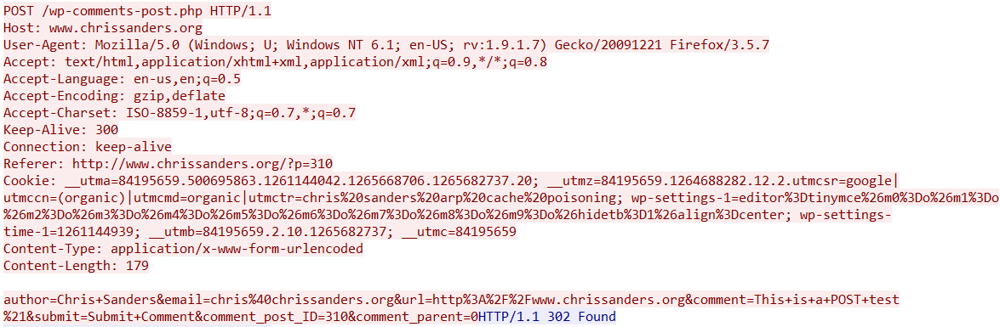
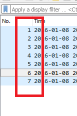
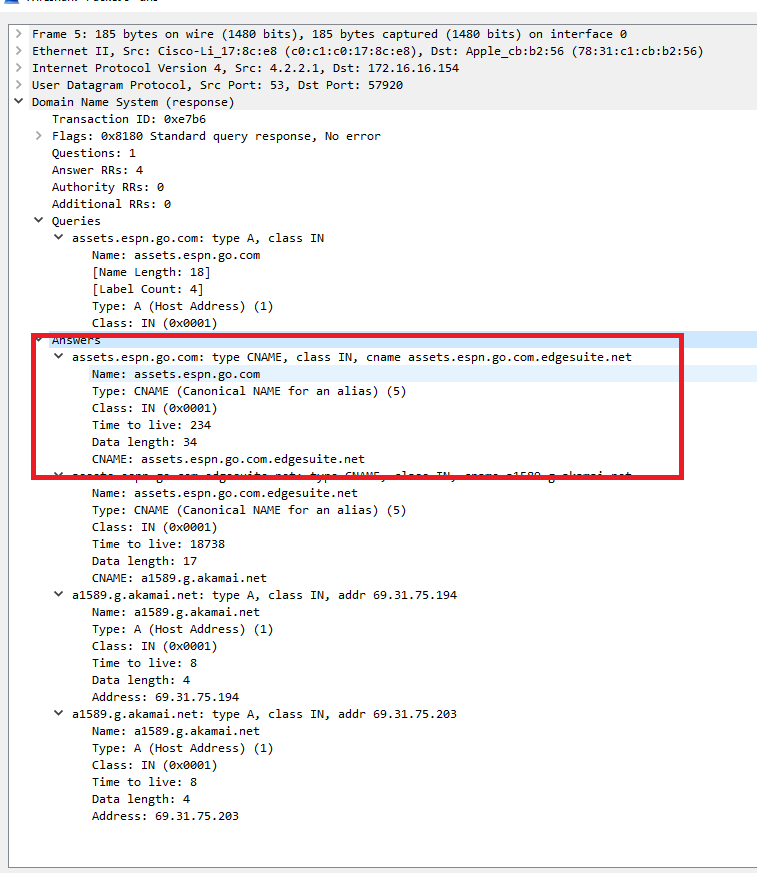
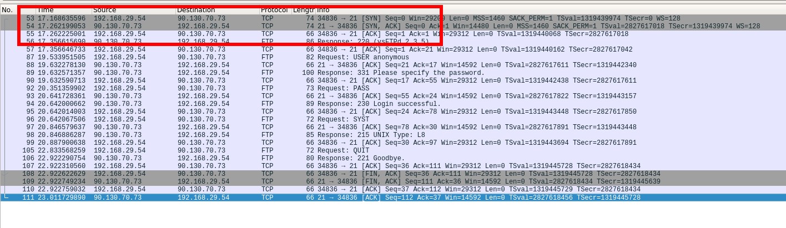
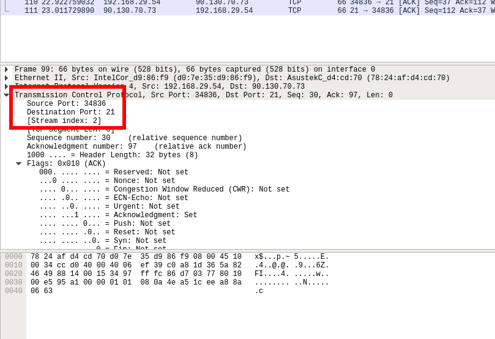
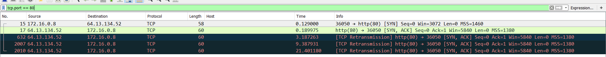

## 5.3 Lesson Plan: Plenty of Protocols

### Overview

Today we'll explore a number of protocols as a means to better understand the layers of the OSI model. We'll cover layers 4-7, starting at Application layer and work down to Network layer - covering HTTP, DNS, Ports, and TCP/IP along the way.

### Class Objectives

By the end of class, students will be able to:

- Describe the flow of typical HTTP and DNS conversations at the application layer
- Explain and define IP addresses and DNS
- Describe the flow of typical TCP conversations
- Describe a port and how it relates to protocols
- Describe which protocols belong to what part of the OSI model
- Identify and analyze communication over common protocols with Wireshark

### Instructor Notes

* This week is all about introducing networking concepts to students and getting them comfortable. The week uses Wireshark as a tool to introduce and visualize complex protocols and network communication.

* Today's class is a mix of hands-on practice and lecture - it is more important they understand the concepts conceptually. Wireshark here is mostly used as a tool to help solidify understanding of these layers of the OSI model, giving them a visual representation of communication at different layers.

* We **strongly** recommend running through today's lecture and demo portions of the class ahead of time, because much of the instruction is done working with Wireshark. Each extra screen, misstep, or keystroke you show is an opportunity for your students to get lost, so be intentional with each step. Take the time necessary to articulate what you are entering/doing at each step.

* We recommend increasing your cursor size so students can more easily follow your mouse and/or zooming into sections of the UI so it's easier for them to follow.

* Try to stay on track of time as best possible, but always feel free to add a few extra minutes to the clock if students are struggling with an activity. As always, have your TAs refer to the [Time Tracker](../5-TimeTracker.xlsx) to help you stay on track.

---

### 1. Students: Chat Spy (0:15)

- Explain to students that we're going to start with a warmup activity! It will help us recall what we did in the last class...

* Explain that in this activity they will dig into a large pcap file associated with two users communicating in an online chatroom.

* Send out the following file to students: [Stu_ChatSpy/ChatSpy.pcapng](Activities/01-Stu_ChatSpy/ChatSpy.pcapng)

* Use the activity slide to introduce the instructions for the activity.

### 2. Instructor: Review Chat Spy (0:05)

* Open up the [03-Stu_ChatSpy/ChatSpy.pcapng](Activities/03-Stu_ChatSpy/ChatSpy.pcapng) file in Wireshark. Then proceed to walk students through the solution. As you do so:

    * Point out that the two individuals were chatting using the IRC (Internet Relay Chat) protocol. While these chats are often stored on an HTTPs webpage to make users feel save, with a bit of cleverness we can decipher the unencrypted messages.

    * In order to filter down the pcap file to collect the conversation contents, specify the protocol as `irc`.

    * Then to read through the communication, right-click on the first packet and select "Follow -> View TCP Stream". The resulting page will show an easy to read full-conversation between the irc participants.

      

    * As one can quickly see, the conversation took place in the "#casualconversation" channel between "maxle" and "fran" who are talking about being software engineers.

      

    * Be sure to point out that, while this kind of monitoring is possible, it is not something they should do too cavalierly. Collecting chat data without other users' express consent falls within an ethical gray zone.

* Answer any questions before proceeding.

### 3. Instructor: Intro/HTTP Lecture (0:05)

- Explain that we're going to be focusing on a ton of protocols today (not just IRC).

- Use the slides to formally introduce HTTP, how it works, and its context/importance in the world.

### 4. Instructor: HTTP Demo (0:10)

- Open [example.pcapng](Activities/02-Ins_HTTP/example.pcapng). This capture contains a minimal trace of `www.example.com`.

- Filter for HTTP traffic. Note that the very first packet should contain a GET request.

  - Point out that the info column (far right) contains the text: `GET / HTTP/1.1`. This indicates that the client wants to retrieve, or GET, a file from the server.

  - Point out that the packet right below this says OK. This means that the server received the request for a file, and was able to send it back without issue.

    

- Remind students that this exchange is called a request-response cycle.

- Demonstrate clicking **Follow** -> **HTTP Stream*.

  

- Explain that this pane lets us see the sequence of HTTP requests/responses between the client and server to load `www.example.com`, without the noise of unrelated packets strewn between.

  - Red text indicates communications sent by the client (the request).

  - Blue text indicates communications sent by the server (the response).

    

- Demonstrate that the **request** has a specific format:

  - Point out that the first line of the request looks specially formatted: `GET / HTTP/1.1`. `GET`, `/`, and `HTTP/1.1` are all distinct components of this line.

  - Point out that the lines in the rest of the request all also look similar, e.g., `Host: www.example.com`.

- Demonstrate that the **response** also has a well-defined structure.

  - The first line reads: `HTTP/1.1 200 OK`. This has `HTTP/1.1` in common with the request. The OK indicates that the server was able to fulfill the request without issue.

  - The following lines are formatted similarly to the trailing lines in the request, but have different values.

- Demonstrate that the bottom of the response looks much different than the request: It contains HTML data, which is the raw code for the web page.

  - This means HTTP responses contain a line indicating whether the server was able to do its job; some extra meta-information; and, finally, the actual data the client requested.

    

- Scroll past the response, until you see the next red request.

- Explain that the first line of this request is similar to the last one, but this time reads: `GET /nonexistent_file.png HTTP/1.1`.

  

- Explain that the first line of the response is different than before, as well. This one says `HTTP/1.1. 404 Not Found`. The meaning of this response is fairly self-explanatory.

  

- Explain that the numbers 200 and 404 are called **status codes**, and indicate whether the server was able to fulfill the client's request.

- There are additional status codes, some of which students will become acquainted with in the next activity.

- Explain that it's no big deal if they didn't get all of this - they're getting an opportunity to practice it all right now!

### 5. Partners: Analyzing HTTP (0:20)

- Explain that in this activity, they'll look at HTTP conversations to reverse-engineer the HTTP protocol.

- Send out the following instructions and files:

  - **Files**: [Captures](Activities/03-Par_HTTP/Captures)

  - **Instructions**: [README.md](Activities/03-Par_HTTP/README.md)

### 6. Instructor: Review Analyzing HTTP (0:10)

- Open [bbc.pcapng](Activities/03-Par_HTTP/Captures/bbc.pcapng).

- Begin by filtering for http traffic. The first packet in the filtered display will be a GET request for `/`. Right-click the packet, then select **Follow** -> **HTTP Stream**.

- Walk through the important information regarding the HTTP protocol, explaining:

  - The HTTP conversation pane contains the full text of the HTTP request. Emphasize the following:

  - The first line of the request, called the **request line**, reads: `GET / HTTP/1.1`.

  - This line contains three major pieces: `GET`, `/`, and `HTTP/1.1`.

    - GET is called the **HTTP method**. It tells the server what the client wants to do. In this case, *get* a file.

    - The `/` is a file path. It tells the server which file the client wants the server to send. When a client requests `/`, the server will implicitly look for a file called `/index.html`.

    - The `HTTP/1.1` specifies which version of HTTP the client is using. There are other versions—namely, 1.0 and 2. 1.1 is the most common.

      - In summary: The HTTP request line tells us what the client wants to do (GET a resource; POST information; etc.); the name of the file the client wants to interact with; and the version of HTTP it's using.

    

  - Point out that the lines below the request line contain familiar-looking information, as well.

    - These lines contain information, called **headers**, which the server can use along with the request line to figure out how to process the client's request.

    - Each header has a name, like `Host`, and then a value, like `www.bbc.com`.

    - Each line contains a single header.

  - Some headers show up on every request. Point out the `Host` header. This is required.

    - The `Host` header contains the domain name the client associates with the site it's trying to retrieve resources from. In this case, that's `www.bbc.com`.

  - Point out that combining the value of the `Host` header with the file path in the request line produces a familiar-looking URL: `www.bbc.com/`.

    - This is equivalent to `www.bbc.com/index.html`, the URL for the home page.

  - Other headers are more unfamiliar, but often straightforward in meaning.

    - The `Connection` header indicates whether we should immediately close the connection between the client and the server after the server responds, or reuse it for later requests. This saves us the time of having to open a new connection for every HTTP request.

    - `Upgrade-Insecure-Requests` tells the browser to turn unencrypted HTTP communications into encrypted HTTPS communications.

    - `User-Agent` gives information about the device sending the request.

    - `Accept` indicates what kind of data the client will accept in response to this request. This is to ensure the server doesn't send, say, image data in response to a request for a text file.

    - Emphasize that there's no need to specifically memorize headers. Students will become familiar with common request and response headers as they analyze more HTTP traffic.

      

- Walk through talking about the different status codes:

  - When we browsed `www.example.com`, the server responded with `200 OK`. This time, the server responded with `304 Not Modified`. To understand why, we must first understand **caching**.

  - Point out that most sites we visit are unlikely to change a lot throughout the day. Stock data might change, but things like the page layout, branding, etc., stay more or less constant.

  - This means many of the files we download when we visit a web page several times in the same day will be the same each time we download them.

  - Because of this, browsers save many of the resources they download when we visit websites for the first time.

  - This way, when we visit a second time, we can simply re-use resources that are unlikely to have changed, and only spend bandwidth downloading files that might have changed from our last visit.

  - The 304 status code means: "You requested a file that you already have a copy of. It has **not** been **modified** since you fetched it last, so you should just use that one."

    - Point out the `Cache-Control`, `Etags`, and `Expires` headers. These allow the client and server to communicate about when a resource should be fetched again, versus when a client should simply use the version that it's saved

      

  - The 304 status code tells us that the user has already visited this page in the recent past!

  - Next, we have to examine the request for `/news/1.55.2536/img/news--icons-sprite.png`.

  - There are many ways to filter for this file, but since we have the path, we can simply do: `frame contains "/news/1.55.2536/img/news--icons-sprite.png"`. This eliminates all but two packets.

    

  - Right-click the first packet, and select **Follow** -> **HTTP Stream**.

  - In this case, we see a request for `/news/1.55.2536/img/news--icons-sprite.png`, followed by a response with status code `404 Not Found`. This indicates the file doesn't exist on the server.

    - We can also tell from the response that the server is running Apache, version 2.2.25.

      

  - Finally, isolate the request for `/track/cmf/generic?ttd_pid=icco6m5&ttd_tpi=1` with: `frame contains "/track/cmf/generic?ttd_pid=icco6m5&ttd_tpi=1"`. Follow the HTTP stream.

  - This time, we have a request for a file, followed by response with status code `302 Found`.

    - A response of 302 Found indicates that the server knows of the resource the client requested, but that it doesn't live at the path the client requested.

  - A 302 Found response redirects the client to the correct location. We can see this in action here in the bottom line, which tells us that the client is being redirected to the right place.

    

  - Take a moment to summarize our findings regarding the shape of HTTP responses.

    - Like requests, they start with a **response line**, which contains the protocol version, and the response status code.

    - This is followed by headers.

    - Finally, the response contains the actual data the client sent.

    - This is followed by two blank lines.

- Explain the post method:

  - Open [http_post.pcapng](Activities/03-Par_HTTP/Captures/http_post.pcapng).

  - Follow the HTTP stream of the packet number 4.

  - Both the request and response look different this time.

  - This request starts with POST instead of GET. The very bottom of the request also contains data, similar to the responses we'd seen earlier.

    - This data is called **POST data**, and is a way for clients to send data to the server.

    - GET tells the server that the client wants to retrieve a file the server has.

    - POST tells the server that the client wants the server to use the POST data to save a new resource.

      

  - Explain that GET and POST are the most common methods, but that there are others (HEAD, PUT, DELETE, etc.)

- Answer any questions before moving on.

### 7. Instructor: DNS (0:10)

- Use the slides to formally introduce DNS.

- When prompted by the slides, demo the following steps:

- Open Wireshark with superuser/administrator privileges.

- Start a live capture with the capture filter `udp port 53`.

  - Explain that we'll talk more about UDP and ports later today, but for now they should just know DNS uses UDP for its Transport Layer protocol and it communicates over port 53.

- Open a web browser, and go to `google.com`. Point out that the capture pane in Wireshark is populating. This demonstrates that, no matter what application we use, if it involves a domain name, we have to go through DNS.

- Go back to Wireshark and stop the capture.

- Click around some packets and expand the **Domain Name System** sections.

  - In a request, point out the flags section and content sections.

  - Don't spend a ton of time here - students will be doing this themselves next. This is to familiarize students with what a packet will look like.

- Answer any questions before moving on.

### 8. Students: Analyzing DNS (0:10)

- Use the slide to distribute the activity instructions.

- Explain that in this activity, they'll look at a couple pcap files and identify some DNS traffic.

- Send out the files in the [Activities/04-Stu_DNS/Captures](Activities/04-Stu_DNS/Captures) folder.

### 9. Instructor: Review DNS in Wireshark (0:10)

- Open up the [dns-1.pcap](Activities/04-Stu_DNS/Captures/dns-1.pcap) file.

- Ask a student how many DNS requests there were.

  - There were 7.

- Ask the student how they know.

  - Each packet is a DNS reply, and there are 7 packets, so there were 7 DNS requests.

  - This highlights a broader point: In DNS and HTTP, a request can only receive a single response.

    

- Ask another student why they think there are no DNS request packets in this pcap.

  - The answer is that the capture was likely done on a DNS server while filtering only for *outbound* DNS traffic.

- Explain that, since DNS is serving on UDP port 53 and this traffic came *from* UDP/53, it's return traffic to the client.

  

- Explain that the source/destination devices show that a Cisco device and an Apple device were communicating. The Apple device (destination) is more likely to be a client than vice versa.

  

- Ask a student which resource the client asked for from `assets.espn.go.com`.

  - Packet #5

    

- Ask the student what happened first to initiate the response.

  - `assets.espn.go.com` turned out to be an alias for `assets.espn.go.com.edgesuite.net`.

  - Make sure that the student mentions "CNAME".

  - Explain that a "CNAME" is an alias - mapping one domain name to another, as we can see here.

    

- Ask another student what happened next.

  - `assets.espn.go.com.edgesuite.net` is an alias (CNAME) for `a1589.g.akamai.net`.

    

- Ask another student what happened next.

  - `a1589.g.akamai.net` returned 2 IP addresses (A records): `69.31.75.194` and `69.31.75.203`.

  - Make sure that the student mentions "A record".

  - Explain that the A record maps the domain name to an IP address, as we can see here.

    

- Ask a student what having a domain name return 2 IP addresses means.

  - Both servers return the same data. If one is down, the other can be used for the sake of redundancy.

- Ask a student which packet the client requested for the A record of `a1.espncdn.com`.

  - Packet #4.

    

- Ask a student what IP addresses the DNS server responded with.

  - `72.246.56.35` and `72.246.56.83`.

    

- Next, open the [dns-2.pcapng](Activities/04-Stu_DNS/Captures/dns-2.pcapng) file.

- Explain that this pcap shows a DNS query and response, but something went wrong. There was no IP address found for that domain name.

- Ask a student which flag in the packet signifies what went wrong?

  - The "Reply Code".

- Explain that the request went to 8.8.8.8. Ask students - did the answer come directly from 8.8.8.8?

  - No.

- Ask the student how they know.

  - The DNS data has a flag that's called "Authoritative" and it is set to `0`. This means that the responding entity is not an authority, and that it asked another DNS server for the information.

    

- Ask a student which DNS server 8.8.8.8 ultimately asked for the name resolution. In other words: Which DNS server ultimately said there was no such domain name?

  - The "Authoritative Nameservers" section says that `a.gtld-servers.net` was the final DNS server.

    

- Answer any questions before moving on.

### 10. Instructor: Ports and Protocols (0:10)

- Explain that we've hand-wavily talked about ports so far - but what are they exactly?

- Use the slides to introduce the concepts of ports, and discuss a a few of the application-layer protocols and their associated ports. Key takeaways:

  - Ports are used in layers 4 and 5 to create sessions and indicate communication between applications on different machines.

  - Where the IP address is the "Who", the port is the "What" - what service is being used?

  - Different ranges of ports are used for different things, with most common protocols being lower in number.

- Answer any questions before moving on to the activity.

### 11. Students: Wireshark Port Identification (0:08)

- Use the slide to distribute the activity instructions.

- Explain that in this activity they'll open up and look at two PCAP files using mystery protocols. For an extra challenge, suggest that they disable the "protocol" column before starting.

- Walk around while they investigate the files and help them answer the questions.

### 12. Instructor: Review Wireshark Port Identification (0:02)

- Open up the PCAP files and discuss the protocols contained within.

- Explain that you know you want to look for protocols in the "registered" range (<=1023) - those are likely to be the destination.

- Point out that the first file is using `ssh`, having a conversation between ports 22 and 59139.

- Point out that the second file is using ports 3306 and 56162. This port is used for MySQL database server connections.

- Answer any questions before breaking.

---

### 13. BREAK (0:40)

---

### 14. Instructor: Transport-layer Protocols (0:15)

- Use the slides to introduce UDP and TCP/IP in the context of layer 4 of the OSI Model. You'll walk through flow of getting a basic html file as well. Key takeaways:

  - Walk through basics of UDP, transport-layer protocol used for DNS.

  - Walk through basics of TCP, transport-layer protocol used for HTTP.

  - Differences between UDP and TCP, and what they do.

  - Understanding of how the transport layer works.

- When you get to the slide demonstrating a GET request with TCP, use the opportunity to describe a TCP stream. Namely:

  - A TCP Stream is a stream of packets in which actual raw data is transferred from computer to computer.

  - When we send an HTTP request, it can contain a GET message; headers, etc. The format for all that information is defined by a protocol, and it's all represented as a string.

  - One of the things TCP does is break up data into manageable chunks. Then, it figures out how to send these chunks across the network.

  - This series of chunks gets reassembled on the other side after they've all been received.

  - This series of chunks is where the name stream comes from.

- Answer any questions before moving on.

### 15. Students: Explain/draw the process (0:10)

- Explain that in this activity they should think about the whole process - from application layer

- Use the slide to distribute the activity instructions.

- Walk around and help students, ensuring they feel confident with the overall model and TCP handshake process before moving on.

### 16. Instructor:  Review Explain/draw the process, Demo Wireshark TCP (0:05)

- Review the previous activity, and if there's time draw the process yourself.

- Answer any questions students have.

- Open up [06-Ins_TCP/tcp_demo.pcapng](06-Ins_TCP/tcp_demo.pcapng) with Wireshark.

- Point out that the TCP protocol is being used, and show the multiple packets associated. Don't go too in depth! They'll be investigating themselves in the next activity.

### 17. Students: Digging Into TCP Communications (0:15)

- Explain that in this activity we'll observe a pcap with TCP communication and answer a few questions about the file.

- Send out the following file: - **Files**: [tcp.pcapng](Activities/07-Stu_TCP/Unsolved/tcp.pcapng)

- Use the slide to distribute the activity instructions.

### 18. Instructor: Review Wireshark Analysis of Transport Layer Protocols (0:10)

- Open up [tcp.pcapng](Activities/07-Stu_TCP/Unsolved/tcp.pcapng).

- Ask the students the following questions, demonstrating the answers in the Wireshark UI as they give them. Take a second to explain/allow for questions after each step.

- Ask a student how we would filter for TCP packets only.
    

- Ask a student how to count up all of the TCP SYN packets.
    

- Ask a student how to count up all of the TCP FIN packets.
    

- Ask a student how we would filter for a TCP stream using the "FTP" protocol.
    

- Ask a student to point out the three-way handshake sequence.
    

- Ask a student to point out the teardown sequence.
    

- Ask a student what is the source and destination IP addresses.
    

- Ask a student what is the source and destination ports.
    

- Ask students if they have any questions before moving on.

### 19. Instructor: Introduce Syn Scan (0:05)

- Use the slides to guide the following conversation.

- Explain that since TCP streams contain the raw data transferred between devices, they really do tell the full story of what happened on the network.

  - Inspecting TCP traffic reveals suspicious patterns that are invisible above the transport layer. Namely:

    - It contains records of attacks or surveillance people have performed on our machines.

    - Just as it contains data for images, CSVs, etc., transferred over the network, it also contains the raw data of malicious files, such as viruses and trojans, that travel over the network.

- Explain that we'll start by using what we know about TCP to find evidence of attackers performing reconnaissance on our machines.

  - Remind students that, when TCP opens a connection between machines, the source machine starts by sending a SYN packet to the target. The target will then respond with a SYN / ACK packet if it's willing to accept a connection on the requested port.

  - Emphasize that, if we send a SYN packet to a port on a server, and the server responds with a SYN / ACK, it *does* accept connections at that port.

  - This means that we can send SYN packets to *every* port on a target machine and keep track of which ones yield a SYN / ACK response.

  - These are ports that we could theoretically connect to, and so make good potential targets for attack.

- Explain that this technique is called a **SYN scan**. A SYN scan is a technique we'd use exclusively for reconnaissance—no normal application would ever do something like this to a target machine.

  - Thus, if we ever see a machine send SYN packets to every port on one of our network devices, it's a safe bet that it's in the hands of a malicious actor.

- Explain that Wireshark's filtering capabilities make it fairly easy to identify SYN scans.

- Open [synscan.pcapng](Activities/08-Par_SynScan/synscan.pcapng).

  - This capture contains a series of SYN packets sent to a set of potentially open ports on a target device.

  - We can see traffic to a specific TCP port by filtering for: `tcp.port == <port of interest>`.

  - Explain that in this next activity they'll be doing a lot of that to try to figure out which ports are opened/closed.

### 20. Partners: Syn Scan (0:15)

- Explain that this capture contains a series of SYN packets sent to a set of potentially open ports on a target device.

- Use the slides to distribute the activity instructions.

- Send out the file [synscan.pcapng](Activities/08-Par_SynScan/synscan.pcapng)

- Walk around and help students as they get stuck.

### 21. Instructor Review: Syn Scan (0:05)

- Explain that this was intended to be challenging! But that we're going to walk through it together.

- Walk through checking information on each port, and talking through the solution. Answer any questions along the way.

- First, let's check port 80:

  - Filter for traffic to the port 80, the canonical port for HTTP transmission.

    

  - Call attention to the first two packets. The first is a SYN packet from `172.16.0.8` to `64.13.134.52`. The second packet is a SYN / ACK response from `64.13.134.52` to `172.16.0.8`.

  - This means the target computer is accepting connections at port 80.

  - Explain the three black packets below the SYN / ACK:

    - The source machine didn't send an ACK packet in response.

    - These are sent from the target computer,`64.13.134.52`, back to the source, `172.16.0.8`.

    - This means we only completed the first two steps of the three-way handshake.

    - This means we didn't actually *open* a connection—just determine if it were possible to do so at this port.

  - Because we only get halfway through setting up a connection, this kind of scan is also known as a **half-open scan**.

  - Since half-open scans are fast and don't actually open connections, they are also known as **stealth scans**.

  - Because the target computer didn't receive an ACK from the malicious machine, it assumes the packet got dropped along the way, and retransmits it a few times before giving up.

- Next, filter for `tcp.port==443`. This is the canonical port for HTTPS traffic:

  - This isolates only two SYN packets from the source machine. There is no SYN / ACK. This indicates one of three common scenarios:

    - The port is not accepting connections.

    - The port is hidden behind a firewall.

    - The device responded, but its response got lost on the network.

  - In this case, it's probably safest to assume that the port is inaccessible, or blocked behind a firewall.

    

- Finally, filter for traffic to port 113, often used for IRC traffic.

  - Note that this time, we see a RST response to the source computer's SYN packets. RST means "reset", and indicates that the target port is not accepting connections.

  - In this case, we can conclude with confidence that the port is closed, as opposed to blocked.

    

- Explain that this approach of checking individual ports is great for inspecting traffic to specific ports we have reason to be suspicious of, but is too slow for large-scale analysis.

- Explain that we can create a better list of open/closed ports. Open the conversations window (**Statistics -> Conversations**), and sort by packet count.

- Note that this lets us see traffic from a port on the source computer's machine to a port on the target computer's machine.

  - Recall that an open port caused a 5-packet exchange: The SYN packet, the SYN / ACK response, and 3 retransmissions.

  - A closed port involved 2: The SYN packet, and the RST response. We also saw this inconclusive scans.

  - Otherwise inaccessible ports involve a single packet: The SYN from the source, with no response from the server.

- Explain that using Wireshark to identify suspicious patterns of activity like this is a common step in assessing a security breach. Amongst other things, it gives clues as to which machines on the network might be malicious actors.

### 22. Instructor: Recap, Next Steps (0:05)

- Use the slides to recap the day and week, and start the transition into next week.

- Explain that now we have a pretty good understanding of application layer and transport/internet layer protocols - next week we'll talk about data link and physical layers, and what devices and hardware make networks possible.

- Answer any final questions and end class.

### 23. END

### 24. Bonus Activity: Spotting Malware on the Wire (0:20)

- **Files**: [aurora.pcapng](Activities/09-Par_Malicious_Activity/aurora.pcapng)

- **Instructions**: [README.md](Activities/09-Par_Malicious_Activity/README.md)

### 25. Instructor Do: Review "Spotting Malware on the Wire" Activity (0:10)

- [Operation Aurora](https://en.wikipedia.org/wiki/Operation_Aurora) was a series of high-profile attacks against large targets, such as Google, Adobe, and others, that took place in 2010.

- Some of the attacks were carried out by exploiting a zero-day vulnerability in Internet Explorer, which allowed an attacker to gain full access to a machine by simply getting the user to browse to a malicious website.

- Once on the website, the browser would fire a request for the malware, which would then infect the computer and give the attacker access to a command shell.

- Open [aurora.pcapng](Activities/09-Par_Malicious_Activity/aurora.pcapng).

- The first three packets of the capture are the three-way handshake to establish a connection to port 80.

- The fourth packet is the first GET request for a resource. Right-click the packet and follow the HTTP stream.

- The response status code is 302, indicating that the server knows where to get what the client asked for, but that it doesn't live at the path the client specified.

  - The `Location` header contains the current path to the resource. The client uses the information in the location header to automatically send another GET request with the right file path.

- The client then sends a GET request to the correct URL. This time, the server is able to locate and respond with the file.

- The top of the response and angle brackets indicate that this is an HTML document.

- We haven't written any JavaScript, but at first blush, the code in the response looks very unfriendly. This is a clue that something's not right.

  - This is because it's malicious code, and it's been **obfuscated** by the attacker. This means they've purposefully written it to be hard to understand.

    

- Point out the oddly-named GIF referred to in the very bottom of the blue response text.

  - When the browser reads this reference, it automatically sends a GET request for it, which we can see in the red request text.

  - The response right below this contains the GIF data, indicating that the client received the suspicious GIF data.

  

- That's everything we can glean from this exchange: A client received some suspicious-looking data from a server, and then closed the connection.

- The black magic occurs right *after* the client receives the GIF. Return to the main Wireshark window, and delete the display filter.

- Scroll to packet 23. This is the OK response indicating the server sent the suspicious GIF without errors.

  - Call attention to the source/destination addresses for this request. The source (server) is `192.168.100.202`, and the destination (client) is `192.168.100.206`.

- Call attention to packet 25.

  - Point out that this and the next three packets show a TCP handshake, opening a connection between the two devices.

  - Point out that the source and destination addresses are reversed. The user's computer, which received the suspicious GIF, has just opened a new TCP connection.

  

- Right-click packet 25 and follow the TCP stream.

- Immediately, we see some unreadable data in blue, followed by what looks like a Microsoft command shell.

  - This means the suspicious GIF contained a dangerous piece of code, which was able to launch a command shell on the target machine, run a command, and give the attacker access to that shell through the connection established at packet 23.

  - Since this user's account is called Administrator, the attacker could conceivably do anything they want to the target device.

  
