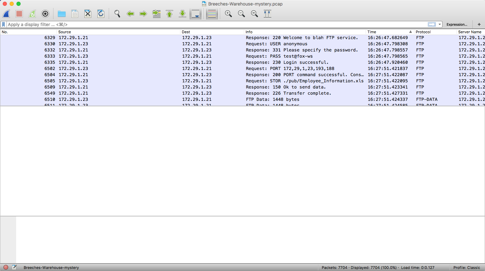
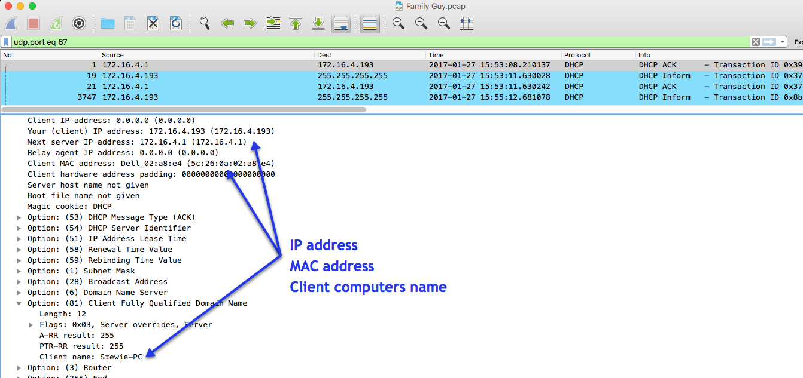

## 7.1 Lesson Plan - Network Security ( minutes)

### Overview

In today's class, students will learn about monitoring data, recognizing malware coming through, and reading messages across the traffic. It is important to note, that Wireshark will not work in a home enviroment unless it is connected to a switch, with port mirroring turned on. Because of these restrictions we will be using pcap files (files from wireshark transfers) in order to replicate an enviromental network. Throughout the day, students will complete difficult exercises focused on using Wireshark.

### Class Objectives

- Students should gain a better understanding networking protocols. 
- Students should gain a better understanding of packets "moving across the wire"
- Students should become familiar with recognizing malicious traffic. 

### Instructor Notes

* Welcome to Day 1 ! Today's class is more hands-on and difficult for students who are not paying attention. In this class, students will pick up from where they left off with Wireshark, as well as learn new skills that Cyber Analysts and  System Administrators use to diagonose issues in the network.

* This class will be difficult for the students that struggled with the first week of Wireshark. It is important to help those students that are struggling to grasp the beginner concepts, and show them different examples on how to preform the same task. 

* Because this is still a "new" technolog to most students, it is highly reccommended to be familiar with the in class labs before teaching, to help the students navigate through any issues they may have. 

* Pay close attention to time today. There are many "mini-exercises" in today's class and it can get easy to lose time in the shuffle. 

* As always, have your TAs refer to the [Time Tracker](../Unit7_NetworkSecurity.xlsx) to stay on track.
------

### 1. Student Do: Wireshark review  (0:08)

* To begin class, divide students into groups of two.

* Have the students start Wireshark on their local computer and browse to a few different websites.

* Have the students exchange pcap files and IP address with their partners. 

* Students should be able to identify the following:

  * Five websites your partner visIted.

  * What time they went to that website.

  * The order that your partner visited the websites. 

### 2. Instructor Do: Review Wireshark review (0:05)

* Using a sample pcap file, identify the following in the above Student Do. 
* Attached is a sample.

- Explain there are many ways to do this lab, but a quick way is by going into Statistics -> Conversations

- Click on "IPv4". We can see this user visited 
- ign.com
- uniregistry.com
- howtohack.com
- hybrid-analysis.com
- facebook.com

### 3. Instructor Do: Introduce Categories of Network Security Problems  (0:05)

* Explain to students tht understanding malicious network traffic requires plenty of practice. 

* People can easily mistake legitimate network traffic for malicious activity, because there are so many weird-looking domains and URLs associated with regular computer operations.

* A great deal of network traffic is generated by any network-enabled device, whether it's an Android phone, a MacBook laptop, or a Windows desktop.

* This is why finding malicious activity is often done through investigating alerts. 

### 4. Instructor Do: Intro to DDoS and Heartbleed  (0:10)

* For this demonstration use the file "heartbleed.pcap".

* Engage the class by asking if anyone recognizes the "Heartbleed" attack a few years ago. 

* Ask the students to define what happened with the Heartbleed attack in their own words. 
  
* Point out the following about Heartbleed attack: 

  * It is a vulnerability that was discovered in OpenSSL, which allowed the attacker to glean information by sending ping requests for information.
  * The target had over 40 million credit and debit card records stolen from its system, along with 70 million other records, including personal information such as addresses and telephone numbers.
  * The easiest way to stop it was by patching/upgrading the system.

* Ask the class "If it's so easy to protect yourself from something this catastrophic, why don't more companies patch more often?"

* Explain  a few reasons why companies don't patch quickly
  * It causes down time for their system to reboot and come back up which can lead to loss of revenue.
  * Sometimes patches/upgrades can affect other systems in their network configuration and can lead to those systems not operating the way that they should.
  * There are too many patches to keep up with. It's a very manual and time consuming process. 

* Take a look at a heartbleed attack via a pcap file. 

* Note that the source keeps reaching out to the server. 
  * This is so that it can find out as much about the server as possible. 
  * ILook at the packet details to see that there is a ping sent out, a response, and an acknowledgement. 

* Explain that an important part of being a cyber security analyst is being able to identify the different attacks. 

* There are many different kinds of DDos attacks.

  * **A UDP flood**  is any DDoS attack that floods a target with User Datagram Protocol (UDP) packets. The goal of the attack is to flood random ports on a remote host

  * **ICMP flood** (Ping) Similar in principle to the UDP flood attack, an ICMP flood overwhelms the target resource with ICMP Echo Request (ping) packets, generally sending packets as fast as possible without waiting for replies. 

  * **SYN Flood** A SYN flood DDoS attack exploits a known weakness in the TCP connection sequence (the “three-way handshake”)      * A SYN request to initiate a TCP connection with a host must be answered by a SYN-ACK response from that host, and then confirmed by an ACK response from the requester. 
     * In a SYN flood scenario, the requester sends multiple SYN requests, but either does not respond to the host’s SYN-ACK response, or sends the SYN requests from a spoofed IP address. 

* The type of flood above will determine how to stop and mitigate these attacks in the future. 

* Show students the following image

* Point out that there are many SYN requests but there is no other acknowledgement for the three-way handshake. 

* Perform a quick Google search to find that this attack is a syn request

### 5. Students Do: Identifying DDoS attacks  (0:10)

* Send to student the pcap entitled "student DDoS.pcap"

* Tell students that they will now be in the driver's seat and will have to answer the following questions about the pcap file. 

  *  **What kind of attack is it? (You'll need to search the web to identify this attack).**

  *  **Provide a brief description of the attack?**

### 6. Instructor Do: Review Identifying DDoS attacks (0:05)

* Review answers to the above questions

* **What kind of attack is it?**

    * Look at the wireshark capture to see three cases of Fin + Ack. 

    * Perform a quick Google search and point out that it looks like a Fin attack. 

* **What is a brief description of the attack?**

    * Instead of the attacker completing the three way handshake, the attacker uses a RST packet and sends another packet again. This is mainly used to search for open ports. 

### 7. Instructor Do: Back to the Wireshark! (0:15)

* Use the "back to the packet tracer.pcap" for this demonstration. 

* Explain that there are different ways to discover information. We can search or use filters.

* Point out the if we were asked to find the hostname, and MAC address of a computer, we can quickly locate this information by searching for DHCP traffic

* When devices connect online, they share their information with DHCP servers. By filtering  out DHCP packets, we can capture what devices connect online. 

* Since DHCP traffic uses UDP port 67 and 68, we can use two different filters. 
  * "udp.port eq 67" or "udp.port eq 68". 

* Present the following scenario to students: 

  * Doc Brown's computer, which contains the time machine files, crashed! He's lost everything concerning the flux compactor. Luckily he had Wireshark running on a second computer so he can now see what happened exactly to his main computer. Although he doesn't know what caused his computer issues he knows he went to a website and something automatically started downloading on to his computer. He has reached out to you to help him identify where the attack took place.
  
* Explain that you must identify where the attack took place with the following steps we will need to do: 
  1. Identify which computer was online during that time, and its MAC address and IP address.
  2. Identify the browser that was being used
  3. Identify which website gave the malware
  4. Find the malware and then export it.
  

- Start by using "udp.port eq 67" (no quotations)

 
* Perfect we just found the MAC address, the IP address, and the host name of the computer. This completes question 1. 

* Use the "http.request" filter to click on any of the sites that are available and see if we can find out information about the computer and browser file used.

* Looking at the image above, we can identify the browser being used, as well as the Windows 10 computer. 

* Point out that the info pane shows an unusual exe file being downoaded This indicates that there is suspicious web traffice at the moment. 

* Follow the tcp stream for a closer look

* Export this file to see what we can find out about the exe file.

* Point out that we have found the exe file in the explortation list. The Hostname matches the host, where we found the exe file from before.

* Explain that now that we have the file we still need to identify what's wrong with it

* Point out that there are many online tools we can use, but we will specifically be using a website called VirusTotal (virustotal.com). 
  * Virus Total allows you to upload files or programs just to see if they contain any malicious data or not. 
  
* Check VirusTotal to see if we can match this file to something someone has already found and diagnosed.

* Point out that a few anti-malware programs have reported this file as being malicious. Use the image below to highlight further information. 

* Now that we know this program is malicious, click on relations to see if we can find out more about this program. 

* Note that amellet.bit looks familiar from what we saw earlier in our pcap file.

* Do a Google search on amellet.bit to find more information.

* Point out that the malware is called **Chthonic**

* Note that this looks eerily similar to what we see on our screen

* Let students know that we found it. 

* Demonstrate how to export the file

* Click "Save".

* Toss the file into into our web browser to see what pops up. 

* We found a fake website. 

### 8. Break (0:15)

- Note, this kicks off three back to back labs for the students to go through, with each one becoming more challenging. 

### 9. Students Do: Loki? LOKI! (0:15)

**Challange** This will be a MSMD activity for the students. It should not be difficult. 

* Send students the file "Loki! LOKI!.pcap" to the students. 

* Present the following scenario: 

* Thor has recently taken up dating again. After his last break up (it was a "mutual" dumping), he has now found someone else. Recently howver he has come to you showing you the following image.

* He explains to you that he has covered her name up so that he can keep her safe, but points out to you the registery from the image shouldn't look like that. He has asked you to diagnose what is going on with her computer. Specifically he has asked you to do the following:

1. **Identify her username on the computer, as well as her MAC address and her IP address.** 
2. **Identify from what website she got the malware from.** 
3. **See if you can find her full name.** 
4. **Upload the packet tracer file to virustotal.com. Find the name of the malware attacking the computer.** 

### 10. Instructor Do: Loki! LOKI! Review (0:08)

* Walk students through each question and how to solve it

* 1. **Identify her username on the computer, her MAC address and her IP address.** 

* Use "udp.port eq 68" and see what we can find.

   

* Now we have found her hostname (Kelly-PC), her MAC address (00:22:15:63:c9:5a), and her IP address (192.168.1.14). 

* 2. **Identify from what website she got the malware from.** 

* Use the "http.request" to filter out all the websites for us.

   

* Follow the tcp stream and see if we can find more infomration. 

   

* It looks like the website has been moved permentaly. Google the name + virus total so we can see if this is a malicious website.

   

* We can see that this is the website where the malware came from, and other people have complained about it before in the past. 

3. **Upload the packet tracer file to virustotal.com. Find the name of the malware attacking the computer.** 

* Upload our pcap file and see if any other websites have complained about this before so we can identify what is going on. 

 
 

* We can see that two big scanners have flagged this before. Click "Details" and scroll down.

* We can see that it was a Trojan known as a Loki bot. 

**Summary**

* We identified the MAC address, IP address and host name of the computer.

* We listed out all the websites, and were able to identify the website where the malware came from. 

* We then used virus total to identify the trojan. 

### 11. Students Do: Avengers assemble (0:12)

**Hand out the Avengers_Assemble.pcap to the students.**

**Challenge** Students will have more websites to filter through to identify where the malware came from. 
* Present the following scenario to students:

* Pollerman is probably the worst avenger to have recently joined the Avengers. Recently, he was at Stark Tower and introduced malware into the network. According to the system alerts, the network was infected on March 21st of 2017. Mr Stark has come to you and asked you to look at the network capture and help him identify the following: 

  * **The start time of the internet browsing activity**
  * **The IP address, the MAC address and the host name of Pollerman's affected Windows computer**
  * **The top five websites that were visited. Mark the ones that were malicious**
  * **One of the websites has the user download a trojan. Can you identify which website, and what the trojan is disguised as? (Hint you''ll need to follow the tcp stream)**

### 12. Instructor Do: Review Avengers assemble Review (0:08)

* Walk students through each question and how to solve it

* **Let's start with our first objective which is "The start time of the internet browsing activity"**

* Point out that because of the system alert we know the date was 03-21-2017, but we don't know what time it was. 

* Add a column for the time by going into **Preferences**, then, **Columns**, then click on **Date**

  

* Now that we've added the new date with time, we can start working on the timeline for when the malware was introduced into the network. Use the filter **http.request** to find when he started browsing the internet. Then click on date so you can see the dates in ascending order. 

  
  
* It looks like the start time is 15:48:30 (3:48:30)   

*  **What is the MAC address, the IP address, and the host name of the affected Windows computer?**

* Use "udp.port eq 67" (no quotations) 

  

**Examine the top five websites that were visited. Mark the ones that were malicious**

* Use the http.request filte to find a list of website names. 

  

* Use a search engine to examine the top 5 ones. 

  1. **a1961.g2.akami.net** 
- This doesn't look like a real website

  2. **bv.truecompassdesigns.net** 
- It looks like this website has been flagged multiple times. Let's take a closer look to verify if this is what we're looking for. 

    
* Click on the first link and we see that it's already been flagged. It looks like the method of delivery is inticing the user into downloading a file through a phishing email. 

  3. **grandrapidsnonprofits.com**

  

  

* It looks like this has been marked by one antivirus engine. Let's keep going.

  4. **suburban-sanitation.com**
* This looks like a real website. 

  

  5. **nailcountryandtan.com**
* Looking at the google search, we can see that nailcountryandtan.com has been flagged by different websites, marking it as, suspicious. 

* Let's click on the hybrid-analysis.com website to find out more information we can about nailcountryandtan.com. 
Scroll down to see what kind of information we can find out about it. 

* We can see in the description that this has been flagged as a trojan.

* We can see that the user downloaded a Trojan from this website. Now we need to see whether we can find it.

* **One of the websites has the user download a trojan. Can you identify which website, and what the trojan is disguised as?**

* Follow the TCP stream for nailcountryandtan.com You should see the the image below.

  

* We can see that there is another virus disguised as a.png, but that there's an error message saying "This program cannot be run in DOS mode". This is suspicious but we'll end our investigation here.  

**Summary**

* We added in a way so we could see what time websites were visited.
* We found the MAC address, IP address, and host name of the computer. 

### 13. Student Do: Family trouble (0:10)

**Hand out the Family_Guy.pcap file to the students.**

* Present the following scenario to students: 

* The Griffen family is in trouble. One of the members downloaded a virus onto their computer and sent it out to the rest of the family. The father has come to you asking for help. Luckily during the time of the incident their son Stewie was trying to capture his family members' passwords using wireshark which meanr that he caught all the traffic that occurred during that time. Peter has asked you to identify which family member was the first one to download the virus. Specifically he wants you to identify the following information: 

1. **What is the MAC address, IP address, and the host name of the infected Windows computer?** 
2. **What type of malware was the computer infected with?** 
3. **What was the date and time of the infection?** 
4. **The PCAP file shows a lot of traffic ending in the domain .top. What does that url lead to?** *Hint use google to find the answer, but when googling, make sure to put the website in quotations.**
5. **What is the name of the malware that infected the user's computer?**
6. **What was the user looking for that directed him to the Home Improvement Website?**

### 14. Instructor Do: Family trouble review (0:08)

**Challenge** This will be the most difficult, as students will need to identify search results. 

* Walk students through each question and how to solve it

* **What is the MAC address, IP address, and the host name of the infected Windows computer?**

* Use the filter "udp.port eq 67"  to find the following. 

* We can see that the IP address is 172.16.4.193, the MAC address is 5c:26:0a:02:a8:e4, and the host name of the computer is Stewie-PC. 

* **What was the date and time of the infection?** 

* Look at the date column, and we can see that it happened on the 27th of January 2017, 15:53:14

* **The PCAP file shows a lot of traffic ending in the domain .top. What does that url lead to?**

* Scroll down through all the hosts to find the website that has the domain top. 

* Do a quick Google Searchand we can see that it's a website that's been flagged for ransomware. 

*  **What is the name of the malware that infected the user's computer?**

* Do a closer look at the Google results and we can see that the ransomware file name is cerber

   

* **What was the user looking for that directed him to the Home Improvement Website?**

* Use the filter http.request.  We can see that homimprovement.com is the first website to show up. 

* Follow the stream, and we can see that the user was using bing to find remodeling kitchen information. 

### 15. Instructor Do: Introduce Homework

* Spend a few minutes discussing the homework assignment 

* Let them know that in the coming assignment they will be getting practice putting together the commands taught today with more to be taught next class. For those who would like a head start, the first parts of the homework assignment can be completed based on what was taught today.

------

### 16.  END CLASS

------

### Copyright

Trilogy Education Services © 2018. All Rights Reserved.

