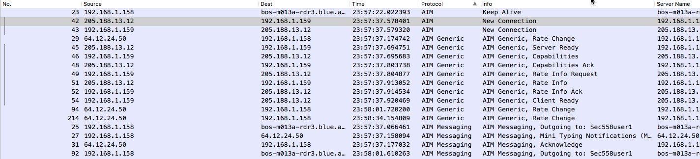
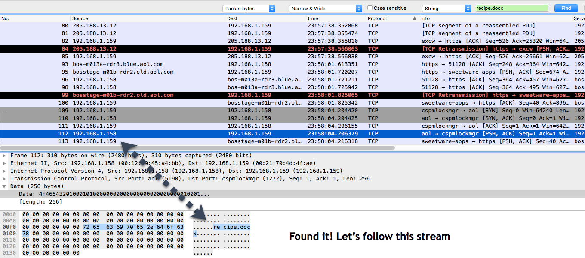

# Unit 7.2 - Fishing for Phishing

## Overview

- Day 2 will re-introduce students to Post-attack identification using Wireshark. 

## Objectives

By the end of class, students will be able to:

  * Use Hydra to brute force passwords 
  * Identify and extract SMTP Traffic into a readable format
  * Identfy and extract VoIP data
  * Identify messaging app and extract files from raw data

## 1. Instructor Do: Introduce class to human threats (0:15)

* Welcome students to class, and answer any questions the students may have about the homework. 

* Introduce students to the broad categories of problems that we'll be using Wireshark to unearth:
  1. Different brute forcing methods FOR THIS AND THE ONE BELOW (WE CAN IGNORE VOIP SINCE IT MIGHT NOT BE COVERED) WHAT SPECIFIC THINGS SHOULD STUDENTS KNOW? WE CAN'T RELY ON THE INSTRUCTOR TO FILL IN THESE GAPS AND NEED TO GIVE THEM SOME TALKING POINTS
  2. Dangers of insider threats
  3. VoIP protocols

## 2. Instructor Do: Introduce brute forcing traffic on the network (0:10)

* Explain to students that for this exercise, you will be showing them what a Wireshark capture looks like from the side of the hacker.
* Point out that this exercise will show why SSH and strong passwords are important.
* Identify brute forcing attacks based off of the traffic generated by them. 

* Present the following scenario to students:

  * One day while working at Dunder Mifflin, Jim Halpert comes to you and asks for a favor. He wants to pull a prank on Michael where he gives himself and Pam Beasley an enormous raise. "It'll be funny, just don't tell anyone so we don't ruin the prank" he explains. Loving pranks you agree to help him.
  * Because you work in the company you know that everyone's user info is their first initial followed by their last name
  * You know that Michael Scott has had issues with his password before so you quickly devise a password list based off the top 2017 most popular passwords. This will be the list that you will use to brute force the password.

  * Being the network admin, you also load up Wireshark so you see what your traffic looks like as it comes through. 

* In order to brute-force into the server, you'll need to use a tool called Hydra. 
 * Hydra is a tool that tries every password you have in a list in order to break into a server with a password. Y
 * You use Hydra to attack the account mscott using your custom password list. 
 * You know the IP address of his computer being the network admin and that everyone uses ssh in the company. 

* To run a brute forcing attack we're going to use a program called Hydra. 
* The syntax to run the program is the following...
* `hydra -l (login) username -P (passwords) yourpasswordslistname.txt ssh://ipaddress of the victim` 

* In practice it looks like this
* `hydra -l mscott -P passwords.txt ssh://172.16.84.163`

* Demonstrate to the students that the password is "password"!

* Look back at the wireshark capture and note the following: 
* Traffic from our network to the other machine was all from port 22 (where SSH operates from)
* The traffic generated from the attack shows that packets wwere sent from the 
* The packets were encrypted by the Diffie-Hellman algorithm
 

* Review and summarize what we did
    1. We made a password list.
    2. We started up Wireshark.
    3. We used hydra to brute force our way into the victims machine.
    4. We then were able to identify brute forcing attacks on Wireshark.

### 3. Students Do: The Good, the Bad, and the Bugly Pest Control

* Send to students the pcap file entitled "hydra.pcap". 

* Present the following scenario to students:

  * You are working at "The Good, The Bad and the Bugly" Pest Control, when you notice weird traffic on your Linux server. Pulling up the var log you can see that someone was trying to authenticate logging into your server. Your boss comes to you with the Wireshark capture and asks you to take a look at it and try to identify what was going on during that time. Specifically your boss asks you for the following: 

  **What was the first username and password used to try to break in?** 

  **How long did the attack run for?**

  **Was this a man made attack or a computer? Why?**

  **What protocol was attacked?**

### 4. Instructor Do: "The Good, the Bad, and the Bugly" Pest Control Review

* Walk students through each of the questions, and use the accompanying screenshots to explain the solutions to each one.

* What was the first username and password used to try to break in?

* Look at the hydra.pcap and point out that we can see that there is a ton of TCP traffic. 

* Click on the fourth one, and follow the stream.

* Use the below image to show that can get the login and password used to enter this website. 

* **How long did the attack run for?** 

* Use the below image to show that the attack started at 4:48:04

* Use the below image to show that the attack ended at 4:48:23

* **Was this a man made attack or a computer? Why?**

* Point out that because so many usernames and passwords were used in such a short amount of time and that the name of the the packet tracer file is named hydra, the attack was made by a computer

* **What protocol was attacked?**

* Use the below image to point out that Telnet was attacked, which is why the usernames are in clear text

## 5. Instructor Do: Simple Email Show

* Introduce this exercise by letting students know that many companies, in order to cut down on costs, will not worry about securing their in-house mail server. Or similarly, if you can get a hold of the encryption key, then you can see the messages in clear text.

* Explain that this walkthrough will not work with email services such as Gmail since those emails are encrypted.

* Point that this exercise involves a packet capture done with an email server that was not using SSL (secure sockets layer).

* Because these emails were not used with SSL, they came across in clear text.

* Let students know that the purpose of this walkthrough is to show how to filter and capture messages to prep them for the next one that they will do.

* Use the email.pcap file for this excercise. 

* Present the following scenario:
  * You have infiltrated Evil corp, and your mission is purely reconnaissance. They have computer codes that when sent, will drop the currency down to 0. You need to find these squence of numbers to stop this from happening. 
  * You boot up wireshark and immediately see that they are not encrypting their emails when they send them.  Your mission is to find the test numbers.

* Point out, when showing this simple email show, that all the messages that come from SMTP (Simple Message Transfer Protocol) are in clear text.

* Click on packet 6 where the SMTP traffic first starts. 

* Point out that the Info pain has information about those specific messages and what is being sent.

* Point out that inside you can see from whom the emails are from, as well as additional information.

 

### 6. Student Do: Hopeless Homer

* Pass the pcap file entitled "Hopeless Homer.pcap" to the students.

* Present the following scenario to students
  * A phishing email was sent to the Springfield Nuclear Plant. Nearly half of all the employees sent their email addresses and their password back to a remote server. Later one of Mr. Burns .XLS files goes missing. Mr. Burns blames Homer for it as he's always the one screwing up.
  * Mr.Burns is also the only one able to create users in the company, and has explained to look for their standard naming convention "hsimpson." Although Homer testifies that he never got the email (because he was bowling), Mr. Burns would like for you to find the following information:

  1. Whose credentials were used to log in? (Include username and password)
  2. When did the attack happen?
  3. What was the original name of the file?
  4. What was inside the file that was stolen? (Hint, for this lab you'll need to find the missing file, and export it as an .XLS file)
  5. What do you think happened?

### 7. Instructor Do: Review Hopeless Homer

* Walk students through each of the questions, and use the accompanying screenshots to explain the solutions to each one.

* 1. **Whose credentials were used to log in? (Include username and password)**

* Use the below image to point out that the username was anonymous, and the password was test@fox-ws 

   

  
* 2. **When did the attack happen?**

* Use the below image to show that the attack happened at 4.26.47

   

* 3. **What was the original name of the file that was stolen?**

* We know a file was stolen, let's organize the protocols in alphabetical order. 
* We see the FTP protocol, let's follow the first packet and see what information we can find.

* Use the below image to show that it was Employee_Information.xls

* 4. **What was inside the file that was stolen? (Hint, for this lab you'll need to find the missing file, and export it as an .XLS file)**

This is the file below

   

* 5. **What do you think happened?**

* Explain that because the username used to log into the system doesn't match Mr.Burns' naming convention and because he is the only one that can create users, it would make sense that Mr. Burns was the one compromised. 

* The attacker made a new user, logged in as the new user to get the data, and had a backdoor to return. 

### 8. Students Do: Krabby Patty

* For this exercise, let students know that although AOL Instant Messenger (AIM) is not used widely today, the steps in this exercise are the ones that they will need to be familiar with as a cybersecurity analyst for other protocols.

* Send to students the pcap file entitled "krabbypatties.pcap."

* Present the following scenario to students

  * You are working at the Krusty Krab when Mr. Krabs comes up to you worried that someone has leaked the Krabby-Patty formula!!! Mr. Krabs tells you he saw a "suspicious" person chatting on AOL messenger in the restaurant the other day, so he captured everyone's traffic using Wireshark. Mr. Krabs had set everyone's laptops with a static IP address, but lost the list. As this could devastate business for the Krusty Krab, your duty is to identify everyone involved and retrieve any files they've shared with each other. Specifically, you will need to find the following information:

  * 1. What was the first comment in the captured IM conversation? Who is the person that leaked it?

  * 2. Who is the person that leaked it? What is the name of the IM buddy?

  * 3. Can you find the file with the recipe?

  * 4. What is the secret recipe?

  * *Hint you need to start off with the AOL messenger filter. They are currently marked as the SSL protocol but need to be decoded as AIM.*
  * *Hint when you find the recipe, follow the stream, view it as raw data, and save it as any name you'd like with a .docx extention*

### 9. Instructor Do: Krabby Patty Review (12 minutes)

* Show students that there are no packets labeled with the “AIM” protocol.

* There are, however, many packets labeled as “SSL” because they use TCP port 443.

* Check the packet's content to show that they are not encrypted. **This means they are not true SSL packets**. They are just AIM messages using port 443, in order to make sure AIM traffic can go through most firewalls.

* Walk students through each of the questions, and use the accompanying screenshots to explain the solutions to each one.

* **1. What was the first comment in the captured IM conversation?**

* AOL has its own communication protocol, which is complicated. Luckily, Wireshark has built-in dissectors for it, so we can decode AOL traffic.

* Right-click one of the "faux" SSL packets, and click **Decode As…**.

* Choose “TCP port” and value of “443”, select “AIM” in Current field, then click “Save”.
  * Now, Wireshark will decode all traffic to port-443 as AIM traffic.

* Start going through the AIM Messaging to read the messages.

* Find the first comment in the IM Conversation 

* Point out that packet 25 contains the first message!

* **2. Who is the person that leaked it? What is the name of the IM buddy?**

* Follow the TCP stream to see the message being sent, and the file name that is sent. 

* Check Packet 25: `outgoing to: Sec558user1`. 

* Check the AIM messaging section in this packet.

* Now we know Leaker is messaging with IM buddy: `Sec558user1`.

**3. Can you find the file with the recipe?**

* Search for recipe.docx

* We know they sent the file over AOL based on the scenario. 

* Go through the AOL protocol packets and see if we can find the recipe file.  

* In Frame 112 we see in the binary it says recipe.docx. This is the recipe file we have been searching for! 

**4. What is the secret recipe?**

* Right click on packet 112 and “Follow TCP Stream”.

* Click on "Show data as" and choose "Raw"

* Save this as `recipe.docx`

* Open the new file to see the secret recipe.

* Summarize and review what we did in this exercise

1. We recognized AIM being mislabeled, so we labeled it correctly.

2. We read the messages to find the file name 

3. Once we found the file name, we followed the stream, showed the data as raw, and saved the file as a docx file. 

4. We then read the secret password.

### 10. Instructor Do: Pem keys and Wireshark

* Explain that things sent across the wire are encypted. 

* Explain that decryption key is sent so that users can decrypt the information into a readable format.

* These decryption keys are sent in ".pem" files. If you have the .pem file, you have the key to decrypt the information that is sent between the users. 

### 11. Students Do: Ultron Escapes

* Send to students the pcap file entitled "Ultron Escape.pcap" to the students.

* Present the following scenario to students.

  * While working on Rikers Island you are notified that Ultron the android has escaped. Your boss immediately asks you to do a search across the traffic to identify what you can. Since Ultron has been emailing a lot of people recently, your boss advises you to look at the email traffic.  Your mission is to find out the following: 

 * 1. **How did he escape?**
 * 2. **What is the name he's operating under?**
 * 3. **Who was he communicating with?**
 * 4. **He transfered DATA of one of the encryption keys via FTP. You will need to find it, export it as a .pem file then go into Preferences, Protocols, SSL and upload the key to use any IP address, port 443, and using http protocol. This is done so further analysis can be completed.** 
 * 5. **Once you have the key to un-encrypt the information, you will need to search all the websites he went to in order to find his shut off code. You will see the same entries for some of the same websites that you will need to check to find the flag. Called "Flag" with a code behind it.** 

### 12. Instructor Do: Ultron Escapes Review

* Walk students through each of the questions, and use the accompanying screenshots to explain the solutions to each one.

* 1. **How did he escape?**

* First, filter out for SMTP protocols.

* Follow the TCP stream

* Use the below image to show what you should see 

* Read the text of the emails to answer the below two questions: 

* 1. **What is the name he's operating under?**
  - Rouge

* 2. **Who was he communicating with?**
  - GR-27

* 3. **He transfered DATA of one of the encryption keys via FTP. You will need to find it, export it as a .pem file and then go into Preferences, Protocols, SSL and upload the key to use any IP address, port 443, and using http protocol. This has to be done so information stored onto the websites will be unencrypted**

* Point out that we know that he transferred the file over FTP, and that there was data. Find a protocol FTP-DATA

* Follow that TCP stream to get the key. Click on "Save As" and export it to a .pem file

* Upload the key so that it will decipher the later messages

* 5. **Once you have the key unencyrpting the information, you will need to search all the websites he went to, to find his shut off code. You will see the same entries for some of the same websites that you will need to check to find the flag. Called "Flag" with a code behind it.** 

* Point out that there are many ways to do this next part. The easiest way is to look at the websites until you find the Flag. 

### 13. Instructor Do: Introduce Homework 
* Spend a few moments letting students know about the coming homework assignment.

* Inform them that in the coming assignment they will be getting practice putting together the commands taught today with more to be taught next class. For those who would like a head start, the homework assignment can be completed based on what was taught today.

------

### 17.  END CLASS

------

### Copyright

Trilogy Education Services © 2018. All Rights Reserved.
