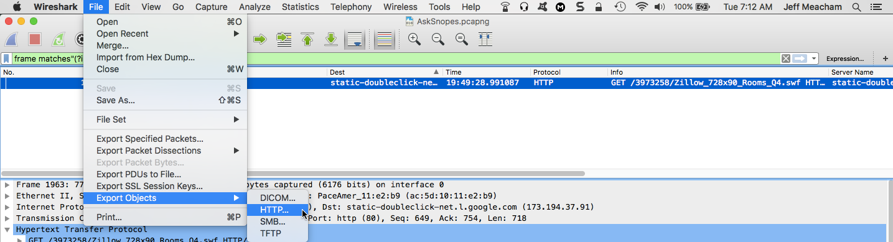
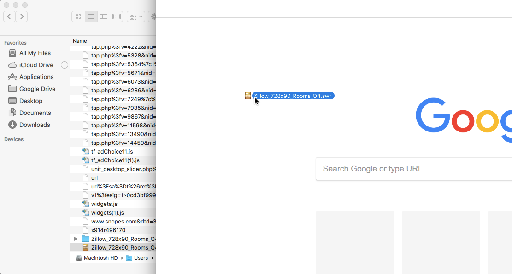
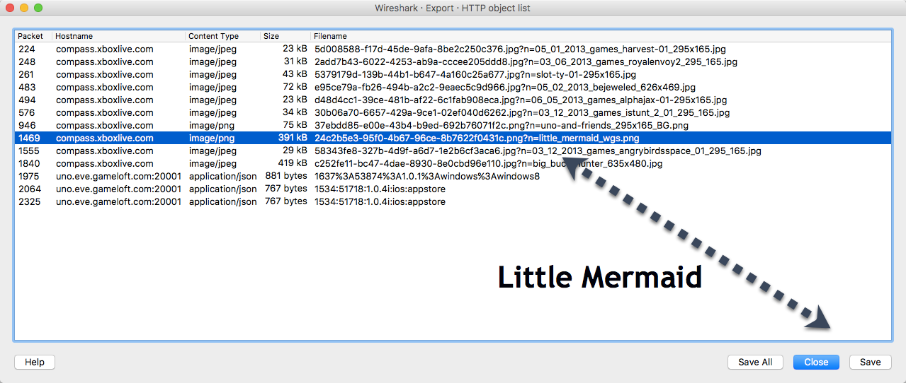
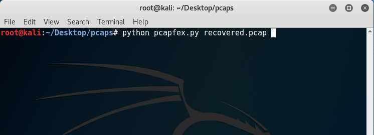

# Unit 7.3 - Live everyweek like it's Wireshark week

## Overview

- Day 2 will re-introduce students to Post-attack identification using Wireshark. They will:
- Export files using Wiresharks built in exportation feature.
- Use Pcapflex, a python script, to export files from Wireshark.
- Use Scapy to...

**WE NEED TO UPDATE THIS FOR DAY 3**

### 1. Instructor Do: Welcome class (0:08)

- Instructor welcomes students and answers any questions they have about the homework. 

### 2. Student Do: Warmup (0:15)

* Explain to the students that they are going to start today's class by answering different questions of varying difficulty in a warmup excercise.

* The questions should be a fantastic review of day one and day two this week. 

* Send students the pcap file called "AskSnopes.pcapng" 

**Scenario**

* This is a warmup exercise based on day one and day two of this week. The questions are thorough in review, however there is one challenging question at the end that you may have difficulty with. If you get stuck, or run out of time, the instructor will cover this in class. 

* Present the following questions that they will need to answer: 

* 1. **What web server software is issued by www.snopes.com?**
* 2. **In this pcap file the client is concerned about a cell phone problem. What is the problem they are concerned about?      How did you find this problem? (Hint, there are different ways to solve this question)**
* 3. **What hosts (IP addresses) think that jokes are more entertaining when they are explained?**
* 4. **How many web servers are running Apache?**
* 5. **Challenge question, according to Zillow, what instrument will Ryan learn to play? Note: This deals with file exportation, if time permits try your skill to see if you can find and export the file. If time does not permit, don't worry we'll be covering this in class.**

### 3. Instructor Do: Review warmup (0:08)

* Walk through the answers to each question using the accompanying images

* 1. **What web server software is issued by www.snopes.com?**

* Let's scroll down the Host column and search for the host www.snopes.com 

* Right click this packet and follow the TCP stream, and see if we can find information about the server that sent this packet. 

* 2. **In this pcap file the client is concerned about a cell phone problem. What is the problem they are concerned about? How did you find this problem? (Hint, there are different ways to solve this question)**

* Point out that there are different ways to find the answer to this question. 

* In this case, we will search for the word "cell" and the issue. This will show us highlighted text in blue that says "Cell Phone Recharging". The client is worried about cellphone recharging. 

* 3. **How many web servers are running Apache?**

* Use the filter http.server contains "Apache"

* We can see that there are 79 instances of Apache. 
 
* 4. **What hosts (IP addresses) think that jokes are more entertaining when they are explained?**

* Filter for all the frames that say "joke" or we can search for the word "joke" in the packet details. 

* In the filter box type **frame contains "joke"**

* We now have a huge list of frames that **have** the word joke in them. We need to find the frame that specifies when jokes are better explained.

* We're going to need to go through each of these filtered packets to find this instance.

* In packet 3705 we find what we're looking for!

**Summary**

* We identified the different servers running in this network capture.
* We searched for strings to find out more information about the users searches. 

### 4. Instructor Do: Quick tutorial on file exportation (0:05)

* In the last class we were able to export a word document. 

* This is because Wireshark was running during this time, capturing and *saving* the information. Wireshark doesn't just save the word documents in its pcap files, but it also saves and stores images as well. 

- Okay, now let's go back and answer the challenge question. 

- 5. **Challenge question according to Zillow, what instrument will Ryan learn to play?**
 
**According to Zillow, what instrument will Ryan learn to play?** 

* Using the pcap that was sent to the students "Ask Snopes.pcapng," filter for the word "zillow". 

* Perfect we found it. Let's go ahead and export this. 

* Click on file then Export Objects then HTTP. We chose the option HTTP because HTML documents, images, executables, and any other files transferred over HTTP to the disk. 

* Wireshark is now grabbing all the files from the pcap. We have the option of manually exporting every file, or we can save them all at once.

* We can search for the specific one, now in this case there are a lot of different files so organization of this might be challenging. Let's go ahead and export all the files so we can filter and find the file we are looking for. 

* Point out that now we can see some of the images that Wireshark has exported out for us. 

* Point out the Zillow.swf file and drag it over to the browser.

* Point out that now we know that Ryan will learn to play saxophone in his bedroom. 

### 5. Student Do: File Exportation (0:15)

**Objectives**

* Students will export files using Wireshark. 

* Students will then identify the different images to answer the deliverables.  

* Send the pcap file AllPlayNoWork.pcapng to students

* Present the following scenario to students

* Your boss explains that he's worried that your coworker, Ryan, is lazy and not completing his work on time. Your boss has asked you to compile evidence on what Ryan has been doing. Peering over Ryan's shoulder your boss explains he's seen Ryan looking up games, and aquatic life. Your boss has captured Ryan's internet activity for you to identify the different things that he has been has been looking at. Your boss has asked you to answer the following questions for you to answer.

1. **He's seen an image of a mermaid, and he wants you to figure out the mermaid's hair color**
2. **Your boss has seen your coworker looking at angry birds. He wants to know what version of the angry birds game your coworker looking at**
3. **Your boss has also seen an image of a snowboarder, and wants you to figure out what color the snowboarder's snowboard i?**

### 6.Instructor Do: Review File Exportation (0:08)

* Knowing we need to export files for evidence, we need to go through the steps we did with Zillow.

* Start by clicking on "File," then go down to "Export Objects" then "HTTP" 

* Locate each of the images based on the names.
 

* Click on the file, click save, then open the file. Below are the open files. 

* The mermaid's hair is red. 

* The Angry Birds version is Angry Birds in Space.

* The board is yellow. 

**Summary**

* We used Wiresharks built in exportation function to export different images that were seen on the network. 

### 7.Instructor Do: Quick tutorial on pcapflex (0:05)

* Explain to students that up until this point, we've been using Wireshark to export images from pcap files.

* But we can combine *python* with Wireshark. 

* By using python we're able to run one command and parse **all** image files out. 

* By using python scripts such as pcapflex, we're able to 

* Let students know that for this demonstration we will use a pcap file called PhotoWithLinux.pcap and will run our python script in the file pcapfex.py to parse out the images. 

- Explain to students that pcapfex.py is a python script that is used to parse out all the images from a Wireshark pcap file. 

- Let's go ahead and run the script against one of our old pcap files. For this example we'll be using krabbypatties.pcap.

- Let's place the pcapflex script in the same folder as where we have our pcap file.

- The syntax to run the script is by stating python, then the script, then the pcap file.

- python pcapfex.py krabbypatties.pcap

- Pcapfex automatically creates a new folder called "Output" that has parsed **all** the images and gifs out in the same folder as the script. 

* Point out the five gifs that you find in this folder. 

### 8.Student Do: Recovering files using pcapflex (0:08)

**Objectives**

* Students will be combining python and Wireshark pcaps, to export files.
* This will introduce the next half of the class using Scapy. 

- For this demonstration use PhotoWithLinux.pcap. 
- Send out the file pcapfex.py to the students.  

**Scenario**

* Brainiac (An A.I) has been loose in Metropolis. Brainiac is currently flowing through the network of the Fortress of Solitude. To catch him you run a network capture to see if you can find some of his weaknesses. With no time to lose, you've been asked by Superman to export all the information you can about him. Your mission is to answer the following questions...

1. **What powers Brainiac?**
2. **Brainiac is thinking about adopting a dog, what color is it?**

*You will need to export the images from the pcap file to answer the questions

### Instructor Do: Review Recovering files using pcapflex (0:08)

- Going through the output of the folder navigation, you can find...

- Going through the output folder you see three gifs. Open each image and you'll see...

1. **What powers Brainiac?** Zend
2. **Brainiac is thinking about adopting a dog, what color is it?** Black 

**Summary**

* We used a python script to read a pcap file.
* We then used that script to export files from the pcap file.
