# Speed Reading

Wireshark is a powerful tool, but poring through packet records can be tedious. Creating configuration profiles for common tasks speeds things up dramatically.

## Instructions

### HTTP Form Submissions

- Open [1-http_post.pcapng](1-http_post.pcapng).

- Recall that HTTP POST requests *send* data from our device to a server. This is where user-submitted form data lives.

- Create a new profile for finding form data.

  - Click **Edit** -> **Configuration Profiles** (or: `Ctrl + Shift + A`).

  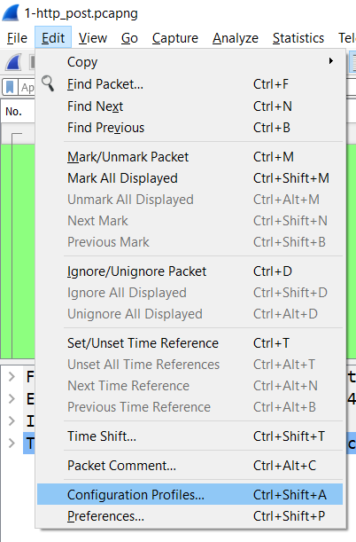

  - Click the `+` button in the bottom-left corner of the resulting pop-up. Create a profile called **HTTP_POST**. This doesn't do anything immediately, but now any changes you make to the Wireshark UI will be saved to this profile, which you'll be able to select later.

  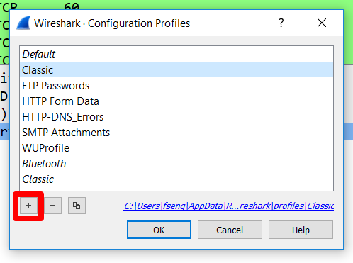

- Return to the normal UI, and filter for: `http.request.method == POST`. Select the packet that pops up.

- In the Packet Details pane (in the middle), click on the caret next to the banner that says **Hypertext Transfer Protocol**. Then, click the caret next to **POST**. This expands the details of the POST data.

- Right-click on **Request Method**, and select **Apply as Column**. This adds a column to the UI that displays the request type of HTTP requests.

  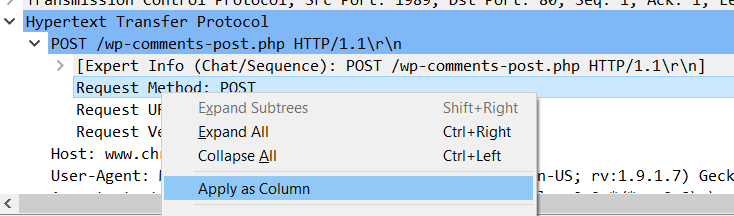

  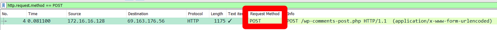

- Next, scroll all the way down to the bottom of the Packet Details pane. Right-click on the banner that says **HTML Form URL Encoded**, and select **Apply as Column**. This adds a column to the UI that displays a check mark next to HTTP packets that contain POST-ed form data.

  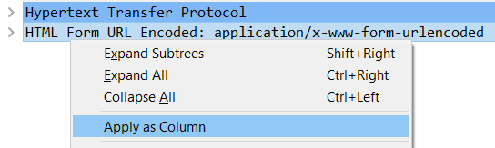

  

- From now on, when you want to look for POST requests containing FORM data, you can simply apply this profile by clicking on the **Profiles** button in the extreme bottom right corner, and these columns will pop up in the UI to make scanning packets that much easier.

  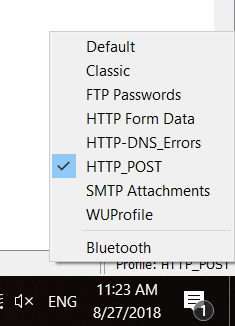

- You should see how effective this profile is immediately—the single packet selected by the filter is the one we're looking for!

- Click on it, and click on the **HTML Form URL-Encoded** banner in the middle pane. This contains the below information about the user who POST-ed the data.

  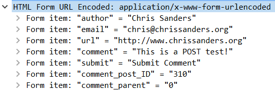

### SMTP Email Attachments

- Open [2-mail_attachments.pcapng](2-mail_attachments.pcapng).

- SMTP powers most user-facing email applications. Refer to the [Wireshark Protocol Wiki](https://wiki.wireshark.org/SMTP). How does SMTP handle attachments?

- Create a new profile for this protocol.

  - Create a new profile called **SMTP Attachments** by clicking **Edit** -> **Configuration Profiles**.

  - Filter for `smtp`. Note that the **Info** column for packet 22 contains the data: `from: mu@musecurity.com, subject: 31337`. This looks like useful information to have in columns...So let's add it!

  - Click on packet 22, and expand the banner that says **Internet Message Format** in the bottom of the middle pane.

  - Add **From**, **To**, **Subject**, and **Content-Type: multipart/mixed, boundary=31337** as columns. This last one adds a column containing the packet's Content-Type. If it's `multipart/mixed`, you have an attachment. Now you have a profile for easy SMTP scanning!

  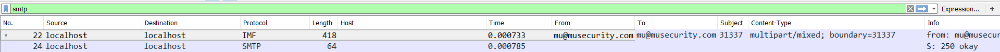

  - Right-click on the Content-Type row again, and select **Apply as Filter**. This selects only two packets from the capture.

- Explore the packet details for one of the emails carrying an attachment. Note the information under the **Internet Message Format** heading, namely:

  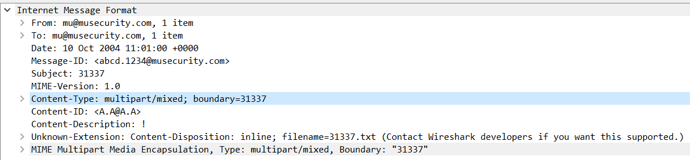

- In particular, note that you can determine who the message is from (`mu@musecurity.com`); whom it was sent to (`mu@musecurity.com`); and the name of the attached file (`31337.txt`).

### Finding FTP Passwords

- Open [3-ftp_transfer.pcapng](3-ftp_transfer.pcapng).

- Refer to the [Wireshark Protocol Wiki entry for FTP](https://wiki.wireshark.org/FTP).

  - Note that the display filter for FTP traffic is `ftp`.

  - Note that the standard port for FTP traffic is 21.

  - Note that FTP passwords are communicated with `PASS` requests. This is a big hint as to which columns and display filters we'll want to use...

- Create a new profile for finding FTP passwords.

  - Start by filtering for FTP. Note that the info columns for the first few packets contain information about USERs and PASS-words. Again, this looks like useful information to store in columns for quick scanning, so let's add it.

  - Click on packet 5, then on **File Transfer Protocol** in the middle pane. Expand the line that says `USER salesxfer\r\n`, then right-click on `Request Command: USER`, and select **Add as Column**. This adds a column indicating the request command of each FTP packet.

  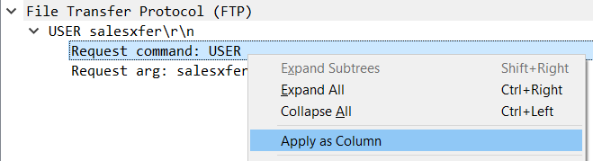

  - Repeat the above to add `Request arg: salesxfer` as a column. This adds the value the user provided with USER requests as a column, as well.

  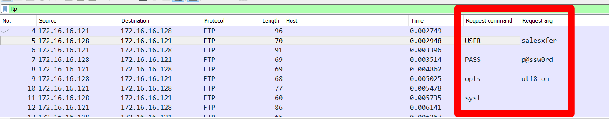

- Note that this lets us identify both `USER` and `PASS` requests at a glance, along with their associated values.

- Click on one of the packets that contains a `PASS` request. Under the **File Transfer Protocol**, right-click on the row contaiing `Request Command: PASS`, and apply it as a filter.

- This selects a single packet, containing a PASS request with the value `p@ssw0rd` (which is, believe it or not, a common password).

  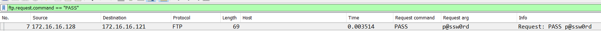
