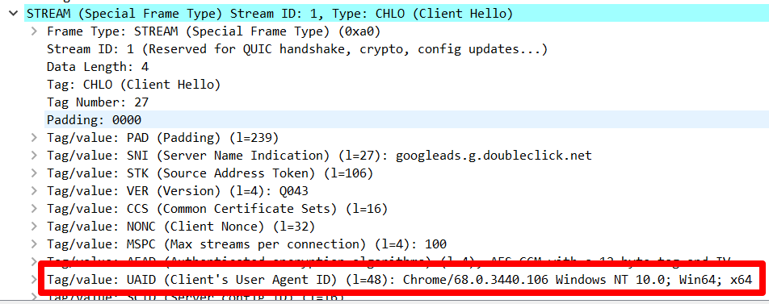
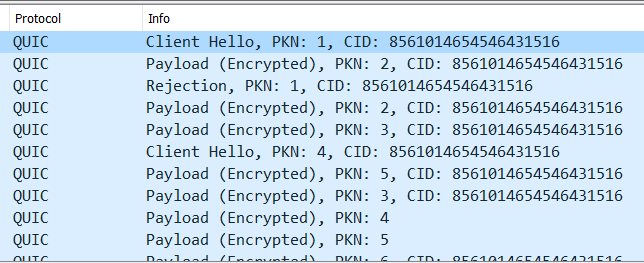
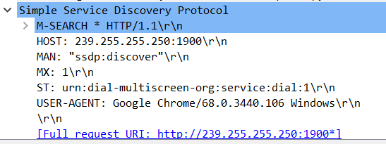

## Home Network Analysis

For this exercise, I let Wireshark run in the background while I did other stuff—research for work, read the latest infosec news, procrastinate...The usual, you know.

I caught a lot of TCP, UDP, TLS, and HTTP traffic, as you'd expect. This is all pretty humdrum stuff, but a few unfamiliar protocols did manage to catch my eye...

**Note**: The capture I took was 263Mb, and not particularly interesting, so I haven't included it. The below notes do a better job of illustrating what this exercise is for, anyway—it's about your _research_. The details of the capture are incidental.

### QUIC

There were a handful of QUIC packets strewn throughout the trace. This was new to me, and a quick Google query turned up why. According to an FAQ maintained by none other than...Well, Google:

> QUIC is the name for a new experimental protocol, and it stands for Quick UDP Internet Connection.  The protocol supports a set multiplexed connections over UDP, and was designed to provide security protection equivalent to TLS/SSL, along with reduced connection and transport latency. An experimental implementation is being put in place in Chrome by a team of engineers at Google.

This little snippet says a lot.

- QUIC is an experiment. The fact that it popped up in my capture betrays my predilection for Google Chrome as my browser of choice.
- QUIC is designed to secure, to at least the standard set by TLS/SSL. Given such a strong security guarantee, I suspect there's not much I can glean from the packets I captured.
- QUIC is also designed to be fast, hence its running over UDP. This suggests I should expect to see packets in a QUIC exchange being sent and received in quick succession.

Let's validate some of these assumptions against the cold, hard numbers in the capture.

- When I right-click one of the QUIC packets and click **Follow** -> **UDP Stream**, I can indeed verify that these packets were sent to and from my Google Chrome instance. Being a protocol, there's no reason other browsers can't use QUIC—but, the assumption that it's coming from Chrome holds strong.

  

- Our second assumption was that data in the QUIC exchange wouldn't be visible as plaintext. This one holds as well—every packet containing a payload is encrypted.

- Since it's encrypted, we can't really glean what the point of this exchange was. But, we can tell that QUIC's done a bang-up job of providing security on part with TLS/SSL.

  

- Finally, we assumed that QUICK packets would be exchanged in quick (...:laughing:) succession. This turns out to be true, as well. The entire exchange of 17 packets in this particular stream took place in _less than 10 milliseconds_—the exchange ended 0.07 milliseconds after it began. You can calculate this by looking at the **Time** column in the packet capture. 

- That's awe-inspiringly low latency. Consider that these packets had to travel through hundreds of miles of cabling, back and forth, to complete the exchange...And they did it literally [40 times faster than the blink of an eye](http://www.ign.com/boards/threads/in-blink-of-an-eye.195418203/).

### SSDP

Another interesting character is SSDP the Simple Service Discovery Protocol. In the [specification draft for SSDP](https://tools.ietf.org/html/draft-cai-ssdp-v1-03#section-2), we find that the protocol is designed to solve the following problem:

> A mechanism is needed to allow HTTP clients and HTTP resources to discover each other in local area networks. That is, a HTTP client may need a particular service that may be provided by one or more HTTP resources. The client needs a mechanism to find out which HTTP resources provide the service the client desires.

This description implies that whichever devices are talking over SSDP are trying to figure out whether other devices on the network provide some or other service.

Following the UDP stream of one of the SSDP packets reveals that my computer was attempting to discover a device provisioning the `device-multiscreen-org` service.

According to the [homepage for this service](http://www.dial-multiscreen.org/), this is a protocol that "second-screen devices can use to discover and launch apps on first-screen devices."

In other words, it's a way for you to, say, play a video you have on your computer on your TV.

  

As much as I'd love to veg out in front of a 60" 4k screen streaming the latest Netflix comedy specials after a long day of packet analysis, I don't actually have a TV...So I'm not sure what my computer's doing looking for one.

Lo—yet another question to investigate further with Wireshark...
