## File Carving Solution

- Take a step back for a moment. You just, out of the nebulous huge amount of data traveling around on a network, filtered all of that down to find the communication associated with a specific set of packets, and then reconstructed that torn-up stream of communication back into files so that you could see what the user was doing and looking at.

- That's ... pretty cool. You thought you were a sophisticated spy yesterday. The packets being communicated on the network now bend to your will!

- So let's go through those previous examples, starting with the FTP transfers.

### Carving FTP

- Open [ftp_transfer.pcapng](ftp_transfer.pcapng).

- Last time, we found user's login credentials. Now, we can steal their data, as well.

- Apply the FTP password profile we created earlier.

  - The extra FTP columns make it easy to identify interesting packets at a glance. Don't worry if your colors don't match—it's the columns that matter, here.

  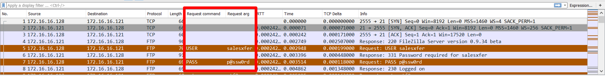

- Click on the packet with the user's password information. Right click, then click **Follow** -> **TCP Stream**.

  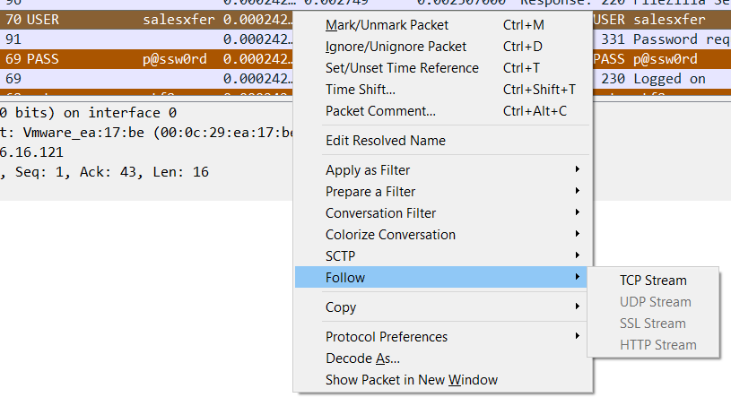

- This reveals the entire FTP exchange between the client and server, including the download of the file data itself.

- Scroll all the way to the bottom of the stream. Note the third line from the bottom, which reads: `STOR store4829-03222010.csv`.

  - This line is a command for the server: "Hey, I want you to **stor**e the file called `store4829-03222010.csv`."

  - After this command, the computers open a connection and transfer the file data.

  - Since file data is different from command data, like `USER`, `PWD`, etc., this transfer lives in a separate TCP stream.

  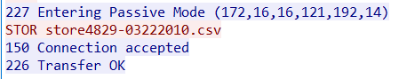

- Wireshark also captures this stream. To find it, click on the the line with the `STOR` command in the TCP stream. Note that the highlighted in the packet list pane changes.

  - Note that this is packet No 64.

- Click out of the TCP stream. Scroll down to Packet 64, which issues the `STOR` request.

- Remove the filter. Note that two packets below, we see a packet whose protocol value is **FTP-DATA**. This is the stream where we transfer the actual file data we're interested in.

  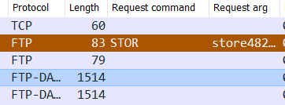

- Right click packet 66, and click **Follow** -> **TCP Stream**.

  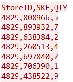

- This opens a pane similar to before, this time containing what looks to be CSV data.

- Click **Save As** in the bottom of the pane, and save the file with the same name you saw in the `STOR` request: `store4829-03222010.csv`.

- Find the file with your file explorer, and open it with whichever program on your computer reads CSVs (likely Excel).

- We can use the same tactic to extract images transferred over FTP.

- Open [ftp_image.pcapng](ftp_image.pcapng).

- We can search for `ftp.request.command==STOR` to look for `STOR` requests.

  - `STOR` requests are used for uploads.

- This time, the search turns up no packets. This is because, in this file, the user is *downloading* a resource, not uploading one.

- Downloads use a different request command: `RETR`, short for **retr**ieve.

  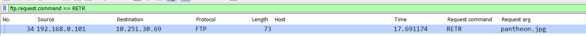

- Update the filter to search for the "RETR" command - `ftp.request.command=="RETR"`.

- This turns up a single packet, whose TCP stream we can follow by right clicking and selecting **Follow** -> **TCP Stream**.

  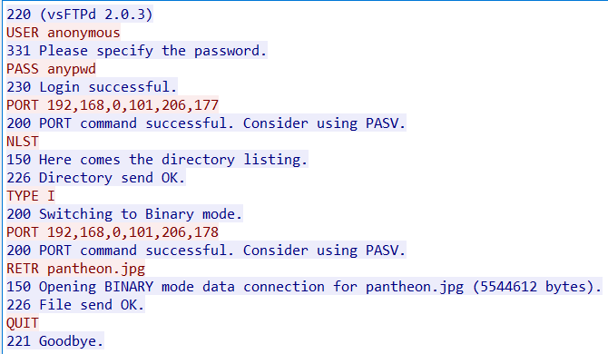

- Click the `RETR` request, and close out of the stream. Note that this highlights packet No 34.

- Return to the packet list, remove the filter, and look below packet 34 for the first packet labeled with protocol FTP-DATA. Follow the TCP stream.

- Note that the data in this pane is much less human-readable than it was last time around.

- Point out that, at the top, we can see human-readable annotations.

  - The first letters in the data are `JFIF`. This stands for **J**PEG **F**ile **I**nterchange **F**ormat.

  - Note that we can also tell that someone edited this image with Adobe Photoshop CS2, on a Mac, just before midnight, on October 4th, 2008.

  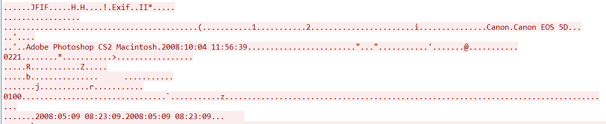

- Near the **Save As** button in the bottom, change the display format from ASCII to Raw. Then, click **Save As** to export the image. Use the name `pantheon.jpg`.

- Find the file wherever you saved it, and open it up.

  

### Carving HTTP Objects

- Retrieving data transferred via FTP is pretty straightforward, as long as you can find the appropriate TCP streams, which is relatively easy to do using display filters. Retrieving data from web browsing is even easier.

- Open [http_page.pcapng](http_page.pcapng).

- We've been told told that the user was reading an article about horrifying medical cures, so we should start by searching for frames containing any of these strings. Let's filter for URLs that contain the word "cure": `http.request.uri contains "cure"`.

  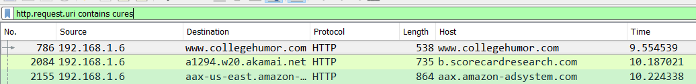

- This narrows it down, but there's still a lot of noise. Let's also get rid of anything that's not an HTML document with: `http.request.uri contains "cure" and http.accept contains "html"`.

  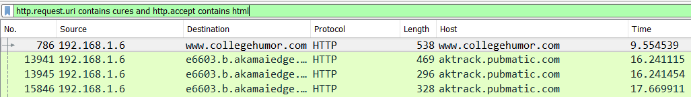

- This does it. Note the first packet, which contains a get request for an article with the name: `7-horrifying-cures-from-medical-history`.

- Click on **File** -> **Export Objects** -> **HTTP**.

  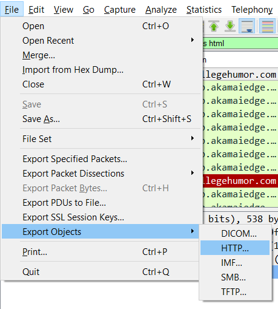

- Click on **Content Type** to group and sort objects, then scroll down until you see `text/html`.

- Look at the **Filename** column. Scan until you see the resource with the name of the article in it. Select it, and click **Save**.

  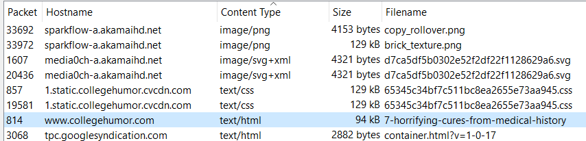

- Navigate to the directory where you saved the file, and open it with VS Code (any text editor will do).

- This is the actual code for the web page the user visited, at the time they visited it. We can look at it to find the names of the images they saw, too.

- Use `Ctrl+F` or similar to find the "word" `jpg`. You'll find 11 jpg images. Save the filename for each one in a separate document.

  - Note that one of them, `82c1f60807eb184f01c9afd07b6f9d91.jpg`, has the `alt` text `peppermintmonster`. Maybe this is a hint!

  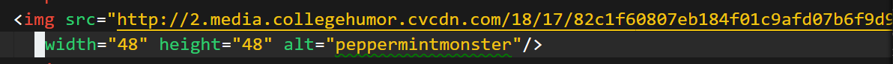

- Switch back to Wireshark, and look at the list of HTTP objects again.

- Click **Filename** to sort by Filename.

- Point out that we can find the file named `82c1f60807eb184f01c9afd07b6f9d91.jpg`. Click, save, and open it. Is it what you expected?

  

- Switch back to the HTTP objects list. Click **Content Type**, and find the group of `image/jpeg` resources.

- Scan the filename list. Point out that there are several files you can't find—in particular, none of:

  - `https://media0ch-a.akamaihd.net/12/30/e17a3c5bf08bef9d35dbf9be9c924c95.jpg`
  - `https://media0ch-a.akamaihd.net/54/75/8eb78937d33be9e87e767a5d86b3f8df.jpg`
  - `https://media0ch-a.akamaihd.net/24/52/2ee6927810c7eb8dfb2203c9d0892010.jpg`
  - `https://media0ch-a.akamaihd.net/82/96/bbf03682cf234ef90338eed32e97af46.jpg`
  - `https://media0ch-a.akamaihd.net/41/67/7d56185200653b45fb9b0e36001c72fc.jpg`
  - `https://media0ch-a.akamaihd.net/69/51/cdb245c8883e72292a1190616f66932f.jpg`
  - `https://media0ch-a.akamaihd.net/46/23/3a06dbc06aa6715a1d8c912f3f9689a6.jpg`

- These links all have something in common: They're transferred over HTTP**S**, not HTTP! This means we *can't* see them in Wireshark's HTTP objects pane, because they're *not* HTTP objects.

  - This is frustrating for analysts, but the fact that we can "hide" traffic like this is what allows for safe banking, etc.

- In this case, if we wanted to retrieve the images, we could do so with `curl`, as with `curl -LO https://media0ch-a.akamaihd.net/12/30/e17a3c5bf08bef9d35dbf9be9c924c95.jpg`.

  
