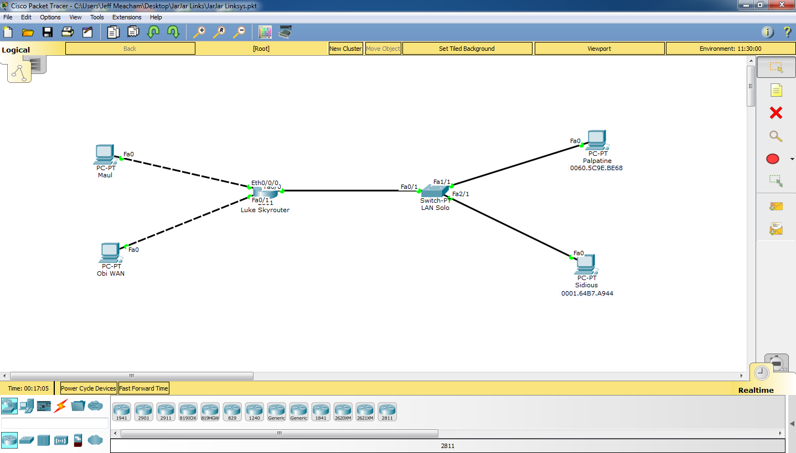

## Jar Jar Links

Good news and bad news. The good news is you have successfully infiltrated the death star! The bad news is you were immediately captured. You have been told by
Darth Maul, to make design him a VPN and a DHCP server so he can log in when necessary, and ensure that there is port security for all the computer connected to the switch. This is actually really lucky as you've
been told by Obi WAN kenobi to create a VPN for him as well. 

**Objectives**

For this exercise, you must accomplish the following... 

1. Create a router named Luke Skyrouter and connect it to a switch called LAN Solo
2. Connect the LAN Solo router to two computers Palpatine and Sidious

3. On the router assign the IP address 10.10.10.0 with a subnet of 255.0.0.0 to the interface connected to the switch
4. Install DHCP onto the router.

5. Set all the computer to accept dynamic IP addresses.
6. On the switch use port filter by only allowing the MAC addresses of the computers connected to the switch 

7. Set up a VPN using the following information for Maul

	- Group: sith
	- Key: darkside
	- Username: maul
	- Password: cookies

9. Set up a VPN using the following information for Obi WAN

	- Group: jedi
	- Key: order
	- Username: obi
	- Password: jedirulz

Send a screenshot to show that each user can successfully log into the router. 
