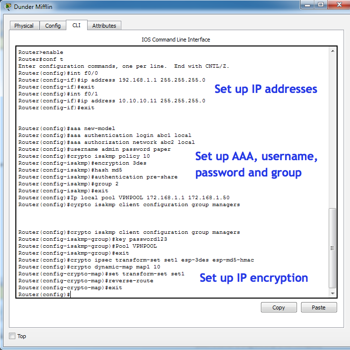
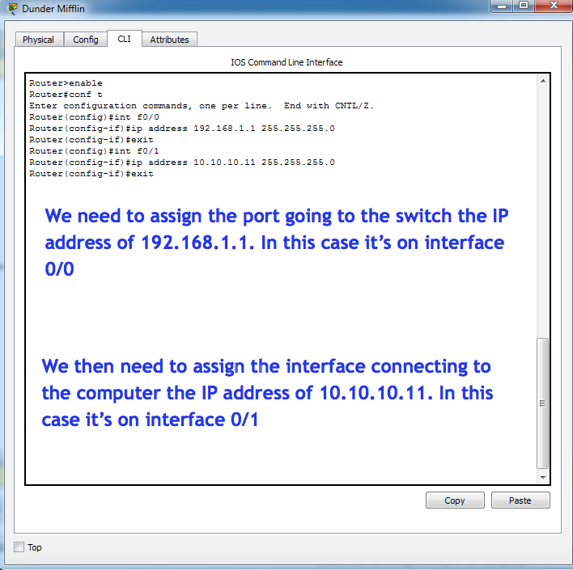
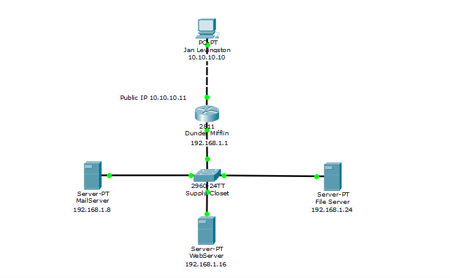
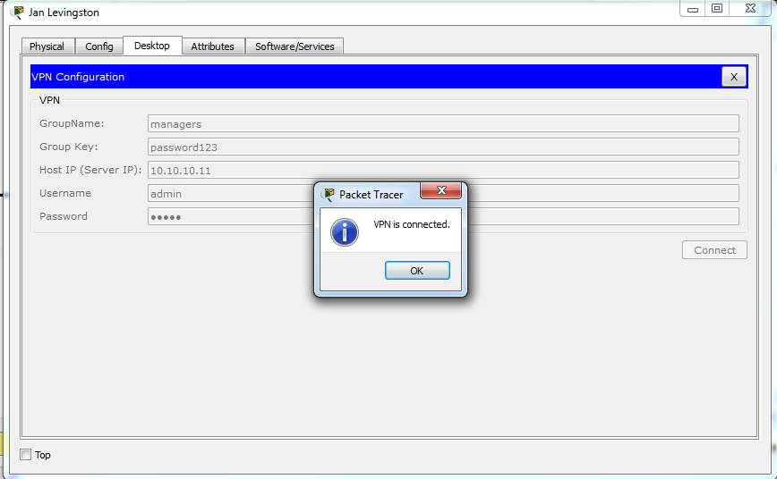
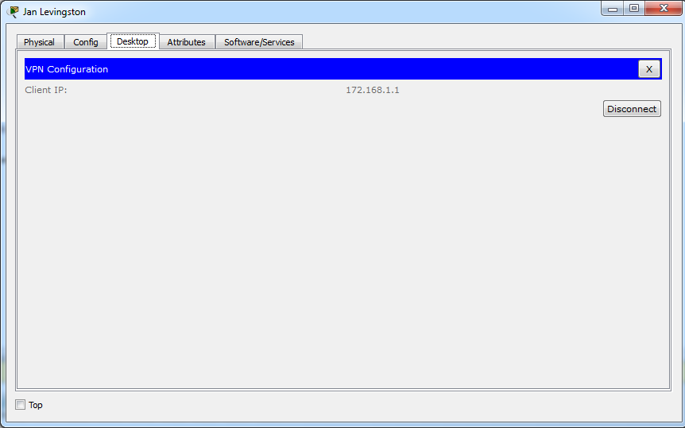
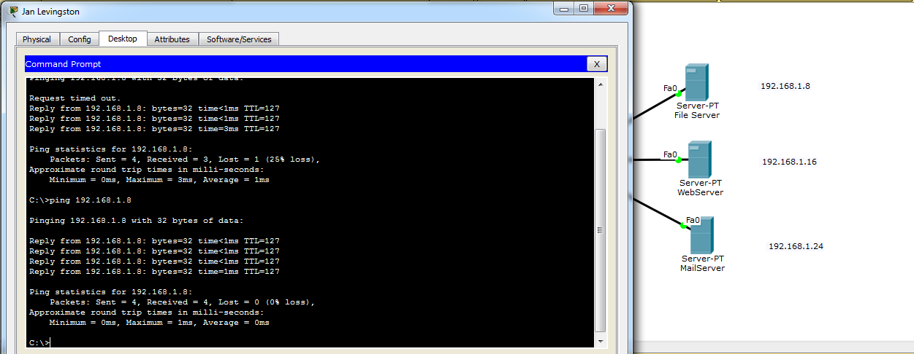

## VPN's at Dunder Mifflin

Jan Levingston, is the VP of Sales at Dunder Mifflin. Because she's on the road a lot and cares about security when she is at any given location, she has come to you and asked if you could create her a VPN between the Dunder Mifflin Router, so she can access the FileServer, MailServer and WebServer.

**Objectives**

1.  This is a big project, so let's try to break out what we know is going to be in this assignment, into three parts.

1.  First, we need to set Jan's computer with the static IP address of 10.10.10.10. Place a computer onto the workspace, then click on "Desktop" then "IP Address" and assign her, her IP address. 

2.  Assign the interface connecting to the switch an IP address of 192.168.1.1

3.  Assign the following IP's to the following servers 
	   - MailServer 192.168.1.8
	   - WebServer 192.168.1.16
	   - File Server 192.168.1.24

The public IP address of the Dunder Mifflin router needs to be 10.10.10.11 

aaa authentication login will need to be set up on network abc1 local

aaa authorization will need to be set up on network abc2 local

Username needs to be admin with a password of paper. 

Use crypto isakmp policy 10

Use encryption 3des

Make sure the hash is md5

Authentication will need to be pre-share.

The VPN pool will need to be 172.168.1.1-172.168.1.50

The client configuration group will need to be managers, with a key of "password123"

Make sure that Jan is able to connect afterwards. 

 

