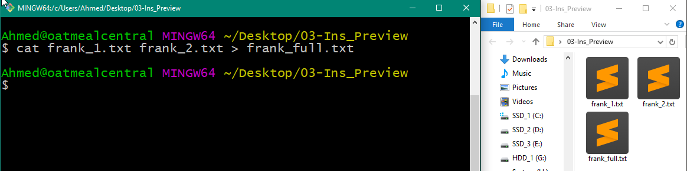
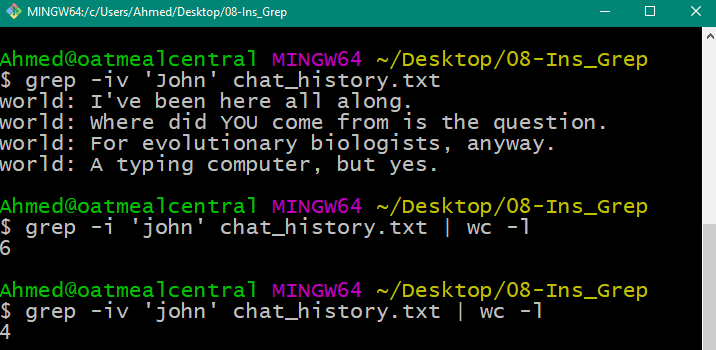

## 1.2 Lesson Plan - Tingles for Terminal

### Overview

In today's class, students will receive their first exposure to terminal and bash commands. Throughout the day, students will complete basic exercises focused on using the command line for file navigation and retrieval.

### Class Objectives

* Students should understand why the command line is important for IT and security professionals. 
* Students should become familiar with basic navigation commands: `pwd`, `cd`, `ls`, `cp`, `mv`, etc.
* Students should become familiar with basic file preview commands: `head`, `tail`, `less`, etc. 
* Students should become familiar with basic search commands: `find`, `exec`, `grep`, etc.
* Students should become comfortable using sequences of bash commands to complete routine IT tasks.

### Instructor Notes

* Welcome to Day 2! Today's class marks students' first step in building their technical tool belt as future security professionals. In this class, students will be exposed to the very basics of the terminal and command line. 
* Today's class might feel more intimidating to your students than you may expect. Be sure to spend the time necessary, dredging out student questions and resolving student confusions early and often. Since this is just Day 2, students will likely be remiss to "out themselves" as feeling lost. Do your best to encourage and remind them that it's okay to be uncomfortable. A big part of being a security professional is all about learning new tools -- even when it's challenging at first.
* Do *not* use the default Windows Command line for any of these exercises. For consistency's sake, we will be teaching unix based bash commands. (Mac users will use Terminal. Windows users will use Git Bash.)
* Take the time before class to familiarize yourself with each exercise in this unit. Most importantly, practice your work flow before class. It's easy get lost on stage while working  the command line. But be careful! Each extra keystroke you show on screen is an opportunity for your students to get lost. Be intentional with each command you show, and take the time to explain why you are running each command as you go.
* Particularly for demonstrations related to navigation, it can be helpful to show a GUI-based explorer (or Finder) window adjacent to your terminal window. As you run commands in terminal, show students  how these commands visually translate into the GUI-based file system navigation they are used to. Giving students an anchor to the familiar is a great way to ease them into learning something new. 
* This link (https://explainshell.com/) will be an absolutely *terrific* resource for students trying to make sense of increasingly complex shell commands. Be sure to share it when prompted. 
* Pay close attention to time today. Use your best judgement regarding exercise times. If needed save some exercises for next class. But please flag this to the Trilogy Team for future classes.
* As always, have your TAs refer to the [Time Tracker](TimeTracker.xlsx) to stay on track.

----

### 1.   Instructor Do: Why Terminal Matters    (0:05)

* Begin class by welcoming students back and informing them that today they will be learning the basics of the command line. 

* Do a quick poll of the class to see how many have worked with the command line in the past. If there are just a few hands, assure students that it's okay -- the terminal is easy enough to learn with a bit of practice. If there are many hands, praise them before letting them know that they will be building on their knowledge throughout class. 

* Then open up a terminal (or Git Bash) window. Explain to students that this is what you mean by the terminal. 

* Follow this up, by stressing the importance of the command line to their future as security professionals. You may want to point out that:

  * Many systems they will use in the future will *not* have a GUI based window. The terminal will be their sole point of interacting with the system.

  * Many scripts and tools will only work as command line applications.

  * The terminal will  open the door for more advanced control of their system. They will be able to complete tasks using the terminal that would be significantly more challenging (or impossible) with the default GUI.

* Then proceed to the installation step. 

### 2.   Students Do: Git Bash Installation  (0:05)

* Provide a few moments for PC-based students to install Git Bash and Mac-based students to find the Terminal. 

* Then send the following instructions to students. 

  * **Instructions**

    * Windows Users: 

      * Visit this page: https://gitforwindows.org to download and install Git Bash for your computer. 
      * Use all of the default settings.  
      * Once complete, open the Git Bash executable.

    * Mac Users: 
      
      * No installation needed! Open Launcher by typing `<cmd> + <space>` then type the word `Terminal`.
      * Hit `<Enter>` to open the Terminal Window. 

### 3.   Instructor Do: Terminal Navigation  (0:10)

* Once all students have opened Git Bash or Terminal, begin the first demonstration. Encourage students to take notes on the key commands as you go.

* Using the Desktop as a starting point, run through the basic commands found in the file `01-Ins_Navigation/demo.sh`. As you run through each command, explain what each command does:

  * `echo <text>` prints a message back.
  * `pwd` print the "present working directory" (i.e. the current folder path)
  * `ls` prints a "list" of all files in the directory
  * `explorer .` (Windows) or `open .` (Mac) opens the current folder in a GUI window.
  * `mkdir <folder name>` creates a new folder in the existing folder.
  * `cd <folder name>` moves into the present directory.
  * `touch <file name>` creates a file in the present directory.
  * `clear` clears the command window. 
  * `cd <folder name>` "changes the present directory" into the folder specified.
  * `cd ..` changes the present directory to move up "one level" 
    *  This concept will confuse some students. Spend a few moments on this one.
  * `cd ../../` changes the present directory to move up "two levels" 
    * Again, this concept will confuse some students. Use a GUI window to the side to show students what is meant by this.)
  * `cd ~` changes the present directory to the home directory. 
  * `cd -` changes the present directory to the last folder you were in.
  * `cp MyFile.txt <folder name>` copies a file from the current folder into a new folder.

  - `mv MyFile.txt <folder name>` copies a file from the current folder into a new folder.

  

  

  

  

* Answer any questions students may have before, sending students the file `01-Ins_Navigation/demo.sh` as a reference. (Note: You may need to inform students that they should open this file using their code editor). 

### 4.   Students Do: Terminal Decor (0:15)

* Explain to students that in this coming activity they will be using the command line to create and move files associated with a home decor planner. 

* Then send students the following instructions:

  * **Instructions**

    * Using *only* Terminal or Git Bash, complete the following tasks:

      * Create a folder on the desktop called `My_House`.
      * Inside the `My_House` folder, create three sub-folders: `Bedroom`, `Living_Room`, `Kitchen`.
      * Inside the `Living_Room` folder, create two files called `tv.txt` and `sofa.txt`.
      * Inside the `Kitchen` folder, create two files called: `oven.txt` and `sink.txt`
      * Inside the `Bedroom` folder, create a file called: `bed.txt` and a folder called `Bathroom`. 
      * Copy the `sink.txt` file from the `Kitchen` folder into the `Bathroom` folder. 
      * Move the `tv.txt` file from the `Living_Room` and into the `Bedroom`.

    * When all is complete, your file tree should look like the below:
  
      ```
        My_House
          - Bedroom
            - bed.txt
            - tv.txt
            - Bathroom
              - sink.txt
          - Living_Room
            - softa.txt
          - Kitchen
            - sink.txt
            - oven.txt
      ```

    * Hint: Commands you will be using include: `cd`, `ls`, `mkdir`, `touch`, `cp`, and `mv`. 
    * Hint: We know it's painful. But believe us when we say: It's important to get good at this!

### 5.   Instructor Do: Review Terminal Decor (0:10)

* Once time is up, spend a few moments walking students through the process of completing this exercise. As you do so, feel encouraged to ask individual students to guide you through the process.

* In going through your solution, use the file `02-Stu_Terminal-Decor/Solved/script.sh` and the steps below as a guide:

  * Use the `mkdir` command to create a `My_House` folder. 
  * Then navigate into the folder using `cd` and create three folders using `mkdir` followed by folder names. Point out how a single line can be used to create multiple folders. 

  

  * Return back to the main `My_House` directory. 
  * Then create a series of text files in the `Living_Room` and `Kitchen`. 
  * Navigate into each folder using `cd` and use the `touch` command to create the individual text files.  

  
  

  * Next navigate into the `Bedroom` folder. 
  * Then use the `touch` and `mkdir` commands to create the relevant file and folder.

  

  * Then, comes a tricky part. 
  * Use the `cp` command to copy the `sink.txt` file from the `Kitchen` into the `Bathroom`. 
    * Explicitly call out the use of `../Bedroom/Bathroom` to specify the destination. 

  

  * Finally, navigate into the `Living-Room`.
  * Then use the `mv` command to move the `tv.txt` file into the `Bedroom` using the `../Bedroom` path. 

  

* Answer any remaining questions, before sharing the solution files with students. 

* Based on the challenges students faced in this activity, you may want to give them a few moments to discuss the solution with their neighbor, before proceeding to the next example. 

### 6.   Students Do: Terminal Mazes (0:10)

* In this next activity, students will get a bit more practice  working with complex file trees in a Capture-The-Flag (CTF) style terminal exercise. 
* In this activity, students will be given a zip folder filled with deeply nested files. Their job is to find the "flag.txt" files and move them into a folder named `all_flags`. 
* This activity is meant to be a pre-cursor to a later exercise introducing students to the `find` command.
* Send students the following files and instructions:

  * **File**

    * `03-Stu_Terminal-Mazes/Unsolved/Docs.zip`

  * **Instructions**

    * Unzip the `Docs.zip` folder. If you have trouble unzipping, be sure to ask one of the TAs for help.
    * Navigate into the Docs folder using your Terminal. 
    * Once inside, create a folder titled `all_flags` at the base directory.
    * Next, use the terminal and/or GUI to explore the folder for files named `flag.txt`. 
    * Then use the `cp` command to move these files into the `all_flags` folder. Try to use a single `cp` command to move each file .

  * **Hints**

    * There are 3 flags in total. 
    * Yes. There is an easier way to do this. We'll show it to you soon. But for now, trudge along and use this exercise as practice working with file trees.
    * Resist the urge to cheat! No Copy-Pasting! :)

### 7.   Instructor Do: Review Terminal Mazes    (0:05)

* Let students know that this activity was meant to be more of a brain teaser than anything else. 

* Follow the steps below to demonstrate the solution:

  * Unzip the folder then use the command `mkdir all_flags` to create an all_flags folder.

  * Then identify where the flags exist (using the GUI is fine).

  * Then use the correct `cp` command they can use to move the file into the all_flags folder. 

  * Each of the commands is shown below.

    * Flag 1: `cp flag1.txt ../../../../../all_flags`
    * Flag 2: `cp flag2.txt ../../../all_flags`
    * Flag 3: `cp flag3.txt ../../../all_flags`

    

    

    

* Give students a minute to ask any questions before sharing your solution and proceeding to the next example. 

### 8. Instructor Do: Previewing Files (0:10)

* Next, spend a few moments introducing students to the preview commands referenced in  `03-Ins_Preview/demo.sh`. Use the below as a general framework for going through the demo:

  * Explain that `frank_1.txt` and `frank_2.txt` contain two halves of the novel Frankenstein.
  * Next, use  `head frank_1.txt` and `tail frank_1.txt` to preview the first and last ten lines.
  * Next, combine these two files using the command `cat frank_1.txt frank_2.txt`. 
    * You may want to explain that `cat` is short for concatenate. 
    * Also point out that the `cat` command combines text but does not save it. 
  * Next, run the command `cat frank_1.txt frank_2.txt > frank_full.txt`. 
    * Emphasize that `>` is used to save text to a file. 
  * Next, run the command `cat frank_1.txt frank_2.txt | tee frank_full.txt`. 
    * Point out that the `|` command has the effect of both saving the file and showing the preview.
  * Next, run the command  `echo -e "THIS WAS A GREAT BOOK >> frank_full.txt"` . 
    * Explain that this appends a line of text to the end of the `frank_full.txt` file.
  * Run the command `tail frank_full.txt`. 
    * Show students that the previous line of text is now at the bottom of the file. 
    * If time permits, you may want to show students that you can further specify the number of lines to retrieve using the command `-n` (e.g. `tail -n 3 frank_full.txt`) 
  * Finally, run the command `less frank_full.txt`.
    * Explain that in this view, it becomes possible to page through the file using the commands `d` (page down), `u` (page up), `gg` (first page), and `G` (last page).

  

  

  

* Answer any questions that remain before giving sending students the `demo.sh` file and introducing the next exercise.  

### 9.  Students Do: Dipping and Diving (0:10)

* In this next activity, students will practice the `cat`, `head`, and `tail` commands in conjunction with the `cd` and `mv` command to shuffle and combine files.

* Send the following file and instructions for students to complete.

* **File**

  * `05-Stu_Dipping-Diving/Docs.zip`

* **Instructions**

  * Unzip the `Docs.zip` folder. Then explore the files contained within. 
  * Notice that there are four folders (`1`, `2`, `3`, and `4`). Each folder contains a text file within.
  * Your task is to: 
    * Move all these files into a new folder called `All_Article` using the `mv` or `cp` command. 
    * Then use the `cat` command to combine these files into a single file titled `full.txt`.  
    * Once combined, use `head` and `tail` to confirm that the file `1_call_to_worship.txt` was appended first and the file `4_phone_hacking.txt` was appended last.

* **Hints**

  * There's a fast way to concatenate multiple files of the same file extension. You may want to do some Googling :-) 

### 10. Instructor Do: Review Dipping and Diving    (0:05)

* Walk through the solution using the solution file and notes below as a guide. 

  * First, create a new folder called `All_Articles` using the `mkdir` command.
  * Next, navigate into each subfolder in the `Docs` folder. 
  * Then, use the `mv` or `cp` command to move these files into the All_Articles folder. You may want to introduce students to the power of the `TAB` key as a means to autocomplete.
  * Once all files are in the `All_Articles` folder, use the `cat` command to combine and save them. Since all of the files are text files, we can use the command `cat *.txt > full.txt`.
  * Lastly, use the `head -3` and `tail -3` commands to confirm the correct file order.

  

  

* Answer any questions that remain before sharing the solution and moving on to the next demo.

### 11. Instructor Do: Find Command (0:12)

* In this next demonstration, you wil show students the power of the `find` command. 

* This is both a critical and challenging exercise, so encourage students to take notes as you go.

* Using `05-Ins_Find/demo.sh` and the notes below, walk students through the value of `find`:

  * Begin by reminding students how painful it was to manually search for the `flag.txt` files in the previous example from today. Explain that as a security professional, they may often need to  search for files using the command line, and the `find` command will help speed up the process. 
  * Then open a terminal window in the `Docs` folder associated with this activity. 
  * Next, run the command `find . -type f`. 
    * Explain that this command finds and lists all files in the current directory and subdirectories.
    * The `.` represents the current directory.
  * Next, run the command `find . -type d`.
    * Explain that this command finds and lists all folders in the current directory and subdirectories. 

  

  

  * Next, run the command `find . -type f -name flag1.txt`. 
    * Explain that this command finds the file specified (by name) in the current directory and subdirectories and provides the full path to the file.

  

  - Next, run the command `find . -type f -name FLAG1.txt`
    - Point out that this does not yield results because `-name` is case sensitive.
  - Run the command `find . -type f -iname FLAG1.txt` to show the contrast.
    - Point out that the `-iname` designation modifies the search to be case insensitive.  

  

  * Next, run the command `find . -type d -iname police`.
    * Point out that this command searches for folders titled police.
    * In this example, `-type d` conveys a search for folders and `-iname` conveys case insensitivity.

  

  * Next, navigate outside of the `Docs` folder.
  * Then run the command `find Docs -type f -name flag2.txt`. 
    * Explain that this command searches specifically within the `Docs` folder for any file named `flag2.txt.`

  

  * Next, run the command `find Docs -type f -iname *.txt`. 
    * Explain that the `*` is a wildcard and allows us to search for all files matching the text extension. 

  

  * Lastly, run the command `find Docs -type f -iname flag*`.
    * Explain that in this case we use the `*` to convey wanting all files that begin with the word `flag`. This is how they could have quickly searched for flag files as in the previous example. 

  

* Take a moment to acknowledge that bash commands can be tricky to parse. 

* Explain that the tool https://explainshell.com can be helpful in breaking down commands. 

  * Open the link in the browser, then enter any of the complex `find ` commands you just demonstrated. 
  * Show students how the page breaks down the components into a way that is easily digestible. Encourage students to use this website as you introduce new commands to them.

* Answer any questions that remain, before sharing your `demo.sh` file and the explain shell link for students to reference.

* Prior to entering into break, have students form into pairs of twos for the proceeding activity. 

----

### 12.  BREAK   (0:15)

----

### 13.  Instructors Do: Exec Command  (0:10)

* As students return from break, let them know that this next section is tricky. Again encourage them to take notes as you go.

* In this coming demo, they will be introduced to `exec`, a more complex command for performing bulk actions. 

* Use the below guide and the associated file in `06-Ins_Exec/demo.sh` to frame your demonstratio

  * Begin, by navigating into the `Docs` folder associated with `06-Ins_Exec`. 
    * Be sure to use this one as there are particular variations relevant to the exercise). 
  * Then ask students to share how they would find all the flag files in this folder. 
    * Answer: `find . -type f -iname flag*`
  * Run the `find` script and point out that the flag file paths are revealed. 
  * Ask students how they would approach the task of moving each of these files into a new folder.
    * Answer: Navigate into each folder and use the `mv` command.
  * Next, run  `find . -type f -iname flag* -exec cp {} . \;` to introduce a new alternative.
    * Explain that this command copied all of the flag files into the present directory.
    * Offer students a chance to explain what they think each argument in the command does before proceeding to explain.
      * `-exec` specifies that we are looking to run a bulk command.
      * `cp` specifies that we want to run a bulk copy.
      * `{}` specifies that we want to run our bulk copy on the resulting array of file paths.
      * `.` specifies that we want to copy our files into the present directory. (This can be changed into any folder name).
      * `\;` specifies that we are at the completion of our command (i.e. this is how we terminate our command statement).

  

  * Provide students a moment to re-explain the significance of each argument before proceeding. 

  * Next, run the following command: `find . -type f \( -iname '*png' -o -iname '*jpg' \) -exec cp {} ./Pictures \;`. 

    * Acknowledge that it looks intimidating, before explaining to students that in this example, we created a complex `find` and `exec` statement
    * Break down each of the unique parts:
      * `find . -type f` signifies that we are running a search for files.
      * `\( _____ \)` the escape character and parenthesis signifies that we are passing multiple parameters into our find statement.
      * `-iname '*png' -o -iname '*jpg' \)` signifies that we are looking for `pngs` OR `jpgs`.
      * `-exec cp {} ./Pictures \;` signifies that we want to move the resulting files into the `Pictures` folder of the present directory. 
    * Don't worry about the `cp` error message. This sometimes gets triggered during copies. 

  

  * Again, give students a few moments to digest this with command with one another before proceeding.
  * Lastly, run the following command: `find . -type f ! -iname *.png -exec cp {} NoPNGsAllowed \;`. 
    * Explain that in this example:
      * `find . -type f` specifies that we are searching for a file.

      * `! -iname *.png` specifies that we are searching for all files that do *not* include a `png` designation. (`!` is commonly used as a not symbol).

      * `-exec cp {} NoPNGsAllowed \;` specifies that we are looking to copy all of these non `png` files into a folder called `NoPNGsAllowed`. 

  

  * Answer any remaining questions, before sharing your `demo.sh` file as a reference and proceeding to the student activity.

### 13.  Partners Do: Lost and Find  (0:15)

* In this next exercise, students will complete a bit of practice on the commands shown thus far.

* Send the following instructions and file for students to use.

  * **File**

    * `08-Stu_Lost-And-Find/Unsolved/Docs.zip` (Note: Be sure to send this version of the folder as there are specific variations relevant to the exercise.)

  * **Instructions**

    * *Part 1: Combining Flags*

      * Using a combination of commands taught thus far, complete the following tasks:

        * Create a new folder called `all_flags` at the base of the `Docs` folder.
        * Find and copy all of the flag files into this folder in a single command.
        * Combine all of these flag files into a single file called flags.txt.
        * Preview the flags.txt file in the command line to confirm that all flag contents have been included.

    * *Part 2: Books and PDFs*

      * Using a combination of commands, complete the following tasks:

        * Create a new folder called `PDFs` at the base of the `Docs` folder.
        * Find and copy all files with a pdf extension and/or the word "book" in their title into the `PDFs` folder. You should end up with six files in your PDF folder.
        * Bonus: Find a way to rename all of the book files to have a pdf file extension using the command line. (Hint: You will need to research this.)

  * **Hints**

    * Remember the commands we've covered thus far (`cd`, `mkdir`, `cat`, `less`, `find`, and `exec`).

### 14.  Instructor Do: Review Lost and Find (0:05)

* Go through an explanation of the solution, using the solution file and notes below as a guide:

  * Begin Part 1 by navigating to the `Docs` folder. 
  * Then create a directory titled `all_flags` using `mkdir` . 
  * Next, run `find . -type -iname flag* -exec cp {} all_flags \;` to find and copy all of the files. 
  * Next, navigate into the `all_flags` folder and use the `cat` command to combine the files.
  * Finally, use `less`, `head`, or `tail` to preview the resulting file.

  

  

  * Proceed to Part 2. 
  * Begin by returning  to the main `Docs` folder. 
  * Next, create a new `PDFs` folder.
  * Then use two `find` statements to retrieve both the pdf and book files:
    * `find . -type f -iname *.pdf -exec cp {} PDFs \;` 
    * `find .-type f -iname *book* -exec cp {} PDFs \;` 

  

  * Lastly, for the bonus, show students that in order to rename the files we use the command:
    *  `find . -type f -iname '*book' -exec mv {} "{}.pdf" \;`. 
    * In this case, `mv {} {}.pdf` indicates that we are looking to move and rename the files in our search results. 

  

  * Offer a few words of encouragement, before sharing the solution and proceeding to the next example. 

### 15.  Instructor Do: Grep Command (0:10)

* Next, you will be introducing the `grep` command. 

* In doing so, preface your discussion by conveying that while the `find` command is useful for searching through a file tree, the `grep` command searches within files themselves.

* Then use the `08-Ins_Grep/demo.sh` file and the below framework as a guide for discussion:

  * Let students know that you have a `chat_history` file with assorted messages. 
  * You will be using `grep` to search through it for specific lines. 
  * First, run the command `grep 'John' chat_history.txt`.
    * This searches for the word "John" in the file. 
  * Next, run the command `grep -i 'john' chat_history.txt`. 
    * With the addition of the `-i` argument, this will search for the word "John" regardless of case. 
  * Next, run the command `grep -in 'john' chat_history.txt`.
    * With the addition of the `-n` argument, this will search for the word "John" regardless of case and include line numbers.

  

  * Next, run the command `grep -i 'John' *`. 
    * This will search for the word John in all files in our present directory.
  * Next, run the command `grep -iv 'John' chat history_txt`. 
    * With the addition of the `-iv` argument, this will search for all lines that do not contain the word John.
  * Next, run the command `grep -i 'John' chat_history.txt | wc -l`.
    * With the addition of the `| wc -l` argument, this will count the number of lines where the word John appears.
  * Next, run the command `grep -iv 'John' chat_history.txt | wc -l`. 
    * This will count the number of lines where the word John does *not* appear. 

  

  * Next, run the command `grep -rli 'hidden text' FilesWithHiddenText`. 
    * This command searches for *all files* that contain the text 'hidden text'. 
    * `-r` indicates recursive search. 
    * `-l` suppresses a more verbose output. Instead printing just the file names with the match.
    * `-i` ignores case.

  

  * Lastly, run the command `ls -R1 | grep -i 'mysterious' | wc -l`.

    * This command searches for the count of files for which the word 'mysterious' appears.

      * Show them that they can use a combination of commands to count the number of titles with the title: "mysterious" included.
      * It works by passing the input from one command to the next. 
      * `ls -R1` lists every single file and sub-folder in the present directory. 
      * `ls -R1 | grep -i 'mysterious'` runs a grep search for only files that contain the word 'mysterious' in the title.
      * `ls -R1 | grep -i 'mysterious' | wc -l`  counts the number of files that then match the search. 
      * Spend a few moments breaking this particular command down. 

      

* Let students know that it's okay if they aren't memorizing each of these commands. They can always search for the command they need, when they need them. 

* Answer any questions that exist, before sending your reference file and proceeding to the next student activity.

### 16.  Partners Do: Find and Grep  (0:20)

* This next activity is meant to be a "sum-up" activity. Students should work together in pairs of two or three to complete as many of the challenges as is possible.

* Send students the following file and instructions.

  * **File**

    * `10-Stu_Find-And-Grep/Unsolved/Docs.zip`

  * **Instructions**

    * In pairs of two or three, complete as many of the challenges below as time permits. 

    * Know in advance that these activities are meant to be challenging, but they are great references for your homework assignment. So give it your all! 

    * As a suggestion, task one of the members of your group to research references, while another drives running the commands. 

    * *Part 1: Security Analysis*

      * Unzip the folder provided and navigate into the `SecurityResources` folder. 

      * Inside you will find a file called `awesome_security_resources.md`. This is a markdown version of the website shown here: https://github.com/sbilly/awesome-security. This markdown file includes various tools, libraries, documents, and books relevant to security professionals. You will be using the command line tools you've learned thus far to parse through the file for trends. 

      * Your first task is to use the command line to count the number of times each of the following words appears in the document. Create a `solution.txt` file and enter the counts you retrieve for each. (Note: You do not need to use the command line to append the counts. Though... that would be pretty impressive if you did!)  

        ```
          Cybersecurity
          Infosec
          Web
          Operating System
          OS
          Security
          Awesome
          Kali
          Linux
          Windows
          Mac
        
        ```

      * Your next task is to use the command line to create a second file called `TOC.txt`. Then use the command line to retrieve and print each of the headers and sub-headers in the file into the `TOC.txt` file. In effect, you are building a table of contents for the page. (Hint: In markdown files, headers and sub-headers are indicated by the presence of `##` and `###`). Your TOC file will look like something below:

        ```
        ## Network
        ### Scanning / Pentesting
        ### Monitoring / Logging
        ### IDS / IPS / Host IDS / Host IPS
        ...
        ```

      * Finally, you will create a third file called `TOC_with_line_numbers.txt`. This will be similar to the previous example, but will also include the line number for which each of these headers and sub-headers can be found. Your `TOC_with_line_numbers.txt` file will look like something below:

      ```
        53:  ## Network
        55:  ### Scanning / Pentesting
        66:  ### Monitoring / Logging
        ...
      ```

      * **Hints:**: 
        * Remember, this is a challenge. So take your time re-visiting old examples to complete this.

    * *Part 2: Blog Analysis*

      * Navigate to the folder called `Blogs`. Inside you will find a folder called `blog_data`. This folder contains an assortment of historic blog posts. 

      * Spend a few moments studying the title formats of each blog post. You will notice that they each use a familiar format that includes the age, gender, and horoscope of the author.

      * Then, use the `less` command to preview a random file contained within. Notice that they each contain the creation date.

      * You will be using your newfound command line skills to analyze these blog posts for patterns.

      * Your first task is to count the number of blog posts that include the word `happy`. Repeat this for the word `sad`. Store your findings in a file called `BlogReport.txt`.

      * Your second task is to count the number of blog posts by each gender. Store your findings in `BlogReport.txt`.  

      * Your third task is to count the number of blog posts by month. Store your findings in `BlogReport.txt`.  

      * Your final task is to  count the number of blog posts by horoscope. Store your findings in `BlogReport.txt`.  

      * Your final output might look something like the below:

      ```
        Happy vs. Sad
        Happy: 94
        Sad: 102
      
        Gender
        Male: 21
        Female: 19
      
        Month:
        ...
      
        Horoscope:
        ...
        
      ```

      * **Hints:**
        * This activity is particularly challenging. In some cases, you are looking to search the file tree, while in others you are looking to search the contents. Remember, the commands are different for each.
        * You will need to manually re-run your script for each of the options (e.g. Male vs. Female; Capricorn vs. Aquarius vs. Taurus; etc.)
      * **Bonus** 
        * If you finish early, look for other things you can do with the files provided. As an example, perhaps you can select all articles written in January, combine them into a file titled `January-Posts.xml`, and move them to the surface. 
        * If you are interested in learning what else is possible, spend a few moments reading through the bash documentation: https://ss64.com/bash/

### 17.  Instructor Do: Review Find and Grep (0:07)

* Once time is complete, spend a few moments reviewing these activities. 

* Begin with your discussion of "Part 1: Security Analysis. 

  * Start by demonstrating that we can use the command `less awesome_security_resources.md` to preview the contents of the file.

  * Then explain that we can use the `grep` command in conjunction with `wc -l` to count the number of instances of each key phrase.

  

  * Next, explain that we can use the command `grep '##' awesome_security_resources.md` to find each header and sub-header. We could then use this command in conjunction with the `>` command to store the result into a text file. 

  

  * Next, explain that we can re-run this script using the command `grep -in`. This will include line numbers in our results. We can similarly store these results with the line numbers using the `>` command.

  

* Then proceed to Part 2 on Blogs. 

* Let students know that the core challenge of this activity is the fact that some of the time we are looking for identifiers in the file name, while in others we are looking for the file contents themselves. 

  * Start by showing students how they can find the word 'happy' or 'sad' in the blog posts. 
  * In this case, we are looking within the file itself, so we use `grep -ri 'happy' . | wc -l`. 
    * This command allows us to search every file in the file tree for the word `happy`. 
    * We use the `| wc -l` command to get the count.
  * 
  * For the male vs. female analysis we need to retrieve a detail associated with the file name. 
  * In this case, we use the commands:
    * `find . -type f -iname '*.male.' | wc -l` 
    * `find . -type f -iname *.female.* | wc -l`
    * 
  * For the month of the year, we once again are looking within the contents of the files itself. 
  * In this case, we use the commands:
    *  `grep -ri 'january' . | wc -l`
    * `grep -ri 'february' . | wc -l`
    * `grep -ri 'march' . | wc -l`
  * 


  * Lastly, for the horoscope, we are are once again looking for the file names. 
  * In this case, we use the commands:

      * `ls -R1 | grep -i 'Capricorn' | wc -l` 
      * `ls -R1 | grep -i 'Taurus' | wc -l` 
  * 
  * Remind students that this was a tricky exercise. Comfort and familiarity will come with time and practice. Encourage them to re-try the activity at home for practice. 


### 18.  Instructor Do: Command Review   (0:05)

* Take a few moments to review all of the commands introduced today. 

* Have students articulate the command they'd use for each of the below situations:

  * Change a directory (`cd`)

  * Create a directory (`mkdir`)
  
  * List all files in a directory (`ls`)

  * Copy a file (`cp`)

  * Move a file (`mv`)

  * View the first 10 lines of a file (`head`)

  * View the last 10 lines of a file (`tail`)

  * View the contents of a file in a page view (`less`)

  * Find all files in a directory (`find`)

  * Perform a bulk function (`exec`)

  * Look through the contents of a file (`grep`)

* Let students know that familiarity with syntax will come over time. They key for today is to simply become more familiar with what's possible. 

### 19.  Instructor Do: Introduce Homework  (0:05)

* Spend a few moments letting students know about the coming homework assignment. 

* Inform them that in the coming assignment they will be getting practice putting together the commands taught today with more to be taught next class. For those who would like a head start, the first parts of the homework assignment can be completed based on what was taught today. 

-------

### 20.  END CLASS  

-------

### Copyright

Trilogy Education Services © 2018. All Rights Reserved.
