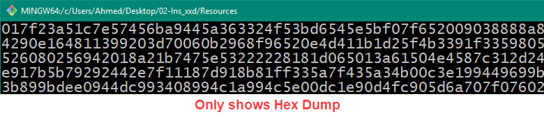
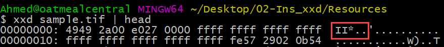

## 1.3 Lesson Plan - Terminal Trickery

### Overview

In today's class, students will further their skillset and familiarity with the command line. They will specifically learn the `xxd` command for converting files to  hex format; and they will additionally learn to use the command line in the context of virtual machines to practice the use of `ssh` and `scp`. 

### Class Objectives

* Students should understand the conceptual importance of hexadecimal format. 
* Students should understand how files can be converted into and out of hex format using the `xxd` command.
* Students should understand how to determine file signature of files by investigating ASCII output.
* Students should become familiar with the fundamental concept of `SSH`.
* Students should become comfortable loading virtual machines into a virtualization software.
* Students should be able to use `SSH` and `SCP` to create a shell connection to a remote machine.
* Students should increase their comfort and familiarity with shell commands taught earlier in the class.

### Instructor Notes

* Welcome to the first Saturday class! These classes are longer and as such allow us to create more extensive "mini-project" style exercises. As class progresses, you will find that Saturdays can often be the most fun as there's more time for students to collaborate.
* In today's class, students are learning effectively three new concepts: hex dumps, virtual machines, and SSH/SCP. As you are teaching today, remember that this is the focus. As students get lost on syntax or struggle to put all the pieces together, always bring it back to these three ideas. If they understand what a hex dump is and how conceptually it can be useful -- then mission accomplished. Let them know that comfort with syntax will come with time and repeated use. 
* At first glance, many of these exercises may seem to involve many steps, but in truth are fairly straightforward. Study the `script.sh` files in your Solution folders when preparing for class and to serve as cues on your "next steps". In each instance, the `script.sh` file should provide you with each step necessary to complete the exercise exactly.
* Be sure to share solution files with students as you go. These are important learning artifacts for students as they work through future problems. 
* The VM (https://drive.google.com/open?id=1g4qG9TKa9Qq821XkwBJxeOa-c9OVm3g7) needed for today is pretty large  be sure to have this downloaded prior to coming to class. For students, they can download this file in advance of class or during break. 
* As always, have your TAs refer to the [Time Tracker](TimeTracker.xlsx) to stay on track.

----

### 1. Students Do: Terminal Refresh (0:07)
* Begin class today by having students complete a brief warm-up exercise. This exercise will test students on their memory of the relevant commands for searching for files and counting their incidences in a file tree. 
* Send the following file and instructions to students:

  * **File**
    * 01-Stu_Terminal_Refresh/Docs.zip

  * **Instructions**
    * Unzip the folder provided then complete the following tasks using the command line:
      * Navigate into the `Music` folder.
      * Create an `MP3` and `FLAC` folder.
      * Find and copy all the `.mp3` and `.flac` files contained in the `Docs` folder into the relevant folder just created. 
      * Count the number of MP3 and FLAC files. 

### 2. Instructor Do: Review Terminal Refresh  (0:05)
* Once time is up take a few moments to review the exercise. Feel encouraged to call on students to lead you through their solution. Don't be surprised if your students struggled with this exercise. They will still be getting familiar with the boot camp style of learning. 

* As you explain the solution, walk students through the process using the below framework as a guide:

  * Begin by navigating into the `Music` folder using `cd` (change directory).

  * Use the `mkdir` (make directory) command to create a directory.

  * Change back into the `Docs` folder using `cd ..`. This is helpful because we will scan this folder and all its sub-folders for the file we need.

  * Run the command `find . -type f -iname *.mp3 -exec cp {} Music/MP3 \;` to search for all files that end with the phrase `mp3`. 

  * Spend a few moments breaking down this `find` statement again for students. Remind them of the significance of the `-iname`, `-exec`, `cp {}`, and `\;`elements. 

  * Then `cd` into the MP3 folder and use `ls -R1 | wc -l` to get a count of files within the directory. 

  * Repeat the above for the FLAC files.
  * 

  * Answer any questions that remain before proceeding to the new topics.

### 3. Instructor Do: Binary and Hex (PPT) (0:10)
* Next, open the PowerPoint ([TerminalTrickery.pptx](TerminalTrickery.pptx) provided. 

* Over the next ten minutes, use the slides to introduce students to the concept of binary and hex files. This is an important concept for students to understand conceptually. 

* When prompted use the in-built discussion activities to reinforce the concepts introduced. (Do not proceed into the section on Virtual Machines just yet.)

### 4. Instructor Do: xxd command  (0:07)
* Next, proceed with the first demonstration on hex dumps. 

* In this example, you've been given a `Resources` folder filled with files of assorted types. Use the `demo.sh` script provided and the below framework to introduce students to the `xxd` command for creating hex dumps with the command line.

  * Begin by running the simple command `xxd lol.gif`. 
  * Explain to students that this has the effect of generating a hex dump representation of our gif file. The output is then broken into three parts. Part 1 specifies the line number. Part 2 specifies the hex representation. Part 3 represents a (somewhat readable) ASCII representation. 
  
  *  
  
  * Next run the command `xxd -p lol.gif`.
  * Explain to students that this command is similar to the previous, but has the effect of suppressing the line numbers and ASCII representations.
  *  
  
  * Next run the command `xxd lol.gif | head` and `xxd lol.gif | tail`. 
  * Explain to students that this command has the effect of showing only the first and last 10 lines of the hex dump.
  
  * 
  
  * Next, show students that we can create hex dump files using the `>`  or `| tee` in conjunction with xxd.

  * 
  
  * Next spend a few moments pointing out to students that hex dumps can reveal interesting bits of information about our files. For instance, in running the `xxd` command on each file in our folder, we see that the ASCII table specifies the file type for each. (Note: for `tif` files, the signature is `II*`) The conversion between file signatures can be found in databases like this one: https://filesignatures.net/index.php?page=search&search=504B0304&mode=SIG).
  
  * 
  * 
  * 
  
  * Finally, convey the fact that this information is particularly interesting to security professionals, as malicious files can be named one file extension, but in fact be another file type completely. Hex dumps allow us to see the true type of a file, even when it is named incorrectly.
  
  *  
  
  * Answer any questions that remain before proceeding to the first student exercise. 

### 5. Students Do: My First Hex Dump  (0:10)

* In this next activity, students will be given a folder filled with files of unspecified file types. They will use the `xxd` command to view the generated hex dump and ASCII text to determine the file type -- and further identify the identifying signature relevant to the hex.
* Send the following file and instructions to students:

  * **File**
    * 03-Stu_My-First-Hex-Dump/MysteryFiles.zip

  * **Instructions**
    * Unzip the folder provided, then use the `xxd` command to identify the correct extension for each file. (Hint: You may need to search online for one of the signatures in particular). 
    * Once you've identified the relevant file types for each, rename them in your file explorer. Confirm that each file opens correctly.
    * Finally, use a Hex to ASCII text converter (https://www.rapidtables.com/convert/number/hex-to-ascii.html) to parse out the specific hex content that is associated with each ASCII signature. 
    * If you finish early, discuss with your partner why some files show clear file signatures and others do not. 

### 6. Instructor Do: Review My First Hex Dump (0:10)
* When time is up, review the solution for students. Use the below as a framework for your discussion:

  * Run the command `xxd <file> | head` on each of the files provided. Note the ASCII signature of each. For instance, `01-success` is a gif file. When renamed it yields the below gif. 
  
  * 
  * 

  - The second file `02-sample` registers as a `qExif`. This will seem unfamiliar to students, so run a quick Google Search for the phrase "qexif file signature", you will then see that JPEG/Exif is a common JPEG format created by digital cameras.

  - 

  - Repeat for `03-poc_gtfo` and show that this is a PDF.

  - 

  - For the last two examples, point out that no ASCII file signature was shown.  Offer a few students an opportunity to chime in, before pointing out that ASCII is effectively a text format. 

  - For the previous "binary" files (images, pdfs, music, etc.), the ASCII representation is an attempted conversion of non-text information into a text-based format. This is why they seem so hard to read.  On the other hand, with text-based documents like txt, html, and other code formats ASCII perfectly captures the contents. There is no "garbage" display.  
  - 
  - 

  - Finally, end the activity by flipping to the Hex to ASCII text converter https://www.rapidtables.com/convert/number/hex-to-ascii.html and enter in snippets of the hex dumps into the converter to show they match up with ASCII. Hex codes for today's activity are shown below: 
    - Hex: ` 4749 4638 3961` | ASCII: `GIF89a`
    - Hex: `2325 5044 462d` | ASCII: `#%PDF-`
    - Hex: `4578 6966 0000` | ASCII `Exif`

  - Explain that Hex codes like these can be very useful in identifying malware -- a task they will be undertaking much later in the course. 

  - Answer any questions that remain before proceeding to the next example.

### 7. Partners Do: Hex Dump CSI (0:10)
* In this next example, students will use their new understanding of file signatures in conjunction with their ability to `find` and `grep` to quickly process and rename files that have been mislabeled. This is a challenging activity, so be sure to actively support students and ensure they are engaged. 
* Have students form up in pairs before sending them the following file and instructions.
  * **File**
    * 04-Stu_Jpg-Or-Gif/Pictures.zip

  * **Instructions**
    * In this example, you've been given a folder filled with your teacher's favorite pictures. 
    * Unfortunately for your teacher, someone incorrectly assumed that GIFs and JPEGs were the same file type and renamed the extension of these files at random. Now, all your teacher's animated memes are static! Your task is to help your teacher quickly process all of the pictures, such that each has the correct file extension.
    * To accomplish this task, use the following steps as a guide:
      * First, create two folders: `GIFs`,  and`JPEGs`. 
      * Next, create a hex dump for a few files to identify the file signatures for GIF and JPEG in the folder.  Do not do this for each file! You just need to run this command on 1-4 files to determine the file signature to search for. Your objective is to figure out any distinguishing pattern between the file types.
      * Next, use the `grep` command to search for this file signature in the folder. (Surprise! `grep` can be used to search within binary files for ASCII signatures. Powerful right?)
      * Bonus: Find a command that you can use in conjunction with `grep` to automatically move the files into their respective folder. (You will need to research online for different pathways).
      * Once you've done this,  run a count of the images in each folder.
      * Finally, *manually* rename the files in the folder to match their true file type. If your script worked correctly, all of the files in the `GIFs` folder should be animated while none of the files in the `JPEG` folder should be. 

  * **Hints**
    * This may seem like a challenging activity, but as you will find later, the solution is fairly simple. Focus on breaking it up into parts. First determine the ASCII signature. Then use `grep` to get all files that contain this signature.
    * If you are 

### 8. Instructor Do: Review Hex Dump CSI  (0:07)

- This activity may have been particularly challenging for students, in part, because of the multiple approaches possible in solving it. As always encourage students who may have felt stuck, before offering the following solution included in the `script.sh` file.
  - Begin by making two folders inside of the `Pictures` folder: `GIFs` and `JPEGs`. 
  - Then run `xxd` on two test files and examining the output. In our case, we began by selecting the `angry.gif` file. After looking at the hex dump it's clear that this file was actually a JPEG, whose signature is JFIF. This might inform us that we should use `JFIF` when searching with Grep.
  - 
  - We'll repeat the above on a file until we find a clear signature for GIFs. We should eventually stumble into a file with the familiar "GIF89" signature. 
  - 
  - Now that we have two possible file signatures `GIF89` and `JFIF`. We can proceed to run a `grep` search for their presence in the folder. Run the following command: `grep -rli 'gif'.` and `grep -rli 'JFIF'.` to see which files emerge. 
  - 
  - Now, let's manually rename all of these files and move them to the appropriate folder. (Advanced students can be challenged to figure out a way to move and rename the files all using the terminal, though it will require a bit of independent research). 
  - To speed things up in the demonstration, you may want to use this command to move all the files at once `grep -rli 'GIF' | xargs mv -t GIFs` and `grep -rli 'JFIF' | xargs mv -t JPEGs`.
  - 
  - Once done, you will have two folders filled with files. These can now be manually renamed corrected.
  - 
  - 
  - Finally run a count on each folder using any command you like. 
  - 
  - 
  - Spend a few moments answering any remaining clarification questions before sharing your `script.sh` file and proceeding to the next section.

### 9. Instructor Do: xxd -r (reverse hex) (0:07)
- Next, introduce students to the `xxd -r` command, which is used to reverse hex dumps. 

- Use the `script.sh` file found in `05-Ins_xxd-r` and the guide below to demonstrate:
  - Begin by running `head` or `less` to view the contents of the secret message file.
  - 
  - Next run the command `xxd -p secret_message | tee secret_message.dump` to store the hex dump into a file and preview it at the same time. 
  - 
  - Now run the command `xxd -r -p secret_message.dump` to retrieve the original text. 
  - 

  - Ask if there are any questions before sending out the example files.

### 10.  Students Do: Reverse that Dump  (0:10)
* In this next exercise, students will get a bit of practice working with `xxd -r` to reverse hex dumps into human-readable content. 
* Send the following file and instructions:
  * **File**
    * 06-Stu_Reverse-The-Dump/Docs.zip
  * **Instructions**
    * You've been given a zip folder with various sub-folders. 
    * Your first task is to find and copy all of the dump files into a folder titled: `Undumped`. 
    * Next, use less to study the contents of one or more of the hex dumps.
    * Next, reverse dump each of the files in the `Undumped` folder.
    * Next, determine the "true" extension for each file by investigating the file signature.  (You may need to research the translation of specific file signatures online).
    * Finally, rename each of the files to the correct file type. Confirm that each opens as you would expect.

### 11.  Instructor Do: Review Reverse that Dump (0:07)
* When time is up, use `script.sh` solution file and below guide to walk students through the solution.
  * Step one is to create a folder titled `Undumped`. 
  * Next we use the `find` and `exec` commands to move all of the dump files into the `Undumped` folder.
  * Next, we run a quick check of the files contained within using `ls` and `head`. This is to simply confirm that we are looking at true hex files.
  * Once we've done this, we use the `xxd -r -p` command to create reverse dumped files.
  * Each of these reverse dumped files needs to then be investigated using `xxd` to determine the file signature. Show students that the translation of these file signatures can be gleaned using any online resource. In this example's case, the below are the file signatures included:
    * ID3 = MP3 (MP3)
    * mpv2avc1 = MP4 (Movie)
    * %PDF = PDF
    * PNG = PNG
  * Finally, answer any questions before sending students the solution file.
  * 
  * 

### 12.  Instructor Do: Intro to VMs and Virtual Box (PPT) (0:10)
* Give students a minute or two to collect themselves, before switching gears and introducing them to Virtual Machines. Re-open the PowerPoint from earlier and proceed through the section on Virtual Machines. (Do not proceed into the section on SSH and SCP).
* When prompted proceed to have students install Virtual Box. 

### 13.  Students Do: Install Virtual Box  (0:05)
* Give students a few moments to install Virtual Box. (As a suggestion, encourage all students to use Virtual Box, even if they already have a VMWare product. Consistency of tooling makes for an easier learning experience).
* Note: There is a large VM download asked of students. Feel encouraged to permit students to head to break while the file downloads.
* Send the following instructions:
  * **Instructions**
    * Visit the Virtual Box website (https://www.virtualbox.org/) and follow the installation steps. Use the default for everything. 
    * Then, download the following Virtual Machine (https://drive.google.com/open?id=1g4qG9TKa9Qq821XkwBJxeOa-c9OVm3g7) for use in the coming demos. 
* Once complete, students can immediately proceed to break.

----

### 14.  Break (0:45)

----

### 15.  Instructor Do: My First VM (Linux Box)  (0:10)
* Upon returning to class, engage students to re-explain the concept of Virtualization to you.
* Then proceed to demonstrate the steps required to load up a Virtual Machine using today's VM as an example. Use the following steps to guide your demonstration:
  * XXX
  * XXX
  * XXX
  * XXX
  * XXX
  * XXX
  * Ask if there are any questions, before proceeding to the first student exercise. 

### 16.  Students Do: Navigating My VM (0:10)
*
### 17.  Instructor Do: Review Navigate My VM  (0:07)
*
### 18.  Instructor Do: Intro to SSH and SCP (PPT) (0:10)
*
### 19.  Instructor Do: SSH Command  (0:10)
*
### 20.  Students Do: SSH in VM  (0:10)
*
### 21.  Instructor Do: SCP in VM  (0:10)
*
### 22.  Students Do: SCP in VM  (0:10)
*
### 23.  Students Do: SSH / SCP Into Partner Machines  (0:20)
*
### 24.  Instructor Do: Review SSH / SCP Into Partner Machines (0:10)
*
### 25.  Instructor Do: Barriers to Entry (PPT)  (0:15)
*
### 26.  Students Do: Mega Challenge   (0:20)
*
### 27.  Instructor Do: Review Mega Challenge  (0:01)
*

-------

### Copyright

Trilogy Education Services © 2018. All Rights Reserved.
