## 2.1 Lesson Plan - Spying on the Wire

### Overview

In today's class, students will receive their first foray into the fundamentals of network traffic analysis. Throughout the day, and the remainder of this week, students will build their familiarity and comfort with the widely used network analyzer Wireshark.

### Class Objectives

* Students should begin to form a working definition of a "network" and understand the principles by which computers communicate.  
* Students should gain a working definition of "packets" and understand their relevance to network and security analysis. 
* Students should understand the relevance of Wireshark to network and security professionals. 
* Students should gain a preliminary familiarity with the interface and basic functionality of Wireshark -- including such concepts as packet capture, capture filters, and display filters.

### Instructor Notes

* Welcome to Week 2! In this week, students will take a head first dive into the world of network and traffic analysis. For many of your students, this will feel like a daunting week filled with new vocabulary, complex-seeming interfaces, and challenging sticking points. Encourage them to swing with the punches and remind them that clarity will come with time.

* Today's class, in particular, is intended to be a "practice-first, learn-second" type of experience. You will guide them through a variety of exercises intended to nudge them through the labyrinth of the Wireshark interface. Encourage your students to take on an explorer's mindset throughout the lesson. Let them know that today they should be focused on gaining exposure. In subsequent classes, they will be spending more time anchoring what they've seen in theory and principle. 

* Because today's class is intended to foster exploration and comfort with the unfamiliar, spend ample time wandering the class and engaging students in small groups. As they work through Wireshark, feel encouraged to prod their learning by asking pointed questions about what they're seeing on their screens. 

* As always, have your TAs refer to the [Time Tracker](TimeTracker.xlsx) to stay on track.

----

### 01. Instructor Do: Networks, Packets, and Wiresharks (0:15)

* Spend a few moments to welcome students back. Inform that in today's class they will be taking a step into the world of networking.

* Then open the PowerPoint [Spying On the Wire](Spying_On_The_Wire.pptx). 

* Use the slides provided to guide students through the basic concepts of networking, packets, and traffic analysis. Try not to get too lost in the weeds during the course of the presentation. It's intended to be a high-level primer for a reason. If more complex questions emerge, answer only the ones most relevant to today's class. There will be plenty of time to deepen the concepts covered during later weeks.

* Keep a steady watch of time as you present. Stay concise! Today's class is not about PowerPoint.

### 02. Students Do: Wireshark Installation (0:05)

* Once you've completed the presentation, send the following instructions for them to install Wireshark.

    * **Instructions**

        * Visit the Wireshark website (https://www.wireshark.org/) and proceed to download the application.

        * Follow the steps through the installation process. (Windows users: Be sure to "Select All" when prompted to "Select Components to Install").

        * Once installed, open the application. You should see a view that looks like this. 

         

        * If you finish early, navigate to the Wireshark User Guide (https://www.wireshark.org/docs/wsug_html_chunked/) and begin skimming through the first few chapters. 

### 03. Partners Do: Diving with the Wiresharks (0:15)

* Once students have successfully installed Wireshark have them form groups of 2-3 to complete this next exercise.

* Give them a heads-up that in this coming challenge they will be tasked with learning to decipher the basics of the Wireshark interface *themselves*. Remind them that this will seem intimidating at first, but as cybersecurity professionals it will often be their responsibility to quickly learn new technologies on the fly.

* Then, send the following instructions for them to complete.

    * **Instructions**

        * Using your own exploration or the Wireshark documentation, complete the following steps and answer the associated questions:

            * First, "Start a Capture". (You will need to first figure out how!)
            * Allow the Wireshark capture to run for a few moments, before "Stopping" the capture.
            * Once stopped, take a few moments to answer the following questions. (Hint: You will need to do a bit of research!)

                * What do the columns "No", "Time", and "Length" represent?
                * What do the "Source" and "Destination" columns represent? How are they associated with one another?
                * What does the "Protocol" column represent? What are a few prominent protocols that appear in your packet trace? 
                * What does the "Info" column represent? How might you interpret if it states: "54492 -> 7437 Len=173"?
                * What do the row colors signify? What does a green row signify? Blue? Black? Red? 

            * Once you've answered the above questions, begin clicking the various rows. Observe how the panels below change as a result. 
            * Then take a few moments to answer the following questions:

                * What is the significance of the *second* panel window (middle)?
                * What is the significance of the *third* panel window (bottom)?
                * What is the significance of the indecipherable numbers, letters, and symbols in the bottom window? What format is this data stored in?

        * **Hint**: 

            * If you need a place to start, look for the section titled "The Packet List" Pane in the Wireshark Documentation.
            * Don't worry if you can't decipher all the terms. We'll break them down in due time!
        
        * **Bonus**: 

            * If you finish early, start a new Wireshark capture, but this time immediately begin browsing the web while the capture is running. See if you can identify which rows (packets) are specifically relevant to your web browsing.  

    * **Instructor / TAs:** 

        * Be sure to wander the class as students explore. It's easy to get stuck or intimidated by the Wireshark interface. 

### 04. Instructor Do: Review Diving with the Wiresharks (0:07)

* Once time is up, call on students one by one to share their answers. 

* As they share, gently guide them to the following answers:

    * The "No" column signifies the packet number. The first packet starts at 1 and each subsequent packet is assigned a sequential number until the capture ends. The "Time" column signifies the amount of time (in seconds) from the start of the packet capture. The "Length" column signifies the size in bytes of the packet received.

    * The "Source" column represents the IP address from which the packet originated. The "Destination" column represents the IP address to which the packet arrived.

    * The "Protocol" column represents the communication method by which the packets are transmitted. Common protocols seen in Wireshark include UDP, SSL, HTTP, TCP, etc. We will be covering various protocols in future lessons.

    * The "Info" column includes additional information about the packet. As an example, "54492 -> 7437 Len=173" would signify that the packet was sent from PORT 54492 and received at PORT 7437 with a transmission length of 173 bytes. We will talk more about ports in future lessons.

    * The row colors are pre-defined to correlate with types of traffic (protocol) and interesting packet patterns. These color schemes can be changed based on user interest. By default: Green signifies HTTP or SMB. Light Blue signifies TCP or UDP. Black signifies an error. Red signifies an abort. 

    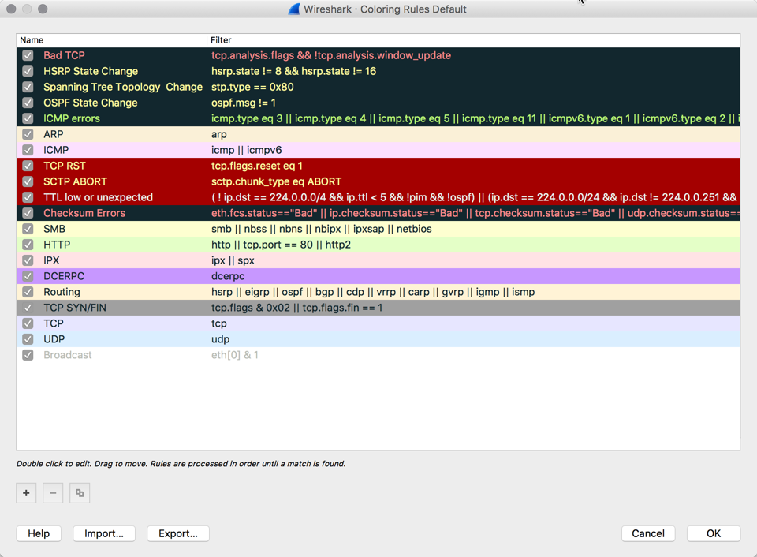

    * The three sections of the Wireshark window are called: "Packet List", "Packet Detail", and "Packet Bytes." 

    * The indecipherable numbers, letters, and symbols represent a complete hex dump of the packet data. 

    

* Answer any remaining student questions before proceeding to the next step.

### 05. Instructor Do: Hunting for HTML (0:10)

* Next, explain to students that Wireshark is a perfect tool for monitoring web traffic on your network. In this next example, we'll be using Wireshark to track web traffic to and from your computer.

* Begin your demonstrating by retrieving your internal (local) IP Address. Remind students that their local IP address is not the same as the Public IP Address they receive when entering "What's my IP Address" in Google. 

    * Mac Users can obtain their local IP address by opening a terminal window and entering the command `ifconfig | grep inet`. Your local IP address will tend to be the last address listed. 

    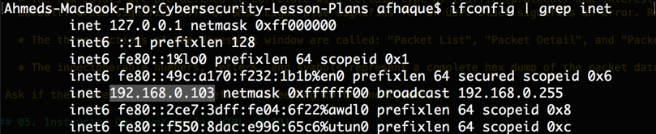

    * Windows Users can obtain their local IP address by opening a command prompt (or bash) window and typing `ipconfig`. 

    

* Next, return to your Wireshark application and initiate a capture. Let it run for a few moments before immediately stopping the capture. Point out the repeated appearance of your local IP address in the Source and Destination columns. This is an easy way to spot incoming and outgoing traffic associated with your machine. 

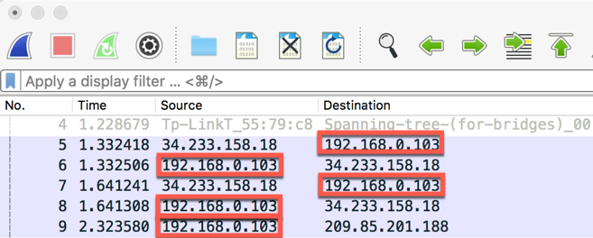

* Re-initiate a Wireshark capture. Then immediately open a Chrome window in incognito mode. While the capture is running in the background, visit http://www.example.com. (Note: You must open this page in incognito mode to ensure the page does NOT load from cache). Once the page is open, point out the fact that the page does NOT use HTTPS and is thus considered insecure.

* Next, return to the Wireshark window and stop the capture. Inform students that web browsers use the HTTP protocol to transmit and receive web page information. Then scroll through the Wireshark Packet List until you spot rows with HTTP listed as the protocol. (Note: If you have too many packets, you can quickly search for HTTP using the Display Filter). 

* Take a moment to break down the two rows. As you do so, point out that:

    * In the first row, the "Source" column lists your Local IP address and the "Destination" lists the IP Address 93.184.216.34. This signifies that *our* machine was sending a request to the example.com server.

    * In the second row, the "Source" column lists 93.184.216.34 and the "Destination" column lists your Local IP. This signifies that the *Example.com* server is responding back to our machine.

    * Let them know that they will be spending more time discussing the concept of Client-Server requests in later lessons. But for now, the key is to understand that as we browse the web, our personal machine is constantly sending requests and receiving responses from other machines.  

    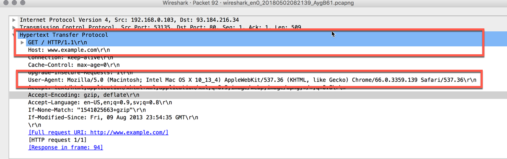

*  Next, double click the first of the two HTTP rows (the request row). Scroll through the Packet Details and point out the following:

    * The top line under the section titled Hypertext Transfer Protocol lists the phrase `GET / HTTP/1.1\r\n`. Let students know that this signifies that we made a "GET Request". In essence, by visiting the example.com website, we are making a request to *GET* the web page's contents. Again, let students know they will be spending more time with GET and POST requests at a later date. 

    * The the "host" listed is www.example.com.

    * The user-agent listed specifies the web browser we used to visit the example page. 

    

* Next, double click the second of the two HTTP rows (the response row). Scroll through the Packet details and point out the following:

    * Under the section titled Hypertext Transfer Protocol we see the phrases `Status Code: 200` and `Response: OK`. This is our signal that the example.com server *successfully* understood our request and provided a response.

    

    * Then flip to the section titled Line-Based Text Data. Point out how this section stores the actual HTML code used to produce the Example.com website on your browser. Again, let them know they will be spending more time with HTML at a later point in time, however, the key for them today is to understand that this HTML is how our browser knows what to render on our screen. 

    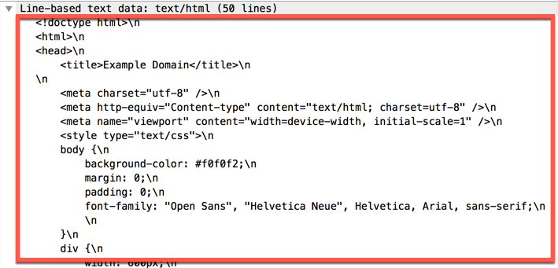

* Answer any remaining student questions before proceeding to the next step.

### 06. Students Do: My First Sniff (0:10)

* Next, let students know they will be completing their own practice capture. 

* Send the following instructions for students to complete.

    * **Instructions**

        * Spend a few moments identifying a website that is currently not secured through HTTPS. As a suggestion, visit the HTTPShame website (https://gist.github.com/Enegnei/6b13b2d5d0bc7adebb66195f807f3f3b). While some have since been secured, many remain insecure.

        * Then perform a Wireshark capture while visiting any of these pages. Stop the capture after a few moments and answer the following questions:

            * Which packets are relevant to your web browsing?
            * Which packets are relevant to your machine's *request*?
            * Which packets are relevant to the website's *response*?
            * If you are seeing many rows of requests and responses, why might this be the case?
            * Which packets contain the HTML markup of the website? (Hint: The packet should show text similar to what you see on the webpage.)

        * If you finish early, re-attempt this experiment, but this time use a website that *is* secure. What do you see this time? What might be the significance of HTTPS vs HTTP?

### 07. Instructor Do: Review My First Sniff (0:10)

* Once time is up, spend a few moments reviewing the previous exercise with students. 

* As part of your review, initiate a capture and browse to a website that is insecure (e.g. www.bbc.com). 

* Then call on students to answer each of the questions from the assignment. As they attempt to answer, guide them to the below solutions:

    * All packets associated with the HTTP protocol are relevant to the browsing event.

    * Packets for which the "Source" matches your local IP address are the ones associated with the "request".

    * Packets for which the "Destination" matches your local IP address are the ones associated with the "response".

    * Multiple requests and responses appear because modern web applications involve the transmission of multiple files (HTML, CSS, JavaScript, etc).

    * The specific packet associated with HTML markup includes the phrase "/text" in the Info column. To confirm, double click on the relevant packet, open the Packet Detail View, and navigate to the section titled Line-Based Text Data. You should see HTML Markup similar relevant to the website.

    

* Once you've answered the above questions, create a new capture while browsing a secure website (e.g. www.chase.com). Then demonstrate to students that no HTTP activity was captured. Explain that instead, the packets are registered under the protocol TLS. If time permits, find a TLS associated packet and demonstrate how there exists no prominent information to decipher this transmission. In fact, because of the encryption, it can be a significant challenge even identifying which packet is relevant to the browsing event. 

    

* Answer any remaining student questions before proceeding to the next step.

### 07. Partners Do: Leaky HTTP Traffic (0:10)

* This next activity is a fun one! In this example, students will use Wireshark to retrieve a user's username and password from an insecure website. 

* Send the following instructions for students to complete.

    * **Instructions**

        * Initiate a Wireshark capture.
        
        * Then, open a Chrome window using incognito mode (`Ctrl+Shift+N` or `Cmd+Shift+N`).
        
        * Navigate to the webpage www.aavtrain.com. Attempt to login using a dummy username and password.
        
        * Now, return to your Wireshark window and stop the capture. 
        
        * See if you can identify the packet relevant to your form submission. (Hint: A "GET" request is when you request information from a server. A "POST" request is when...)
        
        * Once you identify the relevant row, see if you can extract from the packet data the username and password you entered. 
        
        * Once complete, turn to the person next to you and explain the importance of securing webpages with HTTPS.

### 08. Instructor Do: Review Leaky HTTP Traffic (0:10)

* Once time is up, spend a few moments reviewing the previous exercise with students. 

* As part of your review, initiate a capture and browse to the www.aavtrain.com website.

* Next, have a student guide you through the process of identifying the relevant packet and user information. As they share their response, nudge them towards the below talking points:
    
    * The relevant packet includes HTTP as the protocol and the phrase `POST /` as part of the info column. This POST signifies that a POST request was sent by the user to the server.

    * Double click the packet and, in the Packet Detail view, scroll to the section titled HTML Form URL Encoded. There you will the form items: user_name and password, each of which is associated with the user's submission. Voila!

    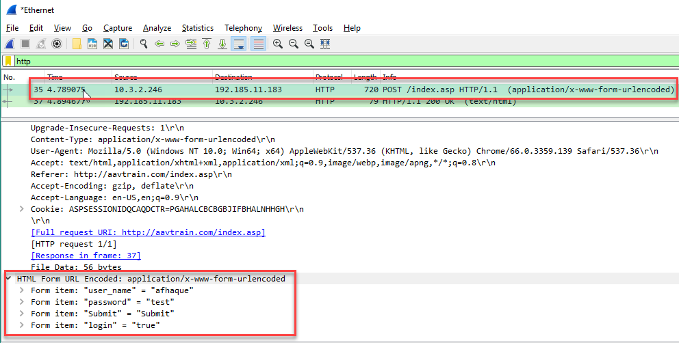

* Answer any remaining student questions before proceeding to the next step.

---

### 09. BREAK (0:15)

---

### 10. Instructor Do: Display Filters (0:05)

* Next, introduce students to the concept of filtering in Wireshark.

* Begin by introducing them formally to the concept of "Display Filters". Display filters are helpful in inspecting web traffic to identify patterns specifically of interest.

* To do so, begin a capture and begin navigating the web. Then return to Wireshark and enter `http` in the Display Filter tab. Note that only packets with the protocol HTTP remain.

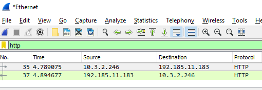

* Clear the filter text and replace it with the phrase `!http`. Note that this time the only packets displayed are ones *not* associated with the HTTP protocol. 

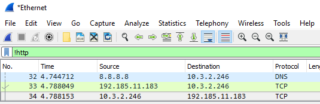

* Switch back to the Chrome browser and navigate to http://www.bbc.com (in incognito mode). Click on a few articles to capture additional traffic. Then return to Wireshark and enter the phrase `http.host contains bbc` in the filter text. Explain that this filters for unencrypted web traffic to any URL containing the word "bbc". 

* Clear the filter text and replace it with the phrase `http.host==www.bbc.com`. Explain that this filters for web traffic *specifically* associated with the url http://www.bbc.com (i.e. none of the article clicks will appear).

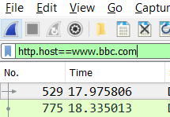

* Clear the filter text once again and enter the phrase `!http.host==www.bbc.com`. Explain that the exclamation point signals that we are looking for all traffic *not* associated with the bbc.

* Lastly, clear the filter text once again and replace it with the phrase `http.host contains bbc or http.host contains reuters`. Explain that using words like `and` or `or` allows us to chain filter commands. 

* Answer any remaining student questions before proceeding to the next step.

### 11. Instructor Do: Capture Filters (0:05)

* Next, introduce the concept of "Capture Filters." In doing so, explain that:

    * While Display Filters are useful in filtering packets to just the ones of interest -- it still means that Wireshark will have collected all the other packets.

    * Capture Filters, on the other hand, allow us to initiate a Wireshark capture exclusively for packets of interest. This can be helpful in reducing the amount of noise we collect in our capture files.

* To demonstrate, first close and re-open Wireshark (or select the "Capture Options" button). 

* This time, prior to initiating the capture enter a capture filter in the relevant field. In our case, we will insert "port 80" as our filtering condition. Most web traffic is transmitted through port 80, so this will effectively limit our capture to HTTP content alone. 

* Initiate the capture, switch back to the browser, navigate to the website www.example.com, and return to the Wireshark window. 

* Note for students that the only signal captured is associated with TCP and HTTP traffic through port 80. 

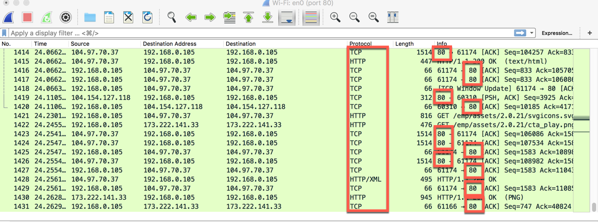

* Answer any remaining student questions before proceeding to the next step.

### 12. Instructor Do: PCAP Exports (0:05)

* Next, introduce students to the process of exporting pcap files.

* Using either your previous Wireshark capture still running or a fresh capture, select "Save As" to generate a PCAP file. Store it some place accessible.

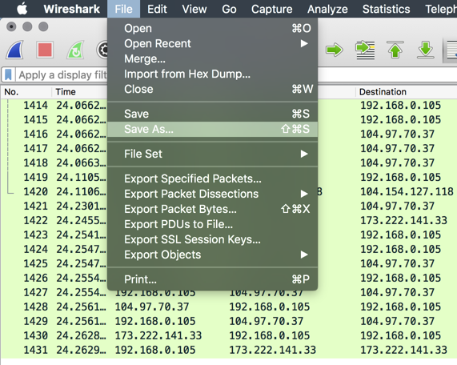

* Then close and re-open Wireshark. This time, instead of initiating a capture. Import the capture just created. Point out that analyzing historic pcap files is great way to retrospectively analyze traffic events in the events of failures or breaches.  

* Answer any remaining student questions before proceeding to the next step.

### 13. Partners Do: The Search for Something Cool (0:15)

* This next activity is a fun one! In this example, students will be tasked with importing a pcap file and using display filters to retrace a user's browsing history. Send the following instructions and files for students to complete.

    * **Files**

        * [01-Stu_TheSearchForCool/big_http.pcap](Activities/01-Stu_TheSearchForCool/big_http.pcapng)

    * **Instructions**

        * You've just been given a pcap file of a user's browsing history. Load the pcap file into Wireshark, then using capture filters limit the view to exclusively show the user's activity on the website: http://www.coolthings.com

        * Then, further limit the view to hide any packets associated with the browser's download of web assets like Javascript, CSS, or images. 

        * Finally, use the packets that remain to decipher which links the user selected while on http://www.coolthings.com. (e.g. coolthings.com/Home -> coolthings.com/Articles -> coolthings.com/Store -> Etc.)

    * **Hint**

        * This is challenging! But spend the time necessary sleuthing through this one. You won't regret giving this an honest shot.

        * You may need to do some research online to attack this problem. Use your Google Fu! In particular, when it comes to filtering out Javascript, CSS, and images pay attention to "file extensions".

        * Pay attention to GET requests. In this case, the simpler the GET request destination, the better!

    * **Bonus**

        * If you finish early, examine the packet history further to identify which other websites the user visited as well.

### 14. Instructor Do: Review The Search for Something Cool (0:10)

* Before you begin discussing the solution, let students know that this was a challenging exercise. If they didn't know where to begin -- it's totally okay!

* Then proceed to walk students through the solution:

    * Begin your discussion, by revealing the first step they should have taken -- using the `http.host contains "coolthings"` display filter to exclusively inspect traffic associated with the coolthings url.

    

    * Then acknowledge that the next step was tricky. In filtering out assets like JavaScript, CSS, and Images -- they should take note of the fact that these assets all contain a *.* in front of the file extension (e.g. `.css`, `jpeg`, `.js`, etc). By using the filter `!http.request.uri contains "."` all traffic associated with the dot extension could be removed from the view. 

    

    * What's left of the view are a series of `GET` requests each followed by the url endpoint associated with the user's browsing history. So in this case, the user visited the coolthings homepage (`/`), then visited the category page on wheels (`/category/wheels`), then visited the page on the felix-monza motorcycle (`/feliz-monza-moto-rocker-motorcycle`), then visited a page on rock climbing mug holds (`/rock-climbing-mug-hold`), etc. 

* Answer any remaining student questions before proceeding to the next step.

### 15. Partners Do: Sifting the Haystack (0:15)

* Explain that in this next activity, they will generate a packet capture while visiting a few websites -- then share the exported pcap file for their partner to decipher. Let them know that this is a good representation of a typical cybersecurity scenario, in which they as the professional will be tasked with identifying bad actors on a network.

* Then send out the following instructions.

    * **Instructions**

        * Initiate a Wireshark capture. 

        * While the capture is running, visit the pages: http://meettheipsums.com/ and http://www.coolthings.com/ one after the other.

        * Next, visit the pages http://www.espn.com and http://www.foxnews.com and begin selecting articles on each site. In your head, keep track of the articles you visit.

        * Then stop the capture and export it into a pcap file. Share this file with a partner.

        * Once you receive your partner's pcap file, see if you can ascertain the order of their browsing history. 

    * **Hint**

        * Use this as an opportunity to explore new and relevant filters using the documentation: https://www.wireshark.org/docs/wsug_html_chunked/ChWorkBuildDisplayFilterSection.html

### 16. Partners Do: Review Sifting the Haystack (0:10)

* In going through the solution, open the sample capture file provided in the folder [02-Sifting_Haystack](Activities/02-Sifting_Haystack/solution.pcapng).

* Then begin to show students how they can iteratively break the capture file down into the relevant components. In doing so, point out that:

    * We begin by using the display filter `http.host contains "ipsums" or http.host==contains "coolthings"` to isolate traffic to these two pages.

    

    * Then proceed to show them how they can specify traffic only associated with foxnews.com and only those pages that are HTML using a filter like: `http.host contains "www.foxnews.com" and http.request.uri contains ".html"`. Mention that there are multiple paths to achieve the same end, and the process of building the correct filter often requires iteration. Point out that they can often use the Packet Detail pane to help glean relevant information that may be filterable. In this case, we could see that the full host name for fox news is www.foxnews.com. (Specifying only "fox" or "foxnews" would pull in traffic associated with tangential services run by fox for user monitoring.)

    

    * Repeat the above process for espn. Explain that in this case, the web traffic may have seemed harder to decipher. Using tactics that may have worked in the previous example, may not similarly work in this example. Begin your process by adding in the display filter `http.host contains "espn.com"` and demonstrate that this filtered traffic to just espn. Explain that while helpful, this still shows us "garbage" entry not associated with user activity.

    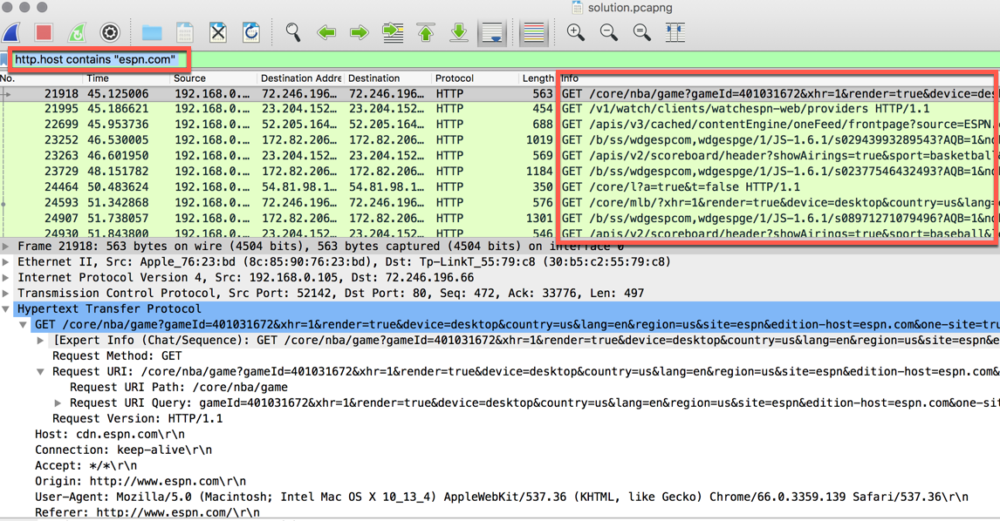

    * Continue the process of breaking down the espn traffic. Explain that for instance, we might know that API calls can be filtered out -- because they are not triggered directly by user link selection. This would allow us to add in the filter `and !http.request.uri contains "api"`. 

    * Explain that we might further conclude, based on our understanding of the espn website, that all urls associated with the `/b/ss` prefix are not associated with weblinks. This would allow us to further add `and !http.request.uri contains "/b/ss/" `. Point out that in many instances, analyzing web traffic is more art than science -- but ultimately it's the goal that matters. In this case, our filters limit our view to the sporting interests of our user.

    

* Answer any remaining student questions before proceeding to the next step.

### 17. Partners Do: Chat Spy (0:15)

* Last activity of the day! In this activity, students will dig into a large pcap file associated with two users communicating in an online chatroom.

* Send out the following instructions.

    * **File**

        * [03-Stu_ChatSpy/ChatSpy.pcapng](Activities/03-Stu_ChatSpy/ChatSpy.pcapng)

    * **Instructions**

        * Somewhere within this large PCAP file is evidence of two individuals  chatting whilst at work. 

        * Your mission is to dive into this collection of packets, find their usernames, the name of the chatroom they are in, and determine the subject of their conversation.

    * **Hint**

        * The display filter needed for this activity is fairly simple, but not one we've covered to date. Spend some time researching the most common protocols for online chat applications and see if you can create a display filter based on what you learn.

        * Once you determine the protocol, investigate how it might be possible to break down the chat conversation.

### 18. Instructor Do: Review Chat Spy (0:05)

* Open up the [03-Stu_ChatSpy/ChatSpy.pcapng](Activities/03-Stu_ChatSpy/ChatSpy.pcapng) file in Wireshark. Then proceed to walk students through the solution. As you do so:

    * Point out that the two individuals were chatting using the IRC (Internet Relay Chat) protocol. While these chats are often stored on an HTTPs webpage to make users feel save, with a bit of cleverness we can decipher the unencrypted messages.

    * In order to filter down the pcap file to collect the conversation contents, specify the protocol as `irc`.

    * Then to read through the communication, right-click on the first packet and select "Follow -> View TCP Stream". The resulting page will show an easy to read full-conversation between the irc participants. 

    

    * As one can quickly see, the conversation took place in the "#casualconversation" channel between "maxle" and "fran" who are talking about being software engineers.

    

    * Be sure to point out that, while this kind of monitoring is possible, it is not something they should do too cavalierly. Collecting chat data without other users' express consent falls within an ethical gray zone.

* Answer any questions before proceeding to the next step.

### 19. Instructor Do: HW 1 Preview (0:05)

* With what time remains, introduce students to the concepts of the upcoming homework assignment, which will task them with breaking down pcap files to draw meaningful insights.

-------

### Copyright

Trilogy Education Services © 2018. All Rights Reserved.
