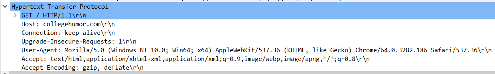
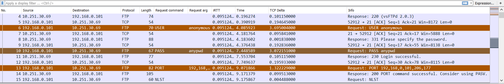
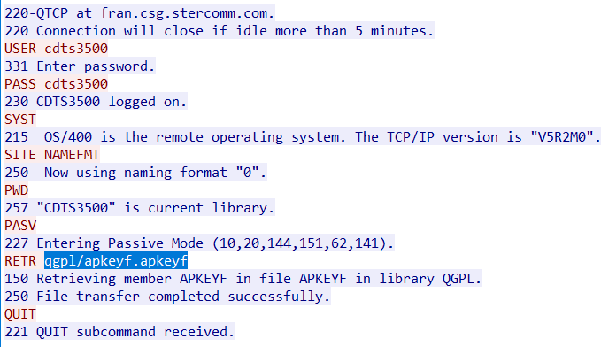
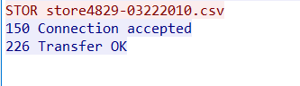
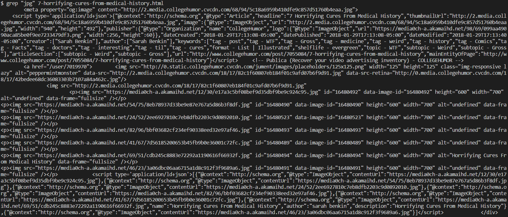
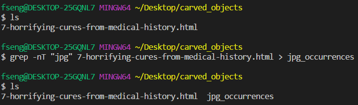

## Unit 2.2 Lesson Plan - UnPACKing the Wire

By now, you've gotten lightning fast at flitting through capture files. Finding usernames, passwords, the sites students are *not* paying attention on—all old hat to you.

Trouble is, your teammates aren't half as quick: What takes you seconds to find takes them hours to see. If they could use capture and display filters as effectively, they'd keep pace. But you have too many cases to respond to teach them how.

Instead of teaching them, you settle on finishing up your work for the day, but saving all your filtering setups along the way as **profiles** for your team to use. At the end of the day, you'll be done with your bug reports, *and* the whole team will be able to work faster.

You'll be saving your team from having to learn how to:

- Create columns to display finer details of captured packets
- Automate configuration with profiles
- Identify latency issues at a glance
- Create custom coloring rules

Lucky them, having *you* to know all that stuff.

---

## Everyone Do: Making Wireshark Do Work (0:10)

- Welcome students to class, and briefly review what we learned in our last session:

  - We use Wireshark to intercept and inspect data traveling on the network. We call these pieces of data **packets**, and Wireshark is a **packet sniffer**.

  - These packets give us a complete picture of the activity on a network, including records of who was browsing which sites; what files were downloaded; how fast or slow communications were; etc.

  - We can use information in these packets to identify suspicious activity, recreate peoples' browsing sessions, etc.

- Last class, we used Wireshark to find peoples' passwords and find out which articles they were reading.

- These are common tasks for analysts to perform, and we were successful, but our methods were a bit manual: There was a lot of scrolling and "eyeballing" involved. This isn't a feasible approach for captures with millions of packets (not uncommon).

- Fortunately, we can use Wireshark's more advanced filtering and coloring features to make it even easier to find packets of interest.

- In addition, we'll learn more about common protocols, and how to actually retrieve files that people have sent over the wire!

- All in all, today's objectives are to be able to:

  - Create columns to display finer details of captured packets
  - Automate configuration with profiles
  - Identify latency issues at a glance
  - Create custom coloring rules

- Let's get started by exploring the columns we see in Wireshark.

- Launch Wireshark, and begin to capture on WiFi. Encourage the class to follow along.

- Wireshark displays the same set of columns by default. From left to right:

  - **No**, the number of the packet in the capture

  - **Time**, how many seconds after starting a given packet was captured

  - **Source** and **Destination**, the source and target devices for a packet

  - **Protocol**, the protocol that Wireshark believes a packet implements

  - **Length**, the size of the packet in bytes

  - **Info**, additional, human-readable information about the packet

- This is all very useful information to have at a glance, but there's a lot of other information we might want our hands on.

  - Yesterday, we searched for users' password data. It would have been helpful to have a column that told us if a packet contained form data.

- Wireshark allows us to customize the columns it displays, and save different combinations of them in **configuration profiles** that we can turn on and off easily.

- There are two ways to add columns to Wireshark:

  - By right-clicking on the data you want to see in a column, and clicking **Apply as Column**.

  - By manually adding a column through the **Preferences** dialogue.

- Most of the time, you'll use the first method. The second is useful if you know exactly what information you want your column to display, but can't find a packet that contains it.

### Profiles & the Right-Click Method

- Before we start adding columns, explain that Wireshark keeps track of which columns you want displayed, and saves them in a configuration profile.

- This lets us design different configuration profiles for different purposes, and easily switch between them.

- To create a new profile, right-click the profile tab in the (very) bottom right of Wireshark, and click **New**.

  

- Name the profile **URLs**, then click **Ok**.

- Next, we'll add a column that shows us the URLs of websites users visited, instead of just their IP addresses, whenever Wireshark can figure out what the URL is.

- With your capture still running, navigate to [College Humor](http://www.collegehumor.com/), and click on any article.

- Return to Wireshark, and stop the capture.

- The URL we use to refer to a website, e.g. `www.collegehumor.com`, is also called a **domain name**.

- When our browser sends a request for a site's resources, it tells the server what kind of request it's making (GET, POST, etc.), and provides the name of the file it wants (e.g., `/about.html`, etc.).

  - Spot check: Ask a specific student what the difference between a 'GET' and a 'POST' is.

- HTTP requests include extra information, called metadata. This is sent in the form of **headers**. Servers use this information to help process client requests.

- Every HTTP request contains a header called **Host**, which contains the domain name of the site the user wanted to hit.

- We can both use this to filter our traffic, and add it as a column to help us find interesting packets easily.

- In the display filter toolbar, type: `http.host contains "college"`.

  - This should filter out only traffic to/from College Humor.

  

- This definitely reduced the number of packets we see, but didn't make things a whole lot easier to understand. The Destination and Source columns are still pretty unreadable, since they use IP addresses instead of names.

- Students should still be following along. Pause for questions at this point.

- Click on any of the GET packets, then on its **Hypertext Transfer Protocol** line.

- Point out the line containing GET.

  - Explain that this part of the request tells the server: "I want to GET the file on your machine that lives at the path `/`. Also, I'm using HTTP version 1.1 to make this request."

  - When a browser asks for the file that lives at `/`, it's short for asking for the file: `/index.html`.

  - This line contains all the main information of the request: The **method** (in this case, GET); the file we want (in this case, `/`, or `/index.html`); and the version of HTTP we're using (here, 1.1).

  - Note that the `\r\n` is simply a 'newline' character.

  

- Below this line comes all the metadata: those **headers** we mentioned before. Each has the form **Name of Header**: **Value of Header**.

- Point out the **Host** header. It has a familiar-looking value that reads like a URL.

- Right-click the host header, and click **Apply as Column**.

- Point out that this adds a new column, called **Host**, which contains the value of each packet's host header.

  

- We can do this with any piece of information in the packet detail pane and Wireshark will gladly add it as a column.

- Point out that Wireshark will also remember that we've added this column to our URLs profile, which we can apply later.

- Switch back to the default profile by clicking on **Profiles** and selecting **Default**. This demonstrates that we can use different profiles for different purposes.

### Adding Columns Through the Preferences Pane

- Sometimes, you know exactly what information you want a column to display, but you don't have a packet that contains it.

- In this case, you can define it manually through the preferences column.

- Switch back to our "URLs" profile and right-click the **Host** column, and click **Remove This Column**.

- Click **Edit** -> **Preferences** -> **Appearance > Columns**, and then click **+**.

- Change the title to **Host**, the Type to **Information**, and the Fields filter to `http.host`.

  - The fields filter uses the same syntax as a display filter, and indicates which information about a packet to extract and display in a column.

- This yields the same result as before.

  

- Adding columns and saving them as profiles can drastically streamline packet analysis.

### Protocols

- We just looked a bit more in-depth at HTTP (the HyperText Transfer Protocol), but what do we mean by protocol here?

  - Networks transfer data a variety of ways, dependent on the data itself and the circumstances around how the data is being communicated. E.g., web data is different than email data (different data), and encrypted web traffic is different than unencrypted web traffic (different circumstances).

  - Different data and circumstances imply different rules and formats for handling things. **Protocols** define these different rules.

- Some common protocols we'll be working with today include:

  - HTTP - for transferring unencrypted web data

  - FTP - for transferring unencrypted file data

  - SMTP and IMF - for email

  - TCP - for raw data

- Don't worry much about learning all the details of all of these all at once. We'll touch on important aspects of each protocol gradually, and revisit them in depth after developing an intuition.

  - In the meantime, encourage students to look up and skim documentation on any protocols we work with in class.

## Students Do: Form Data Scavenger Hunt (0:20)

- So, let's put configurations to practice to speed things up a bit for us.

- Explain to students that it's time to get some practice building configurations for a few specific use cases.

- Send the students the capture files and the instructions for the activity.

- **Files**: [Captures](Activities/01-Stu_Scavenger_Hunt/Captures)

- **Instructions**: [README.md](Activities/01-Stu_Scavenger_Hunt/README.md)

- Be sure to walk around and provide support to students during this exercise.

## Everyone Do: Review Activity (0:10)

### Finding Form Submissions

- First, let's create a profile for form submission data.

- Open [http_post.pcapng](Activities/01-Stu_Scavenger_Hunt/Captures/http_post.pcapng).

- Add a new profile called **HTTP Form Data**.

- Remind students that POST requests contain data users want to send to the server.

  - POST requests come in different types. One type contains form data, which has `Content-Type` `application/x-www-form-urlencoded`.

  - To filter for packets containing form data, use the display filter: `urlencoded-form`.

    

- Select the one POST packet, and right-click the **HTML Form URL Encoded** - frame. Click **Apply as Column**.

  - This adds a column which will contain a check for packets that contain form data, and empty otherwise.

  

  

- We can use this profile in any capture file to quickly isolate any form data being sent on the network! Think about everything you enter in those text boxes on websites...

### Finding Email Attachments

- Open [mail_attachments.pcapng](Activities/01-Stu_Scavenger_Hunt/Captures/mail_attachments.pcapng).

- SMTP stands for **S**imple **M**ail **T**ransfer **P**rotocol. It's used to transfer email from users to servers.

  - SMTP allows users to send both simple text and file attachments.

- For now, we'll create a profile that allows us to swiftly locate attachments.

- Add a new profile called **SMTP Attachments**.

- SMTP uses **MIME multipart** to transfer attachments.

  - MIME multipart is a format for encoding non-text file attachments, such as audio; video; etc.

- To display only MIME multipart traffic, use the filter `mime_multipart`. This would be a good time to point out the autocomplete feature, if you haven't already.

  - The packets in the capture pane all have attached data.

  

- Click on one of the packets.

- In the packet details pane, expand the **Internet Message Format** frame.

  - Right-click the **MIME Multipart Media Encapsulation** frame, and click **Apply as Column**.

  - This adds a boolean indicator as to whether a given packet contains multipart MIME data.

- Expand the **Unknown Extension** frame right above, and add both **Type** and **Value** as columns.

  - This lets us see the value of the **Content-Disposition** header. The value contains the **filename**.

  - A value of **inline** indicates that the attachment should be displayed within the email application. A value of **attachment** indicates that it should be downloaded to the user's device, instead.

- We can now simply apply this profile to a capture to find attachments in SMTP traffic.

- This is can be used to see if someone is attaching malicious-looking files in an email! (e.g. a `.exe` file)

### Finding FTP Passwords

- Open [ftp_transfer.pcapng](Activities/01-Stu_Scavenger_Hunt/Captures/ftp_transfer.pcapng).

- Explain that FTP stands for **F**ile **T**ransfer **P**rotocol. It's used to transfer files between devices.

- Click on the Profiles tab in the bottom-right corner, then click **New**.

  - Add a new profile called **FTP Passwords**.

- FTP requires users to provide a password to make file transfers.

- The correct filter for finding FTP packets containing password data is: `ftp.request.command == "PASS"`, or `ftp.request.command contains "PASS"`.

  - This file contains just one packet with an FTP password.

- To make FTP captures easier to analyze at a glance, we can add the request command and its value as columns.

  - Click on the password-containing FTP packet.

  - Click on the **File Transfer Protocol** frame.

  - Click the `PASS` field.

  - Right-click `Request command`, then click **Apply as Column**. Do the same for `Request arg`.

  

- We can use this profile with any capture to isolate FTP packets containing passwords.

- Close out this section by saying that adding columns allows us to much more quickly identify information about packets at a glance, especially with packet traces with much variability.

- Take a moment for questions before moving on.

## Everyone Do: Coloring Rules! (0:10)

- While adding columns definitely makes understanding the specifics of our communication easier, we can do even better by updating Wireshark's coloring rules to make them stick out like a sore thumb.

- Updating coloring rules is straightforward. There are two main methods: Right-clicking, and using the main menu.

### Right-Click Method

- Often, you'll want to add coloring rule based on something you see in the packet details pane.

- For example, let's flag all POST data with an orange color to indicate they merit closer inspection.

- Demonstrate right-clicking you want to colorize on, and select **Colorize** -> **Colorize With Filter** -> **New Coloring Rule**.

- This brings up a pane with coloring rules for different kinds of packets.

- We can change the colors by clicking on **Foreground** and **Background** buttons at the bottom of the window, and change the name of the coloring rule by double-clicking the placeholder.

- The filter contains the display filter that Wireshark uses to apply each coloring rule.

  

### Through the Menu

- Explain that the second way to do it is through the menu. This is beneficial for similar reasons as being able to add columns through the menu.

- Show that we can access the same coloring menu by clicking **View** -> **Coloring Rules**.

- Ask students why you might want to do it this way.

- Explain that in the case when you don't want to dig through and find the example before applying colors, or you can't find what you're looking for beforehand (or it hasn't happened yet in a current trace).

- It's also useful if you want to just quickly look at and modify existing rules - you don't have to go to where they're applied to modify them.

- Jump back to the SMTP example (File -> Open Recent), and ask students how they'd make all communications with attachments yellow (since they're worth a more in-depth look).

- Demonstrate the steps of making the communications with attachments yellow live, and show the outcome.

  

## Students Do: Better Profiles with Coloring Rules (0:10)

- So, time to apply some color filters of our own to flag suspect network traffic.

- Send the students the capture files and the instructions for the activity.

- **Files**: [Captures](Activities/02-Stu_Colors/Captures)

- **Instructions**: [README.md](Activities/02-Stu_Colors/README.md)

## Everyone Do: Review "Better Profiles with Coloring Rules" Activity (0:10)

- Open [http_with_delays.pcapng](Activities/02-Stu_Colors/Captures/http_with_delays.pcapng).

- To add a new coloring rule, click **View** -> **Coloring Rules**, and then click **Add**. Enter the name **Large Deltas** for this column.

- For the filter, apply: `frame.time_delta > 1 || tcp.time_delta > 1`.

- Select a color of your choosing for the packet background.

  

- Next, we'll create coloring rules to call out FTP PASS requests.

- Open [ftp_image.pcapng](Activities/02-Stu_Colors/Captures/ftp_image.pcapng).

- Apply the profile we built earlier to the new packet capture file! Already saving time.

- Identify one of the PASS request packets.

- Click on the packet, and expand the **File Transfer Protocol (FTP)** line.

- Right click the **Request-arg** line, and click **Colorize with Filter** -> **New Coloring Rule**.

- Change the filter to just: `ftp.request.arg`.

- Set the background color to red, to indicate this is high-priority data.

- Demonstrate the effect this has on Wireshark's display.

  

- This highlights all FTP requests the same way. If you want, you could instead highlight different request types by using filters like: `ftp.request.command=="PASS"`.

- Explain that improving readability and reducing time to finding problems can increase your effectiveness with the tool significantly. Ask if they have any questions, and then dismiss them for break!

---

### BREAK (0:10)

---

### Instructor Do: HTTP Objects & File Carving (0:15)

- We've gotten pretty good at spying on what people are doing, and identifying any files they're transferring. The natural next question is can we peek *inside* those files?

- We can indeed! To do that, we have to download the files themselves.

- Tell students they can follow along if they like, but to not worry if they miss a step or fall behind - they'll get practice!

### Retrieving Files Transferred over FTP

- Load [03-Ins_File_Carving/Captures/iseries.pcap](Activities/03-Ins_File_Carving/Captures/iseries.pcap).

- We identified a user's username and password information, which is significant. A serious analyst would go one step further by saving the file they transferred.

- Remind students that Wireshark captures *all* of the raw data it sees on the network. In this case, that includes all the raw data sent to and from the FTP user's computer during the file upload.

  - Since this data lives in our capture file, all we have to do to "steal" the file this user uploaded is find all the packets that got sent to upload it, and "carve" the file data out of them.

- Search for FTP in the display filter bar.

- Point out that there are always many packets involved in client/server exchanges.

- FTP goes through a number of steps: initiating the connection, choosing the port to communicate over ("which apartment number I know to address"), and then sending commands to login, print information, and retrieve/send files.

- Show the ports and this back and forth by viewing the ports in the Transmission Control Protocol, adding columns for them (in your ftp profile!), and then briefly walking through the many commands issued.

  

- Each of these is requests/response cycle that often involves many packets. But, all these packets are related, since they're participating in a sequence of FTP request/response cycles between the client and the server.

- A series of related exchanges that, taken together, form a single coherent communication is called a **stream**, or **conversation**.

- Most of the time, we're more interested in studying streams than individual packets, since they let us look at only related groups of packets, rather than packets and random noise.

- Wireshark lets us trace these groups of packets easily.

- Right-click on any FTP packets containing a USER or PASS request, then click **Follow** -> **TCP Stream**. Then, explain the following:

  

  - A TCP Stream is a stream of packets, more properly called **segments**, in which actual raw data is transferred from computer to computer.

  - When we send an HTTP request, it can contain a GET message; headers, etc. The format for all that information is defined by a protocol, and it's all represented as a string.

  - To actually get that string to a different computer, we need an entirely different set of tools, which TCP provides.

  - Many protocols, including FTP, use TCP to actually send their data to another computer.

- One of the things TCP does is break up data into manageable chunks. Then, it figures out how to send these chunks across the network.

  - This series of chunks gets reassembled on the other side after they've all been received.

  - This series of chunks is where the name stream comes from.

  - Since Wireshark captures this stream, we can extract transferred files by simply saving the right parts of it!

- Right-click on any FTP packets containing a USER or PASS request, then click **Follow** -> **TCP Stream**, you should see a pane containing a series of blue and red blocks of text.

- Explain that each line represents a request from the client (blue) or a response from the server (red).

  - Each line contains data extracted only from the packets pertinent to this exchange. Note that it includes no data from any of the other packets.

- This gives us a full picture of the sequence of messages two computers exchange when transferring files via FTP.

  - First, the user sends a USER request, which the server responds to with status code 331 and a request for a password

  - The user then sends a PASS request with the password, and the server responds with 230 and a message that the login was successful.

  - Etc., etc. The sequence of messages gives a clear picture of what a typical FTP communication looks like.

    

- Point out the line with RETR at the bottom.

- RETR is short for **retr**ieve. This is a request from the user to download a file from the server.

- Right after the RETR request, the server retrieves the resource for the client.

  - With FTP, the computers open *another* communication channel, which they use to transfer the actual image data.

  - They notably do *not* transfer the file data over the same channel they exchange requests/responses on.

- Since the file transfer itself takes place in a different TCP stream entirely, we'll have to find that one to download the image.

- Fortunately, this is pretty easy. Click on the line that says `150 Retrieving member APKEYE in file APKEYE in library QGPL`. This highlights one of the packets in the capture pane.

- Close the TCP stream, and delete the display filter.

- Point out that, just below the packet that opened the binary connection, we see packets annotated with the protocol FTP-DATA. These are the packets that contain the actual file data for the file.

  

- Right click the FTP-DATA packet, and follow its TCP stream.

- This brings up a pane with what appears to be a product info sheet.

  

- This is the file transferred via FTP. We can save it by simply clicking the **Save As** button in the bottom of the pane, and using the filename we saw in the other conversation (`apkeyf.apkeyf`).

- The same technique works for images, CSVs, etc., which we'll carve out in the next activity.

### Retrieving HTTP Objects

- Carving files out of web browsing sessions will give us a great idea of how actors are behaving on our network. Fortunately, it's even easier than saving data transferred over FTP.

- Open [03-Ins_File_Carving/Captures/http_sample.pcapng](Activities/03-Ins_File_Carving/Captures/http_sample.pcapng).

- This file contains traffic to/from `www.bbc.com`, `www.collegehumor.com`, and `www.foxnews.com`.

- We can extract HTTP objects by simply clicking **File** -> **Export Objects** -> **HTTP**.

- This raises a list of all files transferred over HTTP in the capture.

- We can save individual files by selecting them and clicking **Save**, or we can save everything by clicking **Save All**.

- Bear in mind: Files transferred over HTTPS will *not* show up in this list!

  

## Partners Do: Carving Files (0:20)

- So let's practice pulling actual files from communication! Over both FTP and HTTP.

- Send the students the capture files and the instructions for the activity.

- **Files**: [Captures](Activities/04-Par_File_Carving/Captures)

- **Instructions**: [README.md](Activities/04-Par_File_Carving/README.md)

## Everyone Do: Review Activity (0:15)

- Take a step back for a moment. You just, out of the nebulous huge amount of data traveling around on a network, filtered all of that down to find the communication associated with a specific set of packets, and then reconstructed that torn-up stream of communication back into files so that you could see what the user was doing and looking at.

- That's ... pretty cool. You thought you were a sophisticated spy yesterday. The packets being communicated on the network now bend to your will!

- So let's go through those previous examples, starting with the FTP transfers.

- Open [04-Par_File_Carving/Captures/ftp_transfer.pcapng](Activities/04-Par_File_Carving/Captures/ftp_transfer.pcapng).

- Last time, we found user's login credentials. Now, we can steal  their data, as well.

- Apply the FTP password profile we created earlier.

  - The extra FTP columns make it easy to identify interesting packets at a glance.

  

- Click on the packet with the user's password information. Right click, then click **Follow** -> **TCP Stream**.

- This reveals the entire FTP exchange between the client and server, including the download of the file data itself.

- Scroll all the way to the bottom of the stream. Point out the third line from the bottom, which reads: `STOR store4829-03222010.csv`.

  - This line is a command for the server: "Hey, I want you to **stor**e the file called `store4829-03222010.csv`."

  - After this command, the computers open a connection and transfer the file data.

  - Since file data is different from command data, like `USER`, `PWD`, etc., this transfer lives in a separate TCP stream.

  

- Wireshark also captures this stream. To find it, click on the the line with the `STOR` command in the TCP stream. Note that the highlighted in the packet list pane changes.

  - Note that this is packet No 64.

- Click out of the TCP stream. Scroll down to Packet 64, which issues the `STOR` request.

- Remove the filter. Note that two packets below, we see a packet whose protocol value is **FTP-DATA**. This is the stream where we transfer the actual file data we're interested in.

  

- Right click packet 66, and click **Follow** -> **TCP Stream**.

  

- This opens a pane similar to before, this time containing what looks to be CSV data.

- Click **Save As** in the bottom of the pane, and save the file with the same name you saw in the `STOR` request: `store4829-03222010.csv`.

- Find the file with your file explorer, and open it with whichever program on your computer reads CSVs (likely Excel).

- We can use the same tactic to extract images transferred over FTP.

- Open [ftp_image.pcapng](Activities/04-Par_File_Carving/Captures/ftp_image.pcapng).

- Remind students that we can search for `ftp.request.command==STOR` to look for `STOR` requests.

  - Remind students that `STOR` requests are used for uploads.

- This time, the search turns up no packets. This is because, in this file, the user is *downloading* a resource, not uploading one.

- Downloads use a different request command: `RETR`, short for **retr**ieve.

  

- Update the filter to search for the "RETR" command - `ftp.request.command=="RETR"`.

- This turns up a single packet, whose TCP stream we can follow by right clicking and selecting **Follow** -> **TCP Stream**.

  

- Click the `RETR` request, and close out of the stream. Note that this highlights packet No 34.

- Return to the packet list, remove the filter, and look below packet 34 for the first packet labeled with protocol FTP-DATA. Follow the TCP stream.

- Note that the data in this pane is much less human-readable than it was last time around.

  

- Point out that, at the top, we can see human-readable annotations.

  - The first letters in the data are `JFIF`. This stands for **J**PEG **F**ile **I**nterchange **F**ormat.

  - Note that we can also tell that someone edited this image with Adobe Photoshop CS2, on a Mac, just before midnight, on October 4th, 2008.

  

- Near the **Save As** button in the bottom, change the display format from ASCII to Raw. Then, click **Save As** to export the image. Use the name `pantheon.jpg`.

- Find the file wherever you saved it, and open it up.

  

### Carving HTTP Objects

- Retrieving data transferred via FTP is pretty straightforward, as long as you can find the appropriate TCP streams, which is relatively easy to do using display filters. Retrieving data from web browsing is even easier.

- Open [04-Par_File_Carving/Captures/http_collegehumor.pcapng](Activities/04-Par_File_Carving/Captures/http_collegehumor.pcapng).

- We've been told told that the user was reading an article about horrifying medical cures, so we should start by searching for frames containing any of these strings, let's filter for URLs that contain these words: `http.request.uri contains "cure"`

  

- This narrows it down, but there's still a lot of noise. Let's also get rid of anything that's not an HTML document with: `http.request.uri contains "cure" and http.accept contains "html"`.

  

- This does it. Note the first packet, which contains a get request for an article with the name: `7-horrifying-cures-from-medical-history`.

- Click on **File** -> **Export Objects** -> **HTTP**.

  

- Click on **Content Type** to group and sort objects, then scroll down until you see `text/html`.

- Look at the **Filename** column. Scan until you see the resource with the name of the article in it. Select it, and click **Save**.

  

- Navigate to the directory where you saved the file, and open it with VS Code (any text editor will do).

- This is the actual code for the web page the user visited, at the time they visited it. We can look at it to find the names of the images they saw, too.

- Use `Ctrl+F` or similar to find the "word" `jpg`. You'll find 11 jpg images. Save the filename for each one in a separate document.

  - Note that one of them, `82c1f60807eb184f01c9afd07b6f9d91.jpg`, has the `alt` text `peppermintmonster`. Maybe this is a hint!

  

- Switch back to Wireshark, and look at the list of HTTP objects again.

- Click **Filename** to sort by Filename.

- Point out that we can find the file named `82c1f60807eb184f01c9afd07b6f9d91.jpg`. Click, save, and open it. Is it what you expected?

  

- Switch back to the HTTP objects list. Click **Content Type**, and find the group of `image/jpeg` resources.

- Scan the filename list. Point out that there are several files you can't find—in particular, none of:

  - `https://media0ch-a.akamaihd.net/12/30/e17a3c5bf08bef9d35dbf9be9c924c95.jpg`
  - `https://media0ch-a.akamaihd.net/54/75/8eb78937d33be9e87e767a5d86b3f8df.jpg`
  - `https://media0ch-a.akamaihd.net/24/52/2ee6927810c7eb8dfb2203c9d0892010.jpg`
  - `https://media0ch-a.akamaihd.net/82/96/bbf03682cf234ef90338eed32e97af46.jpg`
  - `https://media0ch-a.akamaihd.net/41/67/7d56185200653b45fb9b0e36001c72fc.jpg`
  - `https://media0ch-a.akamaihd.net/69/51/cdb245c8883e72292a1190616f66932f.jpg`
  - `https://media0ch-a.akamaihd.net/46/23/3a06dbc06aa6715a1d8c912f3f9689a6.jpg`

- These links all have something in common: They're transferred over HTTP**S**, not HTTP! This means we *can't* see them in Wireshark's HTTP objects pane, because they're *not* HTTP objects.

  - This is frustrating for analysts, but the fact that we can "hide" traffic like this is what allows for safe banking, etc.

- In this case, if we wanted to retrieve the images, we could do so with `curl`, as with `curl -LO https://media0ch-a.akamaihd.net/12/30/e17a3c5bf08bef9d35dbf9be9c924c95.jpg`.

  

### Instructor Do: Finding Text with grep (0:05)

- Manually searching this HTML file for JPG images works fine for small files like ours, but doesn't scale well.

- Unfortunately, Wireshark can't perform this kind of reconnaissance for us automatically. But, we can use standard command-line tools to do it easily.

- Bash comes standard with a tool called grep. Grep is essentially a more powerful version of the find utility most GUIs expose.

- Open your terminal, and navigate to the directory containing the HTML file you downloaded through Wireshark.

- Run `ls` to show that we're right next to the HTML file we inspected earlier.

  

- Run: `grep "jpg" 7-horrifying-cures-from-medical-history.html`. This reads the entire HTML file, and finds every line that contains the text `"jpg"`.

  

- This is pretty unfriendly output. We can make it friendlier by telling grep to include the number of every line that contains `"jpg"`. Run: `grep "jpg" 7-horrifying-cures-from-medical-history.html`.

  - This appends a number to every line, but is still not particularly readable.

- We can do even better by adding a tab between the number and the rest of the line. Run: `grep -nT "jpg" 7-horrifying-cures-from-medical-history.html`.

  

- We can do this for any string and any text file, making grep one of the most powerful tools in students' command-line arsenals.

### Partners Do: grep-fu (0:10)

- Grep is a very powerful, very versatile tool. It comes with many options, and can perform most basic tasks around searching for text.

- The best way to become familiar with its major switches is to simply use it. The next activity is an opportunity to expand on what you saw in the demonstration.

- Next time you have a carved HTML file to inspect, you'll know exactly how to tell what's inside...Without even opening it.

- **Instructions**: [README.md](Activities/05-Evr_grep_fu/README.md)

### Everyone Do: Review Activity (0:05)

- Return to the directory containing your copy of `7-horrifying-cures-from-medical-history.html`. Run the command from before, but include the redirection: `grep -nT "jpg" 7-horrifying-cures-from-medical-history.html > jpg_occurrences`.

- Running `ls` reveals a new file, called `jpg_occurrences`.

  

- Run `wc -l jpg_occurrrences`. It should output 11. This is what we found earlier through manual methods.

- The `>` operator, which is called a **redirection** operator, takes the output of `grep` and puts it into a file, instead of printing it to the screen.

  

- Next, open up the HTML file, scroll to the bottom, and add a line with the word: `NONEXISTENT_IMAGE.JPG`.

  - Since grep looks for all occurrences of the string `jpg`, it should find this one, too...In principle.

- Re-run the grep command from above; overwrite `jpg_occurrences`; and re-run `wc -l jpg_occurrences`. It should still print 11, even though we've added a line with the word `JPG`!

  - Ask the class if they can explain why this happened.

- Point out that "jpg" and "JPG" are **not** the same. They're the same letters, but not the same case.

- Our results indicate that grep is case-sensitive by default. We can  change this by adding `i`, which stands for "case **i**nsensitive", to our series of flags: `grep -inT "jpg" 7-horrifying-cures-from-medical-history.html > jpg_occurrences`.

- If we re-run `wc -l`, we'll now count 12 jpg occurrences, as expected.

  

### Everyone Do: Latencies (0:10)

- If you ever export all the HTTP objects from an industrial-sized network capture, you'll end up with quite a large file—easily gigabytes large.

- This gives a good indication of just how much data users are sending across the network.

- When one computer transfers data over the wire, it uses up some of the capacity, or **bandwidth**, of that wire.

- If enough devices try to send a lot of data at the same time, there won't be any bandwidth left, and the network will slow down.

- Users would notice this in the form of slower downloads and browsing. We would notice this in our captures because we would see start to see large amounts of time between packet transmissions.

- In addition to data about endpoints, hosts on the network, downloaded files, etc., Wireshark captures such information about how long it takes data to traverse the network. We can use this data to identify particularly slow traffic, and troubleshoot issues with bandwidth, etc.

- The amount of time it takes for a device to respond to a communication from another is called **latency**.

  - High latency implies a long delay. High latencies are annoying for users, and can indicate serious problems on the network.

### Wireshark's Time Column

- By default, Wireshark's **Time** column displays the number of seconds that passed between the beginning of the capture and the receipt of a given packet.

- This is useful for creating a timeline of when packets came in, but it doesn't let us look at temporal patterns between related packets.

- To fix this, we can reconfigure Wireshark to display the amount of time that passed since the previously displayed packet.

- Click **View** -> **Time Display Format** -> **Seconds Since Previous Displayed Packet**.

  

- In addition, we'll want to enable Wireshark to display more granular information about TCP packets.

- Press click **Edit** -> **Preferences** to open the preferences pane.

  - Open **Protocols** in the left column, and scroll to TCP.

  - Enable **Calculate Conversation Timestamps**.

  

- Click out of the pane, and select a TCP packet.

- Expand its **Transport Control Protocol** frame, and scroll to the bottom. Demonstrate the new `[Timestamps]` information.

  

- There are three main types of latency: Client, Server, and Path (or Round-Trip Time) latency. Wireshark's **Time** column makes these fairly easy to spot.

### Client Latency

- **Client latency** occurs when a long time passes before a client makes a request.

- For example, if you open a website like `www.bbc.com`, and browse for 30 seconds before clicking an article, it will look like it took forever for the client to send a request. This is client-side latency.

- If caused by the user, this kind of latency is nothing to worry about.

- In capture files, this look like a long delay before a user requests a resource. E.g., a long delay before a GET request (with HTTP) or a USER request (with FTP).

- Open [client_latency.pcapng](Activities/06-Ins_Latency/client_latency.pcapng).

- To get a full picture, you might want to see both total time elapsed and time since previous frame.

- Add a column for **Time since previous frame in this TCP stream** by selecting a TCP packet; expanding its **Transmission Control Protocol** frame; expanding **Timestamps**; and right-clicking **Time since previous frame in this TCP stream** to **Apply as Column**. Rename it **TCP Delta**.

- Change back the original Time column's settings: **View** -> **Time Display Format** -> **Seconds Since Beginning of Capture**

- Point out the GET request is sent 1.3 seconds after the previous packet. Since GET requests are sent by the *client* to the *server*, this indicates that there was a delay on the client's side.

  

- Point out that, in the info column, the packets above this GET request have: `SYN`, `SYN, ACK`, `ACK`.

  - We'll talk about this more in the next class, but explain that this sequence of three packets indicates that two devices have opened a connection with one another. It is called the **three-way handshake**.

  - Client requests will follow this handshake.

### Server Latency

- **Server latency** occurs when a server responds quickly to an initial client request, but takes a long time to actually fulfill that request.

- This can occur when the server tells a client it's received the request, but then has to do a lot of work to actually get the resource—e.g., hit a database; do a heavy computation; etc.

- In Wireshark, this looks like a client request that the server immediately acknowledges, but takes forever to fulfill.

- Open [06-Ins_Latency/server_latency.pcapng](Activities/06-Ins_Latency/server_latency.pcapng).

- In this image, the client makes a GET request, which the server immediately acknowledges it's received (the **ACK**nowledged response just after the GET).

  - It takes almost a full second for the server to actually send its response, though. This is an example of server latency.

  

- Remind students that, in the previous example, we saw three packets that started a connection: `SYN`, `SYN, ACK`, and `ACK`.

  - This pattern always indicates a connection has been opened.

- When we see packets with `ACK`, it indicates that the device receiving data has in fact received that data, and is confirming its receipt with the server.

- When we see the server quickly send an ACK packet, we know it's *able* to respond fast: The network can support it.

  - If the packets containing the actual data come a long time after this ACK, it's because the server had to do something to get the data.

  - Thus, *server* latency.

### Path/RTT Latency

- **Path latency**, also known as **Round Trip Time latency**, occurs when it takes a long time for a server to acknowledge a client's request in the first place.

- The difference with the above is that, instead of the server acknowledging fast but being slow to actually respond, the server takes forever to even send its ACK response.

- This could happen because you're connecting to a computer on the other side of the world, for example. Demo <http://www.cloudping.info/> - ping times for servers in different parts of the world. Your quickest ping will probably be the server physically closest to you.

- Open [06-Ins_Latency/path_latency.pcapng](Activities/06-Ins_Latency/path_latency.pcapng)

- Click on packet 4. This is a GET request for a resource.

  - Point out that packet 5, the server's acknowledgement that takes over a second to return (forever in the world of computers).

  

- Those are the three types of latency! Client - slowdowns on your machine, Server - slowdowns on the machine from which resources are being requested, and Path - slowdowns in the communication path itself.

#### Coloring Rules for Latencies

- It's not always easy to spot high-latency packets in Wireshark. We can make it a little easier by implementing special coloring rules for the different kinds of latency.

- We'll create one rule for spotting long TCP time deltas, which will help us spot client/server latency. We'll also create a rule that colors packets with long round-trip times, for identifying path latency.

- This time around, we'll define our coloring rules manually. Click **View** -> **Coloring Rules**. 

- Start by creating a new profile, called **Latencies**.

- Click the `+` in the bottom-left corner to add a new coloring rule.

  

- Name the rule **Client/Server Latency**. Set the filter to: `tcp.time_delta >= 1`. This will highlight any packets that arrived one second or more than the packet before.

  

- Add another rule, and name it **Path Latency**. Set the filter to: `tcp.time_delta >= 1 and tcp.syn == 1 and tcp.ack == 1`. This highlights servers that are slow to respond to client requests to open a connection.

  

- These rules will highlight slow packets in the Wireshark capture pane.

  

### Partners Do: Finding Latency Issues (0:15)

- Now that we know the different kinds of latency we'll have to manage on our networks, let's take a swing at identifying them in some capture files.

- Send the students the capture files and the instructions for the activity.

- **Files**: [07-Par_Latency/Captures](Activities/07-Par_Latency/Captures)

- **Instructions**: [07-Par_Latency/README.md](Activities/07-Par_Latency/README.md)

- Be sure to walk around and provide support to students during this exercise.

### Everyone Do: Review "Finding Latency Issues" Activity (0:10)

- Open [07-Par_Latency/Capturesweb_traffic.pcapng](Activities/07-Par_Latency/Captures/web_traffic.pcapng).

- Click **View** -> **Time Display Format** -> **Seconds Since Previous Displayed Packet**. This changes the **Time** column to display the number of seconds between the highlighted and the previous packet.

- Sort the packets based on this Time column. The longest delay is 2.8 seconds. This is forever on network time scales, but the fact that it involves a GET request means we shouldn't worry.

  - The browser sends a GET request when the user wants a resource. In this case, the user probably loaded up a web page, then looked at it for 2.8 seconds before requesting something else.

- Open [07-Par_Latency/Capture/http_pcapr.pcapng](Activities/07-Par_Latency/Captures/http_pcapr.pcapng).

- Point out that this method does *not* separate packets based on stream.

  - In other words, this method tells us how long it took for a given packet to arrive after the previous packet, whether that previous packet is related or not.

  - We're usually more interested in identifying whether the packets in a given *stream* show strange latencies.

  - Click on a TCP packet. Right click on **Time since previous frame in this TCP stream**, then click **Apply as Column**. Rename the column to **TCP Delta**.

- Sort on TCP Delta.

- The first 6 packets show very high latency, but these delays are normal.

  - The delays for the GET requests are probably due to the user browsing the page before clicking on something to request new data.

  - The delays for the `FIN, ACK` packets are because browsers are lazy about closing connections when a user closes a tab. Users don't see this delay, since the tab is already closed.

- The 1.8 and 1.7 second delays are worrisome, though. Servers should ideally respond in less than a second—almost 2 seconds is always a problem.

  

- In this case, the latency is due to the fact that the site the user was browsing, PCapr, has to perform a database query before responding to the user. This takes awhile, and we notice it in the capture.

- Finally, open [http_with_delays.pcapng](Activities/07-Par_Latency/Captures/http_with_delays.pcapng).

- Sorting on TCP Delta reveals some extreme delays: Up to 118 seconds!

- Here, the 118 second delay isn't a problem, because it's of the FIN, ACK variety. But point out the big delays on some of the OK responses: 29 seconds, 17 seconds, etc.

  - Isolate these by filtering for `http.response.code == 200`.

  

- This is an example of high **server latency**, which users would notice as awful website performance.

### Instructor Do: Recap and Dismiss (0:05)

- Tell students that we'll stop here for today.

- Remind them that they should now not only be masters at detective work with wireshark, but also be able to:

  - Create columns to display finer details of captured packets

  - Automate configuration with profiles

  - Identify latency issues at a glance

  - Create custom coloring rules

- Ask them if they have any questions, encourage them to make some progress on their homework, and bid them farewell 'till next time!
