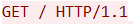
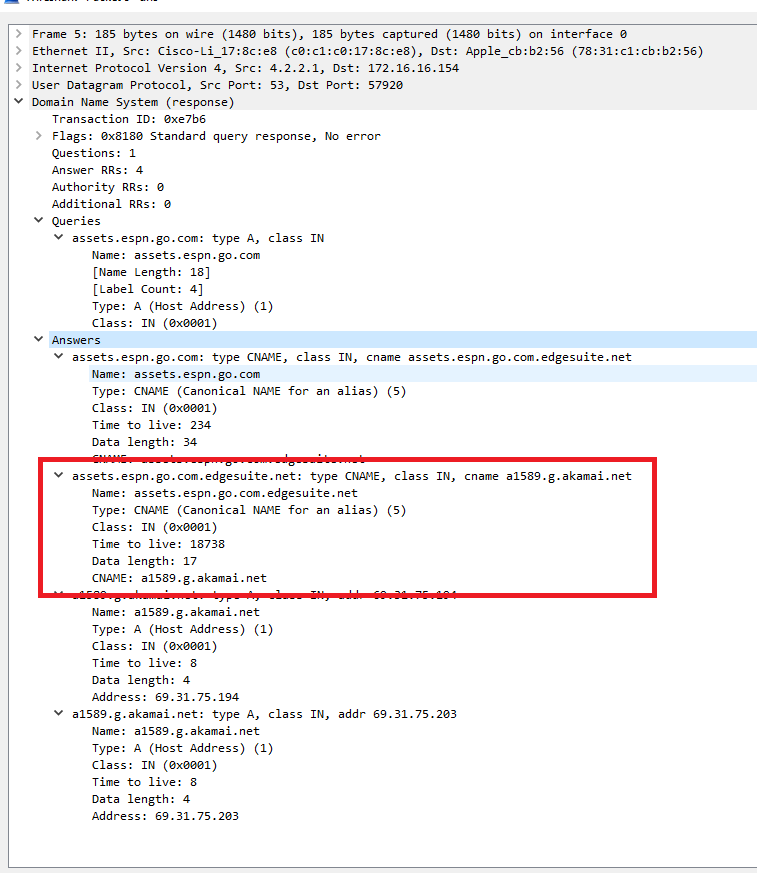
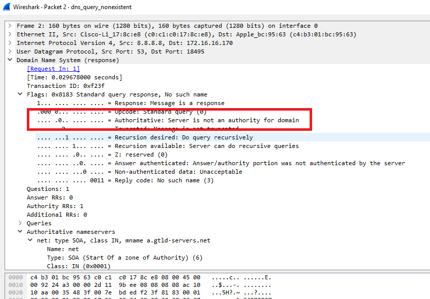
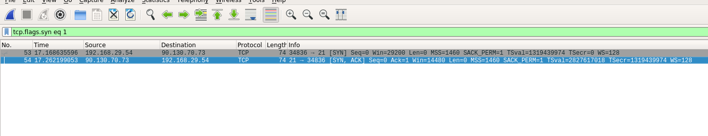

# Unit 2.3 Lesson Plan - Protocol Reverse Engineering

We've gotten good at using Wireshark to find and extract interesting data from network conversations. We even know a lot about what common protocols like HTTP, FTP, and SMTP look like on the wire.

Today, we'll use Wireshark to reverse-engineer these and other protocols by inspecting live traffic captures.

## Class Objectives

- Identify the layers of the TCP/IP model and explain the function of each

- Describe the flow of typical HTTP, FTP, and SMTP conversations, and explain the common status codes and request types used by each

- Describe the flow of typical TCP conversations

- Identify suspicious patterns in raw transport-layer data

---

## Instructor Do: Protocols & the TCP/IP Model (0:10)

- **Objectives**: [Objectives.md](Activities/01-Ins_TCP_IP_Model/Objectives.md)

- **Slides**: [TCP_IP_Model.pptx](Activities/01-Ins_TCP_IP_Model/TCP_IP_Model.pptx)

---

- We’ve seen a lot of packets carrying data for a lot of protocols.
- We know that HTTP is a protocol for sending web data. FTP is a protocol for sending file data. TCP is a protocol for sending raw data.
- But we haven’t talked about exactly what protocols are.
- A little more context will prepare us for some of the more challenging packet analysis we’ll do later today, like hunting for malware in data streams.
- In this section, we’ll set the stage by discussing how protocols are defined, and ways to categorize them.

- Protocols are essentially rules for how devices should talk to each other.
- We use different protocols for different purposes. For example, SMTP is for email, and HTTPS is for encrypted web traffic.
- Since these are different applications, it makes sense there would be different rules for sending the data.
- But many protocols have a lot in common. Most define specific rules for how devices should:

  - **Open connections**. Protocols specify how devices should request and negotiate connections with new devices. This process is often called handshaking.
  - **Configure the connection**. Protocols specify if the device should encrypt data; If so, how are keys traded; etc.
  - **Format data**. Protocols define very specific data formats. Devices communicating under a certain protocol expect to receive messages adhering to the specification.
  - **Handle errors**. Protocols specify how devices should handle situations such as corrupt data, dropped connections, etc.
  - **Terminate connections**. Protocols specify how devices should end the connection between them.

- A few examples of different protocols for different purposes.
- Emphasize that this is a very small subsample.
- Wireshark recognizes over 1,000 protocols by default, and new ones are added all the time.
- Fortunately, these 1,000+ protocols don’t serve 1,000+ purposes. Many do similar jobs in different situations.
- For example, TCP sends raw data between computers. UDP also sends raw data between devices. They do it a bit differently, but they serve a similar purpose.
- Thinking hard about similarities and differences between protocols leads us to powerful models for categorizing different protocols.
- The TCP/IP model is the one that best describes the Internet, and provides a powerful way to group protocols based on what they do.

- The TCP/IP model organizes protocols into four layers.
- At the top are protocols that are used to let user-facing applications request to send/receive data on the network. This is the application layer.
- Just below this are protocols that actually handle sending that data to other applications. These live in the transport layer.
- Below this are protocols that figure out which computer to send the data to next. These are internet layer protocols. Routers are devices that live at this level.
- At the very bottom are protocols that turn physical signals from a wire into data a computer can understand. These live in the network access layer.

### Application Layer

- Explain that the application layer is responsible for representing data in a way the consuming application can understand.
- For web apps, this means HTTP (or HTTPS, which is the encrypted version).
  - Remind students of the HTTP request from before.
- For email applications, this would be a different protocol, called SMTP.
- Emphasize that, at this level, data is formatted for user-facing applications to consume.

### Transport Layer

- The transport layer is responsible for actually transmitting data across the network. In other words, it’s the layer that puts the data onto the network.
- For example, when a user tries to send a message with an email app, the email app will wrap up their message, attachments, the subject line, etc., into a package that the recipient’s email application can understand. This is, e.g., the SMTP protocol.
- This package is a bunch of data, which the recipient’s computer could understand…If it ever received the data.
- To actually get SMTP data from computer to computer, we need to use a different set of rules/protocols. Those are the transport protocols, which actually transport application data between devices.

- The transport layer is responsible for actually transmitting data across the network. In other words, it’s the layer that puts the data onto the network.
- For example, when a user tries to send a message with an email app, the email app will wrap up their message, attachments, the subject line, etc., into a package that the recipient’s email application can understand. This is, e.g., the SMTP protocol.
- This package is a bunch of data, which the recipient’s computer could understand…If it ever received the data.
- To actually get SMTP data from computer to computer, we need to use a different set of rules/protocols. Those are the transport protocols, which actually transport application data between devices.

### Internet Layer

- The Internet layer is responsible for routing data through physical networks.

- The Internet layer ensures data gets to the correct destination.

- Internet-layer devices use IP address to identify target networks.

- Internet-layer devices use a protocol called ARP, or Address Resolution Protocol, to map IP addresses to hardware addresses.

- This allows network hardware to map an IP address to an real, physical machine.

  - We’ll discuss this process in greater detail when we discuss switches.

- Routers are examples of Internet-layer devices.

### Network Access Layer

- The network access layer is responsible for converting packets into data that can be sent along physical wires or fibers to target devices. In other words, this is the layer that puts TCP/IP packets onto the network.

- This typically involves data being fed to a network adapter (e.g., a network card).

  - Each physical network adapter is assigned an IP Address so that it can connect to the network

- This network adapter is responsible for packaging data from the computer’s physical hardware and passing it to a router for further transport along the network.

---

- The best way to develop an intuition for protocols is to inspect packets that implement them, and get a feel for their formats and rulesets by "reverse-engineering" them from live traffic data.

- This is good for learning, but is also an essential skill for network analysts.

  - There are too many protocols to memorize, so much of your time on the wire will be spent figuring out new protocols by inspecting capture data.

## Instructor Do: Teasing Apart HTTP (0:10)

- We'll start by reverse-engineering a familiar application-layer protocol: HTTP.

- Teasing apart a sequence of HTTP exchanges between hosts should allow us to deduce a lot about the shape of HTTP requests/responses.

- Open [example.pcapng](Activities/02-Ins_HTTP/example.pcapng). This capture contains a minimal trace of a to `www.example.com`.

- Open [example.pcapng](Activities/02-Ins_HTTP/example.pcapng). This file contains a capture of a visit to `www.example.com`. It's a familiar site, so analyzing it will help ups get our bearings.

- Filter for HTTP traffic. Note that the very first packet should contain a GET request.

  - Point out that the info column (far right) contains the text: `GET / HTTP/1.1`. This indicates that the client wants to retrieve, or GET, a file from the server.

  - Point out that the packet right below this says OK. This means that the server received the request for a file, and was able to send it back without issue.

  

- Remind students that this exchange is called a request-response cycle.

- We can see all of the data exchanged in a request-response cycle by right-clicking the request, and clicking **Follow** -> **HTTP Stream**. This lets us see the sequence of HTTP exchanges between the client and server.

  

- This raises a pane that shows us the full text of the request, and the full text/data of the response.

  - This shows the series of requests/responses sent between the client and the server to load `www.example.com`, without the noise of unrelated packets strewn between.

  - Red text indicates communications sent by the client.

  - Blue text indicates communications sent by the server.

  

- The request has a specific format.

  - Point out that the first line of the request looks specially formatted: `GET / HTTP/1.1`. `GET`, `/`, and `HTTP/1.1` are all distinct components of this line.

  - Point out that the lines in the rest of the request all also look similar, e.g., `Host: www.example.com`.

- The response also has a well-defined structure.

  - The first line reads: `HTTP/1.1 200 OK`. This has `HTTP/1.1` in common with the request. The OK indicates that the server was able to fulfill the request without issue.

  - The following lines are formatted similarly to the trailing lines in the request, but have different values.

- The bottom of the response looks much different than the request: It contains HTML data, which is the raw code for the web page.

  - This means HTTP responses contain a line indicating whether the server was able to do its job; some extra metainformation; and, finally, the actual data the client requested.

  

- Scroll past the response, until you see the next red request.

- The first line of this request is similar to the last one, but this time reads: `GET /nonexistent_file.png HTTP/1.1`.

  

- The first line of the response is different than before, as well. This one says `HTTP/1.1. 404 Not Found`. The meaning of this response is fairly self-explanatory.

  

- The numbers 200 and 404 are called **status codes**, and indicate whether the server was able to fulfill the client's request.

- There are additional status codes, some of which students will become acquainted with in the next activity.

## Partners Do: Analyzing HTTP (0:20)

- **Files**: [Captures](Activities/03-Par_HTTP/Captures)

- **Instructions**: [README.md](Activities/03-Par_HTTP/README.md)

## Everyone Do: Review Activity (0:10)

- The purpose of this activity is to get students an opportunity to formalize their understanding of HTTP requests; responses; and the flow of real HTTP conversations.

- Open [bbc.pcapng](Activities/03-Par_HTTP/Captures/bbc.pcapng).

- Begin by filtering for http traffic. The first packet in the filtered display will be a GET request for `/`. Right-click the packet, then select **Follow** -> **HTTP Stream**.

### HTTP Request Format

- The HTTP conversation pane contains the full text of the HTTP request. Emphasize the following:

- The first line of the request, called the **request line**, reads: `GET / HTTP/1.1`.

- This line contains three major pieces: `GET`, `/`, and `HTTP/1.1`.

  - GET is called the **HTTP method**. It tells the server what the client wants to do. In this case, *get* a file.

  - The `/` is a file path. It tells the server which file the client wants the server to send. When a client requests `/`, the server will implicitly look for a file called `/index.html`.

  - The `HTTP/1.1` specifies which version of HTTP the client is using. There are other versions—namely, 1.0 and 2. 1.1 is the most common.

    - In summary: The HTTP request line tells us what the client wants to do (GET a resource; POST information; etc.); what the name of the file the client wants to interact with is; and the version of HTTP it's using.

  

- Point out that the lines below the request line contain familiar-looking information, as well.

  - These lines contain information, called **headers**, which the server can use along with the request line to figure out how to process the client's request.

  - Each header has a name, like `Host`, and then a value, like `www.bbc.com`.

  - Each line contains a single header.

- Some headers show up on every request. Point out the `Host` header. This is required.

  - The `Host` header contains the domain name the client associates with the site it's trying to retrieve resources from. In this case, that's `www.bbc.com`.

- Point out that combining the value of the `Host` header with the file path in the request line produces a familiar-looking URL: `www.bbc.com/`.

  - This is equivalent to `www.bbc.com/index.html`, the URL for the home page.

- Other headers are more unfamiliar, but often straightforward in meaning.

  - The `Connection` header indicates whether we should immediately close the connection between the client and the server after the server responds, or reuse it for later requests. This saves us the time of having to open a new connection for every HTTP request.

  - `Upgrade-Insecure-Requests` tells the browser to turn unencrypted HTTP communications into encrypted HTTPS communications.

  - `User-Agent` gives information about the device sending the request.

  - `Accept` indicates what kind of data the client will accept in response to this request. This is to ensure the server doesn't send, say, image data in response to a request for a text file.

  - Emphasize that there's no need to specifically memorize headers. Students will become familiar with common request and response headers as they analyze more HTTP traffic.

  

### Troublesome Status Codes

- When we browsed `www.example.com`, the server responded with `200 OK`. This time, the server responded with `304 Not Modified`. To understand why, we must first understand **caching**.

- Point out that most sites we visit are unlikely to change a lot throughout the day. Stock data might change, but things like the page layout, branding, etc., stay more or less constant.

- This means many of the files we download when we visit a web page several times in the same day will be the same each time we download them.

- Because of this, browsers save many of the resources they download when we visit websites for the first time.

- This way, when we visit a second time, we can simply re-use resources that are unlikely to have changed, and only spend bandwidth downloading files that might have changed from our last visit.

- The 304 status code means: "You requested a file that you already have a copy of. It has **not** been **modified** since you fetched it last, so you should just use that one."

  - Point out the `Cache-Control`, `Etags`, and `Expires` headers. These allow the client and server to communicate about when a resource should be fetched again, versus when a client should simply use the version that it's saved

  

- The 304 status code tells us that the user has already visited this page in the recent past!

- Next, we have to examine the request for `/news/1.55.2536/img/news--icons-sprite.png`.

- There are many ways to filter for this file, but since we have the path, we can simply do: `frame contains "/news/1.55.2536/img/news--icons-sprite.png"`. This eliminates all but two packets.

  

- Right-click the first packet, and select **Follow** -> **HTTP Stream**.

- In this case, we see a request for `/news/1.55.2536/img/news--icons-sprite.png`, followed by a response with status code `404 Not Found`. This indicates the file doesn't exist on the server.

  - We can also tell from the response that the server is running Apache, version 2.2.25.

  

- Finally, isolate the request for `/track/cmf/generic?ttd_pid=icco6m5&ttd_tpi=1` with: `frame contains "/track/cmf/generic?ttd_pid=icco6m5&ttd_tpi=1"`. Follow the HTTP stream.

- This time, we have a request for a file, followed by response with status code `302 Found`.

  - A response of 302 Found indicates that the server knows of the resource the client requested, but that it doesn't live at the path the client requested.

- A 302 Found response redirects the client to the correct location. We can see this in action here in the bottom line, which tells us that the client is being redirected to the right place.

  

- Take a moment to summarize our findings regarding the shape of HTTP responses.

  - Like requests, they start with a **response line**, which contains the protocol version, and the response status code.

  - This is followed by headers.

  - Finally, the response contains the actual data the client sent.

  - This is followed by two blank lines.

### HTTP Post

- Finally, open [http_post.pcapng](Activities/03-Par_HTTP/Captures/http_post.pcapng).

- Follow the HTTP stream of the packet number 4.

- Both the request and response look different this time.

- This request starts with POST instead of GET. The very bottom of the request also contains data, similar to the responses we'd seen earlier.

  - This data is called **POST data**, and is a way for clients to send data to the server.

  - GET tells the server that the client wants to retrieve a file the server has.

  - POST tells the server that the client wants the server to use the POST data to save a new resource.

  

- Other HTTP methods include PUT, PATCH, and DELETE. But, GET and POST are the methods students will see the most.

- Before moving on, walk through the [HTTPFormat.pptx](Activities/02-Ins_HTTP/HTTPFormat.pptx) slides to consolidate the discussion of HTTP request/response formats.

## Instructor Do: DNS (0:10)

- **Slides**: [DNS.pptx](Activities/04-Ins_DNS/DNS.pptx)

---

- Open and talk through the slides in [DNS.pptx](Activities/04-Ins_DNS/DNS.pptx).

- Open Wireshark with superuser/administrator privileges.

- Start a live capture with the capture filter `udp port 53`.

  - UDP is a transport protocol that gets data between computers. It's similar to TCP, which we've seen already.

  - Port 53 tells Wireshark to only pay attention to DNS traffic. We'll discuss ports in greater detail during today's TCP section.

- Open a web browser, and go to `google.com`. Point out that the capture pane in Wireshark is populating. This demonstrates that, no matter what application we use, if it involves a domain name, we have to go through DNS.

- Do a manual DNS resolution for `google.com` using the terminal/command line.

- Go back to Wireshark and stop the capture.

- Click around some packets and expand the **Domain Name System** sections.

  - You don't have to spend too long going through them. Students will be doing this themselves later. This is to familiarize students with what a packet will look like.

## Students Do: Analyzing DNS (0:20)

- **Files**: [Captures](Activities/05-Stu_DNS/Captures)

- **Instructions**: [README.md](Activities/05-Stu_DNS/Unsolved/README.md)

## Everyone Do: Review DNS in Wireshark (0:10)

- Open up the [dns-1.pcap](Activities/05-Stu_DNS/Captures/dns-1.pcap) file.

- Ask a student how many DNS requests there were.

  - There were 7.

- Ask the student how they know.

  - Each packet is a DNS reply, and there are 7 packets, so there were 7 DNS requests.

  - This highlights a broader point: In DNS and HTTP, a request can only receive a single response.

    

- Ask another student why they think there are no DNS request packets in this pcap.

  - The answer is that the capture was likely done on a DNS server while filtering only for *outbound* DNS traffic.

- Since DNS is serving on UDP port 53 and this traffic came *from* UDP/53, it's return traffic to the client.

  

- MAC address device manufacturers imply that a Cisco device and an Apple device were communicating. The Apple device is more likely to be a client than vice versa.

    

- Ask a student which resource the client asked for from `assets.espn.go.com`.

  - Packet #5>

    

- Ask the student what happened first to initiate the response.

  - `assets.espn.go.com` turned out to be an alias for `assets.espn.go.com.edgesuite.net`.

    

  - Make sure that the student mentions "CNAME".

- Ask another student what happened next.

  - `assets.espn.go.com.edgesuite.net` is an alias (CNAME) for `a1589.g.akamai.net`.

    

- Ask another student what happened next.

  - `a1589.g.akamai.net` returned 2 IP addresses (A records): `69.31.75.194` and `69.31.75.203`.

    

  - Make sure that the student mentions "A record".

- Ask a student what might having a domain name return 2 IP addresses mean.

  - Both servers return the same data but, if one is down, the other can be used for the sake of redundancy.

- Ask a student which packet the client requested for the A record of `a1.espncdn.com`.

  - Packet #4.

    

- Ask a student what IP addresses the DNS server responded with.

  - `72.246.56.35` and `72.246.56.83`.

    

### Part 2

- Open the [dns-2.pcapng](Activities/05-Stu_DNS/Captures/dns-2.pcapng) file.

- This pcap shows a DNS query and response, but something went wrong. There was no IP address found for that domain name.

- Which flag in the packet signifies what went wrong?

  - The "Reply Code".

- The request went to 8.8.8.8. Did the answer come directly from 8.8.8.8?

  - No.

- Ask the student how they know.

  - The DNS data has a flag that's called "Authoritative" and it is set to `0`. This means that the responding entity is not an authority, and that it asked another DNS server for the information.

    

- Ask a student which DNS server 8.8.8.8 ultimately asked for the name resolution. In other words: Which DNS server ultimately said there was no such domain name?

  - The "Authoritative Nameservers" section says that `a.gtld-servers.net` was the final DNS server.

    

---

## BREAK (0:10)

---

## Instructor Do: Transport-layer Protocols (0:20)

- **Slides**: [TCP.pptx](Activities/06-Ins_TCP/TCP.pptx)

---

- HTTP and other application protocols govern the conversion of user input to a format that the recipient's web browser can understand. But, they have nothing to say about actually getting data *through* the network.

- The protocol responsible for ensuring application data gets from our computer to where it's going is called **TCP**.

- Emphasize that the job of HTTP is to format data in a way web applications can understand, and which allows them to make requests of/responses to one another.

  - The job of TCP is to connect two computers; break up the data they want to trade into manageable chunks; and make sure that all of those chunks get to their destinations reliably.

- Recall that protocols often define how to open, maintain, and close connections.

- Today, we'll look at the rules that TCP uses to do each of these things. Namely, we'll learn about:

  - The **TCP Three-Way Handshake**, which is how connections get opened.

  - The **TCP Teardown Process**, which is how connections get closed.

  - The meaning of **ACK** packets, which devices exchange during data exchange.

- Talk through the provided slides. Transition to the Wireshark demo when you hit slide 11.

### Transport-Layer Demonstration

- Start up Wireshark as a superuser/administrator. Remind students that a live capture typically requires superuser/administrator privileges.

- Click on the active network interface to start the live capture. For students, this will be `wlan0`.

- Open a web browser in incognito/privacy mode and go to `http://www.secrepo.com/`.

  - Using incognito/privacy mode causes the browser not to use any cached resources from your main browser sessions.

  - We are using `secrepo.com` because it is HTTP and conforms to full TCP teardowns.

- Return to Wireshark.

- Wait a couple of seconds until the tail end of the stream shows the FIN, ACK/FIN, and ACK sequence.

- Stop the live capture.

- Right click any of the packets with the FIN flag and select **Follow** -> **TCP Stream**.

- Remind students that this shows us the entire sequence of TCP packets, and automatically make a display filter for the relevant data stream.

- There shouldn't be much to scroll around in, but if there are a lot of packets, do scroll up and down to show off the beginning handshake and the tail-end teardown.

  - Note the beginning handshake section, the data section, and the tail-end teardown section.

- Step through the slides until slide 20 for review.

### Wireshark Demonstration

- Open [tcp_demo.pcapng](Activities/06-Ins_TCP/tcp_demo.pcapng) with Wireshark.

- Scroll up and down the packets list to call attention to how much traffic there is in this file.

- Enter `tcp` as the display filter. This should remove a lot of noise from the capture display.

- Right click any packet record with `SSHv2` in the "Protocol" field, such as packet #10.

- Select **Follow** -> **TCP Stream**. Immediately exit out of the pop-up. Remind students we're following the stream so Wireshark will create the appropriate display filter for us.

- Call attention to the packets details window, and expand the **Transmission Control Protocol** section. Point out the "Flags" section.

    

- Circle the cursor around the "Flags" section.

- HTTP uses headers to transmit metadata. TCP uses flags for the same purpose.

- The set flags on a packet has reveal the job it's intended to do. A packet with a FIN flag, for instance, is meant to close a connection. On the other hand, a packet with a SYN flag is meant to open one.

- We can see which flags a packet has set by expanding the **Flags** section.

- Circle the cursor around the source and destination IP addresses and ports.

  

- Call attention to the source and destination IP addresses and ports.

  - TCP uses IP addresses to identify which computer to send data to.

  - TCP uses uses port numbers to identify the process/program on that computer to send data to.

- Click on another packet, such as one with "SSHv2" in the "Protocol" field (e.g., packet #20).

- In the packet details window, point out the "SSH Protocol" section.

  - Since the application layer is higher up the OSI model than TCP, which is in the transport layer, that the TCP packet "encapsulates" the application data. In other words, it "sits on top of it", and adds additional data to the packet.

    

- Return to the capture pane. Scroll all the way to the top. Call attention to the SYN, SYN/ACK, and ACK packets at the top of the stream.

  - The "Info" field in the main screen should show the SYN, SYN/ACK, and ACK flags.

  - Remind students that this sequence corresponds to the TCP Three-Way handshake, and initiates a TCP connection.

    

- Click the SYN packet. Expand the **Transmission Control Protocol** section in the details pane. Show off how Wireshark highlights the SYN flag in the **Flags** section.

  

- Circle the cursor around the FIN, ACK/FIN, and ACK packets at the bottom of the stream.

  - The "Info" field in the main screen should show the FIN, ACK/FIN, and FIN flags.

- Click the FIN packet. Expand the **Transmission Control Protocol** section in the details pane. Show off each packet's set flags in the **Flags** section.

  

- Finally, explain that we can filter for TCP packets with specific flags.

  - Input into the display filter: `tcp.flags.fin == 1`. This filters for only TCP packets with the FIN flag set.

  - Update the display filter to `tcp.flags.fin == 1 and tcp.flags.ack == 1`. This filters for FIN / ACK packets.

  - The same technique can be used to filter for SYN, SYN / ACK, etc., packets.

    

## Students Do: Digging Into TCP Communications (0:20)

- **Files**: [tcp.pcapng](Activities/07-Stu_TCP/Unsolved/tcp.pcapng)

- **Instructions**: [README.md](Activities/07-Stu_TCP/Unsolved/README.md)

## Everyone Do: Review Wireshark Analysis of Transport Layer Protocols (0:10)

- Open up [tcp.pcapng](Activities/07-Stu_TCP/Unsolved/tcp.pcapng).

- Ask a student how we would filter for TCP packets only.
    

- Ask a student how to count up all of the TCP SYN packets.
    

- Ask a student how to count up all of the TCP FIN packets.
    

- Ask a student how we would filter for a TCP stream using the "FTP" protocol.
    

- Ask a student to point out the three-way handshake sequence.
    

- Ask a student to point out the teardown sequence.
    

- Ask a student what is the source and destination IP addresses.
    

- Ask a student what is the source and destination ports.
    

## Instructor Do: Spotting Malware on the Wire (0:10)

- Since TCP streams contain the raw data transferred between devices, they really do tell the full story of what happened on the network.

- Inspecting TCP traffic reveals suspicious patterns that are invisible above the transport layer. Namely:

  - It contains records of attacks or surveillance people have performed on our machines.
  - Just as it contains data for images, CSVs, etc., transferred over the network, it also contains the raw data of malicious files, such as viruses and trojans, that travel over the network.

- We'll start by using what we know about TCP to find evidence of attackers performing reconnaissance on our machines.

- Remind students that, when TCP opens a connection between machines, the source machine starts by sending a SYN packet to the target. The target will then respond with a SYN / ACK packet if it's willing to accept a connection on the requested port.

- Emphasize that, if we send a SYN packet to a port on a server, and the server responds with a SYN / ACK, it *does* accept connections at that port.

- This means that we can send SYN packets to *every* port on a target machine and keep track of which ones yield a SYN / ACK response.

  - These are ports that we could theoretically connect to, and so make good potential targets for attack.

- This technique is called a **SYN scan**. A SYN scan is a technique we'd use exclusively for reconnaissance—no normal application would ever do something like this to a target machine.

- Thus, if we ever see a machine send SYN packets to every port on one of our network devices, it's a safe bet that it's in the hands of a malicious actor.

- Wireshark's filtering capabilities make it fairly easy to identify SYN scans. Open [synscan.pcapng](Activities/08-Ins_Malicious_Activity/synscan.pcapng).

- This capture contains a series of SYN packets sent to a set of potentially open ports on a target device.

- We can see traffic to a specific TCP port by filtering for: `tcp.port == <port of interest>`.

- Filter for traffic to the port 80, the canonical port for HTTP transmission.

  

- Call attention to the first two packets. The first is a SYN packet from `172.16.0.8` to `64.13.134.52`. The second packet is a SYN / ACK response from `64.13.134.52` to `172.16.0.8`.

  - This means the target computer is accepting connections at port 80.

- Note the three black packets below the SYN / ACK. Also notice that the source machine didn't send an ACK packet in response.

  - These are sent from the target computer,`64.13.134.52`, back to the source, `172.16.0.8`.

- This means we only completed the first two steps of the three-way handshake.

- This means we didn't actually *open* a connection—just determine if it were possible to do so at this port.

  - Because we only get halfway through setting up a connection, this kind of scan is also known as a **half-open scan**.

  - Since half-open scans are fast and don't actually open connections, they are also known as **stealth scans**.

- Because the target computer didn't receive an ACK from the malicious machine, it assumes the packet got dropped along the way, and retransmits it a few times before giving up.

- Next, filter for `tcp.port==443`. This is the canonical port for HTTPS traffic.

- This isolates only two SYN packets from the source machine. There is no SYN / ACK. This indicates one of three common scenarios:

  - The port is not accepting connections.

  - The port is hidden behind a firewall.

  - The device responded, but its response got lost on the network.

    - In this case, it's probably safest to assume that the port is inaccessible., or blocked behind a firewall.

    

- Finally, filter for traffic to port 113, often used for IRC traffic.

- Note that this time, we see a RST response to the source computer's SYN packets. RST means "reset", and indicates that the target port is not accepting connections.

  - In this case, we can conclude with confidence that the port is closed, as opposed to blocked.

    

- This is great for inspecting traffic to specific ports we have reason to be suspicious of, but is too slow for large-scale analysis.

- To create a better list of open/closed ports, open the conversations window, and sort by packet number.

- Note that this lets us see traffic from a port on the source computer's machine to a port on the target computer's machine.

  - Recall that an open port caused a 5-packet exchange: The SYN packet, the SYN / ACK response, and 3 retransmissions.

  - A closed port involved 2: The SYN packet, and the RST response. We also saw this inconclusive scans.

  - Otherwise inaccessible ports involve a single packet: The SYN from the source, with no response from the server.

- Using Wireshark to identify suspicious patterns of activity like this is a common step in assessing a security breach. Amongst other things, it gives clues as to which machines on the network might be malicious actors.

## Partners Do: Spotting Malware on the Wire (0:20)

- **Files**: [aurora.pcapng](Activities/09-Par_Malicious_Activity/aurora.pcapng)

- **Instructions**: [README.md](Activities/09-Par_Malicious_Activity/README.md)

## Everyone Do: Review "Spotting Malware on the Wire" Activity (0:10)

- [Operation Aurora](https://en.wikipedia.org/wiki/Operation_Aurora) was a series of high-profile attacks against large targets, such as Google, Adobe, and others, that took place in 2010.

- Some of the attacks were carried out by exploiting a zero-day vulnerability in Internet Explorer, which allowed an attacker to gain full access to a machine by simply getting the user to browse to a malicious website.

- Once on the website, the browser would fire a request for the malware, which would then infect the computer and give the attacker access to a command shell.

- Open [aurora.pcapng](Activities/09-Par_Malicious_Activity/aurora.pcapng).

- The first three packets of the capture are the three-way handshake to establish a connection to port 80.

- The fourth packet is the first GET request for a resource. Right-click the packet and follow the HTTP stream.

- The response status code is 302, indicating that the server knows where to get what the client asked for, but that it doesn't live at the path the client specified.

  - The `Location` header contains the current path to the resource. The client uses the information in the location header to automatically send another GET request with the right file path.

- The client then sends a GET request to the correct URL. This time, the server is able to locate and respond with the file.

- The top of the response and angle brackets indicate that this is an HTML document.

- We haven't written any JavaScript, but at first blush, the code in the response looks very unfriendly. This is a clue that something's not right.

  - This is because it's malicious code, and it's been **obfuscated** by the attacker. This means they've purposefully written it to be hard to understand.

    

- Point out the oddly-named GIF referred to in the very bottom of the blue response text.

  - When the browser reads this reference, it automatically sends a GET request for it, which we can see in the red request text.

  - The response right below this contains the GIF data, indicating that the client received the suspicious GIF data.

  

- That's everything we can glean from this exchange: A client received some suspicious-looking data from a server, and then closed the connection.

- The black magic occurs right *after* the client receives the GIF. Return to the main Wireshark window, and delete the display filter.

- Scroll to packet 23. This is the OK response indicating the server sent the suspicious GIF without errors.

  - Call attention to the source/destination addresses for this request. The source (server) is `192.168.100.202`, and the destination (client) is `192.168.100.206`.

- Call attention to packet 25.

  - Point out that this and the next three packets show a TCP handshake, opening a connection between the two devices.

  - Point out that the source and destination addresses are reversed. The user's computer, which received the suspicious GIF, has just opened a new TCP connection.

  

- Right-click packet 25 and follow the TCP stream.

- Immediately, we see some unreadable data in blue, followed by what looks like a Microsoft command shell.

  - This means the suspicious GIF contained a dangerous piece of code, which was able to launch a command shell on the target machine, run a command, and give the attacker access to that shell through the connection established at packet 23.

  - Since this user's account is called Administrator, the attacker could conceivably do anything they want to the target device.

  
