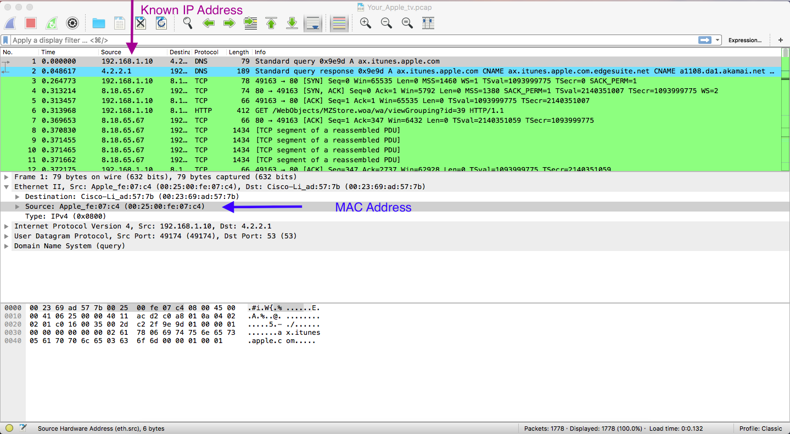
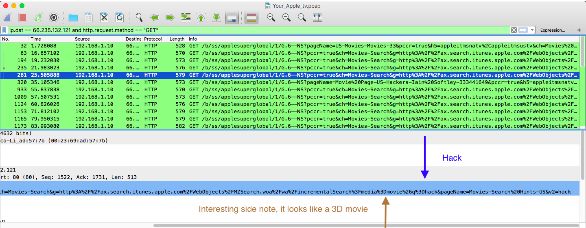
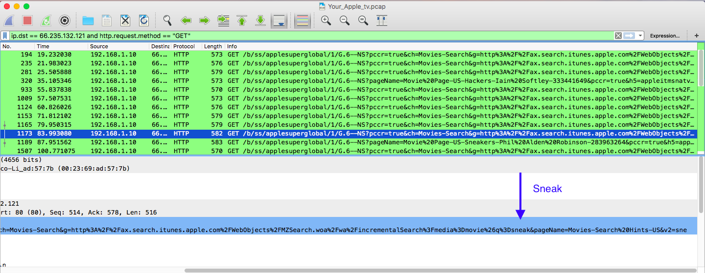
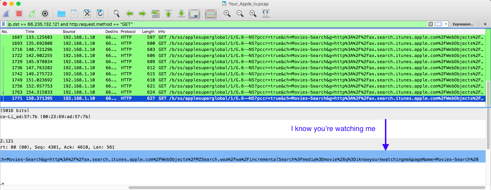
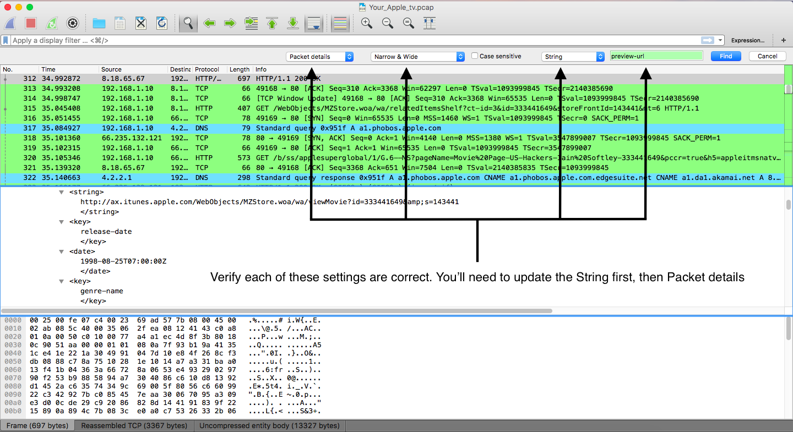
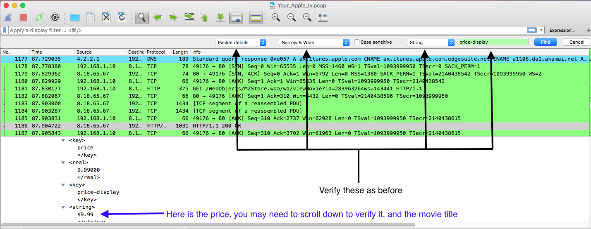

## Unit 2 | Your Apple TV!!!!! - Solution

### What is the MAC address of your AppleTV?

- Click on the first packet. Click on the "Ethernet II" frame, then on "Source". From here you can find the MAC Address.

### What were your first 3 movies searched on the AppleTV?

- First, notice the pattern that the destination IP address for all the searches was `66.235.132.121`, and they were all HTTP GET requests.

- From that, I made the following wireshark filter: `ip.dst == 66.235.132.121 and http.request.method == “GET”`.

- Apply this filter in Wireshark, and you’ll see the following:

### What was the full URL to the movie trailer (defined by “preview-url”)?

- There is a big hint with this question. Since they tell you it is defined by “preview-url”, you can simply do a ctrl-f for “preview-url” as a string, which will search through the packet details for you.

- This reveals the URL: `http://ax.itunes.apple.com/WebObjects/MZStore.woa/wa/viewMovie?id=333441649&amp;s=143441`.

### What was the price to buy sneakers? (defined by “price-display”)?

- You can do the same thing as the last question. Since they tell you it is defined by “price-display”, you can simply do a ctrl-f for “price-display” as a string, which will search through the packet details for you.

- This reveals the price: `$9.99`.

