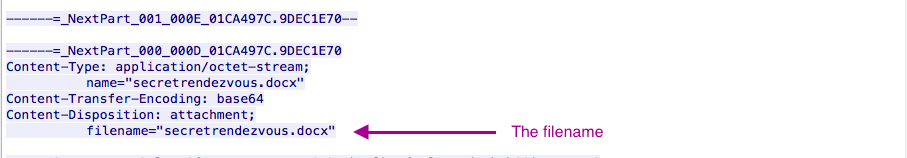

## Unit 2 | Email Tracing at Arkham - Solution

### What is Ann's email address?

Since you know you are dealing with email, you’ll want to filter on SMTP traffic. Under the “Statistics” tab, choose the
second option down called “Protocol Hierarchy”. There you will find the filter for Simple Mail Transfer Protocol. Right click
that option and select “Apply as Filter –> Selected”. This will implement the SMTP filter within Wireshark

Once filtered, right click on the first stream (packet 56) and select “Follow TCP Stream”. There you will find the first
email between Ann and her Secret Lover.

There is your answer to question 1: **Ann's email is** 1sneakyg33k@aol.com.

---

### What is Ann's email password?

Ann's password is: `NTU4cjSAwbHo=`.

This is encrypted, so for bonus points, go to <https://www.base64decode.org/> and decode it.

### What is Ann's secret lover’s email address?

Now we need to figure out Ann’s Secret Lover’s email address.

Looking at the packets filtered on the SMTP traffic, you’ll see a new “Auth Login” in packet 120. Right click that and select “Follow TCP Stream”.

This is the start of another email we’ll want
to look into. You’ll notice in the stream that this email is being sent to `mistersecretx@aol.com`, which is Ann’s Secret Lover’s email address.

Just a few lines below that, in the same stream, you’ll find the answer the next question in the body of the email: “Hi sweetheart! Bring your fake passport and a bathing suit. Address = attached. love, Ann”

### What two items did Ann tell her secret lover to bring?

A **fake passport** and a **bathing suit**.

### What is the NAME of the attachment Ann sent to her secret lover?

Continuing to scroll through the TCP stream you will find the name of the document Ann sent is `secretrendezvous.docx`.

