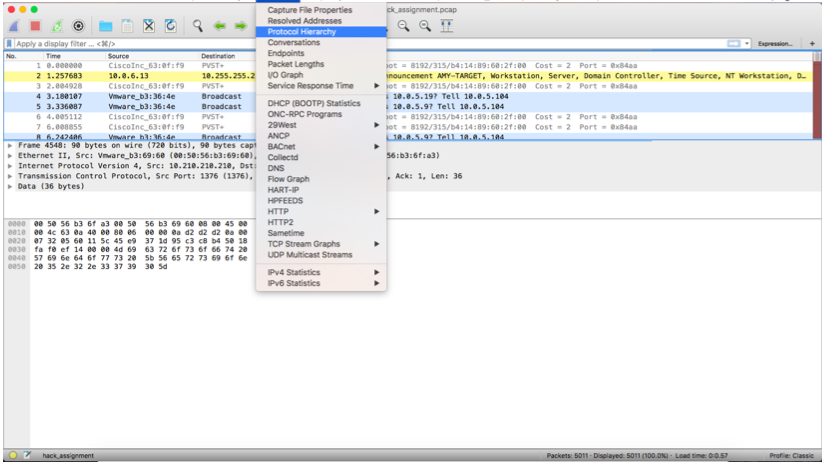
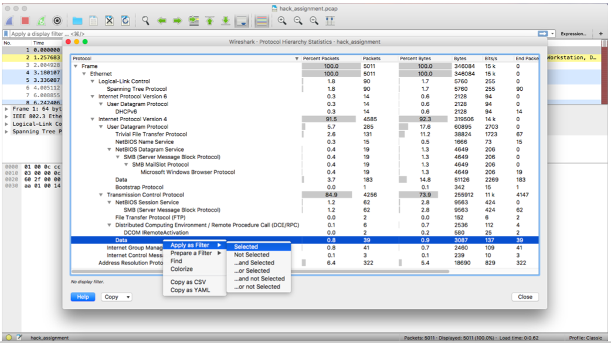
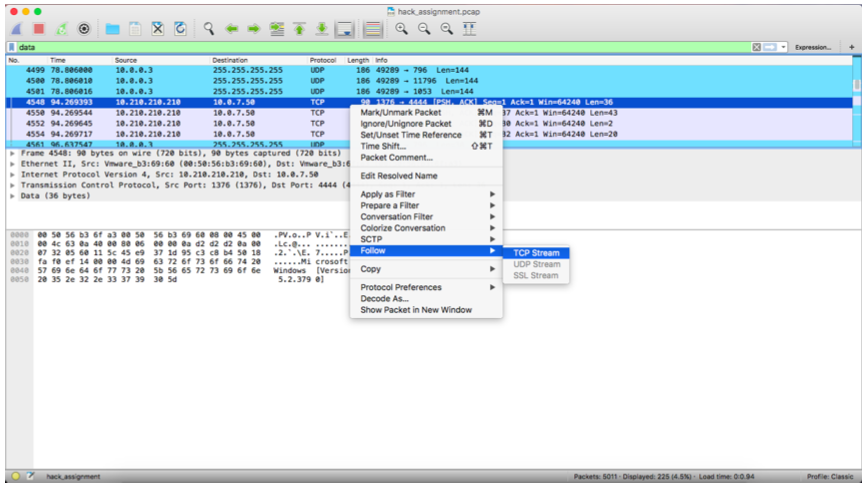
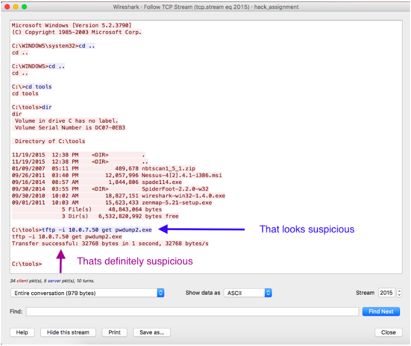

## Unit 2 | LINDA!!!!!

# Bob's Burgers Solution

- Open the bobsburgers.pcap with Wireshark.

- Go into **Statistics**, then scroll down to Protocol Hierarchy.

- Scroll down to the subsection **TCP**, then **Data**. Click on **Data** and **Apply as filter**.

- Scroll down until you see the first TCP packet, right click, and click **Follow**. 

- You should see the image below, as well as the transfer of the virus: `pwdump2.exe`.

