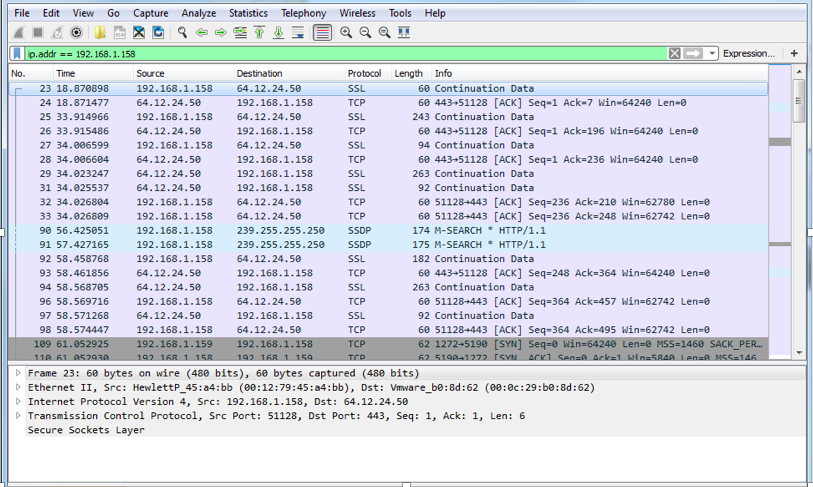
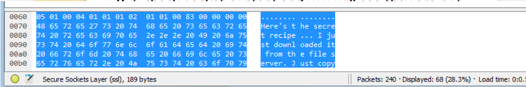
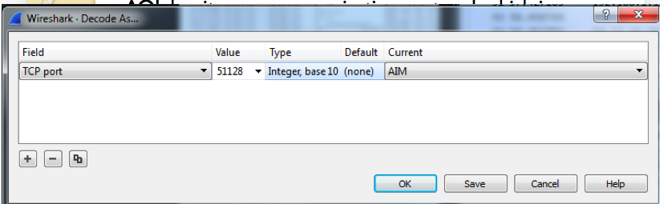
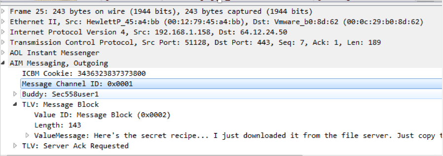
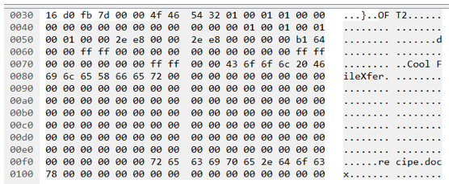
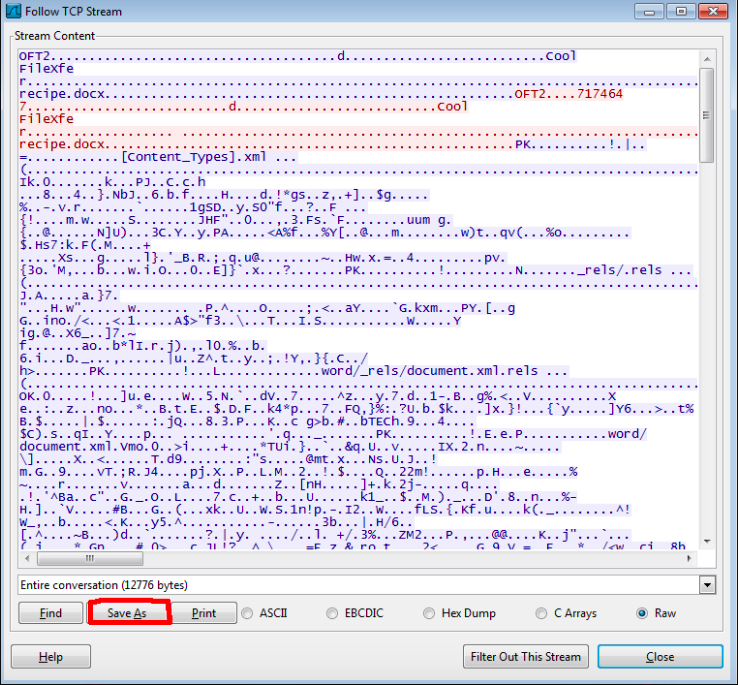
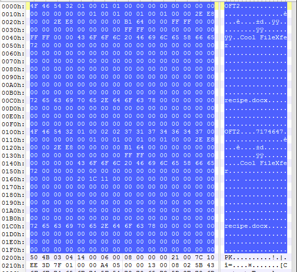
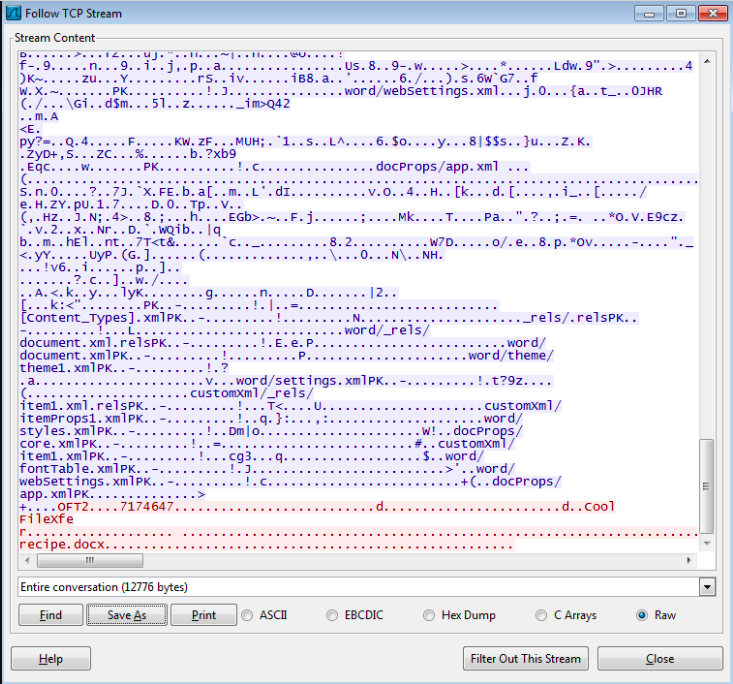
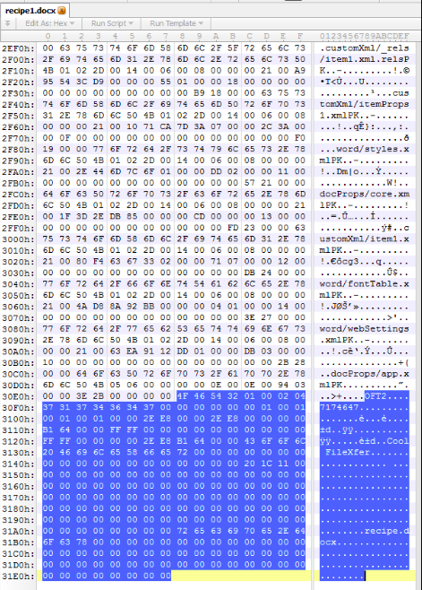

## Unit 2 | Squidward, AIM, and, Krabby Patties - Solution

### Finding Squidward's Chat Buddy

- The puzzle’s name has “AIM”, so Squidward must use AOL Instant Messenger Display filter: `ip.addr == 192.168.1.158`. Note that this is the static IP address Mr. Krabs set for Squidward.

- There are no packets labeled with the “AIM” protocol. There are many packets labeled as “SSL” because they use TCP port 443. But, check the packet's content, and you will see that they are not encrypted! **This means they are not true SSL packets**. They are just AIM messages using port 443, in order to make sure AIM traffic can go through most firewalls.

- AOL has its own communication protocol, which is complicated. Luckily, Wireshark has built-in dissectors for it, in so we can decode AOL traffic!

  - Right-click one of the "faux" SSL packets, and click **Decode As…**.
  - Choose “TCP port” and value of “443”, select “AIM” in Current field, then click “Save”.

  - Now, Wireshark will decode all traffic to port-443 as AIM traffic!

    

- Check Packet 25: `outgoing to: Sec558user1`.

  - Check the AIM messaging section in this packet.

  - Now we know Squidward is messaging with Buddy: `Sec558user1`.

  

### Finding the Comment in the IM Conversation

- Packet 25 also contains the first message as well.

    

### Finding the Recipe File

- Check the first data packet after the three-way handshake (connection setup) packets. It is Packet 112.

- To find the file Squidward sent to his chat buddy, look at the binary data section.

  - Note the OFT2 file transfer protocol. The file name is: `recipe.docx`.

    

### What is the secret recipe?

- You’ll want to right click and “Follow TCP Stream”.

- Click the **Save As** button and save the file as `recipe.docx`.

- Now we will use 010 Editor to carve the file out of the stream.

- A quick google search will show you that the file header for a DOCX file is `PK`. So, you’ll want to carve down to the end of the stream, which is colored in blue.

- From the screenshots below, you’ll find the file header, `PK`, is the start of the blue color.

- You will want to delete all the content before the “PK” file header, as this isn't actually part of the recipe file.

  

  

  

  

- Save this as `recipe.docx`, then open it to see the secret recipe.
