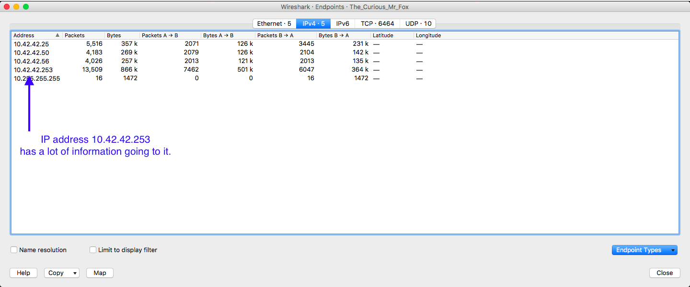
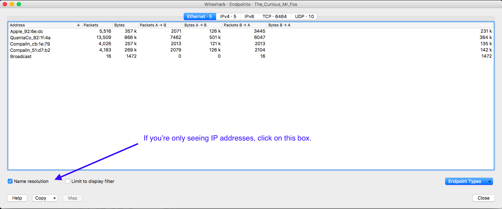
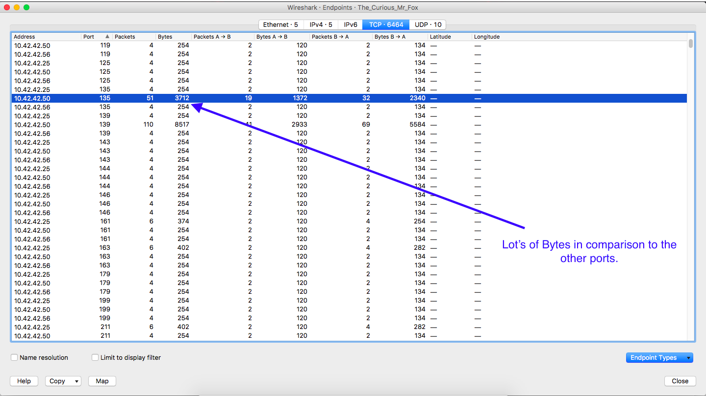
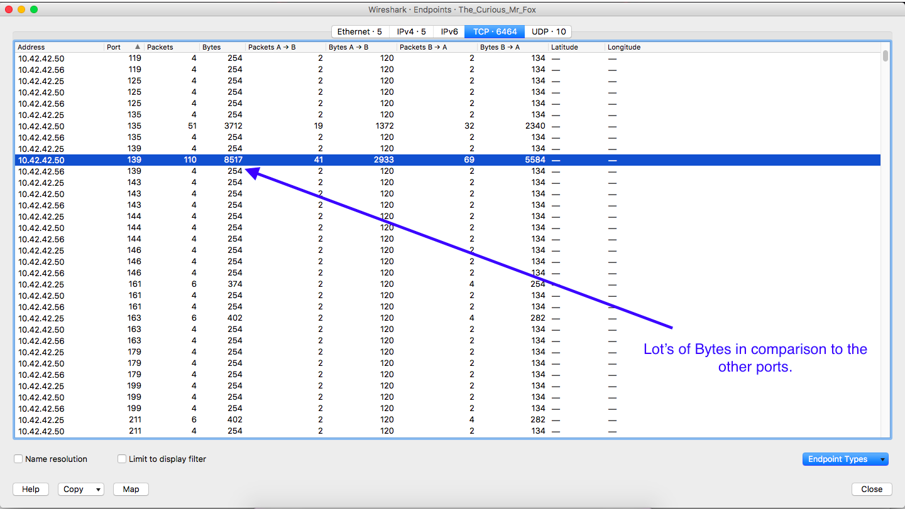

## Unit 2 | The Curious Mr. Fox - Solution

### What was the IP address of Mr. Fox’s scanner?

- You’ll notice the distribution of the number of packets heavily favors `10.42.42.253`. This is a good indication that this IP address is the scanner’s IP. You can also find similar results within **Statistics** -> **Conversations** -> **IPv4**.

### What was the MAC address of the Apple system he found?

- In Wireshark, go to **Statistics** -> **Endpoints**. In the bottom left corner of the window, you’ll see a checkbox for **Name Resolution**. If you uncheck the box, you’ll find the MAC address of the Apple device, `00:16:cb:92:6e:dc`.

### What TCP ports were open on the Windows system?

- Again, we are going to utilize wireshark Endpoints.

- In wireshark, click on **Statistics** -> **Endpoints** -> **TCP**, and filter on **Address**. You already know what IPs are what, so without looking at the scanning IP, you can fairly quickly find that the only open ports are `135` and `139` on `10.42.42.50`.
- You’ll notice that for most (not all) of the other packets, there are only 4 bytes, but then when the scan finds an open port, you’ll see more data being transferred.

