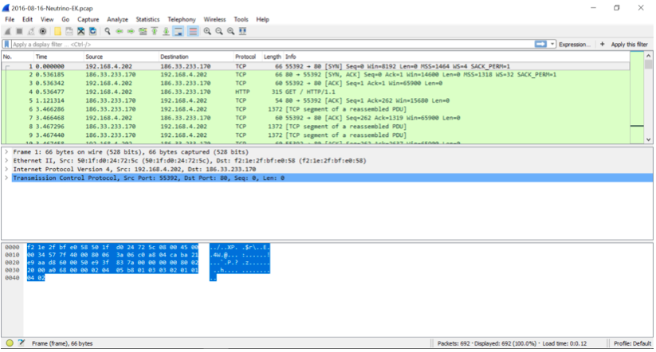
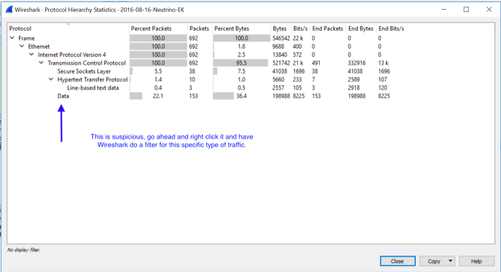
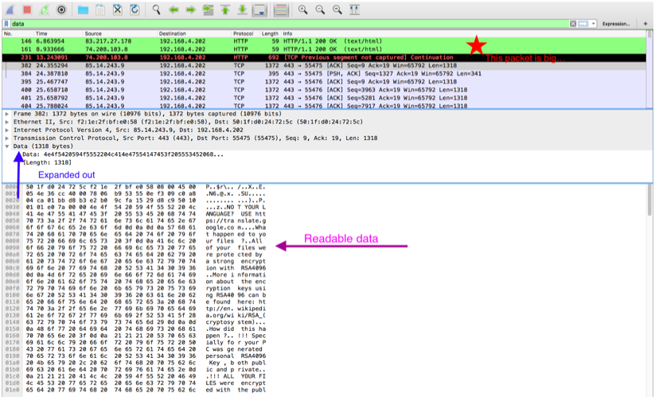

## Unit 2  Assignment | "Morty...we gotta...*burp*...we gotta...get the neutrino bomb"

# Neutrino Solution

- Open the Neutrino.pcap file with Wireshark

- Go into “Statistics”, “Protocol Hierarchy” then go down until you see the word “Data”. This data, is information Wireshark was not able to process, which is suspicious. Right click the word “Data” and use the filter. 

- We can now see everything that has been marked as “Data” and on the fourth packet, we see it’s larger then the others. When we click on it, at the bottom, we see that the hexadecimal has been translated into human format. Go ahead and click on data, and export this information. 

- Open the exported file with NotePad and you can now see the ransom request. 

